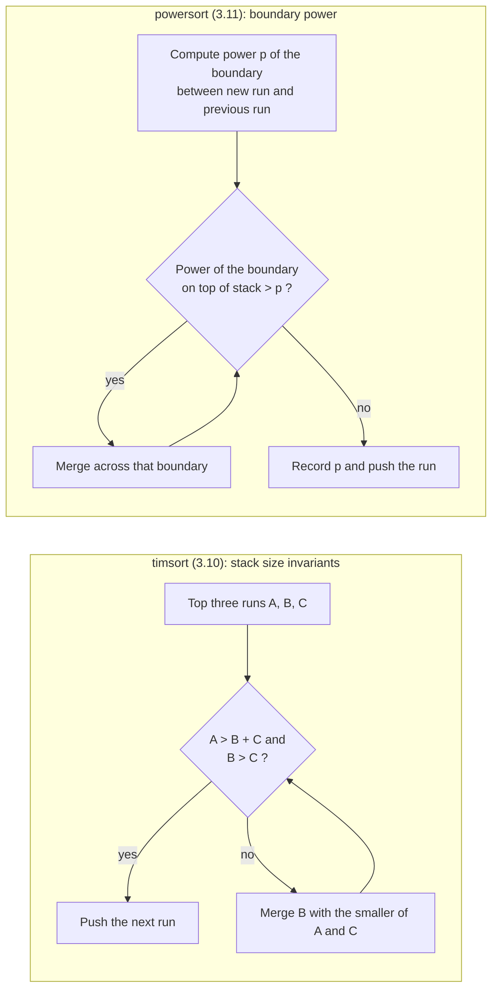
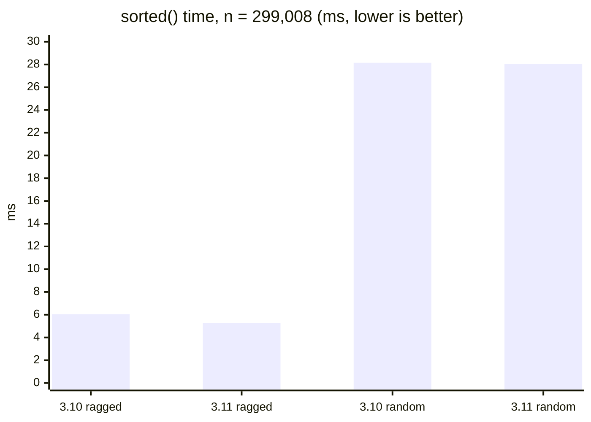

# Powersort in CPython 3.11: the merge order list.sort changed

> In Python 3.11 the rule that decides which runs list.sort merges switched from timsort's stack invariants to powersort's boundary powers. This post walks through what changed in code and measures comparison counts and time on 3.10 and 3.11. Random input does not move at all; only runs of uneven length do.
> 2024-08-20 · https://alfex4936.github.io/blog/cpython-powersort/

Python's `list.sort` has been timsort since 2002. It finds already-sorted stretches (runs), pushes them on a stack, and merges neighbouring runs according to rules about stack sizes. In Python 3.11 **only the rule that decides merge order** was replaced with powersort.[^1] Run detection, extending short runs with insertion sort, and galloping are unchanged.

It is one line in the release notes and easy to miss. Every number in this post was measured on the Docker images `python:3.10.22` and `python:3.11.17` (linux/arm64, on an Apple Silicon laptop).

## Two merge rules



Timsort looks only at the lengths of the runs on the stack. Calling the top three A, B, C, it maintains A > B + C and B > C, merging whenever they break. This makes stack lengths grow like Fibonacci numbers, so the depth stays logarithmic. The invariant used to be checked only on the top three entries and could break deeper down; in 2015 de Gouw et al. found this during formal verification, and a check reaching the fourth run was added.[^2]

Powersort computes each boundary's power from **where the adjacent runs' midpoints sit in the array**. Computing those midpoints uses both run starts and run lengths. This power replaces the stack's run-length invariants as the merge-order rule, with larger-power boundaries merged first. The smaller the power, the closer the boundary is to the root of the merge tree.

## The power of a boundary

Let the array have length $n$, and let two adjacent runs start at $s_1$ with lengths $n_1$ and $n_2$. Normalize each run's midpoint into $[0, 1)$:

$$
a = \frac{s_1 + n_1/2}{n}, \qquad b = \frac{s_1 + n_1 + n_2/2}{n}
$$

The power of the boundary is **the index of the first binary digit where $a$ and $b$ differ**. Equivalently, keep halving $[0,1)$ into halves, quarters, eighths, and the power is the depth at which the two midpoints first land in different pieces. A boundary straddling the middle of the array gets power 1; boundaries between small runs near one end get large powers. CPython computes this with integer arithmetic only. Ported to Python, the loop looks like this.

```python title="power.py"
def power(s1, n1, n2, n):
    a = 2 * s1 + n1
    b = a + n1 + n2
    p = 0
    while True:
        p += 1
        if a >= n:
            a -= n; b -= n
        elif b >= n:
            break
        a <<= 1; b <<= 1
    return p
```

1. Multiply both midpoints by $2n$ to make them integers; $a/2n$ and $b/2n$ are the original midpoints. No division, so no rounding error.

2. If $a \ge n$ then $a/2n \ge 1/2$, and since $b > a$ so is $b$. Both have a 1 in the current digit, so subtract it and move on.

3. If $a < n \le b$, the current digit is 0 for $a$ and 1 for $b$. That is the first digit where they differ, so return its index `p`.

4. If both are 0, double them to look at the next digit. This is shifting the binary fraction left by one place.

CPython's actual implementation (`powerloop` in `Objects/listobject.c`) is the same loop. It runs once per run found and never iterates more than $\log_2 n$ times, which is negligible next to the sort itself.

**Quiz: Checkpoint: boundary power**

1. Two normalized run midpoints differ at their first binary digit. How should you interpret that boundary's power and tree position?
   - Small power, close to the root, merged late.
   - Large power, close to the leaves, merged first.
   - The runs have equal length and must not be merged.

   Answer: Small power, close to the root, merged late. Power is the index of the first differing binary digit. A first-digit split is power 1, as in the post's example: a root-side boundary merged after deeper boundaries.

## Same runs, different merge order

To see how far the merge order can diverge, I picked one example with twelve runs. It is the input on which the two rules differed most in the simulation described below.

| run | 576 | 89 | 13 | 39 | 136 | 165 | 6 | 110 | 10 | 13 | 6 | 5 |
|---|---|---|---|---|---|---|---|---|---|---|---|---|
| right boundary power | 1 | 4 | 5 | 3 | 2 | 4 | 3 | 4 | 6 | 7 | 8 | |

The boundary between the leading run of 576 and everything else has power 1. Powersort merges it exactly once, at the very end, so those 576 elements take part in a single merge.

Here is what each rule does with the same input:

| Step | timsort (3.10) | powersort (3.11) |
|---:|---|---|
| 1 | 13 + 39 | 13 + 39 |
| 2 | 89 + 52 | 89 + 52 |
| 3 | 141 + 136 | 141 + 136 |
| 4 | 6 + 110 | 165 + 6 |
| 5 | 165 + 116 | 6 + 5 |
| 6 | 277 + 281 | 13 + 11 |
| 7 | 10 + 13 | 10 + 24 |
| 8 | 558 + 23 | 110 + 34 |
| 9 | 576 + 581 | 171 + 144 |
| 10 | 6 + 5 | 277 + 315 |
| 11 | **1157 + 11** | 576 + 592 |

Because the small runs at the end reach the stack late, timsort attaches 23 elements to a block of 558 and then 11 elements to a block of 1157. Large blocks get merged again just to absorb small runs. Counting merge cost as the sum of both run lengths per merge, timsort pays 4,365 and powersort 2,929.

## A lower bound from entropy

For run lengths $r_1, \dots, r_k$, the entropy of the run distribution is

$$
\mathcal{H} = -\sum_{i=1}^{k} \frac{r_i}{n} \log_2 \frac{r_i}{n}
$$

Merging these runs by comparisons costs roughly $n\mathcal{H}$ at minimum. Many runs of similar length mean a large $\mathcal{H}$; one run dominating means a small one. Munro and Wild proved powersort's merge cost is at most $n\mathcal{H} + O(n)$,[^3] and Buss and Knop showed timsort can get close to $1.5\,n\mathcal{H}$.[^4]

To check this I ported both merge rules to Python (timsort from 3.10's `merge_collapse`, powersort from 3.11's `found_new_run`) and divided the merge cost by $n\mathcal{H}$ across 20,000 random lists of run lengths.

| Input | timsort / $n\mathcal{H}$ | powersort / $n\mathcal{H}$ |
|---|---:|---:|
| 1,024 runs of length 64 | 1.000 | 1.000 |
| Runs halving in length | 1.000 | 1.000 |
| The 12 runs above ($\mathcal{H}$ = 2.346) | 1.593 | 1.069 |

Both rules are optimal on even runs and on regularly shrinking ones. The gap appears only with ragged lengths, and the worst of 20,000 cases was 1.49×.

## In real CPython

The simulated merge cost is close to the number of element moves, but the real `list.sort` gallops: when merging a small run into a large one it skips most of the large one with a binary search. So I measured actual comparisons on 3.10 and 3.11 with a class whose `__lt__` increments a counter. First, common patterns ($n$ = 131,072):

| Input | 3.10 | 3.11 |
|---|---:|---:|
| Random | 2,057,640 | 2,057,640 |
| Sorted / reversed | 131,071 | 131,071 |
| Repeated runs of 32 | 1,697,099 | 1,697,099 |
| Runs halving in length | 393,333 | 393,333 |
| Repeated runs of 1,000 | 1,065,802 | 1,053,757 |
| Repeated runs of 10,000 | 629,970 | 619,977 |
| Pareto-distributed run lengths | 1,079,127 | 1,075,868 |

Random, sorted, and even-run inputs do not differ by a single comparison, because both rules build the same merge tree for them. A difference of around 1% shows up only when run lengths do not divide $n$ cleanly.

Scaling the twelve-run pattern by 64 and 256 and filling each run with sorted random floats:

| Scale | $n$ | 3.10 comparisons | 3.11 comparisons |
|---:|---:|---:|---:|
| ×64 | 74,752 | 262,295 | 255,202 (−2.7%) |
| ×256 | 299,008 | 1,049,539 | 1,020,365 (−2.8%) |

The 1.49× gap from the simulation shrinks to under 3% in comparisons, because galloping skips nearly all of the large side when a big run meets a small one. Time differs more than comparisons do. Galloping saves comparisons, but the element copies (memcpy) remain, and powersort avoids re-merging large blocks, so it copies less.



On the ×256 input 3.10 took 6.05 ms and 3.11 took 5.25 ms, 13% faster. Random input of the same size took 28.15 ms and 28.04 ms, no difference. Each figure is the best of 5 repeats of 7 runs.

## Summary

- The 3.11 change is a single rule in `list.sort`: the one that decides merge order. Run detection, insertion sort, and galloping are unchanged.
- Timsort orders merges by run lengths on the stack; powersort orders them by the position of each boundary in the array (its power). The power is the first binary digit where the two runs' midpoints differ.
- On random, sorted, and even-run input, comparison counts never differed from 3.10. Everyday sorting will not feel faster.
- On runs of ragged length the merge cost can differ by up to 1.5× in theory; galloping absorbs most of that, and I measured about 3% fewer comparisons and 13% less time.

The value of the change is the **guarantee** more than the average speed. Timsort's merge cost was known to reach $1.5\,n\mathcal{H}$; powersort guarantees at most $n\mathcal{H} + O(n)$. The rule is also simpler than the stack invariants, leaving no room for the kind of bug found in 2015, where an invariant broke deep in the stack.

**Quiz: Separating merge cost from comparisons**

1. Someone says upgrading to CPython 3.11 also replaced run detection and galloping. What change does the post actually establish?
   - The whole sort was replaced with pivot-based partitioning.
   - Only the rule scheduling merges of adjacent runs changed.
   - Run detection was removed, leaving only insertion sort.

   Answer: Only the rule scheduling merges of adjacent runs changed. Powersort replaces the merge schedule. Run detection, insertion sort for extending short runs, and galloping remain, so this is not a change that speeds up every input by the same factor.
2. The simulation shows a large merge-cost gap, but actual comparison counts barely differ. Why can these measurements diverge?
   - The simulation also counts only __lt__ calls, so both results must match.
   - Galloping removes all comparisons and element copies.
   - The simulation sums merged run lengths; the actual sort skips comparisons by galloping.

   Answer: The simulation sums merged run lengths; the actual sort skips comparisons by galloping. Merge cost here is the sum of both run lengths for each merge. Galloping reduces actual comparisons while copies may remain. A merge-cost reduction cannot be read directly as a comparison or time reduction.
3. The post's random input yields identical comparison counts on both Python versions. Does that make the powersort change useless?
   - Yes. Matching on one input proves matching on all inputs.
   - No. Some inputs produce the same tree; uneven runs expose cost and guarantee differences.
   - No. Powersort must reduce comparisons even on random input.

   Answer: No. Some inputs produce the same tree; uneven runs expose cost and guarantee differences. The random-input measurement really did match. Benefits depend on run structure, and the entropy-based merge-cost guarantee is not a promise that every input will take less wall-clock time.

[^1]: CPython 3.11's `Objects/listsort.txt` explains why powersort was adopted and how power is computed. Tim Peters made the change himself.
[^2]: Stijn de Gouw et al., "OpenJDK's java.utils.Collection.sort() is broken: The good, the bad and the worst case", CAV 2015. CPython had the same bug.
[^3]: J. Ian Munro, Sebastian Wild, "Nearly-Optimal Mergesorts: Fast, Practical Sorting Methods That Optimally Adapt to Existing Runs", ESA 2018.
[^4]: Sam Buss, Alexander Knop, "Strategies for Stable Merge Sorting", SODA 2019.
