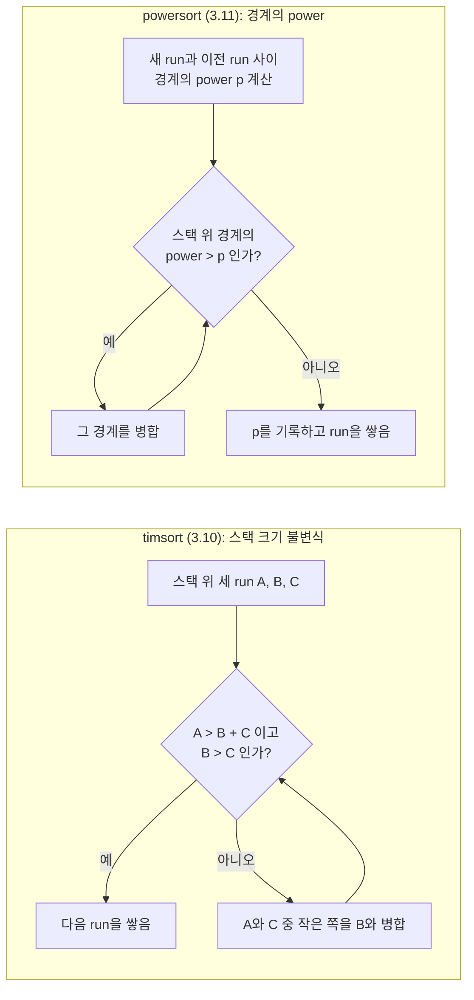
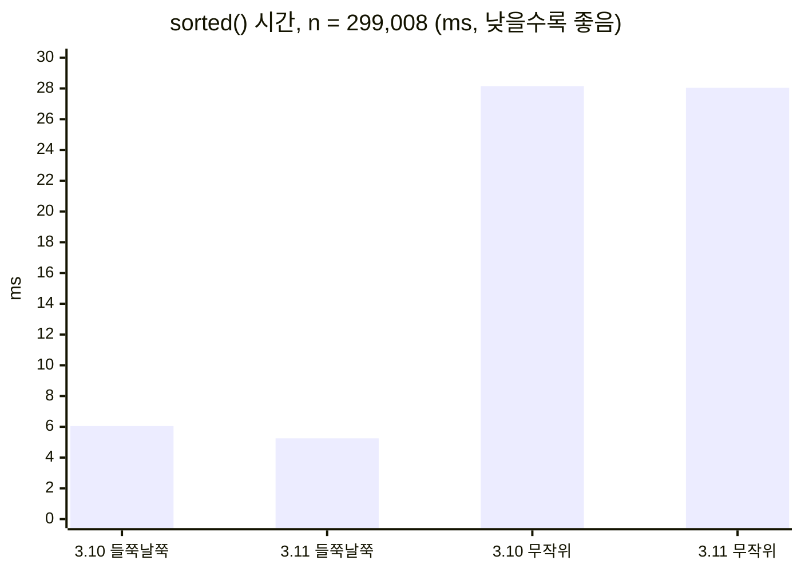

# CPython 3.11의 powersort: list.sort가 바꾼 병합 순서

> Python 3.11에서 list.sort의 run 병합 규칙이 timsort의 스택 불변식에서 powersort의 경계 power로 바뀌었습니다. 무엇이 달라졌는지 코드로 따라가고, 3.10과 3.11에서 비교 횟수와 시간을 직접 재 봤습니다. 무작위 입력에서는 차이가 없고, 길이가 고르지 않은 run에서만 차이가 납니다.
> 2024-08-20 · https://alfex4936.github.io/blog/cpython-powersort/

Python의 `list.sort`는 2002년부터 timsort였습니다. 이미 정렬된 구간(run)을 찾아 스택에 쌓고, 스택 크기 규칙에 따라 이웃한 run을 병합하는 방식입니다. Python 3.11에서 이 중 **병합 순서를 정하는 규칙 하나만** powersort로 바뀌었습니다.[^1] run을 찾는 방법, 짧은 run을 삽입 정렬로 늘리는 방법, galloping은 그대로입니다.

릴리스 노트에서는 한 줄이라 지나치기 쉬운 변경입니다. 이 글의 수치는 모두 Docker의 `python:3.10.22`, `python:3.11.17` 이미지(linux/arm64, Apple Silicon 노트북)에서 직접 잰 것입니다.

## 두 병합 규칙



timsort는 스택에 쌓인 run 길이만 봅니다. 위에서부터 세 run을 A, B, C라 할 때 A > B + C, B > C가 성립하도록 유지하고, 깨지면 병합합니다. 이 규칙 덕분에 스택 길이는 피보나치처럼 늘어나 깊이가 로그로 제한됩니다. 다만 이 불변식은 원래 위쪽 세 개만 검사해서 깊은 곳에서 깨질 수 있었고, 2015년 de Gouw 등이 정형 검증 중에 이를 찾아내 네 번째 run까지 보는 검사가 추가됐습니다.[^2]

powersort는 run 길이 대신 **배열 안에서 run이 놓인 위치**를 봅니다. 두 run 사이의 경계마다 power라는 정수를 매기고, power가 큰 경계부터 병합합니다. power가 작을수록 병합 트리의 뿌리 쪽에 가깝습니다.

## 경계의 power

배열 길이를 $n$이라 하고, 이웃한 두 run이 위치 $s_1$에서 시작해 길이 $n_1$, $n_2$라고 합시다. 각 run의 중점을 $[0, 1)$로 정규화합니다.

$$
a = \frac{s_1 + n_1/2}{n}, \qquad b = \frac{s_1 + n_1 + n_2/2}{n}
$$

경계의 power는 $a$와 $b$를 이진 소수로 썼을 때 **처음으로 다른 자리의 번호**입니다. $[0,1)$을 반, 사분의 일, 팔분의 일로 계속 나눌 때 두 중점이 처음 갈라지는 깊이라고 봐도 됩니다. 배열 한가운데를 걸치는 경계는 power 1이 되고, 끝 쪽의 작은 run 사이는 power가 큽니다. CPython은 이 값을 부동소수점 없이 정수 연산으로 구합니다. 그 루프를 Python으로 옮기면 이렇습니다.

<Walk>

```python title="power.py"
def power(s1, n1, n2, n):
    a = 2 * s1 + n1
    b = a + n1 + n2
    p = 0
    while True:
        p += 1
        if a >= n:
            a -= n; b -= n
        elif b >= n:
            break
        a <<= 1; b <<= 1
    return p
```

<Step lines="2-3">

두 중점에 $2n$을 곱해 정수로 만듭니다. $a/2n$과 $b/2n$이 원래 중점입니다. 나눗셈을 하지 않으니 반올림 오차가 없습니다.

</Step>

<Step lines="7-8">

$a \ge n$이면 $a/2n \ge 1/2$이고, $b > a$이므로 $b$도 마찬가지입니다. 두 수의 현재 자리가 모두 1이니 1을 빼고 다음 자리로 넘어갑니다.

</Step>

<Step lines="9-10">

$a < n \le b$이면 현재 자리에서 $a$는 0, $b$는 1입니다. 처음 갈라진 자리를 찾았으니 그 번호 `p`를 돌려줍니다.

</Step>

<Step lines="11">

둘 다 0이면 두 배로 늘려 다음 자리를 봅니다. 이진 소수를 한 자리씩 왼쪽으로 미는 것과 같습니다.

</Step>

</Walk>

CPython의 실제 구현(`Objects/listobject.c`의 `powerloop`)도 같은 루프입니다. 이 루프는 run 하나를 찾을 때마다 한 번 돌고 반복 횟수는 $\log_2 n$을 넘지 않으므로, 정렬 전체 비용에 비하면 무시할 만합니다.

## 같은 run, 다른 병합 순서

병합 순서가 얼마나 달라지는지 보려고 run 길이 열두 개짜리 예를 하나 골랐습니다. 아래에서 설명할 시뮬레이션에서 두 규칙의 차이가 가장 컸던 입력입니다.

| run | 576 | 89 | 13 | 39 | 136 | 165 | 6 | 110 | 10 | 13 | 6 | 5 |
|---|---|---|---|---|---|---|---|---|---|---|---|---|
| 오른쪽 경계 power | 1 | 4 | 5 | 3 | 2 | 4 | 3 | 4 | 6 | 7 | 8 | |

맨 앞의 576짜리 run과 나머지 사이 경계가 power 1입니다. powersort는 이 경계를 맨 마지막에 한 번만 병합합니다. 576개 원소는 병합에 딱 한 번 참여합니다.

timsort는 같은 입력에서 이렇게 병합합니다.

| 단계 | timsort (3.10) | powersort (3.11) |
|---:|---|---|
| 1 | 13 + 39 | 13 + 39 |
| 2 | 89 + 52 | 89 + 52 |
| 3 | 141 + 136 | 141 + 136 |
| 4 | 6 + 110 | 165 + 6 |
| 5 | 165 + 116 | 6 + 5 |
| 6 | 277 + 281 | 13 + 11 |
| 7 | 10 + 13 | 10 + 24 |
| 8 | 558 + 23 | 110 + 34 |
| 9 | 576 + 581 | 171 + 144 |
| 10 | 6 + 5 | 277 + 315 |
| 11 | **1157 + 11** | 576 + 592 |

timsort는 뒤쪽 작은 run이 스택에 늦게 도착하는 바람에 558짜리 덩어리에 23개를, 1157짜리 덩어리에 11개를 따로 붙입니다. 큰 덩어리가 작은 run 때문에 병합에 또 들어가는 것입니다. 병합 비용을 "병합하는 두 run 길이의 합"으로 세면 timsort는 4,365, powersort는 2,929입니다.

## 엔트로피로 본 하한

run 길이가 $r_1, \dots, r_k$일 때 run 분포의 엔트로피는 다음과 같습니다.

$$
\mathcal{H} = -\sum_{i=1}^{k} \frac{r_i}{n} \log_2 \frac{r_i}{n}
$$

비교 기반 병합으로 이 run들을 합치려면 대략 $n\mathcal{H}$ 정도의 비용은 피할 수 없습니다. 길이가 고른 run이 많으면 $\mathcal{H}$가 크고, 큰 run 하나가 대부분이면 작습니다. Munro와 Wild는 powersort의 병합 비용이 $n\mathcal{H} + O(n)$ 이하임을 보였고,[^3] Buss와 Knop은 timsort가 $1.5\,n\mathcal{H}$ 근처까지 갈 수 있음을 보였습니다.[^4]

이걸 직접 확인하려고 두 병합 규칙을 Python으로 옮기고(timsort는 3.10의 `merge_collapse`, powersort는 3.11의 `found_new_run`), 무작위 run 길이 목록 20,000개에서 병합 비용을 $n\mathcal{H}$로 나눠 봤습니다.

| 입력 | timsort / $n\mathcal{H}$ | powersort / $n\mathcal{H}$ |
|---|---:|---:|
| 길이 64 run 1,024개 | 1.000 | 1.000 |
| 길이가 두 배씩 줄어드는 run | 1.000 | 1.000 |
| 위의 12개 run ($\mathcal{H}$ = 2.346) | 1.593 | 1.069 |

고른 run이나 규칙적으로 줄어드는 run에서는 둘 다 최적입니다. 차이는 길이가 들쭉날쭉할 때만 생기고, 20,000개 중 가장 나쁜 경우가 1.49배였습니다.

## 실제 CPython에서

시뮬레이션의 병합 비용은 원소 이동 횟수에 가깝지만, 실제 `list.sort`에는 galloping이 있어서 큰 run에 작은 run을 붙일 때 이진 탐색으로 대부분을 건너뜁니다. 그래서 `__lt__`가 불릴 때마다 횟수를 세는 클래스로 3.10과 3.11의 실제 비교 횟수를 쟀습니다. 먼저 흔한 패턴입니다($n$ = 131,072).

| 입력 | 3.10 | 3.11 |
|---|---:|---:|
| 무작위 | 2,057,640 | 2,057,640 |
| 정렬됨 / 역순 | 131,071 | 131,071 |
| 길이 32 run 반복 | 1,697,099 | 1,697,099 |
| 길이가 두 배씩 줄어드는 run | 393,333 | 393,333 |
| 길이 1,000 run 반복 | 1,065,802 | 1,053,757 |
| 길이 10,000 run 반복 | 629,970 | 619,977 |
| 파레토 분포 run 길이 | 1,079,127 | 1,075,868 |

무작위, 정렬, 고른 run에서는 한 번도 다르지 않습니다. 이런 입력에서는 두 규칙이 같은 병합 트리를 만들기 때문입니다. 차이는 run 길이가 $n$을 깔끔하게 나누지 못할 때만 1% 안팎으로 생깁니다.

위의 12개 run 패턴을 64배, 256배로 늘리고 각 run을 정렬된 무작위 실수로 채우면 이렇습니다.

| 배율 | $n$ | 3.10 비교 | 3.11 비교 |
|---:|---:|---:|---:|
| ×64 | 74,752 | 262,295 | 255,202 (−2.7%) |
| ×256 | 299,008 | 1,049,539 | 1,020,365 (−2.8%) |

시뮬레이션에서 1.49배였던 차이가 비교 횟수로는 3% 남짓입니다. 큰 run과 작은 run을 병합할 때 galloping이 큰 쪽을 거의 건너뛰기 때문입니다. 시간은 비교 횟수보다 조금 더 차이가 납니다. 비교를 건너뛰어도 원소 복사(memcpy)는 남는데, powersort는 큰 덩어리를 다시 병합하지 않으니 복사 자체가 줄어듭니다.



×256 입력에서 3.10은 6.05 ms, 3.11은 5.25 ms로 13% 빨랐습니다. 같은 크기의 무작위 입력은 28.15 ms와 28.04 ms로 차이가 없습니다. 모두 7번씩 5회 반복한 값 중 최솟값입니다.

## 정리

- 3.11의 변경은 `list.sort`의 병합 순서를 정하는 규칙 하나입니다. run 탐색, 삽입 정렬, galloping은 그대로입니다.
- timsort는 스택 위 run 길이로, powersort는 배열 안에서 경계의 위치(power)로 병합 순서를 정합니다. power는 두 run 중점의 이진 표현이 처음 갈라지는 자리입니다.
- 무작위, 정렬, 고른 run 입력에서는 비교 횟수가 3.10과 한 번도 다르지 않았습니다. 일상적인 정렬에서 빨라진 것을 느끼기는 어렵습니다.
- 길이가 들쭉날쭉한 run에서는 병합 비용이 이론상 최대 1.5배까지 차이 나고, galloping이 대부분을 흡수해 실측으로는 비교 3%, 시간 13% 정도였습니다.

이 변경의 가치는 평균 속도보다 **보장**에 있습니다. timsort의 병합 비용은 $1.5\,n\mathcal{H}$까지 갈 수 있다는 것이 알려져 있었고, powersort는 $n\mathcal{H} + O(n)$ 이하를 보장합니다. 게다가 규칙이 스택 불변식보다 단순해서, 2015년처럼 불변식이 깊은 곳에서 깨지는 종류의 버그가 생길 여지가 없습니다.

[^1]: CPython 3.11의 `Objects/listsort.txt`에 powersort로 바꾼 이유와 power 계산 방법이 정리되어 있습니다. 변경은 Tim Peters가 직접 했습니다.
[^2]: Stijn de Gouw 외, "OpenJDK's java.utils.Collection.sort() is broken: The good, the bad and the worst case", CAV 2015. 같은 버그가 CPython에도 있었습니다.
[^3]: J. Ian Munro, Sebastian Wild, "Nearly-Optimal Mergesorts: Fast, Practical Sorting Methods That Optimally Adapt to Existing Runs", ESA 2018.
[^4]: Sam Buss, Alexander Knop, "Strategies for Stable Merge Sorting", SODA 2019.
