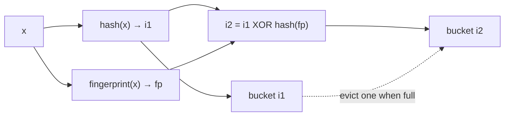
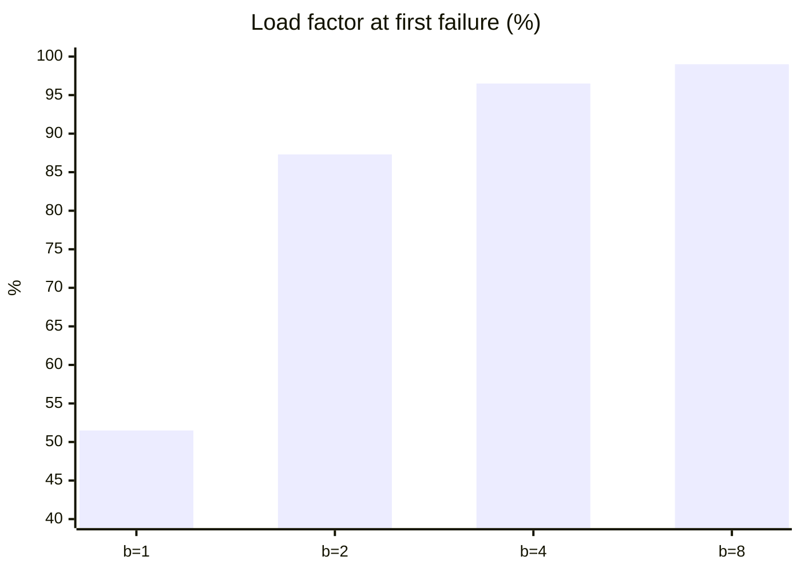

# Is a cuckoo filter really better than a Bloom filter?

> The cuckoo filter paper is subtitled Practically Better Than Bloom. Implementing both and measuring load factor by bucket size, false-positive rate at equal space, and deletion shows it is not always true.
> 2023-06-22 · https://alfex4936.github.io/blog/cuckoo-vs-bloom/

You cannot delete from a Bloom filter. Each bit is shared by several items, so clearing one removes others too. The cuckoo filter, published by Fan et al. in 2014, stores fingerprints in a cuckoo hash table instead, which makes deletion possible, and claims a lower false-positive rate in the same space.[^1] The paper's subtitle is "Practically Better Than Bloom". I implemented both in Python to see how far that holds. Hashing is blake2b, the environment Python 3 on an Apple Silicon laptop. Only ratios are measured, not time, so the language does not affect the results. The code below is an excerpt with bookkeeping such as the item counter removed.

## One fingerprint, two places

A cuckoo filter puts the fingerprint `fp` of item `x` into whichever of two candidate buckets has room. If both are full, it evicts one fingerprint and sends that one to its other place. The name comes from the cuckoo pushing eggs out of another bird's nest.



The tricky part is finding an evicted fingerprint's other place without the original item, because the table only holds fingerprints. The paper's answer is partial-key cuckoo hashing.

<Walk>

```python title="cuckoo.py"
def _alt(s, i, fp):
    return (i ^ h64(fp, 99)) % s.nb

def add(s, x):
    fp, i1 = s._fp(x); i2 = s._alt(i1, fp)
    for i in (i1, i2):
        if len(s.t[i]) < s.bs:
            s.t[i].append(fp); return True
    i = s.rng.choice((i1, i2))
    undo = []
    for _ in range(s.mk):
        j = s.rng.randrange(len(s.t[i]))
        undo.append((i, j, s.t[i][j]))
        fp, s.t[i][j] = s.t[i][j], fp
        i = s._alt(i, fp)
        if len(s.t[i]) < s.bs:
            s.t[i].append(fp); return True
    for i, j, old_fp in reversed(undo):
        s.t[i][j] = old_fp
    return False
```

<Step lines="1-2">

The other place is the current place XORed with a hash of the fingerprint. XOR is its own inverse, so the same expression takes `i1` to `i2` and `i2` back to `i1`. The original key is not needed. The bucket count must be a power of two so that `% nb` does not break this.

</Step>

<Step lines="5-8">

If either candidate has a free slot, insert there. While the table is mostly empty, this is where nearly every insert ends.

</Step>

<Step lines="9-17">

If both are full, pick a random fingerprint, put ours in its slot, and send the evicted one to its other place via `_alt`. If that is full too, evict again. Record each changed slot and its previous fingerprint in `undo`.

</Step>

<Step lines="18-20">

If no free slot turns up within a fixed number of kicks (500 here), the insert fails. This does not prove the whole table is full; the relocation path failed to find room. The last displaced fingerprint is still outside the table in `fp`, so returning failure without repair can lose an existing member. The example rolls changes back in reverse order to restore the table before the failed insert. Order matters because a slot may have been changed several times.

</Step>

</Walk>

## Bucket size and load factor

How many fingerprints a bucket holds decides space efficiency. With $2^{14}$ buckets and 16-bit fingerprints I inserted until the first failure and recorded the load factor, three times with different seeds.

| Slots per bucket | Trial 1 | Trial 2 | Trial 3 |
| ---: | ---: | ---: | ---: |
| 1 | 52.3% | 53.2% | 48.9% |
| 2 | 87.2% | 87.0% | 87.6% |
| 4 | 96.6% | 96.3% | 96.6% |
| 8 | 99.1% | 98.7% | 99.1% |



One slot barely fills half. Four reach 96%, which is why the paper recommends four slots per bucket. Eight fill more, but a lookup compares twice as many fingerprints and false positives grow accordingly.

## False-positive rate in equal space

A fair comparison fixes bits per item. I built a cuckoo filter with $2^{16}$ slots and four slots per bucket, filled it to 95%, and gave a Bloom filter the same item count and the same total bits, with the optimal number of hash functions `k`. Lookups used 400,000 items that were never inserted.

| Fingerprint bits | Bits per item | Cuckoo FPR | Cuckoo bound $2b/2^f$ | Bloom `k` | Bloom FPR | Bloom theory |
| ---: | ---: | ---: | ---: | ---: | ---: | ---: |
| 8 | 8.42 | 2.98% | 3.13% | 6 | **1.78%** | 1.75% |
| 12 | 12.63 | **0.182%** | 0.195% | 9 | 0.219% | 0.232% |
| 16 | 16.84 | **0.014%** | 0.012% | 12 | 0.028% | 0.031% |

At a little over 8 bits per item Bloom wins. From 12 bits cuckoo leads, and at 16 its false-positive rate is half of Bloom's.

The formulas explain it. A cuckoo lookup compares against two buckets, $2b = 8$ fingerprints, so its rate is about $2b/2^f$. An optimal Bloom filter has $(1/2)^{k}$ with $k \approx 0.69 \cdot m/n$.

$$
\varepsilon_{\text{cuckoo}} \approx \frac{2b}{2^{f}}, \qquad \varepsilon_{\text{bloom}} \approx 0.6185^{\,m/n}
$$

Each extra bit per item halves the cuckoo rate but only multiplies the Bloom rate by 0.6185. Cuckoo starts $2b$ times behind with a steeper slope, so the lines cross. In my implementation the crossover is between 8 and 12 bits. The paper reports it drops to about 7 bits per item with semi-sorting, which compresses the sorted fingerprints within a bucket. I did not implement semi-sorting.

> If you live around a 3% false-positive rate, Bloom is smaller. If you need 0.1% or less, cuckoo is smaller.

## How safe is deletion

Deletion is the cuckoo filter's real advantage. I inserted 10,000 items, deleted the 5,000 even ones, and queried.

| Check | Result |
| --- | ---: |
| Odd items that should remain | 5,000 / 5,000 present |
| Deleted even items still answering "present" | 4 |

The 4 are deleted items whose fingerprint happens to collide with a remaining item's. After deletion an item can still answer "present" at the false-positive rate, which is correct behaviour.

The trap is elsewhere: you must not delete an item that was never inserted. I searched for an item that is a false positive and called `remove` on it, and a real member with the same fingerprint disappeared. The filter only sees fingerprints and cannot tell the two apart. Deleting the same item twice does the same damage.

So deletion holds only if the caller guarantees it deletes items that were definitely inserted, once each. That is easy when the authoritative set lives elsewhere and the filter is a cache in front of it. It does not hold when external input is deleted directly.

<Quiz lang="en" title="Checkpoint: authorizing deletion" items={[
  {
    q: "A cuckoo filter reports 'present' for a key absent from the source set. Can that response alone authorize deletion?",
    choices: ["Yes. A successful lookup proves the key was inserted.", "No. Deletion may remove a real member's colliding fingerprint.", "Yes. Deletion only clears the false positive."],
    answer: 1,
    why: "The filter compares fingerprints, not keys. Removing a false-positive match may make a real member disappear from lookups. Establish membership in the source set before deleting.",
  },
]} />

## When to use which

| Situation | Choice |
| --- | --- |
| 1–3% false positives, no deletion | Bloom |
| 0.1% false positives or less | Cuckoo |
| Deletion, deleted items known to be present | Cuckoo |
| Deletion, no such guarantee | Check insertion in the source set before deleting |
| Size unknown in advance | Neither; e.g. Scalable Bloom |

Counting Bloom does not remove the deletion requirement either. Counters replace shared bits and can be decremented, but decrementing for an item never inserted, or already deleted, can make another member disappear from lookups. An approximate "present" response must not authorize deletion. The caller must track successful insertions and deletions exactly or check the source set.

A cuckoo filter can fail to find a slot within its relocation budget. Its failure path must roll back changes as above, or retain the displaced fingerprint separately, to avoid losing an existing member. Overfilling a Bloom filter only degrades its false-positive rate gradually. In production this difference often matters more than the rates.

## Summary

The subtitle is half right. With four slots per bucket it fills to 96%, from 12 bits per item it has a lower false-positive rate in the same space, and it supports deletion. But around 8 bits per item Bloom is more accurate, deletion depends on the caller's discipline, and a full filter fails. "Better than Bloom when the target false-positive rate is low and you need deletion" is the sentence the measurements support.

<Quiz lang="en" title="Putting a filter in front of the source set" items={[
  {
    q: "In this post's equal-space comparison, you have 8.42 bits per item and need no deletion. Which measured false-positive rate favors your choice?",
    choices: ["Cuckoo, because it has a lower rate at every bit budget.", "Neither, because equal space means equal rates.", "Bloom, because its rate is lower in this row."],
    answer: 2,
    why: "This row reports 1.78% for Bloom and 2.98% for cuckoo. Longer fingerprints reverse the ranking, so the paper's title is not a rule to always choose cuckoo.",
  },
  {
    q: "An evicted fingerprint has no original key stored. With a power-of-two bucket count, how do you find its other candidate bucket?",
    choices: ["XOR the current bucket index with the fingerprint's hash.", "You cannot find it without the original key.", "Scan the whole table for an identical fingerprint."],
    answer: 0,
    why: "Applying the same XOR twice reverses it. The current bucket and fingerprint suffice to travel between candidates. The bucket-count condition keeps the modulo operation from breaking this property.",
  },
  {
    q: "The item count keeps growing beyond your estimate. How do these fixed-size filters behave on insertion?",
    choices: ["Both reject inserts once their capacity is exceeded.", "Cuckoo can fail to find a slot; Bloom's false-positive rate degrades.", "Only Bloom rejects inserts; cuckoo grows automatically."],
    answer: 1,
    why: "Cuckoo must find an empty slot within a bounded number of relocations. Failure can leave a fingerprint displaced, so the example reverses its changes. Bloom can keep setting bits, but its false-positive rate rises. Unknown size calls for a scalable structure.",
  },
]} />

[^1]: Bin Fan, David G. Andersen, Michael Kaminsky, Michael D. Mitzenmacher, "Cuckoo Filter: Practically Better Than Bloom", CoNEXT 2014.
