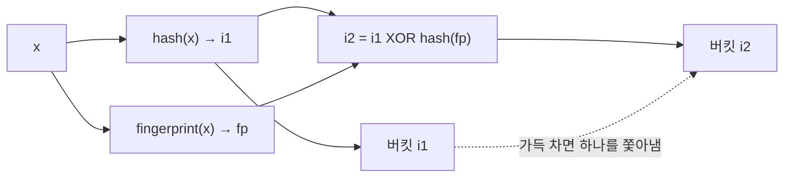
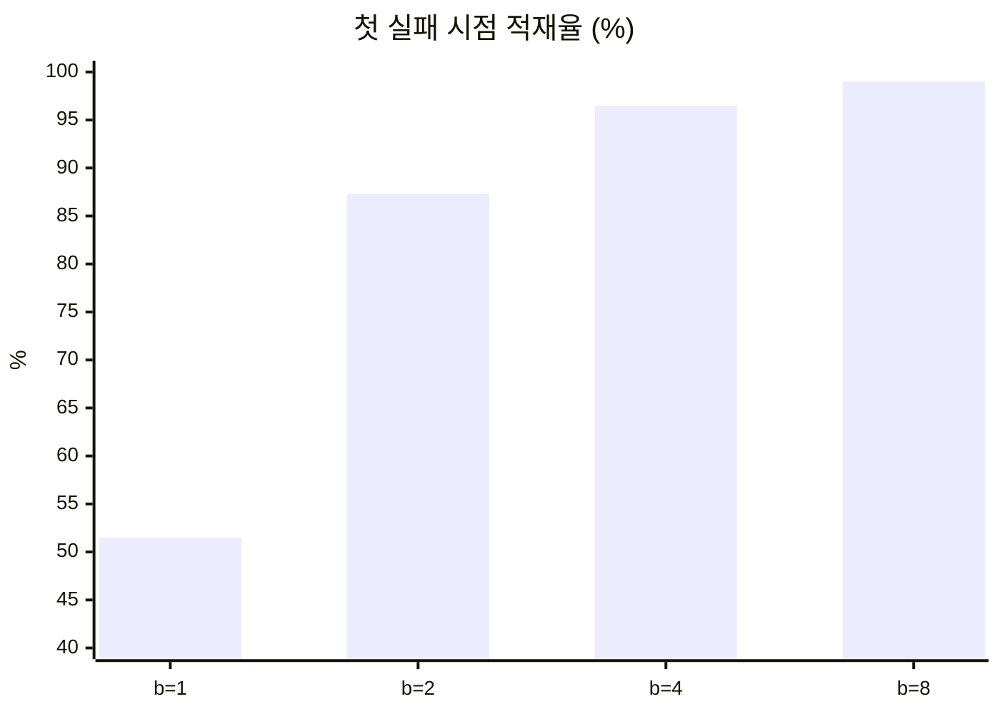

# Cuckoo filter는 정말 Bloom filter보다 나은가

> Cuckoo filter 논문의 부제는 Practically Better Than Bloom입니다. 버킷 크기별 적재율, 같은 공간에서의 오탐률, 삭제가 실제로 어떻게 동작하는지 직접 구현해 재 보니 '항상'은 아니었습니다.
> 2023-06-22 · https://alfex4936.github.io/blog/cuckoo-vs-bloom/

Bloom filter는 원소를 지울 수 없습니다. 비트 하나가 여러 원소의 몫이라 하나를 지우면 다른 원소까지 사라집니다. 2014년 Fan 등이 발표한 Cuckoo filter는 원소 대신 지문(fingerprint)을 cuckoo 해시 테이블에 넣어 삭제를 지원하고, 같은 공간에서 오탐률도 더 낮다고 주장합니다.[^1] 논문 부제가 "Practically Better Than Bloom"입니다. 두 구조를 Python으로 구현해서 이 주장이 어디까지 맞는지 확인했습니다. 해시는 blake2b, 환경은 Python 3(Apple Silicon 노트북)입니다. 아래 코드는 원소 수 집계 같은 부분을 뺀 발췌입니다. 시간이 아니라 비율만 재므로 언어는 결과에 영향이 없습니다.

## 지문 하나에 자리 두 개

Cuckoo filter는 원소 `x`의 지문 `fp`를 두 후보 버킷 중 빈 자리가 있는 곳에 넣습니다. 둘 다 차 있으면 한쪽의 지문 하나를 쫓아내고 그 지문을 자기 다른 자리로 보냅니다. 뻐꾸기가 남의 둥지에서 알을 밀어내는 것과 같다고 해서 이 이름이 붙었습니다.



까다로운 점은 쫓겨난 지문의 다른 자리를 원래 원소 없이 알아내야 한다는 것입니다. 테이블에는 지문만 있으니까요. 논문의 해법이 partial-key cuckoo hashing입니다.

<Walk>

```python title="cuckoo.py"
def _alt(s, i, fp):
    return (i ^ h64(fp, 99)) % s.nb

def add(s, x):
    fp, i1 = s._fp(x); i2 = s._alt(i1, fp)
    for i in (i1, i2):
        if len(s.t[i]) < s.bs:
            s.t[i].append(fp); return True
    i = s.rng.choice((i1, i2))
    for _ in range(s.mk):
        j = s.rng.randrange(len(s.t[i]))
        fp, s.t[i][j] = s.t[i][j], fp
        i = s._alt(i, fp)
        if len(s.t[i]) < s.bs:
            s.t[i].append(fp); return True
    return False
```

<Step lines="1-2">

다른 자리는 현재 자리와 지문의 해시를 XOR해서 구합니다. XOR은 자기 역원이므로 `i1`에서 `i2`를, `i2`에서 `i1`을 같은 식으로 얻습니다. 원래 키가 없어도 됩니다. 버킷 수가 2의 거듭제곱이어야 `% nb`가 이 성질을 깨지 않습니다.

</Step>

<Step lines="5-8">

두 후보 중 빈 자리가 있으면 바로 넣습니다. 테이블이 비어 있을 때는 대부분 여기서 끝납니다.

</Step>

<Step lines="9-15">

둘 다 차 있으면 무작위로 지문 하나를 꺼내고 내 지문을 그 자리에 넣습니다. 꺼낸 지문은 `_alt`로 자기 다른 자리를 찾아갑니다. 거기도 차 있으면 또 쫓아냅니다.

</Step>

<Step lines="16">

정해진 횟수(여기서는 500번) 안에 빈 자리를 못 찾으면 삽입이 실패합니다. 이때가 필터가 "가득 찬" 순간입니다.

</Step>

</Walk>

## 버킷 크기와 적재율

버킷 하나에 지문을 몇 개 담느냐가 공간 효율을 정합니다. 버킷 $2^{14}$개, 16비트 지문으로 첫 삽입 실패가 날 때까지 넣고 적재율을 봤습니다. 시드를 바꿔 세 번 반복했습니다.

| 버킷당 슬롯 | 시도 1 | 시도 2 | 시도 3 |
| ---: | ---: | ---: | ---: |
| 1 | 52.3% | 53.2% | 48.9% |
| 2 | 87.2% | 87.0% | 87.6% |
| 4 | 96.6% | 96.3% | 96.6% |
| 8 | 99.1% | 98.7% | 99.1% |



슬롯이 하나면 절반을 겨우 채웁니다. 넷이면 96%까지 갑니다. 논문이 기본값으로 버킷당 4슬롯을 권하는 이유입니다. 8로 늘리면 더 채울 수 있지만 조회 때 비교할 지문이 두 배가 되고, 그만큼 오탐도 늘어납니다.

## 같은 공간에서 오탐률

공정하게 비교하려면 원소당 비트 수를 맞춰야 합니다. Cuckoo filter를 슬롯 $2^{16}$개, 버킷당 4슬롯으로 만들어 95%까지 채우고, 같은 원소 수에 같은 총 비트를 Bloom filter에 줬습니다. Bloom의 해시 함수 개수 `k`는 최적값을 썼습니다. 넣지 않은 원소 40만 개로 조회했습니다.

| 지문 비트 | 원소당 비트 | Cuckoo 오탐률 | Cuckoo 상한 $2b/2^f$ | Bloom `k` | Bloom 오탐률 | Bloom 이론값 |
| ---: | ---: | ---: | ---: | ---: | ---: | ---: |
| 8 | 8.42 | 2.98% | 3.13% | 6 | **1.78%** | 1.75% |
| 12 | 12.63 | **0.182%** | 0.195% | 9 | 0.219% | 0.232% |
| 16 | 16.84 | **0.014%** | 0.012% | 12 | 0.028% | 0.031% |

원소당 8비트 남짓에서는 Bloom이 이깁니다. 12비트부터 Cuckoo가 앞서고, 16비트에서는 오탐률이 절반입니다.

이유는 식에 있습니다. Cuckoo는 조회 때 버킷 두 개, 지문 $2b = 8$개와 비교하므로 오탐률이 대략 $2b/2^f$입니다. Bloom은 최적일 때 $(1/2)^{k}$이고 $k \approx 0.69 \cdot m/n$입니다.

$$
\varepsilon_{\text{cuckoo}} \approx \frac{2b}{2^{f}}, \qquad \varepsilon_{\text{bloom}} \approx 0.6185^{\,m/n}
$$

원소당 비트가 늘 때 Cuckoo는 비트 하나당 오탐률이 절반으로 줄고 Bloom은 0.6185배로 줄어듭니다. 출발점은 Cuckoo가 $2b$ 배만큼 불리하지만 기울기가 더 가파르니 어느 지점에서 교차합니다. 제 구현에서는 8과 12비트 사이였습니다. 논문은 버킷 안의 지문을 정렬해 압축하는 semi-sorting을 쓰면 교차점이 원소당 약 7비트까지 내려간다고 합니다. 저는 semi-sorting을 구현하지 않았습니다.

> 오탐률 3% 언저리를 쓰는 곳이라면 Bloom이 더 작습니다. 0.1% 이하가 필요하면 Cuckoo가 더 작습니다.

## 삭제는 얼마나 안전한가

삭제가 Cuckoo filter의 진짜 장점입니다. 원소 1만 개를 넣고 짝수 5천 개를 지운 뒤 조회했습니다.

| 확인 대상 | 결과 |
| --- | ---: |
| 남아 있어야 할 홀수 | 5,000 / 5,000 있음 |
| 지운 짝수 중 "있음"으로 답한 수 | 4 |

남은 4개는 지운 원소의 지문이 다른 원소 지문과 우연히 겹친 오탐입니다. 지운 뒤에도 오탐률만큼은 "있음"으로 답할 수 있다는 뜻이고, 이는 정상 동작입니다.

함정은 따로 있습니다. 넣은 적 없는 원소를 지우면 안 됩니다. 오탐으로 "있음"이 나오는 원소를 일부러 찾아 `remove`를 불렀더니, 같은 지문을 가진 진짜 원소 하나가 사라졌습니다. 필터는 지문만 보므로 둘을 구별할 수 없습니다. 같은 원소를 두 번 지우는 것도 마찬가지입니다.

따라서 Cuckoo filter의 삭제는 "확실히 넣었던 원소를 한 번만 지운다"는 조건을 호출하는 쪽이 지켜야 합니다. 원본 집합이 다른 곳에 있고 필터는 그 앞의 캐시 역할만 할 때는 쉽게 지켜지는 조건입니다. 외부 입력을 그대로 지우는 구조에서는 지켜지지 않습니다.

## 언제 무엇을 쓰나

| 상황 | 고를 것 |
| --- | --- |
| 오탐률 1~3%, 삭제 없음 | Bloom |
| 오탐률 0.1% 이하 | Cuckoo |
| 삭제 필요, 지울 원소가 확실히 들어 있음 | Cuckoo |
| 삭제 필요, 지울 원소를 보장할 수 없음 | Counting Bloom이나 원본 조회 |
| 크기를 미리 알 수 없음 | 둘 다 아님. Scalable Bloom 등 |

Cuckoo filter는 가득 차면 삽입이 실패합니다. Bloom filter는 넘치게 넣어도 오탐률이 서서히 나빠질 뿐 실패하지 않습니다. 운영에서는 이 차이가 오탐률 수치보다 클 때가 많습니다.

## 정리

부제는 반쯤 맞습니다. 버킷당 4슬롯이면 96%까지 채우고, 원소당 12비트 이상에서는 같은 공간에 오탐률이 더 낮으며, 삭제도 됩니다. 그러나 원소당 8비트 언저리에서는 Bloom이 더 정확하고, 삭제는 호출하는 쪽의 규율에 기대며, 꽉 차면 실패합니다. "Bloom보다 낫다"보다는 "목표 오탐률이 낮고 삭제가 필요하면 낫다"가 측정에 맞는 문장입니다.

[^1]: Bin Fan, David G. Andersen, Michael Kaminsky, Michael D. Mitzenmacher, "Cuckoo Filter: Practically Better Than Bloom", CoNEXT 2014.
