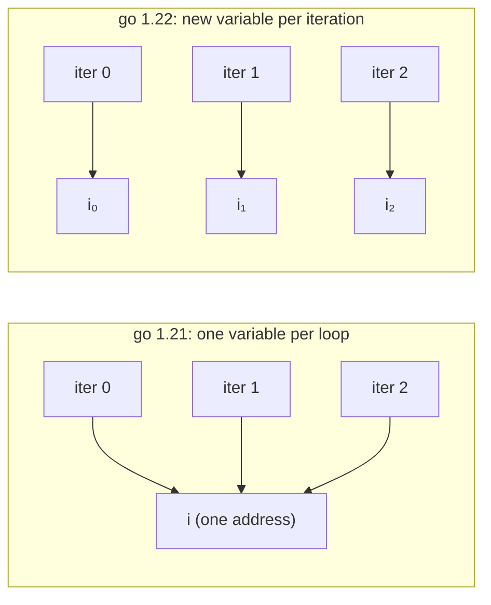

# Go 1.22 loop variables: the fixed bug and one line of go.mod

> Since Go 1.22, for-loop variables are created fresh on every iteration. But the go line in go.mod, not the toolchain, decides which semantics apply, and go run main.go never reads that line. I checked both toolchains, and measured a loop that leaks addresses going from 2 to 102 allocations.
> 2024-03-05 · https://alfex4936.github.io/blog/go122-loopvar/

Go 1.22 shipped in February 2024 and changed what a `for` loop variable means.[^1] Up to 1.21 the whole loop shared one variable; from 1.22 each iteration gets a new one. The most common Go mistake, closures and goroutines capturing the loop variable, is gone at the language level.

The release note is a single paragraph, but which code actually gets the new semantics is subtler than it looks. Every result here comes from the Docker images `golang:1.21.13` and `golang:1.22.12` (linux/arm64, on an Apple Silicon laptop).

## What changed



The test program looks at three patterns at once: a closure capturing `i`, collecting `&i` into a slice, and goroutines reading a `range` variable.

```go title="main.go"
var fs []func()
for i := 0; i < 3; i++ {
	fs = append(fs, func() { fmt.Print(i, " ") })
}
for _, f := range fs { f() }

var ps []*int
for i := 0; i < 3; i++ { ps = append(ps, &i) }
for _, p := range ps { fmt.Print(*p, " ") }

for _, s := range []string{"a", "b", "c"} {
	wg.Add(1)
	go func() { defer wg.Done(); mu.Lock(); seen[s]++; mu.Unlock() }()
}
```

| Pattern | go 1.21 semantics | go 1.22 semantics |
|---|---|---|
| closure captures `i` | `3 3 3` | `0 1 2` |
| collect `&i` | `3 3 3` | `0 1 2` |
| goroutine reads `s` | `map[c:3]` | `map[a:1 b:1 c:1]` |

Under 1.21 semantics all three closures point at the same `i`, which is 3 once the loop ends. The goroutines all saw the last element `c` by the time of `wg.Wait()`. The usual workaround was an `s := s` line inside the loop; from 1.22 that line is unnecessary.

## go.mod decides, not the toolchain

Upgrading the toolchain to 1.22 does not switch the new semantics on. The deciding input is the `go` line in each module's `go.mod`. Dependencies follow their own `go` line, so a toolchain upgrade does not change how an old library behaves.

| Toolchain | Setup | Result |
|---|---|---|
| go1.21.13 | `go 1.21` | old semantics |
| go1.21.13 | `go 1.22` | refuses to build: `go.mod requires go >= 1.22` |
| go1.21.13 | `go 1.21` + `GOEXPERIMENT=loopvar` | new semantics |
| go1.22.12 | `go 1.21`, `go run .` | old semantics |
| go1.22.12 | `go 1.21`, `go run main.go` | **new semantics** |
| go1.22.12 | `go 1.22` + `//go:build go1.21` in the file | old semantics for that file only |

The 1.21 toolchain could already opt in with `GOEXPERIMENT=loopvar`. Its purpose was to check, before 1.22 shipped, whether a codebase breaks under the new semantics.

The last row is the escape hatch in the other direction. You can move the module to 1.22 and pin a single file that relies on the old behaviour with a `//go:build go1.21` constraint. The Go version in the build constraint becomes that file's language version.

## The go run main.go trap

The row that stands out is the fifth one. Same directory, same `go.mod` (`go 1.21`), yet `go run .` prints `3 3 3` and `go run main.go` prints `0 1 2`.

```text
$ go run .
3 3 3 <- closures
$ go run main.go
0 1 2 <- closures
$ go list -f '{{.Module}}' main.go
<nil>
```

When you pass file names, the go command builds a synthetic package called `command-line-arguments` from them. As `go list` shows, that package belongs to no module, so the `go` line in `go.mod` does not apply and the toolchain's own language version, 1.22, is used instead. `go build main.go` behaves the same way.

The upshot is that code CI runs with `go test ./...` and code you check locally with `go run main.go` can compile under different semantics. If you are trying to reproduce a loop variable bug and it refuses to show up, suspect this first.

## What did not change

If each iteration gets a new variable, where does a change made to `i` inside the body go? A three-clause `for` copies the current variable's value into the new one at the end of each iteration and then runs the post statement (`i++`). Changes made in the body carry over.

```go
for i := 0; i < 5; i++ {
	f := func() { i += 2 }
	f()
	fmt.Print(i, " ")
}
```

Both semantics print `2 5`. It goes from 0 to 2, `i++` makes 3, then 5, then 6 and the loop ends. A change made through a closure carries over as well, so code that adjusts the loop counter in the body behaves exactly as before.

The `go vet` `loopclosure` check follows the same rule. In a `go 1.21` module it reports `loop variable s captured by func literal`; bump the module to `go 1.22` and it says nothing about the same code.

## Cost

A fresh variable per iteration does not mean a fresh allocation per iteration. If the variable does not escape the loop, the compiler keeps it in a register as before. Allocations only grow when an address leaves the loop.

```go title="bench_test.go"
func BenchmarkAddrTaken(b *testing.B) {
	for n := 0; n < b.N; n++ {
		ps := make([]*int, 0, 100)
		for i := 0; i < 100; i++ { ps = append(ps, &i) }
		sink = ps
	}
}
func BenchmarkNoEscape(b *testing.B) {
	s := 0
	for n := 0; n < b.N; n++ { for i := 0; i < 100; i++ { s += i } }
	_ = s
}
```

These are five runs each on the same 1.22.12 toolchain, changing only the `go` line in `go.mod`.

| Benchmark | Semantics | ns/op | B/op | allocs/op |
|---|---|---:|---:|---:|
| AddrTaken | 1.21 | 157 – 176 | 904 | 2 |
| AddrTaken | 1.22 | 739 – 768 | 1,704 | 102 |
| NoEscape | 1.21 | 24.8 – 25.4 | 0 | 0 |
| NoEscape | 1.22 | 29.0 – 30.3 | 0 | 0 |

Under 1.21 semantics `AddrTaken` needs one slice and one `i`: two allocations. The answer is wrong, but cheap. Under 1.22 semantics each of the 100 `i`s goes to the heap, giving 102 allocations and about 4.6 times the time. It is not a fair comparison now that the answer is right, but if a hot loop collects `&i`, new allocations may show up in the profile after moving to 1.22.

`NoEscape` being about 17% slower looked odd at first. Disassembling `BenchmarkNoEscape` from both builds with `go tool objdump` showed not a single differing instruction. The right reading is an alignment difference from where the function landed in the binary, not a cost of the semantic change. Code layout alone produces gaps of this size in microbenchmarks.

## Summary

- The 1.22 semantics are switched on by each module's `go` line in `go.mod`, not by the toolchain. Dependencies keep their behaviour.
- Passing files directly, as in `go run main.go`, creates a package outside any module, compiled at the toolchain's language version.
- A file that needs the old semantics can be pinned per file with `//go:build go1.21`.
- Code that changes the counter in the body still works, because the value is copied before `i++` at the end of each iteration.
- The cost appears only when an address escapes the loop: one extra heap allocation per iteration.

[^1]: Go 1.22 Release Notes, "Changes to the language" (February 2024). The design background is in proposal golang/go#60078 and the Go blog post "Fixing For Loops in Go 1.22" (September 2023).
