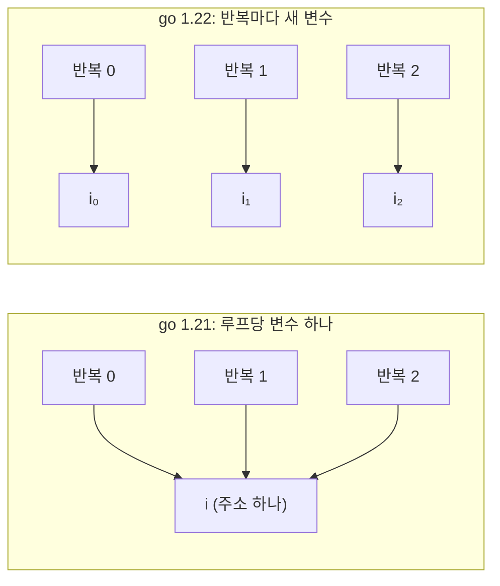

# Go 1.22 루프 변수: 고쳐진 버그와 go.mod 한 줄

> Go 1.22부터 for 루프 변수는 반복마다 새로 만들어집니다. 그런데 어느 의미가 적용될지는 툴체인이 아니라 go.mod의 go 줄이 정하고, go run main.go는 그 줄을 보지 않습니다. 두 툴체인으로 직접 확인하고, 주소를 넘기는 루프의 할당이 2개에서 102개로 느는 것까지 재 봤습니다.
> 2024-03-05 · https://alfex4936.github.io/blog/go122-loopvar/

Go 1.22가 2024년 2월에 나오면서 `for` 루프 변수의 의미가 바뀌었습니다.[^1] 1.21까지는 루프 전체가 변수 하나를 같이 썼고, 1.22부터는 반복마다 새 변수가 생깁니다. 클로저나 고루틴이 루프 변수를 잡을 때 생기던, Go에서 가장 흔한 실수가 언어 차원에서 사라졌습니다.

릴리스 노트는 한 문단이지만 실제로 어느 코드에 새 의미가 적용되는지는 생각보다 미묘합니다. 이 글의 결과는 모두 Docker의 `golang:1.21.13`, `golang:1.22.12` 이미지(linux/arm64, Apple Silicon 노트북)에서 직접 돌려 본 것입니다.

## 무엇이 바뀌었나



실험에 쓴 코드는 세 가지 패턴을 한 번에 봅니다. 클로저가 `i`를 잡는 경우, `&i`를 슬라이스에 모으는 경우, `range` 변수를 고루틴이 읽는 경우입니다.

```go title="main.go"
var fs []func()
for i := 0; i < 3; i++ {
	fs = append(fs, func() { fmt.Print(i, " ") })
}
for _, f := range fs { f() }

var ps []*int
for i := 0; i < 3; i++ { ps = append(ps, &i) }
for _, p := range ps { fmt.Print(*p, " ") }

for _, s := range []string{"a", "b", "c"} {
	wg.Add(1)
	go func() { defer wg.Done(); mu.Lock(); seen[s]++; mu.Unlock() }()
}
```

| 패턴 | go 1.21 의미 | go 1.22 의미 |
|---|---|---|
| 클로저가 `i`를 잡음 | `3 3 3` | `0 1 2` |
| `&i`를 모음 | `3 3 3` | `0 1 2` |
| 고루틴이 `s`를 읽음 | `map[c:3]` | `map[a:1 b:1 c:1]` |

1.21 의미에서는 세 클로저가 모두 같은 `i`를 가리키고, 루프가 끝났을 때 그 값은 3입니다. 고루틴 쪽은 `wg.Wait()` 시점에 모두 마지막 원소 `c`를 봤습니다. 지금까지는 루프 안에 `s := s`를 한 줄 넣어서 피했는데, 1.22부터는 그 줄이 필요 없습니다.

## 의미를 정하는 것은 go.mod

툴체인을 1.22로 올린다고 새 의미가 켜지지는 않습니다. 기준은 각 모듈 `go.mod`의 `go` 줄입니다. 의존성 모듈은 각자의 `go` 줄을 따르므로, 오래된 라이브러리의 동작이 툴체인 업그레이드로 바뀌지 않습니다.

| 툴체인 | 설정 | 결과 |
|---|---|---|
| go1.21.13 | `go 1.21` | 옛 의미 |
| go1.21.13 | `go 1.22` | 빌드 거부: `go.mod requires go >= 1.22` |
| go1.21.13 | `go 1.21` + `GOEXPERIMENT=loopvar` | 새 의미 |
| go1.22.12 | `go 1.21`, `go run .` | 옛 의미 |
| go1.22.12 | `go 1.21`, `go run main.go` | **새 의미** |
| go1.22.12 | `go 1.22` + 파일에 `//go:build go1.21` | 그 파일만 옛 의미 |

1.21 툴체인에서도 `GOEXPERIMENT=loopvar`로 새 의미를 미리 켤 수 있었습니다. 1.22가 나오기 전에 코드베이스가 새 의미에서 깨지는지 확인하는 용도입니다.

마지막 줄은 반대 방향의 탈출구입니다. 모듈은 1.22로 올리되, 옛 의미에 기대는 파일 하나만 `//go:build go1.21` 제약으로 내려 둘 수 있습니다. 빌드 제약에 쓴 Go 버전이 그 파일의 언어 버전이 됩니다.

<Quiz title="모듈의 언어 버전을 확인합니다" items={[
  {
    q: "본문의 클로저 예제를 Go 1.22.12로 빌드합니다. 모듈은 go 1.21이고 별도 빌드 제약이나 실험 설정은 없습니다. go run .으로 실행하면 무엇을 출력합니까?",
    choices: ["0 1 2를 출력합니다. 툴체인 버전만 봅니다.", "3 3 3을 출력합니다. 모듈의 go 줄이 옛 의미를 선택합니다.", "빌드를 거부합니다. 새 툴체인은 옛 모듈을 빌드하지 못합니다."],
    answer: 1,
    why: "본문의 툴체인 비교에서 모듈 패키지는 go.mod의 언어 버전을 따릅니다. 루프가 끝난 뒤 실행한 클로저는 옛 의미에서 공유 변수의 마지막 값을 읽습니다.",
  },
]} />

## go run main.go의 함정

표에서 가장 눈에 띄는 줄은 다섯 번째입니다. 같은 디렉터리, 같은 `go.mod`(`go 1.21`)인데 `go run .`은 `3 3 3`을, `go run main.go`는 `0 1 2`를 출력합니다.

```text
$ go run .
3 3 3 <- closures
$ go run main.go
0 1 2 <- closures
$ go list -f '{{.Module}}' main.go
<nil>
```

파일 이름을 직접 넘기면 go 명령은 그 파일들로 `command-line-arguments`라는 임시 패키지를 만듭니다. `go list`가 보여 주듯 이 패키지는 어느 모듈에도 속하지 않으므로 `go.mod`의 `go` 줄이 적용되지 않고, 툴체인 자신의 언어 버전인 1.22를 씁니다. `go build main.go`도 같습니다.

결과적으로 CI에서 `go test ./...`로 돌린 코드와 로컬에서 `go run main.go`로 확인한 코드가 다른 의미로 컴파일될 수 있습니다. 루프 변수 문제를 재현하려다 재현이 안 된다면 이것부터 의심할 만합니다.

## 바뀌지 않은 것

반복마다 새 변수가 생긴다면, 루프 본문에서 `i`를 바꾸면 그 변경은 어디로 갈까요. 3절 `for` 문은 반복이 끝날 때 현재 변수의 값을 새 변수에 복사한 뒤 후처리 문(`i++`)을 실행합니다. 그래서 본문에서 바꾼 값이 다음 반복으로 이어집니다.

```go
for i := 0; i < 5; i++ {
	f := func() { i += 2 }
	f()
	fmt.Print(i, " ")
}
```

두 의미 모두 `2 5`를 출력합니다. 0에서 2가 되고, `i++`로 3, 다시 5가 되고, 6이 되어 끝납니다. 클로저가 바꾼 값도 그대로 이어지므로, 루프 카운터를 본문에서 건드리는 코드는 동작이 바뀌지 않습니다.

`go vet`의 `loopclosure` 검사도 같은 기준을 따릅니다. `go 1.21`인 모듈에서는 `loop variable s captured by func literal` 경고를 내고, `go 1.22`로 올리면 같은 코드에 아무 말도 하지 않습니다.

## 비용

반복마다 변수가 새로 생긴다고 해서 매번 메모리를 할당하지는 않습니다. 변수가 루프 밖으로 새 나가지 않으면 컴파일러는 지금까지처럼 레지스터 하나로 처리합니다. 할당이 늘어나는 것은 주소가 루프 밖으로 나갈 때뿐입니다.

```go title="bench_test.go"
func BenchmarkAddrTaken(b *testing.B) {
	for n := 0; n < b.N; n++ {
		ps := make([]*int, 0, 100)
		for i := 0; i < 100; i++ { ps = append(ps, &i) }
		sink = ps
	}
}
func BenchmarkNoEscape(b *testing.B) {
	s := 0
	for n := 0; n < b.N; n++ { for i := 0; i < 100; i++ { s += i } }
	_ = s
}
```

같은 1.22.12 툴체인에서 `go.mod`의 `go` 줄만 바꿔 가며 5번씩 돌린 결과입니다.

| 벤치마크 | 의미 | ns/op | B/op | allocs/op |
|---|---|---:|---:|---:|
| AddrTaken | 1.21 | 157 ~ 176 | 904 | 2 |
| AddrTaken | 1.22 | 739 ~ 768 | 1,704 | 102 |
| NoEscape | 1.21 | 24.8 ~ 25.4 | 0 | 0 |
| NoEscape | 1.22 | 29.0 ~ 30.3 | 0 | 0 |

`AddrTaken`은 1.21 의미에서 슬라이스 하나와 `i` 하나, 할당 2번이면 됩니다. 결과는 틀렸지만 쌉니다. 1.22 의미에서는 `i` 100개가 각각 힙으로 가서 할당이 102번이 되고 시간은 약 4.6배가 됩니다. 이제 결과가 맞으니 공정한 비교는 아니지만, 뜨거운 루프에서 `&i`를 모으고 있다면 1.22로 올린 뒤 프로파일에 새 할당이 보일 수 있습니다.

`NoEscape`가 약 17% 느린 것은 처음에 이상해 보였습니다. 두 빌드의 `BenchmarkNoEscape`를 `go tool objdump`로 풀어 보니 명령어가 한 줄도 다르지 않았습니다. 바이너리 안에서 함수가 놓인 위치가 달라져 생긴 정렬 차이로 보는 것이 맞고, 의미 변경의 비용이 아닙니다. 마이크로벤치마크에서 이 정도 차이는 코드 배치만으로 생깁니다.

## 정리

- 1.22 의미는 툴체인이 아니라 각 모듈 `go.mod`의 `go` 줄이 켭니다. 의존성의 동작은 바뀌지 않습니다.
- `go run main.go`처럼 파일을 직접 넘기면 모듈 밖 패키지가 되어 툴체인의 언어 버전으로 컴파일됩니다.
- 옛 의미가 필요한 파일은 `//go:build go1.21`로 파일 단위로 내릴 수 있습니다.
- 본문에서 카운터를 바꾸는 코드는 그대로 동작합니다. 반복 끝에 값을 복사한 뒤 `i++`를 하기 때문입니다.
- 비용은 주소가 루프 밖으로 나갈 때만 생깁니다. 이 경우 반복마다 힙 할당이 하나씩 늘어납니다.

<Quiz title="루프 변수 변경을 재현한다면" items={[
  {
    q: "같은 디렉터리에서 go run .과 go run main.go의 클로저 출력이 다릅니다. 본문 실험에서는 무엇이 원인입니까?",
    choices: ["파일 이름을 직접 넘겨 모듈에 속하지 않는 패키지를 만들었습니다.", "파일 이름을 넘기면 클로저가 즉시 실행됩니다.", "go run .만 클로저 실행 순서를 바꿉니다."],
    answer: 0,
    why: "파일을 직접 넘긴 command-line-arguments 패키지는 본문 실험에서 Module이 nil입니다. 모듈의 go 줄 대신 툴체인의 언어 버전을 쓰므로, CI와 같은 의미를 확인하려면 패키지 단위 실행으로 비교해야 합니다.",
  },
  {
    q: "새 의미의 3절 for 본문에서 클로저가 i를 바꿉니다. 다음 반복의 i는 어떻게 정해집니까?",
    choices: ["선언할 때의 초깃값으로 매번 돌아갑니다.", "본문에서 바꾼 값은 버리고 이전 값에 i++만 합니다.", "본문이 바꾼 값을 새 변수에 복사한 뒤 후처리 문을 실행합니다."],
    answer: 2,
    why: "반복마다 변수는 달라도 값은 이어집니다. 그래서 본문의 i += 2 예제는 두 의미 모두 2 5를 출력하고, 본문에서 카운터를 조절하는 동작은 유지됩니다.",
  },
  {
    q: "모듈을 새 의미로 올린 뒤 할당을 점검합니다. 본문의 두 벤치마크 중 반복별 변수의 힙 할당을 확인할 대상은 무엇입니까?",
    choices: ["두 루프 모두 확인합니다. 새 변수는 반드시 힙에 생깁니다.", "주소를 슬라이스에 저장해 루프 밖으로 내보내는 AddrTaken을 확인합니다.", "주소를 저장하지 않는 NoEscape만 확인합니다."],
    answer: 1,
    why: "새 변수의 의미와 힙 할당은 다릅니다. AddrTaken은 각 반복의 주소를 밖에 보관하지만, 주소가 탈출하지 않는 변수는 반복마다 힙에 만들 필요가 없습니다.",
  },
]} />

[^1]: Go 1.22 Release Notes, "Changes to the language" (2024년 2월). 설계 배경은 golang/go#60078 제안과 Go 블로그 "Fixing For Loops in Go 1.22"(2023년 9월)에 있습니다.
