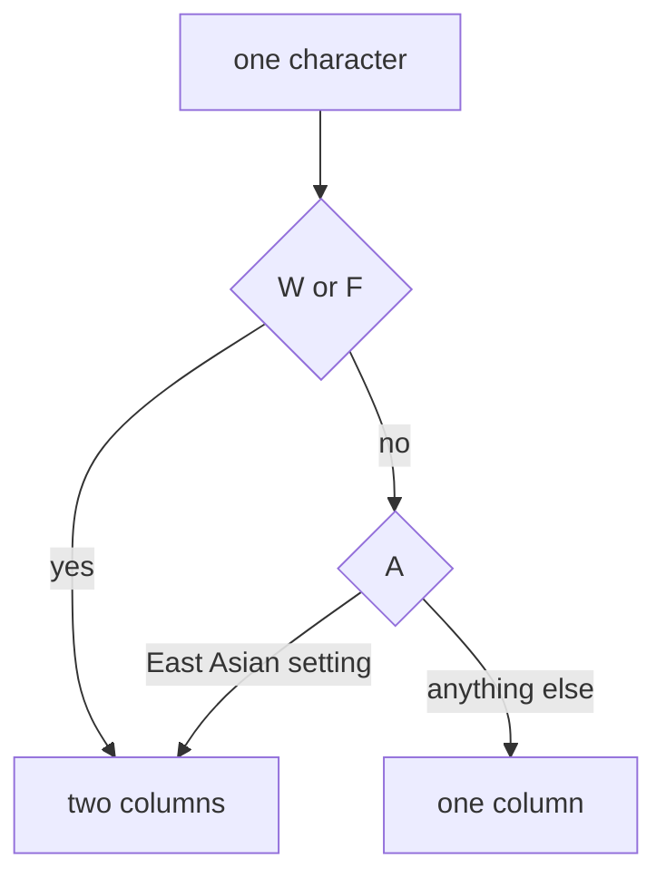

# Why Hangul takes two columns in a terminal

> Why one Hangul syllable is as wide as two Latin letters, why arrows and box-drawing characters change width from one setup to the next, and why string length is not a column count.
> 2024-11-19 · https://alfex4936.github.io/blog/hangul-width/

The code font on this blog draws each Hangul syllable exactly two columns wide. Why that matters comes from how a terminal decides how wide a character is. The property values below were checked against `EastAsianWidth.txt` from Unicode 16.0, and the code output was produced by Node.js 22.11 (ICU 75.1).

## Width is a property of the character

Unicode gives every character an East_Asian_Width property (UAX #11). Terminals mostly read that value to decide how many columns a character gets.

| Value | Meaning | Columns | Examples |
| :--- | :--- | ---: | :--- |
| W | Wide | 2 | `한` `ㄱ` `漢` |
| F | Fullwidth | 2 | `！` (U+FF01) |
| Na, H | Narrow, Halfwidth | 1 | `a` `1` |
| A | Ambiguous | 1 or 2 | `§` `·` `→` `─` |
| N | Neutral | usually 1 | |

<Walk>



<Step show="C,W,T">
First, is it W or F? All 11,172 precomposed Hangul syllables (U+AC00–U+D7A3) are W, so two columns.
</Step>

<Step show="W,A">
If it is neither, is it A? Ambiguous characters are the ones whose width depended on the character set they came from.
</Step>

<Step show="A,T,O">
An A character is two columns in a terminal set up for East Asian text and one column everywhere else. When the same text lines up in one terminal and not in another, this is usually why.
</Step>

</Walk>

## Hangul

Hangul can be encoded more than one way, and each way has its own property values.

- Precomposed syllables, U+AC00–U+D7A3, are W.
- Compatibility jamo such as `ㄱ` (U+3131–U+318E) are W too.
- Decomposed (NFD), the leading consonants U+1100–U+115F are W, while the vowels and trailing consonants U+1160–U+11FF are N.

Decomposed vowels and trailing consonants attach to the letter before them to form one syllable, so most wcwidth implementations count them as zero columns. Decomposing `한` gives three code points, yet only the leading consonant's two columns remain: still two columns.

```text
한글 (NFD) → 1112 1161 11AB 1100 1173 11AF
```

<Quiz lang="en" title="Checkpoint: a decomposed syllable's width" items={[
  {
    q: "You decompose the same Hangul text into NFD. Should the terminal column count increase just because there are more code points?",
    choices: ["Yes. Add a column for every code point.", "No. The vowels and trailing consonants attach to the leading consonant to form the same syllable.", "Reduce it, because every decomposed syllable is zero columns."],
    answer: 1,
    why: "The post identifies leading jamo as W, while most wcwidth implementations assign zero columns to the attached vowels and trailing consonants. More code points in the representation do not make the visible syllable wider.",
  },
]} />

## Ambiguous width

`§`, `·`, `→` and the box-drawing `─` `│` (U+2500–U+254B) are all A, because older East Asian character sets such as EUC-KR made them two columns. Terminals have a setting for whether ambiguous characters are double width, and when that setting and the width the font actually draws disagree, the lines of a box no longer meet.

Monoplex KR, the code font here, draws box-drawing characters half width. So in the usual setup, where ambiguous means one column, a box with Hangul inside still lines up.

```text
┌────────┬──────┐
│ Name   │ Cols │
├────────┼──────┤
│ 한글   │ 4    │
│ abc    │ 3    │
└────────┴──────┘
```

## String length is not a column count

In JavaScript, `length` counts UTF-16 code units. The same `한글` is 2 precomposed and 6 decomposed. To count columns, split the string into the characters a reader sees (graphemes), then give each one its width.

<Walk>

```js title="columns.js"
const graphemes = new Intl.Segmenter('ko', { granularity: 'grapheme' })
const WIDE = /^[\u1100-\u115F\u2E80-\u303E\u3041-\u33FF\u3400-\u4DBF\u4E00-\u9FFF\uA960-\uA97F\uAC00-\uD7A3\uF900-\uFAFF\uFE30-\uFE4F\uFF00-\uFF60\uFFE0-\uFFE6]/
const AMBIGUOUS = /^[\u00A7\u00B7\u2190-\u2199\u2500-\u254B]/

function columns(text, { cjk = false } = {}) {
  let n = 0
  for (const { segment } of graphemes.segment(text)) {
    if (WIDE.test(segment)) n += 2
    else if (AMBIGUOUS.test(segment)) n += cjk ? 2 : 1
    else n += 1
  }
  return n
}
```

<Step lines="1">
`Intl.Segmenter` splits the string into the characters a reader sees. The three code points of a decomposed syllable come out as one.
</Step>

<Step lines="2-3">
The W and F ranges, and the A range. Hangul, CJK ideographs, kana and fullwidth forms count as wide; for A, only the characters this post mentions.
</Step>

<Step lines="5-13">
Each character's width comes from its first code point. With `cjk` on, A counts as two columns.
</Step>

</Walk>

What it returns:

| Input | columns | length |
| :--- | ---: | ---: |
| `한글` | 4 | 2 |
| `한글` (NFD) | 4 | 6 |
| `Redis 키` | 8 | 7 |
| `─→·` | 3 | 3 |
| `─→·`, `cjk: true` | 6 | 3 |
| `ㄱㄴ` | 4 | 2 |
| `！` | 2 | 1 |

This function does not cover emoji or every combining sequence. For real use, an implementation that follows the full Unicode tables is safer: `string-width` in JavaScript, `go-runewidth` in Go.

<Quiz lang="en" title="When a terminal table stops lining up" items={[
  {
    q: "Hangul aligns, but arrows and box-drawing lines shift in another terminal. What should you check first?",
    choices: ["A setting that makes all precomposed Hangul half width.", "Only whether UTF-16 code units are used as the column count.", "Whether the ambiguous-width setting matches the width drawn by the font."],
    answer: 2,
    why: "The arrows and box characters shown have property A, so a setup may treat them as one or two columns. If the terminal's reserved columns differ from the font's drawn width, the lines no longer align.",
  },
  {
    q: "User input includes emoji and combining sequences. Is the post's short columns function ready to use unchanged in a product?",
    choices: ["No. Choose an implementation covering full Unicode tables and the sequences you need.", "Yes. Grapheme segmentation automatically determines every character's width.", "Yes. The first code point determines every emoji's width."],
    answer: 0,
    why: "Grapheme segmentation finds character boundaries; it does not guarantee display width. The sample covers only selected ranges. For real use, consider implementations such as string-width or go-runewidth.",
  },
]} />
