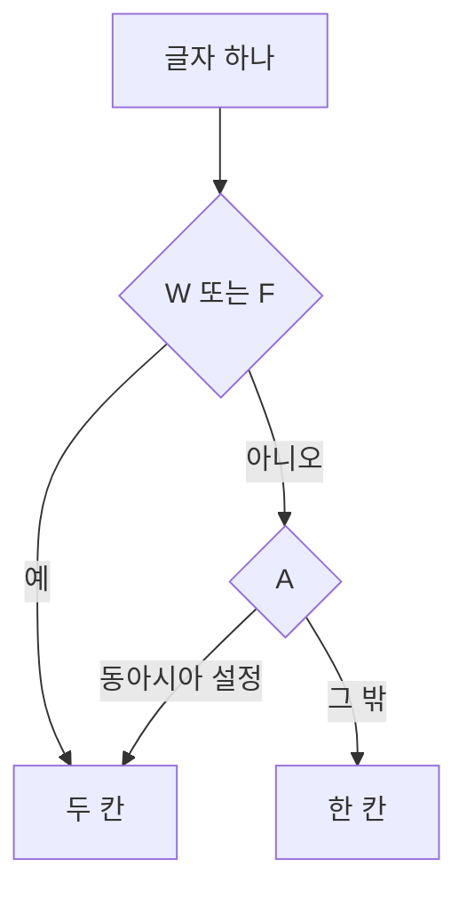

# 터미널에서 한글은 왜 두 칸인가

> 한글 한 글자가 영문 두 칸을 차지하는 이유, 화살표와 상자 문자의 폭이 환경마다 다른 이유, 그리고 문자열 길이로 칸을 세면 안 되는 이유.
> 2026-10-02 · https://alfex4936.github.io/blog/hangul-width/

이 블로그의 코드 글꼴은 한글을 정확히 두 칸으로 그립니다. 왜 그래야 하는지는 터미널이 글자의 폭을 정하는 방식에서 나옵니다. 아래 속성 값은 Unicode 18.0의 `EastAsianWidth.txt`에서 확인했고, 코드 출력은 Node.js(ICU 78.3)에서 실행한 결과입니다.

## 폭은 문자에 붙은 속성입니다

Unicode는 모든 문자에 East_Asian_Width라는 속성을 붙여 둡니다(UAX #11). 터미널은 대개 이 값을 보고 글자 하나에 몇 칸을 줄지 정합니다.

| 값 | 뜻 | 칸 | 예 |
| :--- | :--- | ---: | :--- |
| W | Wide | 2 | `한` `ㄱ` `漢` |
| F | Fullwidth | 2 | `！` (U+FF01) |
| Na, H | Narrow, Halfwidth | 1 | `a` `1` |
| A | Ambiguous | 1 또는 2 | `§` `·` `→` `─` |
| N | Neutral | 대개 1 | |

<Walk>



<Step show="C,W,T">
먼저 W나 F인지 봅니다. 한글 완성형 음절 11,172자(U+AC00–U+D7A3)는 모두 W라서 두 칸입니다.
</Step>

<Step show="W,A">
W도 F도 아니면 A인지 봅니다. A는 원래의 문자 집합에 따라 폭이 달랐던 문자들입니다.
</Step>

<Step show="A,T,O">
A는 동아시아 환경으로 설정된 터미널에서는 두 칸, 그 밖에서는 한 칸입니다. 같은 글이 터미널에 따라 어긋나는 이유가 대개 여기에 있습니다.
</Step>

</Walk>

## 한글

한글은 표현하는 방법이 여러 가지이고, 방법마다 속성이 다릅니다.

- 완성형 음절 U+AC00–U+D7A3은 W입니다.
- 호환 자모 `ㄱ`(U+3131–U+318E)도 W입니다.
- 조합형(NFD)으로 풀면 초성 U+1100–U+115F는 W, 중성과 종성 U+1160–U+11FF는 N입니다.

조합형의 중성과 종성은 앞 글자에 붙어 한 글자를 이룹니다. 그래서 대부분의 wcwidth 구현은 이들을 0칸으로 셉니다. `한`을 NFD로 풀면 코드 포인트 세 개가 되지만, 초성의 두 칸만 남아 여전히 두 칸입니다.

```text
한글 (NFD) → 1112 1161 11AB 1100 1173 11AF
```

## 모호한 폭

`§` `·` `→`, 그리고 상자를 그리는 `─` `│`(U+2500–U+254B)는 모두 A입니다. EUC-KR 같은 예전 동아시아 문자 집합에서는 이 문자들이 두 칸이었기 때문입니다. 터미널마다 모호한 폭을 두 칸으로 볼지 정하는 설정이 있고, 그 설정과 글꼴이 실제로 그리는 폭이 다르면 상자의 선이 어긋납니다.

이 블로그의 코드 글꼴 Monoplex KR은 상자 문자를 반각으로 그립니다. 그래서 모호한 폭을 한 칸으로 보는 일반적인 환경에서 한글이 섞인 상자도 맞습니다.

```text
┌────────┬──────┐
│ 이름   │ 칸   │
├────────┼──────┤
│ 한글   │ 4    │
│ abc    │ 3    │
└────────┴──────┘
```

## 문자열 길이는 칸 수가 아닙니다

JavaScript의 `length`는 UTF-16 코드 단위의 수입니다. 같은 `한글`도 완성형이면 2, 조합형이면 6입니다. 칸을 세려면 글자를 사용자가 보는 단위(grapheme)로 나눈 다음, 글자마다 폭을 정해야 합니다.

<Walk>

```js title="columns.js"
const graphemes = new Intl.Segmenter('ko', { granularity: 'grapheme' })
const WIDE = /^[ᄀ-ᅟ⺀-〾ぁ-㏿㐀-䶿一-鿿ꥠ-꥿가-힣豈-﫿︰-﹏＀-｠￠-￦]/
const AMBIGUOUS = /^[§·←-↙─-╋]/

function columns(text, { cjk = false } = {}) {
  let n = 0
  for (const { segment } of graphemes.segment(text)) {
    if (WIDE.test(segment)) n += 2
    else if (AMBIGUOUS.test(segment)) n += cjk ? 2 : 1
    else n += 1
  }
  return n
}
```

<Step lines="1">
`Intl.Segmenter`가 문자열을 사용자가 보는 글자 단위로 나눕니다. 조합형 `한`의 코드 포인트 세 개는 글자 하나로 묶입니다.
</Step>

<Step lines="2-3">
W·F 범위와 A 범위입니다. 한글, 한자, 가나, 전각 문자를 넓게 보고, A는 이 글에 나온 것만 골랐습니다.
</Step>

<Step lines="5-13">
글자의 첫 코드 포인트로 폭을 정합니다. `cjk`를 켜면 A를 두 칸으로 셉니다.
</Step>

</Walk>

실행한 결과입니다.

| 입력 | columns | length |
| :--- | ---: | ---: |
| `한글` | 4 | 2 |
| `한글` (NFD) | 4 | 6 |
| `Redis 키` | 8 | 7 |
| `─→·` | 3 | 3 |
| `─→·`, `cjk: true` | 6 | 3 |
| `ㄱㄴ` | 4 | 2 |
| `！` | 2 | 1 |

이 함수는 이모지나 결합 문자를 모두 다루지는 않습니다. 실제로 쓸 때는 JavaScript의 `string-width`나 Go의 `go-runewidth`처럼 Unicode 표 전체를 따르는 구현을 쓰는 편이 안전합니다.
