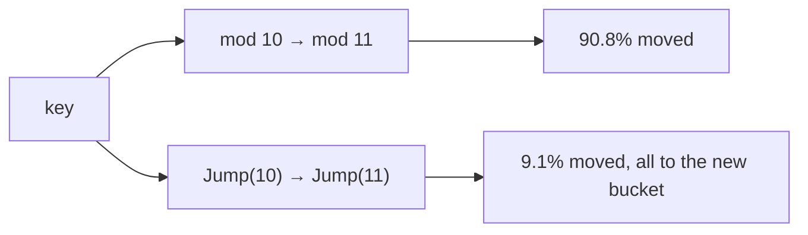
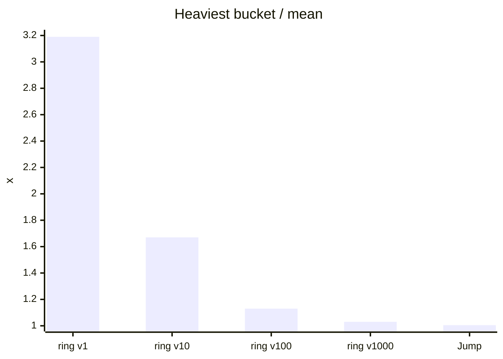

# Jump Consistent Hash: consistent hashing in five lines and no memory

> Growing from 10 to 11 buckets, mod-N moves 91% of keys and Jump Consistent Hash moves 9.1%. How it does that with no ring and no table, measured next to a hash ring.
> 2023-03-14 · https://alfex4936.github.io/blog/jump-consistent-hash/

Whatever the shard count, we want keys spread evenly, and when a shard is added we want to move as few keys as possible. The usual answer is a hash ring with virtual nodes. Jump Consistent Hash, published by John Lamping and Eric Veach at Google in 2014, does the same job with one function and no memory.[^1] Every number in this post was measured with Go 1.21.13 (linux/arm64, Docker on an Apple Silicon laptop) on one million keys generated by splitmix64.

## Why mod-N hurts

The simplest scheme is `hash(key) % n`. It spreads evenly, but when `n` changes almost every key lands somewhere else.



| Scheme | Keys moved going 10 → 11 | Share |
| --- | ---: | ---: |
| mod-N | 908,262 | 90.8% |
| Jump Consistent Hash | 91,359 | 9.1% |
| Hash ring (100 virtual nodes per node) | 86,250 | 8.6% |
| Ideal (1/11) | 90,909 | 9.1% |

The eleventh bucket should take 1/11 of the keys. Anything moved beyond that is waste, and in a cache every wasted move is a miss. mod-N moved ten times the ideal.

## A five-line function

Here is the paper's code in Go.

<Walk>

```go title="jump.go"
func Jump(key uint64, n int32) int32 {
	var b, j int64 = -1, 0
	for j < int64(n) {
		b = j
		key = key*2862933555777941757 + 1
		j = int64(float64(b+1) * (float64(int64(1)<<31) / float64((key>>33)+1)))
	}
	return int32(b)
}
```

<Step lines="1-2">

`b` is the bucket the key last sat in, `j` is the next bucket it jumps to. It starts in bucket 0.

</Step>

<Step lines="5">

The key seeds a 64-bit linear congruential generator, so the same key always produces the same random sequence.

</Step>

<Step lines="6">

The core line. Draw $r \in (0, 1]$ and set the next jump to $\lfloor (b+1)/r \rfloor$. Each time a bucket is added, the key moves to the new bucket with probability 1/(new bucket count). Instead of simulating each of those events, the function skips straight to the next one that moves the key.

</Step>

<Step lines="3,8">

Once the jump passes `n`, stop and return the previous bucket. That is where the key belongs when there are `n` buckets.

</Step>

</Walk>

Why skipping is allowed is the whole algorithm. If the key sat in $b$ with $b+1$ buckets, the probability it never moves until there are $i$ buckets is:

$$
P(\text{no move}) = \prod_{k=b+2}^{i} \left(1 - \frac{1}{k}\right) = \frac{b+1}{i}
$$

The product telescopes to $(b+1)/i$. So draw one uniform $r$ and jump straight to the largest $i$ with $r \le (b+1)/i$, which is $\lfloor (b+1)/r \rfloor$.

## How many iterations

With $k$ buckets the move probability is $1/k$, so the expected number of jumps is the harmonic number $H_n \approx \ln n + \gamma$. The measurements agree.

| Buckets | Mean iterations | ln n + γ |
| ---: | ---: | ---: |
| 10 | 2.93 | 2.88 |
| 1,000 | 7.49 | 7.48 |
| 100,000 | 12.09 | 12.09 |

Ten thousand times more buckets costs a bit over four times more iterations.

## How evenly it spreads

One million keys into 10 buckets, looking at the lightest and heaviest bucket. Ideal is 100,000.

| Scheme | Min | Max | Max/mean |
| --- | ---: | ---: | ---: |
| Jump Consistent Hash | 99,715 | 100,456 | 1.005 |
| Hash ring, 1 virtual node | 10,700 | 319,124 | 3.19 |
| Hash ring, 10 virtual nodes | 36,440 | 166,584 | 1.67 |
| Hash ring, 100 virtual nodes | 91,164 | 112,757 | 1.13 |
| Hash ring, 1,000 virtual nodes | 96,498 | 103,343 | 1.03 |



For a ring to match Jump it needs more than 1,000 virtual nodes per node. With 1,000 buckets, that is a million points on the ring. Jump stores nothing.

## Lookup cost

| Scheme | Buckets | ns/op | State held |
| --- | ---: | ---: | --- |
| Jump | 10 | 18.1 | none |
| Jump | 1,000 | 47.6 | none |
| Jump | 100,000 | 70.5 | none |
| Ring (100 virtual nodes) | 10 | 19.2 | 1,000 entries |
| Ring (100 virtual nodes) | 1,000 | 51.7 | 100,000 entries |

The ring binary-searches a sorted array, $O(\log nv)$; Jump is $O(\log n)$. Time is similar, but Jump uses no memory and has no structure to rebuild when the node list changes.

## What you give up

Jump does not name buckets. It returns a number from `0` to `n-1`, and buckets can only be added or removed at the end. If node 3 in the middle dies and you just drop it, every number after it shifts and you are back to mod-N.

So it fits particular places:

- Stores with fixed shard numbers, where a replica takes over a dead shard's number.
- Systems that keep a separate number-to-address mapping and only update that mapping when nodes change.
- For cache clusters where nodes come and go freely, a hash ring or rendezvous hashing fits better.

It has no weights either. You can fake them by giving a big node several numbers, but then you are managing a number table and most of the appeal is gone.

## Summary

It moves as few keys as a hash ring, spreads more evenly than a ring with 1,000 virtual nodes, and uses zero memory. The price is a single constraint: buckets are only added or removed at the end. If your shard numbers are fixed, these five lines are worth considering before building a ring.

[^1]: John Lamping, Eric Veach, "A Fast, Minimal Memory, Consistent Hash Algorithm", arXiv:1406.2294 (2014). The constant 2862933555777941757 is taken from the paper's code.
