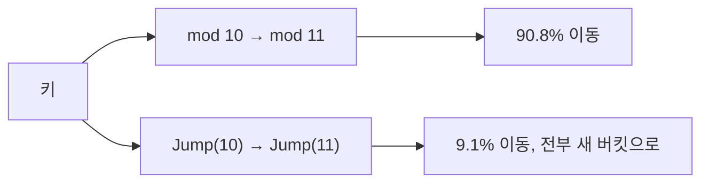
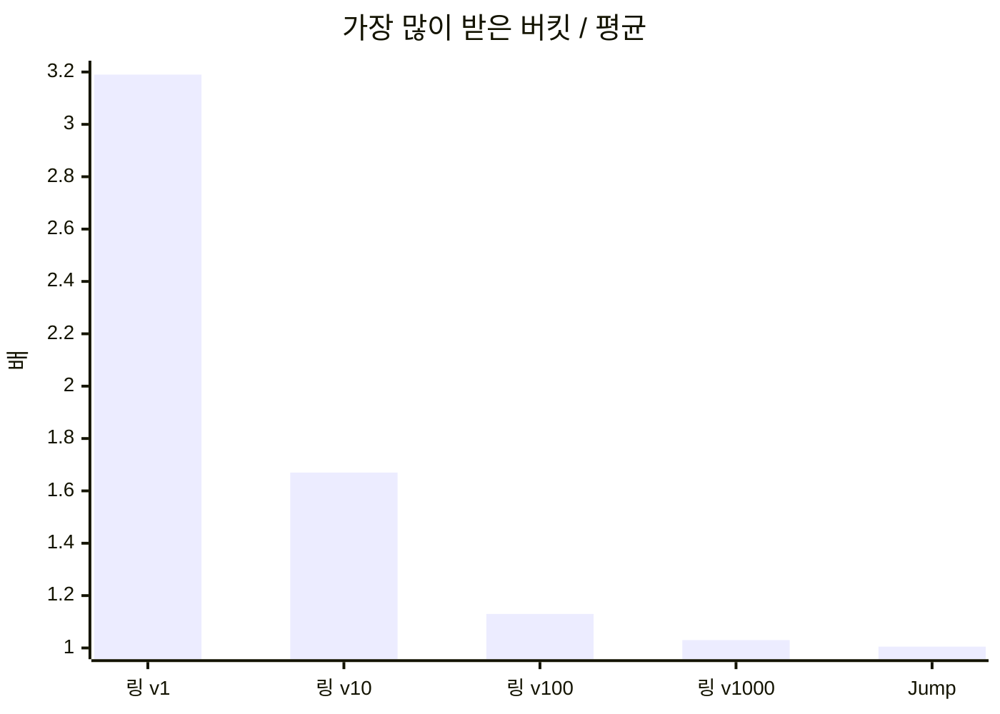

# Jump Consistent Hash: 메모리 없이 다섯 줄로 하는 일관된 해싱

> 버킷을 10개에서 11개로 늘릴 때 mod-N은 키의 91%를 옮기고, Jump Consistent Hash는 9.1%만 옮깁니다. 링도 테이블도 없이 어떻게 그게 되는지 따라가 보고, 해시 링과 나란히 재 봤습니다.
> 2023-03-14 · https://alfex4936.github.io/blog/jump-consistent-hash/

샤드가 몇 개든 키를 골고루 나누고, 샤드를 하나 늘릴 때 옮겨야 하는 키는 최소로 줄이고 싶습니다. 보통 떠올리는 답은 가상 노드를 둔 해시 링입니다. 2014년 Google의 John Lamping과 Eric Veach가 낸 Jump Consistent Hash는 같은 일을 메모리 없이, 함수 하나로 합니다.[^1] 이 글의 숫자는 모두 Go 1.21.13(linux/arm64, Apple Silicon 노트북의 Docker)에서 splitmix64로 만든 키 100만 개로 잰 값입니다.

## mod-N이 문제인 이유

가장 단순한 방법은 `hash(key) % n`입니다. 고르게 나뉘지만 `n`이 바뀌면 거의 모든 키의 자리가 바뀝니다.



| 방식 | 10 → 11개로 늘릴 때 옮겨진 키 | 비율 |
| --- | ---: | ---: |
| mod-N | 908,262 | 90.8% |
| Jump Consistent Hash | 91,359 | 9.1% |
| 해시 링(노드당 가상 노드 100개) | 86,250 | 8.6% |
| 이상적인 값 (1/11) | 90,909 | 9.1% |

11번째 버킷이 가져가야 할 몫은 전체의 1/11입니다. 그보다 많이 옮기는 것은 모두 낭비이고, 캐시라면 그만큼 미스가 납니다. mod-N은 열 배를 옮겼습니다.

<Quiz title="새 버킷의 몫을 확인합니다" items={[
  {
    q: "버킷을 끝에 하나 추가할 때 Jump의 이동 패턴은 무엇입니까?",
    choices: ["기존 버킷 사이에서 대부분의 키를 다시 나눕니다.", "옮겨지는 키는 새 버킷으로 가고 나머지는 원래 버킷에 남습니다.", "기존 키는 전혀 옮기지 않고 새 키만 새 버킷에 넣습니다."],
    answer: 1,
    why: "버킷 수를 늘릴 때 각 키가 새 버킷으로 옮길 확률을 사용합니다. 본문의 10개에서 11개 실험에서도 이동한 키는 전부 새 버킷으로 갔습니다. mod-N처럼 기존 버킷 사이의 재배치를 만들지 않습니다.",
  },
]} />

## 다섯 줄짜리 함수

논문에 실린 코드를 Go로 옮기면 이렇습니다.

<Walk>

```go title="jump.go"
func Jump(key uint64, n int32) int32 {
	var b, j int64 = -1, 0
	for j < int64(n) {
		b = j
		key = key*2862933555777941757 + 1
		j = int64(float64(b+1) * (float64(int64(1)<<31) / float64((key>>33)+1)))
	}
	return int32(b)
}
```

<Step lines="1-2">

`b`는 이 키가 마지막으로 머문 버킷, `j`는 다음에 뛰어갈 버킷입니다. 처음에는 버킷 0에 있습니다.

</Step>

<Step lines="5">

키를 64비트 선형 합동 생성기의 씨앗으로 씁니다. 같은 키는 언제나 같은 난수열을 만듭니다.

</Step>

<Step lines="6">

핵심 줄입니다. 난수 $r \in (0, 1]$을 뽑아 다음 점프 위치를 $\lfloor (b+1)/r \rfloor$로 정합니다. 버킷이 하나씩 늘 때마다 키가 새 버킷으로 옮겨 갈 확률은 1/(새 버킷 수)인데, 그 사건을 하나하나 흉내 내지 않고 다음에 옮기는 지점으로 곧장 건너뜁니다.

</Step>

<Step lines="3,8">

점프 위치가 `n`을 넘으면 멈추고 직전 버킷을 돌려줍니다. 버킷 수가 `n`일 때 이 키가 있어야 할 자리입니다.

</Step>

</Walk>

왜 건너뛰어도 되는지가 이 알고리즘의 전부입니다. 버킷이 $b+1$개일 때 키가 $b$에 있었다면, $i$개가 될 때까지 한 번도 옮기지 않을 확률은 다음과 같습니다.

$$
P(\text{옮기지 않음}) = \prod_{k=b+2}^{i} \left(1 - \frac{1}{k}\right) = \frac{b+1}{i}
$$

곱의 앞뒤가 지워져 $(b+1)/i$만 남습니다. 그러니 균등 난수 $r$을 하나 뽑아 $r \le (b+1)/i$를 만족하는 가장 큰 $i$, 곧 $\lfloor (b+1)/r \rfloor$까지 한 번에 뛰면 됩니다.

## 몇 번 도는가

버킷 수가 $k$일 때 옮길 확률이 $1/k$이므로, 기대 점프 수는 조화수 $H_n \approx \ln n + \gamma$입니다. 잰 값도 같았습니다.

| 버킷 수 | 평균 반복 횟수 | ln n + γ |
| ---: | ---: | ---: |
| 10 | 2.93 | 2.88 |
| 1,000 | 7.49 | 7.48 |
| 100,000 | 12.09 | 12.09 |

버킷이 1만 배 늘어도 반복은 네 배 남짓 늘어납니다.

## 얼마나 고르게 나누나

버킷 10개에 키 100만 개를 넣고 가장 적게 받은 버킷과 가장 많이 받은 버킷을 봤습니다. 이상적인 값은 10만 개입니다.

| 방식 | 최소 | 최대 | 최대/평균 |
| --- | ---: | ---: | ---: |
| Jump Consistent Hash | 99,715 | 100,456 | 1.005 |
| 해시 링, 가상 노드 1개 | 10,700 | 319,124 | 3.19 |
| 해시 링, 가상 노드 10개 | 36,440 | 166,584 | 1.67 |
| 해시 링, 가상 노드 100개 | 91,164 | 112,757 | 1.13 |
| 해시 링, 가상 노드 1,000개 | 96,498 | 103,343 | 1.03 |



해시 링이 Jump만큼 고르려면 노드당 가상 노드를 1,000개 넘게 둬야 합니다. 버킷 1,000개짜리 클러스터라면 링에 점이 100만 개 찍힙니다. Jump는 아무것도 저장하지 않습니다.

## 조회 비용

| 방식 | 버킷 수 | ns/op | 들고 있는 상태 |
| --- | ---: | ---: | --- |
| Jump | 10 | 18.1 | 없음 |
| Jump | 1,000 | 47.6 | 없음 |
| Jump | 100,000 | 70.5 | 없음 |
| 링(가상 노드 100개) | 10 | 19.2 | 항목 1,000개 |
| 링(가상 노드 100개) | 1,000 | 51.7 | 항목 100,000개 |

링은 정렬된 배열을 이진 탐색하므로 $O(\log nv)$이고, Jump는 $O(\log n)$입니다. 시간은 비슷하지만 Jump는 메모리를 쓰지 않고, 노드 목록이 바뀔 때 다시 만들 자료구조도 없습니다.

## 대신 포기하는 것

Jump는 버킷에 이름을 붙이지 않습니다. 돌려주는 것은 `0`부터 `n-1`까지의 번호뿐이고, 버킷은 끝에서만 늘리고 줄일 수 있습니다. 가운데 3번 노드가 죽었다고 3번만 빼면 그 뒤 번호가 모두 밀려 mod-N과 같은 일이 벌어집니다.

그래서 맞는 자리가 정해져 있습니다.

- 샤드 번호가 고정된 저장소. 샤드 하나가 죽으면 복제본이 같은 번호를 이어받습니다.
- 번호와 실제 주소의 매핑을 따로 두는 시스템. 노드가 바뀌면 매핑만 고칩니다.
- 노드가 수시로 들고 나는 캐시 클러스터라면 해시 링이나 rendezvous 해싱이 더 맞습니다.

가중치도 직접 지원하지 않습니다. 큰 노드에 번호를 여러 개 주는 식으로 흉내 낼 수는 있지만, 그 순간 번호표를 따로 관리해야 해서 Jump의 장점이 줄어듭니다.

## 정리

옮기는 키의 양은 해시 링과 같고, 분포는 가상 노드 1,000개짜리 링보다 고르고, 메모리는 0입니다. 대가는 버킷을 끝에서만 붙이고 뗄 수 있다는 제약 하나입니다. 샤드 번호가 고정된 시스템이라면 링을 만들기 전에 이 다섯 줄을 먼저 떠올려 볼 만합니다.

<Quiz title="샤드를 늘리고 교체한다면" items={[
  {
    q: "가운데 샤드의 서버가 죽었습니다. Jump의 기존 배치를 유지하면서 복제본으로 넘기려면 어떻게 합니다?",
    choices: ["죽은 번호를 삭제하고 뒤 번호를 앞으로 당깁니다.", "버킷 수를 유지한 채 모든 샤드 번호를 다시 매깁니다.", "샤드 번호는 유지하고 그 번호가 가리키는 서버 주소만 바꿉니다."],
    answer: 2,
    why: "Jump가 돌려주는 것은 고정된 번호입니다. 가운데 번호를 빼고 목록을 당기면 번호와 서버의 대응이 바뀝니다. 복제본이 같은 번호를 이어받도록 매핑만 고치면 이 재배치를 피합니다.",
  },
  {
    q: "버킷 수를 늘리면 Jump도 버킷마다 링 항목을 하나씩 만들거나 순서대로 검사해야 합니까?",
    choices: ["아닙니다. 키로 만든 같은 난수열에서 다음 이동 지점으로 건너뜁니다.", "그렇습니다. 균등 분포에는 가상 노드 배열이 필수입니다.", "그렇습니다. 모든 버킷을 방문해야 마지막 버킷을 알 수 있습니다."],
    answer: 0,
    why: "옮기지 않을 확률의 곱이 단순한 비율로 정리되어 다음 이동 지점을 직접 뽑을 수 있습니다. 저장할 링이 없고, 본문의 기대 반복 횟수도 버킷 수에 선형이 아니라 로그로 늘어납니다.",
  },
]} />

[^1]: John Lamping, Eric Veach, "A Fast, Minimal Memory, Consistent Hash Algorithm", arXiv:1406.2294 (2014). 상수 2862933555777941757은 논문 코드 그대로입니다.
