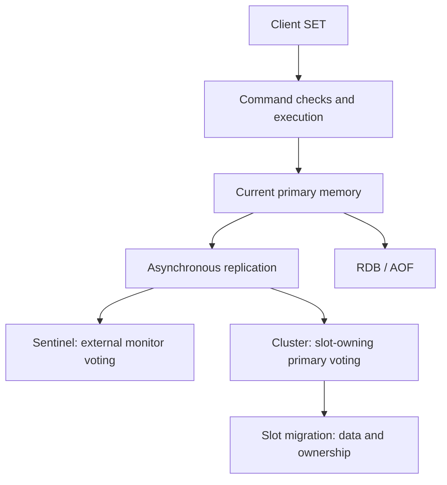
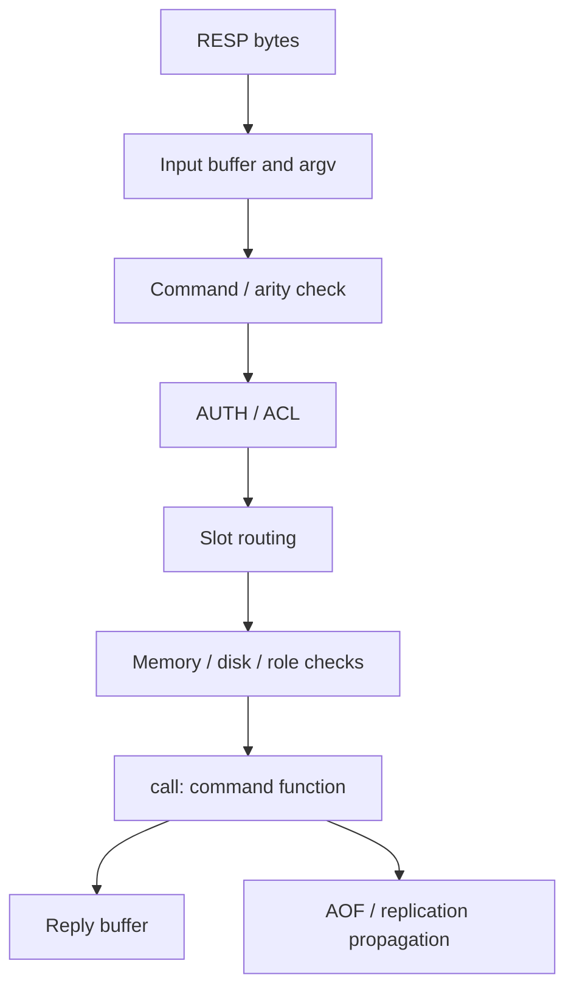
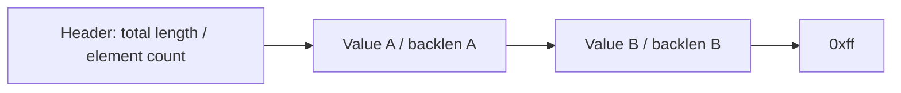
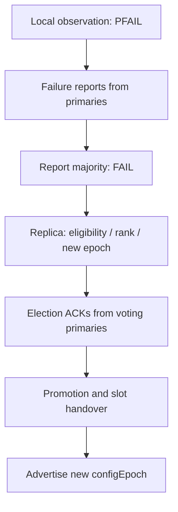

# Redis 7.2.16 internals: from one write to failover

> Follow source functions from command execution and data structures through replication, Sentinel voting, Cluster failover and slot migration. Connect lost MIGRATE replies, eviction, Pub/Sub and ACL inside the same server.
> 2026-08-24 · https://alfex4936.github.io/blog/redis-7-2-internals/

import reproduction from '../../../../scripts/test-redis-internals.py?url'

You sent `SET` to Redis and received `OK`. What has finished? The value is in the memory of the server you connected to. Whether a replica received it, whether it reached disk, and whether it survives the next failover require separate checks.

This article follows that one write. It starts with receiving and executing a command, stores a value in a byte array, sends it over a replication connection, and examines who becomes the next writer when a server disconnects. Later sections follow slot migration through a lost reply.

The analysis is pinned to commit `335554f18caf7bbf6b0ac2b3548133d750f00a1b` of [Redis 7.2.16](https://github.com/redis/redis/releases/tag/7.2.16). The release was published on 2026-08-17; the displayed date is 2026-08-24, the following week. The source investigation and reproductions below were **verified on 2026-10-10**. The displayed date is not a record of when I ran the experiments.

Current `redis.io` documentation can include features from later versions, so the implementations and defaults here are pinned to this commit. Diagram playback uses edited snapshots of sequences read from the source. It does not run Redis in the browser or predict failure timing.



On a first read, follow §1 through §8 in order. For an operational problem, start at §5 for replication, §7 for Sentinel, §9 for Cluster, or §11 for slot migration. Cache usage patterns are covered in the [cache field guide](/blog/redis-cache-field-guide/), listpack memory measurements in the [listpack article](/blog/redis-listpack/), and rank calculations in the [skip list article](/blog/skip-list/). Those articles use different reference versions.

## Before a command executes

A TCP connection is not a command. Redis must read the client's RESP bytes and parse them into a command name and argument array. Following `readQueryFromClient` and `processInputBuffer` in `networking.c` leads to `processCommand` in `server.c`.[^dispatch]

`processCommand` has several gates before an actual write. It checks the command and argument count, authentication and ACL. In Cluster mode, it checks whether the keys belong to this node's slots. Memory pressure, disk errors, insufficient replicas and a read-only replica role can also reject the command here. If the checks pass, `call` executes `c->cmd->proc(c)`.[^gates]

<Walk>



<Step show="R,B,V">
Finishing reads and parsing does not mean the command has executed. RESP completeness and the command's argument count are separate checks.
</Step>

<Step show="A,S,G">
Before execution, Redis checks permissions, slot ownership and whether it can accept the write. A MOVED or NOPERM response can mean the command never reached the function that modifies its data structure.
</Step>

<Step show="F,O,P">
The command function changes memory and prepares a reply. Propagation and persistence have separate paths, so OK is not a completion marker for replicas or disk.
</Step>

</Walk>

`MULTI` queues commands for execution at `EXEC`. Preventing other ordinary clients' commands from interleaving during execution and undoing an earlier command's results are different features. Redis transactions do not have SQL-style rollback. Ignoring an execution-time command error and concluding that "EXEC is atomic, so everything succeeded" is incorrect.[^multi]

## What single-threaded execution does and does not explain

In this version, the main thread executes ordinary commands. A large command that takes a long time therefore affects other requests waiting on the same execution path. Pipelining reduces network round trips; it does not remove the server execution cost of a large `SMEMBERS` or a long Lua operation.

That does not mean the Redis process has only one thread. `io-threads` defaults to 1 and `io-threads-do-reads` to `no`. When enabled, I/O threads share socket writes and, optionally, reads and parsing. `handleClientsWithPendingReadsUsingThreads` waits for their work to finish, then calls `processPendingCommandAndInputBuffer` on the main thread. This configuration does not distribute command execution across I/O threads.[^threads]

Background work is separate too. AOF fsync and lazy free use background jobs, while RDB saves and AOF rewrites use child processes. Remembering only "single-threaded" makes it easy to treat CPU, disk and fork costs as the same problem.[^persist]

`SLOWLOG` and `INFO commandstats` show time spent on commands inside the server. Application connection-pool waits, network round trips and reading replies are separate. This article does not measure throughput or failover recovery times and generalize them.

## TYPE has several encodings underneath

`TYPE` reports the public data type; `OBJECT ENCODING` reports its current representation. A `redisObject` holds the type, encoding, reference count, LRU/LFU information and a pointer to the actual data. Even within hashes, a small one can use listpack while a larger one uses a hashtable.[^objects]

| Public type | Internal representations to read in this tag | Functions to read |
| --- | --- | --- |
| string | Integer `int`, `embstr` allocating the object and SDS together, `raw` with a separate SDS | `createStringObject`, `tryObjectEncoding` |
| hash | listpack of field/value pairs or dict | `hashTypeSet`, `hashTypeConvert` |
| set | Integer array intset, listpack, dict | `setTypeCreate`, `setTypeAddAux` |
| sorted set | Small listpack or dict plus skip list | `zsetAdd`, `zsetConvertAndExpand` |
| list | Small listpack or quicklist | `listTypeTryConversionRaw` |
| stream | listpack groups attached to a radix tree, per-group pending state | `streamAppendItem` |

The string `embstr` boundary in this source is `OBJ_ENCODING_EMBSTR_SIZE_LIMIT = 44`. This is a byte length, not a promise that every input of 44 bytes or fewer stays embstr forever. Values representable as integers can become integer-encoded, and mutation paths can change the encoding too. SDS stores string length in a separate field, so it can handle NUL bytes inside a value.[^objects]

Dict expansion is not exclusively one call that reinserts all keys at once. `dictRehash` moves buckets incrementally from the old table to the new one. Both tables coexist during this period. "Incremental" still does not guarantee an upper latency bound for each operation: moving the entries linked to one bucket still costs work.[^dict]

A sorted set's dict looks up scores by member, while its skip list finds score order and ranges. A skip list's `span` counts skipped elements, enabling rank calculations. Equal scores are ordered by the bytes of member strings. Describing both `ZRANK` and a large `ZRANGE` with the same O(log N) line misses the cost of the number of returned elements.[^zset]

A stream does not store every message only as a separate dict entry. `streamAppendItem` converts IDs into sortable bytes and locates a listpack group in the radix tree. The group shares a base ID and field names, compressing message ID differences and repeated fields. A consumer group's PEL is separate state tracking entries delivered but not yet acknowledged. A consumer reporting completed work with `XACK` and data becoming durable on disk are different events.[^stream]

## Boundaries that are easy to miss in listpack

The format in `listpack.c` consists of a 6-byte header holding the total byte count and element count, the elements, and a `0xff` end marker. Each element stores a backlen after its encoded value, describing its own encoded length. That length excludes the backlen's own size. It locates this element's start when walking backward; it is not the previous element's length stored in the next element.[^listpack]



This design eliminates ziplist's cascading prevlen updates. It does not eliminate moving trailing bytes when inserting into the middle of a contiguous array. `lpInsert` contains an actual `memmove` and reallocates when necessary. The caller must retain the new pointer it returns.[^listpack]

Default thresholds are in [this tag's redis.conf](https://github.com/redis/redis/blob/335554f18caf7bbf6b0ac2b3548133d750f00a1b/redis.conf#L1918-L2003). Entries refer to elements of the public data type. Storing a hash field/value pair as two listpack entries does not halve the field limit.

| Setting | Default | What it limits |
| --- | ---: | --- |
| `hash-max-listpack-entries` | 512 | Number of fields |
| `hash-max-listpack-value` | 64 | Field name or value byte length |
| `zset-max-listpack-entries` | 128 | Number of members |
| `zset-max-listpack-value` | 64 | Member byte length |
| `set-max-intset-entries` | 512 | Number of integer-representable members |
| `set-max-listpack-entries` | 128 | Number of members in a listpack set |
| `set-max-listpack-value` | 64 | Member byte length |
| `list-max-listpack-size` | -2 | Quicklist node size criterion; -2 selects 8 KiB |
| `list-compress-depth` | 0 | Depth of uncompressed nodes from each end; 0 disables compression |

`hashTypeSet` converts to a hashtable when the count exceeds 512 or field names or values exceed the length conditions. Deleting entries until the hash becomes small does not automatically convert it back to listpack. For sets, the first value and a hint about how many values will be inserted at once also affect the initial representation. Saying that any non-integer value immediately means hashtable misses the path converting a small intset to listpack.[^compact]

Lists especially require a version check. **A small list in this tag can be a standalone listpack.** `listTypeTryConvertListpack` converts a growing list to quicklist, while `listTypeTryConvertQuicklist` checks the reverse conversion when it shrinks to one packed node. Shrink conversion uses half the threshold to reduce repeated representation changes near the boundary. Do not generalize another type's one-way conversion into a rule for every Redis type.[^lists]

<Quiz lang="en" title="Why check the encoding?" items={[
  { q: "Do all Redis data structures switch back to a compact encoding after shrinking?", choices: ["All of them do.", "None of them do.", "It depends on the type and code path. Lists in this tag have a shrink conversion."], answer: 2, why: "Applying a hash's conversion rules to lists gives the wrong answer. listTypeTryConvertQuicklist checks for one packed node and the shrink boundary. Check the version and OBJECT ENCODING alongside TYPE." },
]} />

## Replication means rejoining the same byte history

The primary accepts current writes; a replica follows that server's replication stream. Replication is asynchronous by default. An ordinary `SET` does not execute a write on the primary and then wait for every replica's acknowledgment before returning `OK`.[^replication]

After connecting, a replica proceeds through PING, authentication if needed, `REPLCONF` negotiation and `PSYNC`. The comparison here concerns the **replication ID and the stream's byte offset**, not the number of keys. A replica with a higher offset has received more of the stream; that does not mean every byte in the replication stream is user data.[^psync]

Partial resynchronization requires the requested ID to match the current history or an accepted previous history, and the backlog to retain the bytes from the requested offset. The backlog retains replication history so a replica can catch up after a brief disconnection. It is not an unlimited database change log.

```c title="src/replication.c L755-L792"
    if (strcasecmp(master_replid, server.replid) &&
        (strcasecmp(master_replid, server.replid2) ||
         psync_offset > server.second_replid_offset))
    {
        /* Replid "?" is used by slaves that want to force a full resync. */
        /* log omitted */
        goto need_full_resync;
    }

    /* We still have the data our slave is asking for? */
    if (!server.repl_backlog ||
        psync_offset < server.repl_backlog->offset ||
        psync_offset > (server.repl_backlog->offset + server.repl_backlog->histlen))
    {
        /* log omitted */
        goto need_full_resync;
    }
```

[GitHub](https://github.com/redis/redis/blob/335554f18caf7bbf6b0ac2b3548133d750f00a1b/src/replication.c#L755-L792)

The first `if` checks that the replid sent by the replica matches the current one. If it does not, it passes only when it matches the previous replid (`replid2`) and the requested offset is at or below `second_replid_offset`. The second `if` checks that the requested offset still lies inside the backlog; failing either check jumps to `need_full_resync`.

If those conditions fail, Redis performs full resynchronization. The primary sends a reference offset and an RDB snapshot, followed by the stream generated while the snapshot was being created, which the replica continues applying. It does not copy current memory piecemeal in arbitrary order without a snapshot.[^fullsync]

| Setting | Default | Meaning of changing it |
| --- | --- | --- |
| `repl-backlog-size` | 1 MiB | Target size of the stream retained during disconnection. Consider write volume and disconnection duration together. |
| `repl-backlog-ttl` | 3600 seconds | When to free the backlog if no replicas are connected. This is not a key TTL. |
| `repl-timeout` | 60 seconds | Timeout for replication connections and transfers, separate from Sentinel detection time. |
| `repl-ping-replica-period` | 10 seconds | How often the primary sends PING over replication connections. |
| `repl-diskless-sync` | yes | Allows sending a full-sync RDB over sockets instead of a disk file. |
| `repl-diskless-sync-delay` | 5 seconds | Delay to group full-sync starts together. |
| `repl-diskless-load` | disabled | Loading mode on the receiving replica, distinct from the sending setting. |
| `replica-read-only` | yes | Rejects ordinary application writes on a replica. |
| `replica-serve-stale-data` | yes | Can allow reads while replication is disconnected. This does not guarantee freshness. |

I checked these values in the configuration registry and the tag's configuration file.[^repl-config] Diskless does not remove all disk, CPU and memory costs. Creating and loading an RDB still require work.

Promotion creates a new replication ID. Redis retains the previous ID and valid offset boundary in `replid2` and `second_replid_offset`, giving existing replicas a chance to partially resynchronize from the previous history. It does not merge divergent write histories into one ID.[^history]

<TracePlayer
  lang="en"
  title="Between OK and replica application"
  columns={["Client", "primary", "replica"]}
  caption="A and B are illustrative values. These snapshots show possible asynchronous replication orderings, not measured transfer delays."
  tracks={[
    { label: "Failure after application", steps: [
      { action: "Start", note: "Both servers hold A.", values: ["Waiting", "A", "A"] },
      { action: "Execute SET B", note: "The current primary writes B and replies OK.", values: ["OK", "B", "A"] },
      { action: "Apply replication", note: "The replica applies the stream containing B.", values: ["OK", "B", "B"] },
      { action: "Primary fails", note: "B remains if a replica that received it is selected. Selection and persistence conditions are separate.", values: ["Reconnect needed", "Stopped", "B"] },
    ] },
    { label: "Failure before application", steps: [
      { action: "Start", note: "Both servers hold A.", values: ["Waiting", "A", "A"] },
      { action: "Execute SET B", note: "The replica can still hold A even after the client receives OK.", values: ["OK", "B", "A"] },
      { action: "Primary fails", note: "In this ordering, only a replica that did not receive B remains eligible for promotion.", values: ["Reconnect needed", "Stopped", "A"] },
      { action: "Promote replica", note: "The new primary does not have B. Receiving OK earlier does not restore it.", values: ["Reads A", "Stopped", "A / primary"] },
    ] },
  ]}
/>

### What changes with WAIT and WAITAOF?

`WAIT numreplicas timeout` waits for a specified number of replicas to acknowledge the offset of preceding writes on the same client connection, then returns the actual acknowledgment count. A result below the requested count does not roll back the earlier writes. The application must handle a result that falls short of its success criterion.[^wait]

`WAITAOF numlocal numreplicas timeout` waits for AOF fsync acknowledgments for preceding writes on the same connection. It returns local and replica acknowledgment counts separately. A local server with AOF disabled cannot satisfy a request for local fsync. Again, check the return value.[^wait]

Neither command can wait for the original connection's writes if called on a different connection. Running `redis-cli SET ...` and a separate `redis-cli WAIT ...` hides that distinction. Which connection a pool lends out also matters.

Even a successful WAIT does not force a Sentinel or Cluster election to select only replicas that acknowledged that write. Without designing disk durability requirements and the next-primary selection rules too, do not describe this as "strong consistency." Retrying an increment after a reply timeout is another remaining problem. The first attempt might have applied, so retries require a separate idempotency design.

## Standalone servers and manual FAILOVER

If a server with no replication stops, there is no replacement primary candidate. Restarting it from RDB/AOF is different from a failover election.

If a primary and replica are connected without Sentinel or Cluster, a broken replication link does not automatically make the replica the writer. An operator can promote it with `REPLICAOF NO ONE` and reconfigure other nodes and clients, but this command has neither a monitor-majority vote nor fencing of the old primary.[^standalone]

There is also a `FAILOVER` command initiated on a running standalone primary. Coordinated failover pauses writes, lets the target replica catch up to the offset, then hands over the role. It is not automatic recovery by sending a command to a dead primary. Do not mix the meanings of `TO`, `TIMEOUT`, `FORCE` and `ABORT` with Sentinel or `CLUSTER FAILOVER` options.[^standalone]

Standalone `FAILOVER ... FORCE` can hand the role to the specified target even if it has not caught up within the configured timeout, creating a data-loss risk. `REPLICAOF NO ONE` is a different command that changes the role immediately. A role change does not automatically update application addresses, DNS or connection pools.

## Sentinel SDOWN, ODOWN and elections are separate gates

Sentinel is an external monitor, not a server partitioning data keys. It monitors a primary and its replicas, discovers other Sentinels, and coordinates promotion when needed. Clients need to resolve the primary address by service name to establish a new connection.

### SDOWN is my observation

`sentinelCheckSubjectivelyDown` sets SDOWN (subjectively down) from one Sentinel's observations. Among other conditions, it checks whether valid replies have been absent for `down-after-milliseconds`. Valid PING replies include `PONG`, as well as `LOADING` and `MASTERDOWN`, which indicate that the server is alive. TCP connection status alone does not determine this.[^sdown]

```c title="src/sentinel.c L4576-L4602"
    /* Update the SDOWN flag. We believe the instance is SDOWN if:
     *
     * 1) It is not replying.
     * 2) We believe it is a master, it reports to be a slave for enough time
     *    to meet the down_after_period, plus enough time to get two times
     *    INFO report from the instance. */
    if (elapsed > ri->down_after_period ||
        (ri->flags & SRI_MASTER &&
         ri->role_reported == SRI_SLAVE &&
         mstime() - ri->role_reported_time >
          (ri->down_after_period+sentinel_info_period*2)) ||
          (ri->flags & SRI_MASTER_REBOOT &&
           mstime()-ri->master_reboot_since_time > ri->master_reboot_down_after_period))
    {
        /* Is subjectively down */
        if ((ri->flags & SRI_S_DOWN) == 0) {
            sentinelEvent(LL_WARNING,"+sdown",ri,"%@");
            ri->s_down_since_time = mstime();
            ri->flags |= SRI_S_DOWN;
        }
    } else {
        /* Is subjectively up */
        if (ri->flags & SRI_S_DOWN) {
            sentinelEvent(LL_WARNING,"-sdown",ri,"%@");
            ri->flags &= ~(SRI_S_DOWN|SRI_SCRIPT_KILL_SENT);
        }
    }
```

[GitHub](https://github.com/redis/redis/blob/335554f18caf7bbf6b0ac2b3548133d750f00a1b/src/sentinel.c#L4576-L4602)

There are three conditions: `elapsed` since the last valid reply exceeds `down_after_period`, the primary has been reporting itself as a replica for longer than `down_after_period+sentinel_info_period*2`, or a rebooted primary has not recovered within `master_reboot_down_after_period`. Any of them emits `+sdown` and sets `SRI_S_DOWN`.

This assessment mainly means "I cannot use this server normally." The Sentinel itself might be isolated, or only its network path might be broken. SDOWN flags can apply to replicas and other Sentinels too, not only the primary.

### ODOWN meets the detection quorum

When a primary is SDOWN, Sentinel asks other monitors for their observations with `SENTINEL is-master-down-by-addr`. `sentinelCheckObjectivelyDown` counts its own and other monitors' down reports, setting ODOWN (objectively down) when they reach the configured quorum. This means neither that all monitors agree nor that they have reached agreement on data.[^odown]

```c title="src/sentinel.c L4605-L4628"
/* Is this instance down according to the configured quorum?
 *
 * Note that ODOWN is a weak quorum, it only means that enough Sentinels
 * reported in a given time range that the instance was not reachable.
 * However messages can be delayed so there are no strong guarantees about
 * N instances agreeing at the same time about the down state. */
void sentinelCheckObjectivelyDown(sentinelRedisInstance *master) {
    dictIterator *di;
    dictEntry *de;
    unsigned int quorum = 0, odown = 0;

    if (master->flags & SRI_S_DOWN) {
        /* Is down for enough sentinels? */
        quorum = 1; /* the current sentinel. */
        /* Count all the other sentinels. */
        di = dictGetIterator(master->sentinels);
        while((de = dictNext(di)) != NULL) {
            sentinelRedisInstance *ri = dictGetVal(de);

            if (ri->flags & SRI_MASTER_DOWN) quorum++;
        }
        dictReleaseIterator(di);
        if (quorum >= master->quorum) odown = 1;
    }
```

[GitHub](https://github.com/redis/redis/blob/335554f18caf7bbf6b0ac2b3548133d750f00a1b/src/sentinel.c#L4605-L4628)

`quorum = 1` is this Sentinel's own vote, and each other Sentinel with `SRI_MASTER_DOWN` set adds one. If the total reaches the configured `quorum`, the primary is ODOWN. The comment calls this a "weak quorum" because the votes are recent replies counted together, not an agreement reached at one instant.

### Promotion also requires a majority of known monitors

Allowing a Sentinel that observes ODOWN to promote any replica by itself could produce simultaneous role changes in two places. An election therefore chooses a leader for each epoch. `sentinelVoteLeader` votes for an epoch, and `sentinelGetLeader` checks that the leader meets both an absolute majority of known Sentinels and the configured quorum.[^leader]

```c title="src/sentinel.c L4843-L4862"
    /* Count this Sentinel vote:
     * if this Sentinel did not voted yet, either vote for the most
     * common voted sentinel, or for itself if no vote exists at all. */
    if (winner)
        myvote = sentinelVoteLeader(master,epoch,winner,&leader_epoch);
    else
        myvote = sentinelVoteLeader(master,epoch,sentinel.myid,&leader_epoch);

    if (myvote && leader_epoch == epoch) {
        uint64_t votes = sentinelLeaderIncr(counters,myvote);

        if (votes > max_votes) {
            max_votes = votes;
            winner = myvote;
        }
    }

    voters_quorum = voters/2+1;
    if (winner && (max_votes < voters_quorum || max_votes < master->quorum))
        winner = NULL;
```

[GitHub](https://github.com/redis/redis/blob/335554f18caf7bbf6b0ac2b3548133d750f00a1b/src/sentinel.c#L4843-L4862)

`voters_quorum = voters/2+1` is the majority. Even the most-voted candidate is rejected (`winner = NULL`) if `max_votes` is below the majority or below the configured `quorum`. So with five Sentinels and quorum 2, starting a failover still takes three votes.

Quorum is the failure-detection threshold; elections add the majority condition. The numbers below are quorum arithmetic examples, not deployment measurements. The monitor count includes the Sentinel itself and counts Sentinels known for the same primary.

<TracePlayer
  lang="en"
  title="Why can ODOWN still block promotion?"
  columns={["Known Sentinels", "Down reports", "Leader votes", "Decision"]}
  caption="An illustrative election with quorum fixed at 2. Detection quorum and leader election conditions are separate; actual timeouts and message retransmissions are omitted."
  tracks={[
    { label: "3 monitors", steps: [
      { action: "My observation", note: "Only S1 considers the primary down. This is below quorum.", values: ["3", "1", "0", "SDOWN"] },
      { action: "S2 reports down too", note: "Two reports, including its own, produce ODOWN. Those reports are not themselves leader votes.", values: ["3", "2", "0", "ODOWN"] },
      { action: "Leader votes in one epoch", note: "Two votes meet both the absolute majority of 3 and quorum=2.", values: ["3", "2", "2", "Election possible"] },
    ] },
    { label: "5 monitors", steps: [
      { action: "My observation", note: "Only S1 considers the primary down.", values: ["5", "1", "0", "SDOWN"] },
      { action: "S2 reports down too", note: "With quorum=2, this can produce ODOWN.", values: ["5", "2", "0", "ODOWN"] },
      { action: "Only 2 votes", note: "An absolute majority of the 5 known monitors is 3. Two votes cannot elect a leader.", values: ["5", "2", "2", "No promotion authorization"] },
      { action: "3 votes for one leader", note: "Election requires both majority and quorum within the same epoch.", values: ["5", "2", "3", "Election possible"] },
    ] },
  ]}
/>

<Quiz lang="en" title="Does lowering quorum restore availability?" items={[
  { q: "There are 5 known Sentinels and quorum=2. A partition leaves only 2 able to communicate with each other. Does ODOWN authorize automatic promotion?", choices: ["Yes. They meet quorum=2.", "No. Electing a leader also requires an absolute majority of known Sentinels.", "A data replica can supply one extra vote."], answer: 1, why: "Down reports and leader votes are separate. A leader in this topology needs at least 3 votes. A data replica cannot replace a missing vote in a Sentinel election." },
]} />

### Work remains after choosing the leader

The state sequence in `sentinelFailoverStateMachine` shows that promotion does not finish with one command's return value.[^sentinel-states]

| State | What the code waits for |
| --- | --- |
| `WAIT_START` | Leader election and start conditions |
| `SELECT_SLAVE` | Selection of a replica for promotion |
| `SEND_SLAVEOF_NOONE` | Sending the target a role-change command equivalent to `REPLICAOF NO ONE` |
| `WAIT_PROMOTION` | Confirmation of the primary role in the target's INFO |
| `RECONF_SLAVES` | Connecting other replicas to the new primary |
| `UPDATE_CONFIG` | Updating the monitored address and configuration to the new primary |

Candidate selection also has two stages. First, eligibility checks filter candidates using SDOWN/ODOWN, long-disconnected links, INFO freshness, time disconnected from the primary, `replica-priority=0` and other conditions. Remaining candidates are then sorted by **lower priority, higher replication offset, then run ID**. The newest offset is not unconditionally the first criterion.[^selection]

<TracePlayer
  lang="en"
  title="Role changes after leader election"
  columns={["Sentinel leader", "Candidate R1", "Other replicas"]}
  caption="Edited state playback of the successful path. The candidate is assumed to have passed eligibility checks; the text covers timeouts, reelections and reconfiguration retries."
  tracks={[
    { label: "Promotion and reconfiguration", steps: [
      { action: "WAIT_START", note: "Elected leader in the same epoch, with start conditions satisfied.", values: ["Elected", "replica", "Follow old primary"] },
      { action: "SELECT_SLAVE", note: "Select R1 among eligible candidates by priority, offset and run ID.", values: ["R1 selected", "Selected", "Follow old primary"] },
      { action: "SEND_SLAVEOF_NOONE", note: "Send R1 the role-change command. INFO confirmation has not happened yet.", values: ["Command sent", "Promotion requested", "Follow old primary"] },
      { action: "WAIT_PROMOTION", note: "Confirm R1's primary role through INFO.", values: ["INFO confirmed", "primary", "Follow old primary"] },
      { action: "RECONF_SLAVES", note: "Connect other replicas to R1 within the parallel-syncs limit.", values: ["Reconfigure", "primary", "Sync to R1"] },
      { action: "UPDATE_CONFIG", note: "Update the service name's primary address. Applications must resolve it and reconnect.", values: ["Address updated", "primary", "Follow R1"] },
    ] },
  ]}
/>

Failure to confirm the role in `WAIT_PROMOTION` activates time limits and failure paths. `parallel-syncs` counts replicas being reconfigured to the new primary at once, not leader votes. "The election finished" and "all replicas reconnected" are not the same timestamp.

## Sentinel configuration and network partitions

Monitoring starts with `sentinel monitor <name> <ip> <port> <quorum>` in the configuration file. There is no universal deployment default to substitute for quorum. Sentinel must be able to observe and reconfigure the advertised address. Advertising unreachable addresses behind NAT or in containers can make monitoring and client reconnection point to different places.

| Setting | Code default | Operational question |
| --- | --- | --- |
| `down-after-milliseconds` | 30000 ms | How do you balance detection delay against treating a healthy server's temporary delay as failure? |
| `failover-timeout` | 180000 ms | How do you operate time limits for election, promotion, reconfiguration and subsequent attempts? |
| `parallel-syncs` | 1 | How much read capacity can simultaneous replica resynchronization remove? |
| `replica-priority` | 100 | Which replica should be promoted first? 0 excludes it from automatic promotion candidates. |
| `min-replicas-to-write` | 0 | Can the primary accept writes without a specified number of healthy replicas? |
| `min-replicas-max-lag` | 10 seconds | How much time since the last ACK is allowed when counting healthy replicas? |

These values come from Sentinel constants and the Redis configuration registry.[^sentinel-config] `failover-timeout` does not promise that complete recovery finishes within that time. It controls retries and conditions for individual stages.

During a network partition, creating a new primary does not necessarily stop the old one immediately. Sentinel does not fence the old primary's CPU or forcibly close existing application connections. If clients attached to the old address keep writing, those divergent writes can disappear after reconnection when that server becomes a replica of the new primary.[^sentinel-partition]

`min-replicas-to-write` and `min-replicas-max-lag` can reduce this window. The primary checks the number of healthy replicas using recent ACKs and can reject writes with `NOREPLICAS`. This does not obtain synchronous replication agreement for every write, so configuring it does not eliminate the data-loss window.[^min-replicas]

Sentinel also has TILT mode. When clock changes or long execution pauses make timer observations unreliable, it continues monitoring while suppressing risky actions. In this tag, `sentinel_tilt_trigger` defaults to 2000 ms and `sentinel_tilt_period` to `SENTINEL_PING_PERIOD * 30`, which is 30000 ms. Shortening detection thresholds alone does not solve host pauses and timer problems.[^tilt]

Take care with automatically restarting a persistence-disabled primary with an empty dataset too. If it returns still acting as primary, replicas can follow that empty state. Treating a replica as a backup requires considering the original server's restart policy too. Replication can follow deletions and empty states.

## Cluster failure detection and voting

Cluster partitions the keyspace. `CLUSTER_SLOTS` in this source is 16384, and `keyHashSlot` reduces the CRC16 result into that range. Using the first nonempty hash tag puts `{user:42}:profile` and `{user:42}:session` in the same slot. A slot is a bucket assigning keys, not one key; its primary currently handles writes.[^slots]

Each data node exchanges state over a separate cluster bus. Sentinel processes do not conduct this election. By default, the bus port is the data port plus 10000, though `cluster-port` can specify it. A client's working data-port connection does not prove that node-to-node bus connections work.[^cluster-bus]

PFAIL is a local suspicion that another node has not been reachable in time. FAIL aggregates failure reports from slot-owning voting primaries and requires a majority. Reports from primaries and the local node's own observation, when it is a primary, are counted together. Adding replicas does not substitute for adding voting primaries.[^cluster-fail]

A replica of the failed primary attempts promotion through `clusterHandleSlaveFailover`. After eligibility checks, it spreads attempts using replica rank based on replication offset and a random delay, then requests votes in a new epoch. Offset rank makes more lagging replicas attempt later. It is not a procedure in which every node compares candidate datasets and restores the newest values.[^cluster-election]

```c title="src/cluster.c L4344-L4363"
    /* If the previous failover attempt timeout and the retry time has
     * elapsed, we can setup a new one. */
    if (auth_age > auth_retry_time) {
        server.cluster->failover_auth_time = mstime() +
            500 + /* Fixed delay of 500 milliseconds, let FAIL msg propagate. */
            random() % 500; /* Random delay between 0 and 500 milliseconds. */
        server.cluster->failover_auth_count = 0;
        server.cluster->failover_auth_sent = 0;
        server.cluster->failover_auth_rank = clusterGetSlaveRank();
        /* We add another delay that is proportional to the slave rank.
         * Specifically 1 second * rank. This way slaves that have a probably
         * less updated replication offset, are penalized. */
        server.cluster->failover_auth_time +=
            server.cluster->failover_auth_rank * 1000;
        /* However if this is a manual failover, no delay is needed. */
        if (server.cluster->mf_end) {
            server.cluster->failover_auth_time = mstime();
            server.cluster->failover_auth_rank = 0;
            clusterDoBeforeSleep(CLUSTER_TODO_HANDLE_FAILOVER);
        }
```

[GitHub](https://github.com/redis/redis/blob/335554f18caf7bbf6b0ac2b3548133d750f00a1b/src/cluster.c#L4344-L4363)

The election starts 500 ms plus a random 0 to 499 ms from now, then one more second per rank. `clusterGetSlaveRank` (L4142-L4157) computes rank as the number of failover-capable sibling replicas with a larger `repl_offset`, so the most up-to-date replica asks for votes first. A manual failover (`mf_end`) removes the delay.

In `clusterSendFailoverAuthIfNeeded`, a voting primary checks its own role, whether it already voted in the epoch, the target primary's FAIL state, slot config epochs and other conditions. A candidate that gathers ACKs from a majority of voting primaries promotes itself and takes over the slots. `currentEpoch` numbers election progress; `configEpoch` establishes precedence between slot-ownership information. Neither is a key-value version number.[^cluster-election]

```c title="src/cluster.c L4039-L4083"
    if (nodeIsSlave(myself) || myself->numslots == 0) return;

    /* Request epoch must be >= our currentEpoch.
     * Note that it is impossible for it to actually be greater since
     * our currentEpoch was updated as a side effect of receiving this
     * request, if the request epoch was greater. */
    if (requestCurrentEpoch < server.cluster->currentEpoch) {
        /* log omitted */
        return;
    }

    /* I already voted for this epoch? Return ASAP. */
    if (server.cluster->lastVoteEpoch == server.cluster->currentEpoch) {
        /* log omitted */
        return;
    }

    /* Node must be a slave and its master down.
     * The master can be non failing if the request is flagged
     * with CLUSTERMSG_FLAG0_FORCEACK (manual failover). */
    if (nodeIsMaster(node) || master == NULL ||
        (!nodeFailed(master) && !force_ack))
    {
        /* log omitted */
        return;
    }
```

[GitHub](https://github.com/redis/redis/blob/335554f18caf7bbf6b0ac2b3548133d750f00a1b/src/cluster.c#L4039-L4083)

These are the early checks. The voter must be a primary that owns slots, and a request whose epoch is below the voter's `currentEpoch` is refused. A node that already voted in this epoch (`lastVoteEpoch == currentEpoch`) does not vote again, and the request is refused unless the requester's primary is seen as FAIL (or `force_ack` is set for a manual failover).

```c title="src/cluster.c L4085-L4125"
    /* We did not voted for a slave about this master for two
     * times the node timeout. This is not strictly needed for correctness
     * of the algorithm but makes the base case more linear. */
    if (mstime() - node->slaveof->voted_time < server.cluster_node_timeout * 2)
    {
        /* log omitted */
        return;
    }

    /* The slave requesting the vote must have a configEpoch for the claimed
     * slots that is >= the one of the masters currently serving the same
     * slots in the current configuration. */
    for (j = 0; j < CLUSTER_SLOTS; j++) {
        if (bitmapTestBit(claimed_slots, j) == 0) continue;
        if (isSlotUnclaimed(j) ||
            server.cluster->slots[j]->configEpoch <= requestConfigEpoch)
        {
            continue;
        }
        /* If we reached this point we found a slot that in our current slots
         * is served by a master with a greater configEpoch than the one claimed
         * by the slave requesting our vote. Refuse to vote for this slave. */
        /* log omitted */
        return;
    }

    /* We can vote for this slave. */
    server.cluster->lastVoteEpoch = server.cluster->currentEpoch;
    node->slaveof->voted_time = mstime();
    clusterDoBeforeSleep(CLUSTER_TODO_SAVE_CONFIG|CLUSTER_TODO_FSYNC_CONFIG);
    clusterSendFailoverAuth(node);
```

[GitHub](https://github.com/redis/redis/blob/335554f18caf7bbf6b0ac2b3548133d750f00a1b/src/cluster.c#L4085-L4125)

A voter does not vote again for a replica of the same primary within `node_timeout*2`. If any slot the request claims has a known owner with a higher configEpoch than the request, the vote is refused. Once every check passes it records `lastVoteEpoch`, schedules a config save and fsync for `beforeSleep`, and calls `clusterSendFailoverAuth`. That call only queues the message on the link; the write handler sends it (L3530-L3535), and that handler runs after `clusterBeforeSleep` in `beforeSleep` (server.c L1663) has fsynced the config. So `lastVoteEpoch` is on disk before the vote leaves the node, and a restarted node cannot vote twice in one epoch.



A `cluster-node-timeout` of 15000 ms does not mean detection, voting, promotion and client reconnection finish exactly then. Message transfer, election delays, retries and connection state also contribute. This value is a failure-assessment criterion in this tag, not a recovery-time SLA.[^cluster-config]

## Cluster manual promotion and availability settings

`CLUSTER FAILOVER` starts on a replica. The normal manual path coordinates with the existing primary, temporarily pauses writes, catches up to its offset, then holds an election. Even the initiating node differs from standalone `FAILOVER`, which is sent to the primary.[^cluster-manual]

`CLUSTER FAILOVER FORCE` skips coordination with the existing primary but still requires authorization from voting primaries. `TAKEOVER` skips the normal election too and performs promotion and ownership changes locally. The latter is a dangerous recovery tool for an operator controlling the partition and authority. Do not choose it just because it is "faster."

| Setting | Default | What it actually changes |
| --- | --- | --- |
| `cluster-enabled` | no | Whether the server runs the Cluster protocol. |
| `cluster-node-timeout` | 15000 ms | Timing criteria for node connections, failure assessment and elections. |
| `cluster-replica-validity-factor` | 10 | Limits automatic promotion eligibility for replicas disconnected from their primary for a long time. |
| `cluster-require-full-coverage` | yes | Can place the entire keyspace service in a failed state if a slot is unassigned or its owner is in FAIL. |
| `cluster-allow-reads-when-down` | no | Changes which reads are allowed when Cluster is down. It does not create write consensus or freshness. |
| `cluster-replica-no-failover` | no | Suppresses this replica's participation in automatic failover. |
| `cluster-migration-barrier` | 1 | Number of healthy replicas to leave with the existing primary when a replica moves to a primary that has none. |
| `cluster-allow-replica-migration` | yes | Allows replica relocation, distinct from migrating client keys between slots. |

Defaults are registered in `config.c`.[^cluster-config] Replica validity is not determined solely by multiplying factor and timeout. This code's eligibility criterion also adds the replication PING period. Factor 0 disables excluding long-disconnected replicas by that criterion; it does not guarantee fresh data.

`cluster-require-full-coverage no` allows serving remaining slots when some are unavailable. It does not enable continued writes on the side that has lost a majority of voting primaries. The majority-reachability check in `clusterUpdateState` remains separate.[^cluster-state]

Replica reads using `READONLY` require a separate understanding too. This connection state permits reading from a replica for slots owned by its primary. Asynchronous replication does not automatically satisfy read-after-write. Selecting the next primary, choosing a read path and retrying application requests are separate designs.

## Slot migration changes ownership and data separately

Reducing "move a slot from A to B" to "change A's slot number to B" cannot explain routing during migration. First put B in `IMPORTING A` and A in `MIGRATING B`. **A is still the official slot owner.** After moving the data, finalize ownership with `SETSLOT ... NODE B`.[^routing]

In this state, A keeps handling existing keys. A request for a missing key can receive ASK, meaning "try B for this one command." On B, send `ASKING` and the command over the same connection. ASK does not mean permanently updating the slot map.

MOVED, by contrast, reports the current slot owner. The client can retry at that address and update its slot map too. `redis-cli -c` is convenient in ordinary use, but when observing ASK and MOVED themselves as in the reproduction below, its automatic resending can hide those responses.

| Request during migration | Source branch |
| --- | --- |
| Read an existing key on A | A handles it. |
| Read a missing key on A | May return ASK pointing to B. |
| Read on B without ASKING | May return MOVED pointing to current owner A. |
| Read on B after ASKING | B accepts the command for that importing slot. |
| Only some keys of a same-slot multi-key command exist on A | May return TRYAGAIN because it cannot split execution of one command. |
| Ordinary multi-key command spanning different slots | CROSSSLOT. Migration state does not turn it into one transaction. |

Using the same hash tag does not guarantee that multi-key commands succeed during migration either. Keys can share a slot while temporarily residing on different nodes. `getNodeByQuery` counts missing keys and rejects such commands. TRYAGAIN retries need limits and backoff too.[^routing]

```c title="src/cluster.c L7508-L7540"
    /* MIGRATE always works in the context of the local node if the slot
     * is open (migrating or importing state). We need to be able to freely
     * move keys among instances in this case. */
    if ((migrating_slot || importing_slot) && cmd->proc == migrateCommand)
        return myself;

    /* If we don't have all the keys and we are migrating the slot, send
     * an ASK redirection or TRYAGAIN. */
    if (migrating_slot && missing_keys) {
        /* If we have keys but we don't have all keys, we return TRYAGAIN */
        if (existing_keys) {
            if (error_code) *error_code = CLUSTER_REDIR_UNSTABLE;
            return NULL;
        } else {
            if (error_code) *error_code = CLUSTER_REDIR_ASK;
            return server.cluster->migrating_slots_to[slot];
        }
    }

    /* If we are receiving the slot, and the client correctly flagged the
     * request as "ASKING", we can serve the request. However if the request
     * involves multiple keys and we don't have them all, the only option is
     * to send a TRYAGAIN error. */
    if (importing_slot &&
        (c->flags & CLIENT_ASKING || cmd_flags & CMD_ASKING))
    {
        if (multiple_keys && missing_keys) {
            if (error_code) *error_code = CLUSTER_REDIR_UNSTABLE;
            return NULL;
        } else {
            return myself;
        }
    }
```

[GitHub](https://github.com/redis/redis/blob/335554f18caf7bbf6b0ac2b3548133d750f00a1b/src/cluster.c#L7508-L7540)

`MIGRATE` itself runs locally while the slot is open. On the migrating side, if only some keys remain the result is `CLUSTER_REDIR_UNSTABLE` (the client sees `-TRYAGAIN`); if none remain it returns `-ASK` pointing at `migrating_slots_to[slot]`. The importing side serves only requests flagged with `ASKING`, and a multi-key request with missing keys also gets TRYAGAIN.

### What MIGRATE does

`migrateCommand` connects to the destination and prepares AUTH/SELECT as needed. It serializes key values in RDB format and sends `RESTORE` with the remaining TTL. In Cluster mode it uses `RESTORE-ASKING` to load into an importing destination. It deletes the source only after the destination returns success. `COPY` keeps the source; `REPLACE` allows overwriting an existing destination key.[^migrate]

Value copying and slot-ownership changes are separate. One `MIGRATE` is not proof that every key in a slot has moved. The destination's RESTORE and the source's DEL also follow each node's own replication and persistence paths.

```c title="src/cluster.c L7151-L7185"
    for (j = 0; j < num_keys; j++) {
        if (connSyncReadLine(cs->conn, buf2, sizeof(buf2), timeout) <= 0) {
            socket_error = 1;
            break;
        }
        if ((password && buf0[0] == '-') ||
            (select && buf1[0] == '-') ||
            buf2[0] == '-')
        {
            /* On error assume that last_dbid is no longer valid. */
            /* reply with the first error only */
        } else {
            if (!copy) {
                /* No COPY option: remove the local key, signal the change. */
                dbDelete(c->db,kv[j]);
                signalModifiedKey(c,c->db,kv[j]);
                notifyKeyspaceEvent(NOTIFY_GENERIC,"del",kv[j],c->db->id);
                server.dirty++;

                /* Populate the argument vector to replace the old one. */
                newargv[del_idx++] = kv[j];
                incrRefCount(kv[j]);
            }
        }
    }
```

[GitHub](https://github.com/redis/redis/blob/335554f18caf7bbf6b0ac2b3548133d750f00a1b/src/cluster.c#L7151-L7185)

Each time the target answers OK to a key's `RESTORE`, the source deletes that key with `dbDelete` (unless `COPY` was given) and collects it in `newargv`. A key that got an error is not deleted, so it stays on the source.

```c title="src/cluster.c L7187-L7215"
    /* On socket error, if we want to retry, do it now before rewriting the
     * command vector. We only retry if we are sure nothing was processed
     * and we failed to read the first reply (j == 0 test). */
    if (!error_from_target && socket_error && j == 0 && may_retry &&
        errno != ETIMEDOUT)
    {
        goto socket_err; /* A retry is guaranteed because of tested conditions.*/
    }

    /* On socket errors, close the migration socket now that we still have
     * the original host/port in the ARGV. Later the original command may be
     * rewritten to DEL and will be too later. */
    if (socket_error) migrateCloseSocket(c->argv[1],c->argv[2]);

    if (!copy) {
        /* Translate MIGRATE as DEL for replication/AOF. Note that we do
         * this only for the keys for which we received an acknowledgement
         * from the receiving Redis server, by using the del_idx index. */
        if (del_idx > 1) {
            newargv[0] = createStringObject("DEL",3);
            /* Note that the following call takes ownership of newargv. */
            replaceClientCommandVector(c,del_idx,newargv);
            argv_rewritten = 1;
        } else {
            /* No key transfer acknowledged, no need to rewrite as DEL. */
            zfree(newargv);
        }
        newargv = NULL; /* Make it safe to call zfree() on it in the future. */
    }
```

[GitHub](https://github.com/redis/redis/blob/335554f18caf7bbf6b0ac2b3548133d750f00a1b/src/cluster.c#L7187-L7215)

It retries only on a socket error (not a target error), when no reply has been read yet (`j == 0`), on the first attempt, and not on a timeout. Keys are deleted only after an OK is read, so `j == 0` means nothing was deleted and resending is safe. Finally the command is rewritten as `DEL` over the deleted keys only and propagated to replicas and the AOF.

<TracePlayer
  lang="en"
  title="The key moves, but A still owns the slot"
  columns={["Official owner", "Key on A", "Key on B", "Routing"]}
  caption="Successful migration of one key in a slot. Value V and node names are illustrative; replication ACKs and repeated migrations for the whole slot are omitted."
  tracks={[
    { label: "IMPORTING → MIGRATING → NODE", steps: [
      { action: "Start", note: "A holds the slot and key.", values: ["A", "V", "Absent", "A handles it"] },
      { action: "Set migration states", note: "B is IMPORTING and A is MIGRATING. Ownership is unchanged.", values: ["A", "V", "Absent", "Existing key: A"] },
      { action: "RESTORE succeeds on B", note: "B has received the value. Source deletion has not happened yet.", values: ["A", "V", "V", "Owner is A"] },
      { action: "A receives success", note: "On the successful path without COPY, A deletes the source.", values: ["A", "Absent", "V", "A: ASK B"] },
      { action: "Check the entire slot", note: "Check that A has no remaining keys in this slot. The diagram shows only one key.", values: ["A", "Absent", "V", "B via ASKING"] },
      { action: "Finalize and propagate ownership", note: "B becomes the slot owner. Other nodes and clients learn the new map.", values: ["B", "Absent", "V", "MOVED B"] },
    ] },
  ]}
/>

## When the network disconnects during MIGRATE

The most dangerous point lies between "the destination wrote it" and "the source received the success reply." If the destination finishes RESTORE but the reply is lost, A cannot know whether it can delete the source. This source can leave unconfirmed keys on the source node. **A timeout is not evidence that migration did nothing.**[^migrate]

<TracePlayer
  lang="en"
  title="One lost reply can leave two copies"
  columns={["A", "Network", "B"]}
  caption="A possible sequence separating MIGRATE's RESTORE success from reply receipt. This does not simulate failover; the duplicate copies illustrate a lost success reply."
  tracks={[
    { label: "Reply arrives", steps: [
      { action: "Source", note: "Only A holds V.", values: ["V", "Connected", "Absent"] },
      { action: "Execute RESTORE", note: "B stores V and sends a success reply.", values: ["V", "Sending OK", "V"] },
      { action: "Receive OK", note: "A deletes the source after confirmation.", values: ["Absent", "OK arrived", "V"] },
    ] },
    { label: "Reply lost", steps: [
      { action: "Source", note: "Only A holds V.", values: ["V", "Connected", "Absent"] },
      { action: "Execute RESTORE", note: "B already holds V.", values: ["V", "Sending OK", "V"] },
      { action: "No reply received", note: "A cannot confirm success. Do not conclude that the destination lacks the data.", values: ["V remains", "Possible IOERR", "V remains"] },
      { action: "Choose recovery", note: "Check slot state, both copies and new writes before deciding how to resume. Do not automatically delete or blindly REPLACE.", values: ["Inspection needed", "Reconnect", "Inspection needed"] },
    ] },
  ]}
/>

Distinguish a single-key migration from moving multiple keys with `KEYS`. While processing multiple RESTORE replies, partial progress is possible: some keys have been confirmed and deleted, while others remain on the source. One failure is not a rollback of the entire slot.

### What to check at each disconnection point

| Disconnection point | Possible state | First checks |
| --- | --- | --- |
| Destination connection or AUTH fails | Only the source may remain. | Exact error and destination permissions |
| RESTORE returns an error at the destination | That source key remains. | BUSYKEY, OOM, destination role and importing state |
| Reply lost after RESTORE succeeds | Values may remain on both sides. | Both values, TTLs, recent writes, owner and migration states |
| Destination fails after source deletion | Its replica might not have received the value yet. | Destination replication progress and persistence, slot recovery state |
| Disconnection during owner propagation after all keys move | Nodes can temporarily disagree on the owner. | Each node's slot map and config epoch, remaining importing/migrating markers |

The last two rows explain why a MIGRATE success reply is not a distributed transaction commit. Adding WAIT or WAITAOF at the destination first requires resolving their same-connection offset conditions. Calling WAIT on the source connection that ran MIGRATE does not acknowledge RESTORE on the destination's replicas.

Clients can still write during recovery. Two duplicates that matched at the start are not guaranteed to remain equal. Deleting the source without comparing TTLs, or repeatedly running `MIGRATE ... REPLACE`, can overwrite newer values or change their lifetimes.

Cluster's `--cluster fix` does not merge two values according to business meaning either. Before changing anything, preserve each node's `CLUSTER NODES`, `CLUSTER SLOTS`, `CLUSTER COUNTKEYSINSLOT`, required key values and TTLs, and replication state; control the write path. If the keyspace contains personal information, protect the diagnostic data too.

## Expiration and eviction delete for different reasons

Expiration ends a key's valid lifetime; eviction removes a value under memory pressure. Both make keys disappear and produce cache misses, but the operational metrics and remedies differ.

`expireIfNeeded` in `db.c` checks expiration on lookup paths. `activeExpireCycle` in `expire.c` incrementally scans TTL-bearing dicts and cleans up expired keys. This tag also uses a cursor based on `dictScan`. Do not copy the older explanation that it "picks a few random keys each time" unchanged.[^expire]

`active-expire-effort` defaults to 1 and ranges from 1 to 10. Increasing it changes the amount inspected, tolerated stale ratio and CPU time budget. `hz=10` and `dynamic-hz=yes` do not mean that key TTLs are accurate only in 100 ms increments. Logical expiration decisions and actual memory cleanup cycles are separate.[^memory-config]

Primary deletions propagate through the replication stream. Replicas must follow expiration and deletion from their replication source, so an ordinary replica does not independently and unconditionally delete its dataset. That does not mean user reads always return expired keys. `expireIfNeeded` can report a key as logically expired to its caller.[^expire]

### maxmemory is not a process RSS ceiling

`performEvictions` uses `getMaxmemoryState` to evaluate memory for eviction. `freeMemoryGetNotCountedMemory` subtracts AOF buffers and part of the replication buffers. It does not unconditionally exclude the entire portion corresponding to the backlog target size too. The source separately calculates the replication-buffer portion exceeding a baseline that accounts for backlog size and block overhead.[^evict]

This calculation avoids a cycle in which DEL propagation grows replication/AOF buffers, which then causes more keys to be deleted. That is why `mem_not_counted_for_evict` in `INFO memory` matters. Host capacity planning must separately account for allocator slack, fork copy-on-write and other RSS costs.

| Policy | Candidates and selection |
| --- | --- |
| `noeviction` | Does not evict keys. Commands subject to rejection under OOM fail. |
| `allkeys-lru` / `volatile-lru` | Compares recent access information in samples of all keys or TTL-bearing keys. |
| `allkeys-lfu` / `volatile-lfu` | Compares decaying frequency information within the same candidate scopes. |
| `allkeys-random` / `volatile-random` | Selects random candidates within the corresponding scope. |
| `volatile-ttl` | Prefers sooner-expiring candidates among TTL-bearing keys. |

`maxmemory` defaults to 0 and the policy to `noeviction`. With `volatile-*`, no TTL-bearing keys can mean no eviction candidates. "I set a memory limit, so Redis automatically deletes arbitrary keys" is not the default behavior.[^memory-config]

LRU does not maintain a perfect access-order list of all keys. It approximates ordering with samples, defaulting to `maxmemory-samples=5`, and retains better candidates in an eviction pool. `maxmemory-eviction-tenacity=10` affects the eviction time budget; it does not mean 10% CPU.[^evict]

```c title="src/evict.c L168-L187"
        /* Calculate the idle time according to the policy. This is called
         * idle just because the code initially handled LRU, but is in fact
         * just a score where an higher score means better candidate. */
        if (server.maxmemory_policy & MAXMEMORY_FLAG_LRU) {
            idle = estimateObjectIdleTime(o);
        } else if (server.maxmemory_policy & MAXMEMORY_FLAG_LFU) {
            /* When we use an LRU policy, we sort the keys by idle time
             * so that we expire keys starting from greater idle time.
             * However when the policy is an LFU one, we have a frequency
             * estimation, and we want to evict keys with lower frequency
             * first. So inside the pool we put objects using the inverted
             * frequency subtracting the actual frequency to the maximum
             * frequency of 255. */
            idle = 255-LFUDecrAndReturn(o);
        } else if (server.maxmemory_policy == MAXMEMORY_VOLATILE_TTL) {
            /* In this case the sooner the expire the better. */
            idle = ULLONG_MAX - (long)dictGetVal(de);
        } else {
            serverPanic("Unknown eviction policy in evictionPoolPopulate()");
        }
```

[GitHub](https://github.com/redis/redis/blob/335554f18caf7bbf6b0ac2b3548133d750f00a1b/src/evict.c#L168-L187)

The variable is named `idle`, but it is a policy-specific score where higher means evicted sooner. LRU uses idle time, LFU uses `255 - frequency`, and volatile-ttl uses `ULLONG_MAX - expire time`, so keys expiring sooner score higher.

LFU is not an exact request counter. It uses an 8-bit logarithmic counter and 16-bit minute-based decay information in the object field. The actual `LFUDecrAndReturn` subtracts the number of elapsed decay periods from the counter. Copying only an older nearby comment saying it "always halves" would contradict the implementation. Defaults `lfu-log-factor=10` and `lfu-decay-time=1` adjust this probabilistic increment and decay.[^lfu]

```c title="src/evict.c L297-L326"
/* Logarithmically increment a counter. The greater is the current counter value
 * the less likely is that it gets really incremented. Saturate it at 255. */
uint8_t LFULogIncr(uint8_t counter) {
    if (counter == 255) return 255;
    double r = (double)rand()/RAND_MAX;
    double baseval = counter - LFU_INIT_VAL;
    if (baseval < 0) baseval = 0;
    double p = 1.0/(baseval*server.lfu_log_factor+1);
    if (r < p) counter++;
    return counter;
}
/* snip */
unsigned long LFUDecrAndReturn(robj *o) {
    unsigned long ldt = o->lru >> 8;
    unsigned long counter = o->lru & 255;
    unsigned long num_periods = server.lfu_decay_time ? LFUTimeElapsed(ldt) / server.lfu_decay_time : 0;
    if (num_periods)
        counter = (num_periods > counter) ? 0 : counter - num_periods;
    return counter;
}
```

[GitHub](https://github.com/redis/redis/blob/335554f18caf7bbf6b0ac2b3548133d750f00a1b/src/evict.c#L297-L326)

`LFULogIncr` bumps the counter only with probability `p = 1/((counter - 5) * lfu-log-factor + 1)` (5 is `LFU_INIT_VAL`, server.h L3411). With the default factor 10, the table in redis.conf L2168-L2180 shows 100 hits giving 10 and 1M hits giving 255. `LFUDecrAndReturn` splits the 24-bit `lru` field into a 16-bit minute timestamp and an 8-bit counter, and subtracts 1 for every `lfu-decay-time` minutes elapsed.

With `replica-ignore-maxmemory=yes` by default, replicas suppress independent eviction while following the primary's dataset. Replica memory and host limits still need attention. After promotion, the server applies memory policy as a primary, so check headroom immediately after the role change too.[^memory-config]

## RDB, AOF and a restarted server

RDB is a point-in-time snapshot. `rdbSaveBackground` saves through a child process, while the parent can keep handling requests. Fork and copy-on-write have costs; "background" does not mean "no effect on the main server."[^persist]

AOF records subsequent commands. The write buffer, writing to the OS and completing fsync are separate events. `appendonly` defaults to `no`; when AOF is enabled, the default fsync policy is `everysec`. `always` synchronizes more frequently, with different latency and storage-error handling.[^persist-config]

This version's AOF rewrite uses multi-part AOF, managing a base file, subsequent incremental files and a manifest together. Do not maintain it by indiscriminately deleting an old file. Restoration requires understanding the relationship between the manifest and its file set.[^persist]

The normal operational target of `everysec` differs from a guarantee covering OS pauses and storage failures. Without examining the failure type and storage behavior, do not promise that "exactly one second is lost." Read `WAIT`, `WAITAOF`, AOF policy and replica selection as separate completion conditions.

Distinguish a cache from a source of record too. If data can be rebuilt from the original database, misses and reheating load are the concern. If Redis holds the only copy, acknowledgment and recovery policies define the data-loss contract. Calling it a cache does not create an original copy to recover from.

## Pub/Sub does not acknowledge replication or completed work

`pubsubPublishMessageInternal` looks up the channel's subscribers and places the message in each client's reply buffer. Ordinary Pub/Sub also checks the pattern list. It is not a queue retaining message history for disconnected subscribers or replaying it after reconnection.[^pubsub]

The integer reply from `PUBLISH` concerns local subscription deliveries made by the server. It does not confirm that a consumer ran its code, completed work or persisted anything to disk. Overlapping channel and pattern subscriptions can give one connection multiple deliveries, so this is not a unique-user count.

Ordinary Cluster Pub/Sub propagates messages over the cluster bus. Sharded Pub/Sub commands `SPUBLISH` and `SSUBSCRIBE` assign channels to slots and propagate within that shard. The shard branch in `pubsubPublishMessageInternal` does not handle pattern subscriptions. A shard includes its primary and replicas, not just one node.[^sharded]

The code propagating ordinary PUBLISH through standalone replication does not make it a durable queue either. Ordinary PUBLISH does not store messages in AOF for per-subscriber replay. If delivery guarantees are required, consider Streams or an external queue together with retention, acknowledgment and reprocessing policies.

Slow subscribers can grow output buffers. `client-output-buffer-limit pubsub 32mb 8mb 60` is the value in this tag's configuration file. It specifies a hard limit, a soft limit and duration; exceeding limits can close the connection. The final 60 is seconds, not a message count.[^buffers]

Reconnecting does not retrieve missed messages. First decide whether a lost notification can be repaired by a subsequent read or whether every event must be processed. Keyspace notifications use Pub/Sub too; do not treat them as a durable change log.

## ACL checks commands, keys and channels together

This release includes security fixes for TLS pending-data handling, ACL key extraction and blocked-client handling. The implementation discussion is pinned to the corrected tag. Do not assess access control solely from older Redis behavior or current documentation.[^release]

`ACLCheckAllPerm` passes the user, command and argument array to `ACLCheckAllUserCommandPerm`. Access is allowed if one selector satisfies the command and all required key and channel conditions. It does not assemble a new permission combination by taking GET permission from one selector and a key pattern from another.[^acl]

Key checks do not treat every argument as a key. Command key specs and the required extraction paths identify the keys actually accessed. Commands such as `EVAL`, with a key count in their arguments, and indirect accesses such as `SORT` need additional care. Arity and extraction validation are part of permission checks.

| ACL expression | Meaning |
| --- | --- |
| `on` / `off` | Whether the user is enabled |
| `+get`, `-set` | Allowing and denying commands |
| `+@read`, `-@all` | Command categories |
| `~cache:*` | Read/write key pattern |
| `%R~cache:*` / `%W~cache:*` | Read or write key access pattern |
| `&events:*` | Pub/Sub channel pattern, separate from key patterns |
| `reset` / `clearselectors` | How to remove existing permissions and selectors |

The default user is special. `ACLCreateDefaultUser` creates it with `on`, `nopass`, `+@all`, `~*` and `&*`. This does not mean channel permissions are open by default for a newly restricted user. The default `acl-pubsub-default` is restrictive; inspect the actual server's ACL and network configuration.[^acl-default]

Pattern authorization for `PSUBSCRIBE` differs from ordinary channel names too. `ACLCheckChannelAgainstList` compares the pattern-subscription argument literally with allowed patterns. Do not assume an arbitrary pattern makes the server automatically calculate a safe set of channels.[^acl]

Before changing production permissions, test allowed and denied cases with `ACL DRYRUN`, then verify on an actual authenticated connection. Use `ACL LOG` to diagnose denials. Runtime changes with `ACL SETUSER`, persistence to an ACL file through `ACL SAVE`, and rewriting the configuration file are separate. Verify that changes survive a restart.[^acl-persist]

Sentinel authentication to data nodes, replica authentication to primaries, and ordinary application authentication also use different connections. Reusing a GET/SET application user can block failover even while the data is intact if INFO or role-change commands from the monitor are denied. Check the minimum permissions for each role against this tag's Sentinel documentation and actual denial logs.

## Reproduction and boundaries not verified here

The reproduction script uses Docker's `redis:7.2.16` and checks the server version first. It does not connect to the host's Redis; it starts servers inside a dedicated container with a noncolliding name and removes the container on exit. This is not an exercise in copying failover commands onto production servers.

Download the Python script attached to this article and run it where Docker works. No additional Python packages are required. Inspect downloaded code before executing it.

<a href={reproduction} download="test-redis-internals.py">Download the reproduction script</a>

```bash title="Run the isolated reproduction"
python3 test-redis-internals.py --docker
```

This run asserts encoding boundaries and actual server replies, normal replication and role transitions, and slot routing. It does not prove the entire source-derived state machine under every possible schedule. Failure injection and wait limits in the test topology are reproduction parameters, not recommended operational defaults.

The checks that actually passed cover hash/set/zset element-count and byte-length boundaries, list growth and shrinkage, separation of authenticated ACL selectors, absence of Pub/Sub replay after reconnection, and same-connection WAIT and read-only replicas. I also verified replication of new writes after a standalone role handoff, Sentinel SDOWN, ODOWN, leader election and address changes, and Cluster PFAIL, FAIL and replica promotion. Slot-migration checks covered ASK, MOVED, TRYAGAIN, ASKING followed by GET, source deletion after successful MIGRATE, and preservation of both values after an actual BUSYKEY error.

I did not inject the loss of a successful RESTORE reply. Reproducing BUSYKEY does not count as reproducing a lost reply. WAITAOF, storage power loss and production-scale load were not checked in this run either.

A laptop experiment cannot guarantee every combination of network disconnection timing, storage power loss and simultaneous new writes on both sides of a partition. Those cases are explained through source branches and possible sequences in the article. Quantified failover recovery SLAs, production capacity and upper bounds on data loss are not results of this article.

## Apply this to the next failure

<Quiz lang="en" title="Apply the mechanism to a different situation" items={[
  { q: "SET returned OK. The primary disconnected, and a replica that had not received the write was promoted. What can happen?", choices: ["The new primary must have it because OK was received.", "The write can be absent from the new primary.", "Sentinel restores the value from the client's OK record."], answer: 1, why: "Ordinary replication is asynchronous. Leader elections and Cluster epochs do not reconstruct data values. Design acknowledgment requirements, fsync and candidate-selection conditions separately." },
  { q: "What does CLUSTER FAILOVER FORCE skip?", choices: ["Normal coordination to match the existing primary's offset. Election authorization is still required.", "Election authorization from voting primaries.", "It permanently disables all replication."], answer: 0, why: "Distinguish FORCE from TAKEOVER. FORCE skips coordination with the existing primary. TAKEOVER skips the normal election too and can create a dangerous partitioned state." },
  { q: "MIGRATE returned IOERR. Can you delete the source immediately?", choices: ["Delete it because the destination succeeded.", "Keep overwriting with REPLACE because the destination failed.", "It may already have been restored at the destination. Check both copies, TTLs, slot states and new writes first."], answer: 2, why: "RESTORE success and receiving its reply are separate events. A lost reply can leave two copies, and multiple keys can be partially migrated. A failure reply is not a rollback marker." },
  { q: "You ran MIGRATE on the source, then WAIT on the same connection. Did you wait for RESTORE on the destination's replicas too?", choices: ["Yes. WAIT waits for writes on every node.", "No. WAIT acknowledges preceding write offsets for that connection and server.", "Yes, if the slot counts match."], answer: 1, why: "Source and destination replication are different streams. An acknowledgment received on the source does not establish destination restoration durability." },
  { q: "PUBLISH returned a subscription-delivery count. Does this confirm completed consumer work?", choices: ["Yes. Consumers reply after completing work.", "No. Server subscription delivery and application completion are different.", "It confirms completion if replicas exist."], answer: 1, why: "Pub/Sub places messages in subscriber reply buffers. Work ACKs and reconnection replay are not features of this path." },
]} />

<FlashCards lang="en" title="Terms to recall" cards={[
  { front: "SDOWN / ODOWN", back: "One Sentinel's failure observation / a primary failure observation meeting configured quorum. Leader election is separate." },
  { front: "Sentinel quorum / majority", back: "Quorum is the down-report threshold. A leader must meet both an absolute majority of known Sentinels and quorum." },
  { front: "PFAIL / FAIL", back: "Cluster local suspicion / a decision aggregating reports from voting primaries. Election participants differ from Sentinel ODOWN." },
  { front: "replid + offset", back: "Identifies which replication history and through which byte a replica has continued. It is not a key count." },
  { front: "backlog", back: "Replication stream retained for partial resynchronization, not a permanent change log or backup." },
  { front: "ASK / MOVED", back: "ASK sends one command to a temporary migration destination with ASKING. MOVED reports the current slot owner." },
  { front: "IMPORTING / MIGRATING", back: "The destination's accepting state / the source's outgoing state. Moving data and changing the official owner are separate." },
  { front: "WAIT / WAITAOF", back: "Wait for replication ACKs / AOF fsync acknowledgments of preceding writes on the same connection. Check returned counts; neither means rollback." },
  { front: "expiration / eviction", back: "End of valid lifetime / removal under memory pressure. Both can produce a miss, but metrics and responses differ." },
  { front: "ACL selector", back: "A permission set satisfying the command and every required key and channel together. Do not combine partial permissions from different selectors." },
]} />

## A map for reopening the source

When you see a setting that changes behavior, find the function reading it. Following a setting name into these functions lets you check the article's explanations again.

| Question | File and entry point |
| --- | --- |
| Why was the command rejected? | `server.c`: `processCommand` |
| Who executes the actual command? | `server.c`: `call`, `networking.c`: postprocessing of threaded reads |
| Why did a small value switch to a larger representation? | `t_hash.c`, `t_set.c`, `t_zset.c`, `t_list.c` |
| Why did replication require full sync? | `replication.c`: `masterTryPartialResynchronization` |
| Why did WAIT return too few acknowledgments? | `replication.c`: `waitCommand`, `processClientsWaitingReplicas` |
| Why is there no election despite ODOWN? | `sentinel.c`: `sentinelGetLeader`, `sentinelFailoverStateMachine` |
| Why was this replica chosen? | `sentinel.c`: `sentinelSelectSlave`, `compareSlavesForPromotion` |
| Why are Cluster writes and promotion blocked? | `cluster.c`: `clusterUpdateState`, `clusterHandleSlaveFailover` |
| Why did I receive ASK, MOVED or TRYAGAIN? | `cluster.c`: `getNodeByQuery` |
| Which keys remain after MIGRATE fails? | `cluster.c`: `migrateCommand` |
| Why does RSS exceed the memory limit? | `evict.c`: `getMaxmemoryState`, `freeMemoryGetNotCountedMemory` |
| Why is delivery count not completion count? | `pubsub.c`: `pubsubPublishMessageInternal` |
| Where are permission combinations checked? | `acl.c`: `ACLSelectorCheckCmd`, `ACLCheckAllUserCommandPerm` |

Reducing all of this to "Redis recovers automatically" erases where observations occur, who votes and which ACKs are awaited. Operational decisions need those boundaries. Recording whether you verified changed memory, replication history or slot ownership narrows what you need to inspect in the next failure.

[^release]: [7.2.16 release](https://github.com/redis/redis/releases/tag/7.2.16). All implementation links in this article are pinned to commit `335554f18caf7bbf6b0ac2b3548133d750f00a1b`.
[^dispatch]: [`networking.c`, input handling](https://github.com/redis/redis/blob/335554f18caf7bbf6b0ac2b3548133d750f00a1b/src/networking.c#L2487-L2735).
[^gates]: [`processCommand`](https://github.com/redis/redis/blob/335554f18caf7bbf6b0ac2b3548133d750f00a1b/src/server.c#L3834-L4140), [`call`](https://github.com/redis/redis/blob/335554f18caf7bbf6b0ac2b3548133d750f00a1b/src/server.c#L3476-L3550).
[^multi]: [`multiCommand`](https://github.com/redis/redis/blob/335554f18caf7bbf6b0ac2b3548133d750f00a1b/src/multi.c#L112-L120), [`execCommand`](https://github.com/redis/redis/blob/335554f18caf7bbf6b0ac2b3548133d750f00a1b/src/multi.c#L148-L256).
[^threads]: [`handleClientsWithPendingReadsUsingThreads`](https://github.com/redis/redis/blob/335554f18caf7bbf6b0ac2b3548133d750f00a1b/src/networking.c#L4473-L4556), [`config.c`, I/O settings](https://github.com/redis/redis/blob/335554f18caf7bbf6b0ac2b3548133d750f00a1b/src/config.c#L3074-L3172).
[^objects]: [`object.c`, creation and encoding](https://github.com/redis/redis/blob/335554f18caf7bbf6b0ac2b3548133d750f00a1b/src/object.c#L43-L300), [`sds.h`](https://github.com/redis/redis/blob/335554f18caf7bbf6b0ac2b3548133d750f00a1b/src/sds.h).
[^dict]: [`dictRehash`](https://github.com/redis/redis/blob/335554f18caf7bbf6b0ac2b3548133d750f00a1b/src/dict.c#L285-L403).
[^zset]: [`zslInsert`, spans and byte order](https://github.com/redis/redis/blob/335554f18caf7bbf6b0ac2b3548133d750f00a1b/src/t_zset.c#L119-L190), [`zslGetRank`](https://github.com/redis/redis/blob/335554f18caf7bbf6b0ac2b3548133d750f00a1b/src/t_zset.c#L478-L501).
[^stream]: [`streamAppendItem`](https://github.com/redis/redis/blob/335554f18caf7bbf6b0ac2b3548133d750f00a1b/src/t_stream.c#L427-L663), [`t_stream.c`, groups and ACK](https://github.com/redis/redis/blob/335554f18caf7bbf6b0ac2b3548133d750f00a1b/src/t_stream.c).
[^listpack]: [`listpack.c`, format](https://github.com/redis/redis/blob/335554f18caf7bbf6b0ac2b3548133d750f00a1b/src/listpack.c#L40-L100), [`lpInsert`](https://github.com/redis/redis/blob/335554f18caf7bbf6b0ac2b3548133d750f00a1b/src/listpack.c#L780-L924).
[^compact]: [`hashTypeSet`](https://github.com/redis/redis/blob/335554f18caf7bbf6b0ac2b3548133d750f00a1b/src/t_hash.c#L200-L280), [`setTypeCreate` / `setTypeAddAux`](https://github.com/redis/redis/blob/335554f18caf7bbf6b0ac2b3548133d750f00a1b/src/t_set.c#L40-L238).
[^lists]: [`t_list.c`, bidirectional representation conversion](https://github.com/redis/redis/blob/335554f18caf7bbf6b0ac2b3548133d750f00a1b/src/t_list.c#L36-L158).
[^replication]: [`replication.c`](https://github.com/redis/redis/blob/335554f18caf7bbf6b0ac2b3548133d750f00a1b/src/replication.c).
[^psync]: [`masterTryPartialResynchronization`](https://github.com/redis/redis/blob/335554f18caf7bbf6b0ac2b3548133d750f00a1b/src/replication.c#L743-L858).
[^fullsync]: [`replication.c`, full sync setup](https://github.com/redis/redis/blob/335554f18caf7bbf6b0ac2b3548133d750f00a1b/src/replication.c#L859-L939), [`syncCommand`](https://github.com/redis/redis/blob/335554f18caf7bbf6b0ac2b3548133d750f00a1b/src/replication.c#L940-L1132).
[^repl-config]: [`config.c`, replication bool settings](https://github.com/redis/redis/blob/335554f18caf7bbf6b0ac2b3548133d750f00a1b/src/config.c#L3088-L3101), [`config.c`, replication numeric settings](https://github.com/redis/redis/blob/335554f18caf7bbf6b0ac2b3548133d750f00a1b/src/config.c#L3184-L3251).
[^history]: [`replication.c`, replication ID changes](https://github.com/redis/redis/blob/335554f18caf7bbf6b0ac2b3548133d750f00a1b/src/replication.c#L1713-L1725).
[^wait]: [`waitCommand`](https://github.com/redis/redis/blob/335554f18caf7bbf6b0ac2b3548133d750f00a1b/src/replication.c#L3537-L3567), [`waitaofCommand`](https://github.com/redis/redis/blob/335554f18caf7bbf6b0ac2b3548133d750f00a1b/src/replication.c#L3571-L3609).
[^standalone]: [`replicaofCommand`](https://github.com/redis/redis/blob/335554f18caf7bbf6b0ac2b3548133d750f00a1b/src/replication.c#L3145-L3204), [`failoverCommand`](https://github.com/redis/redis/blob/335554f18caf7bbf6b0ac2b3548133d750f00a1b/src/replication.c#L4071-L4178).
[^sdown]: [`sentinelCheckSubjectivelyDown`](https://github.com/redis/redis/blob/335554f18caf7bbf6b0ac2b3548133d750f00a1b/src/sentinel.c#L4537-L4603).
[^odown]: [`sentinelCheckObjectivelyDown`](https://github.com/redis/redis/blob/335554f18caf7bbf6b0ac2b3548133d750f00a1b/src/sentinel.c#L4605-L4644).
[^leader]: [`sentinelVoteLeader`](https://github.com/redis/redis/blob/335554f18caf7bbf6b0ac2b3548133d750f00a1b/src/sentinel.c#L4749-L4774), [`sentinelGetLeader`](https://github.com/redis/redis/blob/335554f18caf7bbf6b0ac2b3548133d750f00a1b/src/sentinel.c#L4805-L4868).
[^sentinel-states]: [`sentinel.c`, failover state constants](https://github.com/redis/redis/blob/335554f18caf7bbf6b0ac2b3548133d750f00a1b/src/sentinel.c#L110-L116), [`sentinelFailoverStateMachine`](https://github.com/redis/redis/blob/335554f18caf7bbf6b0ac2b3548133d750f00a1b/src/sentinel.c#L5331-L5352).
[^selection]: [`compareSlavesForPromotion`](https://github.com/redis/redis/blob/335554f18caf7bbf6b0ac2b3548133d750f00a1b/src/sentinel.c#L5034-L5060), [`sentinelSelectSlave`](https://github.com/redis/redis/blob/335554f18caf7bbf6b0ac2b3548133d750f00a1b/src/sentinel.c#L5062-L5105).
[^sentinel-config]: [`sentinel.c`, default constants](https://github.com/redis/redis/blob/335554f18caf7bbf6b0ac2b3548133d750f00a1b/src/sentinel.c#L89-L97), [`sentinelHandleConfiguration`](https://github.com/redis/redis/blob/335554f18caf7bbf6b0ac2b3548133d750f00a1b/src/sentinel.c#L1857-L2022).
[^sentinel-partition]: [`sentinelCheckObjectivelyDown`](https://github.com/redis/redis/blob/335554f18caf7bbf6b0ac2b3548133d750f00a1b/src/sentinel.c#L4605-L4644), [`sentinelGetLeader`](https://github.com/redis/redis/blob/335554f18caf7bbf6b0ac2b3548133d750f00a1b/src/sentinel.c#L4805-L4868).
[^min-replicas]: [`server.c`, healthy replica check](https://github.com/redis/redis/blob/335554f18caf7bbf6b0ac2b3548133d750f00a1b/src/server.c#L4053-L4064).
[^tilt]: [`sentinelCheckTiltCondition`](https://github.com/redis/redis/blob/335554f18caf7bbf6b0ac2b3548133d750f00a1b/src/sentinel.c#L5458-L5468), [`sentinel.c`, TILT constants](https://github.com/redis/redis/blob/335554f18caf7bbf6b0ac2b3548133d750f00a1b/src/sentinel.c#L91-L92).
[^slots]: [`keyHashSlot`](https://github.com/redis/redis/blob/335554f18caf7bbf6b0ac2b3548133d750f00a1b/src/cluster.c#L1380-L1407), [`cluster.h`, CLUSTER_SLOTS](https://github.com/redis/redis/blob/335554f18caf7bbf6b0ac2b3548133d750f00a1b/src/cluster.h#L8).
[^cluster-bus]: [`clusterProcessPacket`](https://github.com/redis/redis/blob/335554f18caf7bbf6b0ac2b3548133d750f00a1b/src/cluster.c#L2771-L3346), [`cluster.h`, bus port offset](https://github.com/redis/redis/blob/335554f18caf7bbf6b0ac2b3548133d750f00a1b/src/cluster.h#L12).
[^cluster-fail]: [around `markNodeAsFailingIfNeeded`](https://github.com/redis/redis/blob/335554f18caf7bbf6b0ac2b3548133d750f00a1b/src/cluster.c#L2000-L2070), [`cluster.h`, FAIL constants](https://github.com/redis/redis/blob/335554f18caf7bbf6b0ac2b3548133d750f00a1b/src/cluster.h#L16-L17).
[^cluster-election]: [`clusterSendFailoverAuthIfNeeded`](https://github.com/redis/redis/blob/335554f18caf7bbf6b0ac2b3548133d750f00a1b/src/cluster.c#L4027-L4141), [`clusterGetSlaveRank`](https://github.com/redis/redis/blob/335554f18caf7bbf6b0ac2b3548133d750f00a1b/src/cluster.c#L4142-L4180), [`clusterHandleSlaveFailover`](https://github.com/redis/redis/blob/335554f18caf7bbf6b0ac2b3548133d750f00a1b/src/cluster.c#L4274-L4471).
[^cluster-manual]: [`CLUSTER FAILOVER` handling](https://github.com/redis/redis/blob/335554f18caf7bbf6b0ac2b3548133d750f00a1b/src/cluster.c#L6472-L6550), [`clusterHandleManualFailover`](https://github.com/redis/redis/blob/335554f18caf7bbf6b0ac2b3548133d750f00a1b/src/cluster.c#L4613-L4634), [`clusterBumpConfigEpochWithoutConsensus`](https://github.com/redis/redis/blob/335554f18caf7bbf6b0ac2b3548133d750f00a1b/src/cluster.c#L1819-L1836).
[^cluster-config]: [`config.c`, Cluster defaults](https://github.com/redis/redis/blob/335554f18caf7bbf6b0ac2b3548133d750f00a1b/src/config.c#L3092-L3223).
[^cluster-state]: [`clusterUpdateState`](https://github.com/redis/redis/blob/335554f18caf7bbf6b0ac2b3548133d750f00a1b/src/cluster.c#L5113-L5196).
[^routing]: [`getNodeByQuery`](https://github.com/redis/redis/blob/335554f18caf7bbf6b0ac2b3548133d750f00a1b/src/cluster.c#L7345-L7567), [`clusterRedirectClient`](https://github.com/redis/redis/blob/335554f18caf7bbf6b0ac2b3548133d750f00a1b/src/cluster.c#L7568-L7597), [`CLUSTER SETSLOT`](https://github.com/redis/redis/blob/335554f18caf7bbf6b0ac2b3548133d750f00a1b/src/cluster.c#L6182-L6280).
[^migrate]: [`migrateCommand`](https://github.com/redis/redis/blob/335554f18caf7bbf6b0ac2b3548133d750f00a1b/src/cluster.c#L6934-L7281), [`restoreCommand`, BUSYKEY](https://github.com/redis/redis/blob/335554f18caf7bbf6b0ac2b3548133d750f00a1b/src/cluster.c#L6750-L6753). `migrateCommand` never raises BUSYKEY itself. The target's `restoreCommand` raises it when the key already exists and REPLACE was not given, and MIGRATE passes that error back.
[^expire]: [`activeExpireCycle`](https://github.com/redis/redis/blob/335554f18caf7bbf6b0ac2b3548133d750f00a1b/src/expire.c#L142-L300), [`expireIfNeeded`](https://github.com/redis/redis/blob/335554f18caf7bbf6b0ac2b3548133d750f00a1b/src/db.c#L1775-L1819).
[^memory-config]: [`config.c`, memory settings](https://github.com/redis/redis/blob/335554f18caf7bbf6b0ac2b3548133d750f00a1b/src/config.c#L3099-L3232), [`redis.conf`, hz](https://github.com/redis/redis/blob/335554f18caf7bbf6b0ac2b3548133d750f00a1b/redis.conf#L2117-L2133).
[^evict]: [`evict.c`, memory accounting](https://github.com/redis/redis/blob/335554f18caf7bbf6b0ac2b3548133d750f00a1b/src/evict.c#L333-L429), [`performEvictions`](https://github.com/redis/redis/blob/335554f18caf7bbf6b0ac2b3548133d750f00a1b/src/evict.c#L538-L770).
[^lfu]: [`LFULogIncr` / `LFUDecrAndReturn`](https://github.com/redis/redis/blob/335554f18caf7bbf6b0ac2b3548133d750f00a1b/src/evict.c#L242-L332).
[^persist]: [`rdbSaveBackground`](https://github.com/redis/redis/blob/335554f18caf7bbf6b0ac2b3548133d750f00a1b/src/rdb.c#L1559-L1606), [`aof.c`](https://github.com/redis/redis/blob/335554f18caf7bbf6b0ac2b3548133d750f00a1b/src/aof.c), [`bio.c`](https://github.com/redis/redis/blob/335554f18caf7bbf6b0ac2b3548133d750f00a1b/src/bio.c).
[^persist-config]: [`redis.conf`, appendonly](https://github.com/redis/redis/blob/335554f18caf7bbf6b0ac2b3548133d750f00a1b/redis.conf#L1387-L1446), [`aof.c`, fsync](https://github.com/redis/redis/blob/335554f18caf7bbf6b0ac2b3548133d750f00a1b/src/aof.c#L1238-L1270).
[^pubsub]: [`pubsubPublishMessageInternal` / `publishCommand`](https://github.com/redis/redis/blob/335554f18caf7bbf6b0ac2b3548133d750f00a1b/src/pubsub.c#L470-L619).
[^sharded]: [`pubsub.c`, sharded branch](https://github.com/redis/redis/blob/335554f18caf7bbf6b0ac2b3548133d750f00a1b/src/pubsub.c#L470-L526), [`cluster.c`, clusterPropagatePublish](https://github.com/redis/redis/blob/335554f18caf7bbf6b0ac2b3548133d750f00a1b/src/cluster.c).
[^buffers]: [`redis.conf`, output buffer limits](https://github.com/redis/redis/blob/335554f18caf7bbf6b0ac2b3548133d750f00a1b/redis.conf#L2045-L2067).
[^acl]: [`ACLSelectorCheckCmd` / `ACLCheckAllUserCommandPerm`](https://github.com/redis/redis/blob/335554f18caf7bbf6b0ac2b3548133d750f00a1b/src/acl.c#L1603-L1864).
[^acl-default]: [`ACLCreateDefaultUser`](https://github.com/redis/redis/blob/335554f18caf7bbf6b0ac2b3548133d750f00a1b/src/acl.c#L1387-L1400), [`config.c`, acl-pubsub-default](https://github.com/redis/redis/blob/335554f18caf7bbf6b0ac2b3548133d750f00a1b/src/config.c#L3156-L3160).
[^acl-persist]: [`ACLSaveToFile`, file persistence and startup handling](https://github.com/redis/redis/blob/335554f18caf7bbf6b0ac2b3548133d750f00a1b/src/acl.c#L2398-L2494), [`ACL DRYRUN`](https://github.com/redis/redis/blob/335554f18caf7bbf6b0ac2b3548133d750f00a1b/src/acl.c#L3022-L3050).
