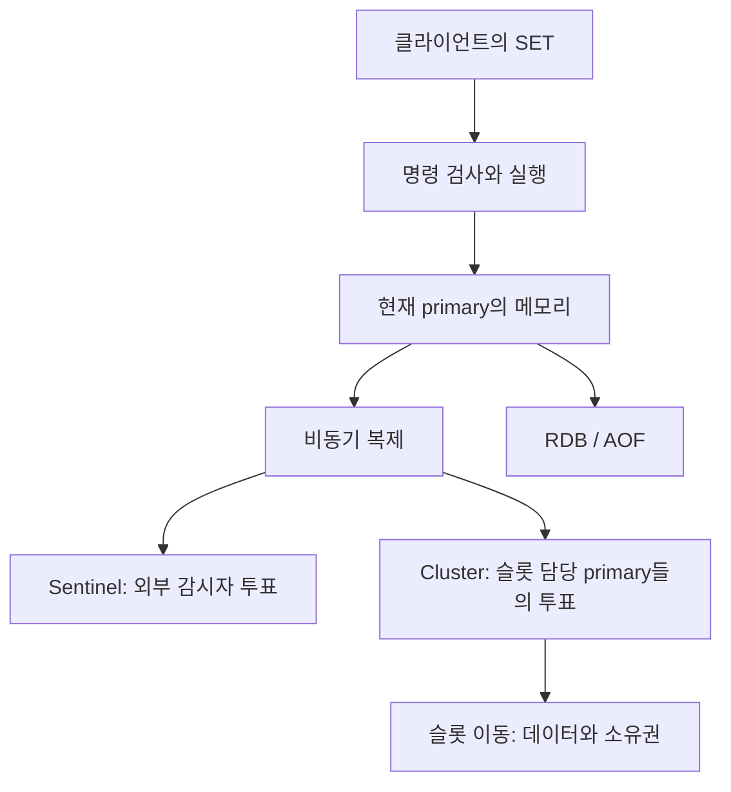
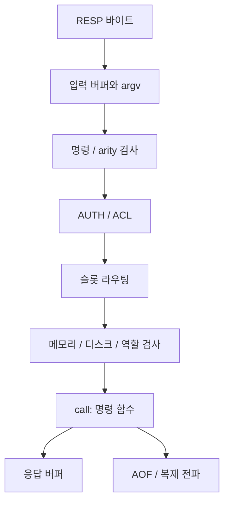
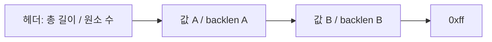
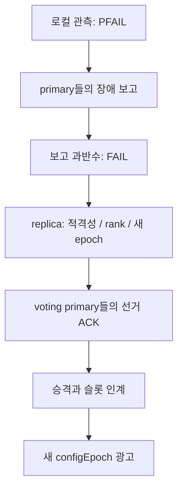

# Redis 7.2.16 내부: 쓰기 한 건에서 장애 조치까지

> 명령 실행과 자료구조에서 시작해 복제, Sentinel의 투표, Cluster 장애 조치와 슬롯 이동을 소스 함수까지 따라갑니다. 응답을 잃은 MIGRATE, 메모리 축출, Pub/Sub와 ACL도 같은 서버 안에서 연결합니다.
> 2026-08-24 · https://alfex4936.github.io/blog/redis-7-2-internals/

import reproduction from '../../../../scripts/test-redis-internals.py?url'

Redis에 `SET`을 보내고 `OK`를 받았습니다. 그러면 어디까지 끝난 것일까요? 지금 연결한 서버의 메모리에는 들어갔습니다. 레플리카가 받았는지, 디스크에 남았는지, 다음 장애 조치에서도 살아남는지는 별도로 확인해야 합니다.

이 글에서는 그 쓰기 한 건을 따라갑니다. 명령을 받아 실행하는 경로에서 시작해, 바이트 배열에 값을 넣고, 복제 연결로 보내고, 서버가 끊겼을 때 누가 다음 쓰기 담당자가 되는지 봅니다. 뒤에서는 슬롯을 옮기다가 응답을 잃는 경우까지 이어집니다.

분석 기준은 [Redis 7.2.16](https://github.com/redis/redis/releases/tag/7.2.16)의 커밋 `335554f18caf7bbf6b0ac2b3548133d750f00a1b`입니다. 릴리스의 공개 시각은 2026-08-17이고, 표시 날짜는 그다음 주인 2026-08-24로 잡았습니다. 소스 조사와 아래 재현은 **2026-10-10에 수행한 검증**입니다. 표시 날짜에 실험했다는 기록으로 읽으면 안 됩니다.

현재 `redis.io`의 설명에는 이후 버전의 기능이 섞일 수 있으므로 구현과 기본값은 이 커밋에 고정했습니다. 그림의 재생은 소스에서 읽은 순서를 편집한 스냅샷입니다. 실제 Redis를 브라우저에서 돌리거나 장애 시간을 예측하지 않습니다.



처음 읽는다면 §1에서 §8까지 순서대로 보시면 됩니다. 운영 중 문제를 찾는다면 복제는 §5, Sentinel은 §7, Cluster는 §9, 슬롯 이동은 §11부터 읽어도 됩니다. 캐시 사용 패턴은 [캐시 안내서](/blog/redis-cache-field-guide/), listpack의 메모리 측정은 [listpack 글](/blog/redis-listpack/), 순위 계산은 [skip list 글](/blog/skip-list/)에서 따로 다룹니다. 이 글의 기준 버전과 그 글들의 기준 버전은 다릅니다.

## 명령 하나가 실행되기까지

TCP 연결은 명령 자체가 아닙니다. 클라이언트가 보낸 RESP 바이트를 읽고, 명령 이름과 인자 배열로 파싱해야 합니다. `networking.c`의 `readQueryFromClient`, `processInputBuffer`를 따라가면 `server.c`의 `processCommand`에 도착합니다.[^dispatch]

`processCommand`에는 실제 쓰기보다 앞선 문이 여러 개 있습니다. 명령과 인자 수를 확인하고, 인증과 ACL을 검사합니다. Cluster라면 키가 이 노드의 슬롯인지 판단합니다. 메모리 압박과 디스크 오류, 부족한 레플리카, 읽기 전용 레플리카 상태도 여기서 명령을 거절할 수 있습니다. 통과하면 `call`이 `c->cmd->proc(c)`를 실행합니다.[^gates]

<Walk>



<Step show="R,B,V">
읽기와 파싱을 마쳐도 명령이 실행된 것은 아닙니다. RESP가 온전한지와 명령의 인자 수가 맞는지를 구분합니다.
</Step>

<Step show="A,S,G">
실행 전에 접근 권한, 슬롯 담당자, 쓰기를 받을 수 있는 상태를 확인합니다. MOVED나 NOPERM을 받았다면 자료구조를 수정하는 함수까지 가지 않았을 수 있습니다.
</Step>

<Step show="F,O,P">
명령 함수가 메모리를 바꾸고 응답을 준비합니다. 전파와 영속화에는 별도 경로가 있으므로 OK를 레플리카와 디스크의 완료 표시로 바꾸어 읽지 않습니다.
</Step>

</Walk>

`MULTI`는 명령을 모으고 `EXEC`에서 실행합니다. 실행 중 다른 일반 클라이언트의 명령이 끼어드는 것과, 앞 명령의 결과를 되돌리는 것은 다른 기능입니다. Redis 트랜잭션에는 SQL식 rollback이 없습니다. 실행 시점의 명령 오류를 무시한 채 "EXEC가 원자적이니 전부 성공했다"고 판단하면 안 됩니다.[^multi]

## 싱글 스레드가 설명하는 것과 설명하지 않는 것

이 버전의 일반 명령 실행은 메인 스레드가 담당합니다. 그래서 하나의 큰 명령이 오래 걸리면 같은 실행 경로를 기다리는 다른 요청에도 영향을 줍니다. 네트워크 왕복을 줄이는 pipelining은 큰 `SMEMBERS`나 긴 Lua 연산의 서버 실행 비용을 없애지 않습니다.

그렇다고 Redis 프로세스 전체에 스레드가 하나인 것은 아닙니다. `io-threads`의 기본값은 1이고 `io-threads-do-reads`는 `no`입니다. I/O 스레드를 쓰도록 설정하면 소켓 쓰기, 선택적으로 읽기와 파싱을 분담합니다. `handleClientsWithPendingReadsUsingThreads`는 작업 완료를 기다린 뒤 메인 스레드에서 `processPendingCommandAndInputBuffer`를 호출합니다. 명령 실행까지 서로 다른 I/O 스레드에 나누는 설정이 아닙니다.[^threads]

백그라운드 작업도 따로 있습니다. AOF fsync와 lazy free는 백그라운드 작업을 사용하고, RDB 저장이나 AOF rewrite는 자식 프로세스를 사용합니다. 운영에서 "싱글 스레드"라는 말만 외우면 CPU, 디스크, fork 비용을 같은 문제로 취급하게 됩니다.[^persist]

`SLOWLOG`와 `INFO commandstats`는 서버가 명령에 쓴 시간을 보는 도구입니다. 애플리케이션의 연결 풀 대기, 네트워크 왕복, 응답을 읽는 시간은 별도입니다. 이 글에서는 처리량이나 장애 복구 시간을 측정해 일반화하지 않습니다.

## TYPE 아래에 여러 인코딩이 있습니다

`TYPE`은 공개 자료형을 말하고, `OBJECT ENCODING`은 현재 표현을 말합니다. `redisObject`는 type, encoding, 참조 수, LRU/LFU 정보와 실제 데이터 포인터를 갖습니다. 같은 hash라도 작은 것은 listpack, 커진 것은 hashtable일 수 있습니다.[^objects]

| 공개 자료형 | 이 태그에서 읽어 볼 내부 표현 | 읽을 함수 |
| --- | --- | --- |
| string | 정수 `int`, 객체와 SDS를 한 번에 할당하는 `embstr`, 별도 SDS의 `raw` | `createStringObject`, `tryObjectEncoding` |
| hash | field/value 쌍을 나열한 listpack 또는 dict | `hashTypeSet`, `hashTypeConvert` |
| set | 정수 배열 intset, listpack, dict | `setTypeCreate`, `setTypeAddAux` |
| sorted set | 작은 listpack 또는 dict와 skip list | `zsetAdd`, `zsetConvertAndExpand` |
| list | 작은 listpack 또는 quicklist | `listTypeTryConversionRaw` |
| stream | radix tree에 매단 listpack 묶음, 그룹별 pending 정보 | `streamAppendItem` |

string의 `embstr` 경계는 이 소스의 `OBJ_ENCODING_EMBSTR_SIZE_LIMIT = 44`입니다. 이는 바이트 길이이며 모든 44바이트 이하 입력이 끝까지 embstr로 남는다는 뜻은 아닙니다. 정수로 표현 가능한 값은 정수 인코딩으로 바뀔 수 있고, 수정 경로에서도 인코딩이 바뀝니다. SDS는 문자열 길이를 별도 필드에 두므로 값 안의 NUL 바이트도 다룰 수 있습니다.[^objects]

dict의 확장은 전체 키를 한 번에 다시 넣는 호출 하나로만 구성되지 않습니다. `dictRehash`가 옛 테이블에서 새 테이블로 버킷을 조금씩 옮깁니다. 이 기간에는 두 테이블이 공존합니다. 점진적이라는 말도 작업 하나의 지연 상한을 보장하지는 않습니다. 버킷 하나에 연결된 엔트리를 옮기는 비용은 남습니다.[^dict]

sorted set의 dict는 멤버로 점수를 찾고, skip list는 점수 순서와 범위를 찾습니다. skip list의 `span`은 건너뛴 원소 수여서 rank를 계산할 수 있습니다. 점수가 같으면 멤버 문자열의 바이트 순서로 정렬합니다. `ZRANK`와 큰 `ZRANGE`를 같은 O(log N) 한 줄로 묶으면 반환할 원소 수의 비용을 놓칩니다.[^zset]

stream은 각 메시지를 독립된 dict 엔트리로만 저장하지 않습니다. `streamAppendItem`은 ID를 정렬 가능한 바이트로 바꿔 radix tree에서 listpack 묶음을 찾습니다. 묶음의 기준 ID와 필드명을 공유하고, 메시지의 ID 차이와 반복 필드를 압축합니다. consumer group의 PEL은 전달됐지만 아직 확인되지 않은 항목을 추적하는 별도 상태입니다. 소비자가 일을 완료했다고 `XACK`하는 것과 데이터가 디스크에 영속화되는 것은 다른 사건입니다.[^stream]

## listpack을 읽을 때 놓치기 쉬운 경계

`listpack.c`의 형식은 총 바이트 수와 원소 수가 있는 6바이트 헤더, 원소들, 끝 표시 `0xff`입니다. 각 원소는 인코딩된 값 뒤에 자기 인코딩 길이의 backlen을 둡니다. backlen 자체의 크기를 그 길이에 포함하지 않습니다. 뒤로 걸을 때 자기 원소의 시작을 찾는 정보이지, 다음 원소에 저장된 앞 원소 길이가 아닙니다.[^listpack]



이 설계는 ziplist의 prevlen 연쇄 갱신을 없앱니다. 연속 배열의 중간에 넣을 때 뒤 바이트를 옮기는 비용까지 없애지는 않습니다. `lpInsert`에는 실제 `memmove`와 필요할 때의 재할당이 있고, 호출자는 반환된 새 포인터를 보관해야 합니다.[^listpack]

기본 임계값은 [이 태그의 redis.conf](https://github.com/redis/redis/blob/335554f18caf7bbf6b0ac2b3548133d750f00a1b/redis.conf#L1918-L2003)에 있습니다. entries는 공개 자료형의 원소 수입니다. hash의 field/value를 listpack 항목 두 개로 저장한다고 해서 필드 제한을 절반으로 읽지 않습니다.

| 설정 | 기본값 | 어떤 한계를 정합니까 |
| --- | ---: | --- |
| `hash-max-listpack-entries` | 512 | 필드 수 |
| `hash-max-listpack-value` | 64 | 필드명 또는 값의 바이트 길이 |
| `zset-max-listpack-entries` | 128 | 멤버 수 |
| `zset-max-listpack-value` | 64 | 멤버의 바이트 길이 |
| `set-max-intset-entries` | 512 | 정수로 표현되는 멤버 수 |
| `set-max-listpack-entries` | 128 | listpack set의 멤버 수 |
| `set-max-listpack-value` | 64 | 멤버의 바이트 길이 |
| `list-max-listpack-size` | -2 | quicklist 노드 크기 기준, -2는 8 KiB 설정 |
| `list-compress-depth` | 0 | 끝에서 압축하지 않을 노드 깊이, 0은 압축 끔 |

`hashTypeSet`에서는 512개를 넘거나 필드명·값의 길이 조건을 벗어나면 hashtable로 전환합니다. 삭제 후 작아졌다고 그 hash가 자동으로 listpack으로 돌아오는 경로는 아닙니다. set은 첫 값과 한 번에 넣을 개수의 힌트도 초기 표현에 영향을 줍니다. 정수가 아닌 값을 넣는 순간 무조건 hashtable이라고 설명하면, 작은 intset을 listpack으로 바꾸는 경로를 놓칩니다.[^compact]

list에는 특히 버전 확인이 필요합니다. **이 태그의 작은 list는 독립된 listpack일 수 있습니다.** `listTypeTryConvertListpack`은 커지면 quicklist로 바꾸고, `listTypeTryConvertQuicklist`은 packed 노드 하나로 줄었을 때 반대 전환도 검사합니다. 축소 시에는 기준의 절반을 사용해 경계에서 계속 표현을 바꾸는 일을 줄입니다. 다른 자료형의 한쪽 방향 전환을 모든 Redis 자료형의 규칙으로 일반화하지 않습니다.[^lists]

<Quiz title="인코딩을 확인하는 이유" items={[
  { q: "작아진 Redis 자료구조는 모두 작은 인코딩으로 되돌아갑니까?", choices: ["모두 되돌아갑니다.", "모두 되돌아가지 않습니다.", "자료형과 코드 경로마다 다릅니다. 이 태그의 list에는 축소 전환이 있습니다."], answer: 2, why: "hash의 전환 규칙을 list에도 적용하면 틀립니다. listTypeTryConvertQuicklist는 packed 노드 하나와 축소 경계를 확인합니다. TYPE만 보지 말고 버전과 OBJECT ENCODING을 함께 봅니다." },
]} />

## 복제는 같은 바이트 역사에 다시 합류하는 일입니다

primary는 현재 쓰기를 받는 서버이고, replica는 그 서버의 복제 스트림을 따라가는 서버입니다. 복제는 기본적으로 비동기입니다. primary가 쓰기를 실행한 뒤 모든 replica의 확인을 기다려서 일반 `SET`의 `OK`를 내보내는 구조가 아닙니다.[^replication]

레플리카는 연결 후 PING, 필요하면 인증, `REPLCONF` 협상과 `PSYNC`를 진행합니다. 여기서 비교하는 것은 키 개수가 아니라 **replication ID와 스트림의 byte offset**입니다. offset이 큰 레플리카가 더 많은 스트림을 받았다는 뜻이지, 복제 스트림에 실린 모든 바이트가 사용자 데이터라는 뜻은 아닙니다.[^psync]

부분 재동기화(partial resynchronization)가 되려면 요청한 ID가 현재 역사 또는 허용된 이전 역사와 맞고, 요청한 offset부터의 바이트를 backlog가 보관하고 있어야 합니다. backlog는 레플리카가 잠시 끊긴 동안 따라잡을 수 있도록 남기는 복제 이력입니다. 데이터베이스의 변경 로그를 무한히 저장하는 장치는 아닙니다.

```c title="src/replication.c L755-L792" link="https://github.com/redis/redis/blob/335554f18caf7bbf6b0ac2b3548133d750f00a1b/src/replication.c#L755-L792"
    if (strcasecmp(master_replid, server.replid) &&
        (strcasecmp(master_replid, server.replid2) ||
         psync_offset > server.second_replid_offset))
    {
        /* Replid "?" is used by slaves that want to force a full resync. */
        /* 로그 생략 */
        goto need_full_resync;
    }

    /* We still have the data our slave is asking for? */
    if (!server.repl_backlog ||
        psync_offset < server.repl_backlog->offset ||
        psync_offset > (server.repl_backlog->offset + server.repl_backlog->histlen))
    {
        /* 로그 생략 */
        goto need_full_resync;
    }
```

첫 번째 `if`는 replica가 보낸 replid가 현재 replid와 같은지 봅니다. 다르면 이전 replid(`replid2`)와 같고 요청 offset이 `second_replid_offset` 이하인 경우만 통과합니다. 두 번째 `if`는 요청 offset이 backlog에 남아 있는 구간 안에 있는지 보고, 어느 쪽이든 실패하면 `need_full_resync`로 가서 전체 동기화를 합니다.

조건을 못 맞추면 full resynchronization으로 갑니다. primary가 기준 offset과 RDB 스냅샷을 보내고, 스냅샷을 만드는 동안 생긴 이후 스트림도 보내 레플리카가 이어서 적용하게 합니다. 스냅샷 없이 현재 메모리를 조금씩 읽으며 임의 순서로 복사하는 방식이 아닙니다.[^fullsync]

| 설정 | 기본값 | 줄이거나 늘렸을 때의 의미 |
| --- | --- | --- |
| `repl-backlog-size` | 1 MiB | 끊김 동안 보관할 스트림의 목표 크기입니다. 쓰기량과 단절 시간을 함께 봅니다. |
| `repl-backlog-ttl` | 3600초 | 연결된 레플리카가 없을 때 backlog를 언제 해제할지 정합니다. 키 TTL이 아닙니다. |
| `repl-timeout` | 60초 | 복제 연결과 전송의 타임아웃입니다. Sentinel의 감지 시간과 별도입니다. |
| `repl-ping-replica-period` | 10초 | primary가 복제 연결에 PING을 보내는 주기입니다. |
| `repl-diskless-sync` | yes | full sync의 RDB를 디스크 파일 대신 소켓으로 보내는 경로를 허용합니다. |
| `repl-diskless-sync-delay` | 5초 | full sync를 묶어 시작하려고 기다리는 시간입니다. |
| `repl-diskless-load` | disabled | 수신하는 레플리카의 적재 방식입니다. 송신 설정과 같지 않습니다. |
| `replica-read-only` | yes | 애플리케이션의 일반 쓰기를 레플리카에서 거절합니다. |
| `replica-serve-stale-data` | yes | 복제 연결이 끊겨도 읽기를 허용할 수 있습니다. 최신성 보장이 아닙니다. |

위 값은 설정 등록부와 태그의 설정 파일에서 확인했습니다.[^repl-config] diskless도 디스크, CPU와 메모리 비용이 전부 없어졌다는 뜻은 아닙니다. RDB를 만들고 적재하는 일이 남습니다.

승격 후에는 새 replication ID를 사용합니다. 이전 ID와 유효 offset 경계를 `replid2`, `second_replid_offset`에 남겨 기존 레플리카가 이전 역사에서 부분 재동기화할 기회를 줍니다. 둘로 갈라진 쓰기 역사를 ID 하나로 합치는 기능은 아닙니다.[^history]

<TracePlayer
  title="OK와 레플리카 반영 사이"
  columns={["클라이언트", "primary", "replica"]}
  caption="A와 B는 설명용 값입니다. 스냅샷은 비동기 복제의 가능한 순서이며, 전송 지연을 측정하지 않습니다."
  tracks={[
    { label: "반영 후 장애", steps: [
      { action: "시작", note: "두 서버가 A를 갖고 있습니다.", values: ["대기", "A", "A"] },
      { action: "SET B 실행", note: "현재 primary가 B를 쓰고 OK를 응답합니다.", values: ["OK", "B", "A"] },
      { action: "복제 적용", note: "replica가 B의 스트림을 적용합니다.", values: ["OK", "B", "B"] },
      { action: "primary 장애", note: "B를 받은 replica가 선택되는 경우 B가 남습니다. 선택과 영속화 조건은 별도입니다.", values: ["재연결 필요", "중단", "B"] },
    ] },
    { label: "반영 전 장애", steps: [
      { action: "시작", note: "두 서버가 A를 갖고 있습니다.", values: ["대기", "A", "A"] },
      { action: "SET B 실행", note: "OK를 받았어도 replica는 아직 A일 수 있습니다.", values: ["OK", "B", "A"] },
      { action: "primary 장애", note: "B를 못 받은 replica만 승격 후보로 남는 순서입니다.", values: ["재연결 필요", "중단", "A"] },
      { action: "replica 승격", note: "새 primary에 B가 없습니다. 원래 OK를 받았다는 사실로 복원되지 않습니다.", values: ["A를 읽음", "중단", "A / primary"] },
    ] },
  ]}
/>

### WAIT와 WAITAOF를 붙이면 무엇이 달라집니까

`WAIT numreplicas timeout`은 같은 클라이언트 연결의 앞선 쓰기 offset을 일정 수의 replica가 확인했는지 기다리고, 실제 확인 수를 돌려줍니다. 결과가 요구한 수보다 작아도 앞선 쓰기를 rollback하지 않습니다. 애플리케이션은 성공 기준에 못 미친 결과를 별도로 처리해야 합니다.[^wait]

`WAITAOF numlocal numreplicas timeout`은 같은 연결의 앞선 쓰기에 대한 AOF fsync 확인을 기다립니다. local과 replica 확인 수를 따로 돌려줍니다. AOF가 꺼진 로컬 서버에 로컬 fsync를 요구할 수는 없습니다. 이 역시 반환값을 검사해야 합니다.[^wait]

둘 다 연결을 바꾸고 호출하면 원래 연결의 쓰기를 기다리는 용도로 쓸 수 없습니다. `redis-cli SET ...`와 별도의 `redis-cli WAIT ...`를 두 번 실행하는 예제는 그 점을 숨깁니다. 연결 풀이 어느 연결을 빌려 주는지도 중요합니다.

WAIT가 성공해도 Sentinel/Cluster 선거가 그 쓰기에 투표한 레플리카만 반드시 고르는 것은 아닙니다. 디스크에 남기는 요구와 다음 primary 선택 규칙까지 설계하지 않고 "강한 일관성이 됐다"고 말하지 않습니다. 응답 타임아웃 뒤에 같은 증가 명령을 다시 보내는 문제도 남습니다. 첫 시도가 적용됐을 수 있으므로 재시도에는 idempotency를 별도로 설계해야 합니다.

## 단독 서버와 수동 FAILOVER

복제도 없는 서버 하나가 멈추면 대체 primary 후보가 없습니다. RDB/AOF를 적재해 재시작하는 것은 장애 조치 선거와 다릅니다.

Sentinel이나 Cluster 없이 primary와 replica만 연결했다면, 복제 링크가 끊겼다는 이유로 replica가 자동으로 쓰기 담당자가 되지는 않습니다. 사람이 `REPLICAOF NO ONE`으로 승격하고 다른 노드와 클라이언트를 재설정할 수 있지만, 이 명령에는 감시자 과반수 투표나 옛 primary fencing이 없습니다.[^standalone]

실행 중인 standalone primary에서 시작하는 `FAILOVER` 명령도 있습니다. coordinated failover는 쓰기를 멈추고 대상 replica가 offset을 따라잡게 한 뒤 역할을 넘기는 경로입니다. 죽은 primary에 명령을 보내는 자동 장애 복구 기능은 아닙니다. `TO`, `TIMEOUT`, `FORCE`, `ABORT`의 의미를 Sentinel이나 `CLUSTER FAILOVER` 옵션과 섞지 않습니다.[^standalone]

standalone의 `FAILOVER ... FORCE`는 정한 timeout 안에 따라잡지 못해도 지정한 대상으로 역할을 넘길 수 있어 유실 위험이 있습니다. `REPLICAOF NO ONE`은 즉시 역할을 바꾸는 다른 명령입니다. 역할이 바뀌었다고 애플리케이션의 주소, DNS와 연결 풀이 자동으로 바뀌지는 않습니다.

## Sentinel의 SDOWN, ODOWN과 선거는 서로 다른 문입니다

Sentinel은 데이터 키를 나누는 서버가 아니라 외부 감시자입니다. 하나의 primary와 그 replicas를 감시하고, 다른 Sentinels를 알아내고, 필요할 때 승격을 조정합니다. 여기서 primary 주소는 서비스 이름으로 조회할 수 있어야 클라이언트가 새 연결을 만들 수 있습니다.

### SDOWN은 내 관측입니다

`sentinelCheckSubjectivelyDown`은 Sentinel 하나의 관측으로 SDOWN(subjectively down)을 설정합니다. `down-after-milliseconds` 동안 유효한 응답을 못 받았는지 등을 봅니다. PING의 정상 응답에는 `PONG`뿐 아니라 서버가 살아 있음을 나타내는 `LOADING`, `MASTERDOWN`도 포함됩니다. TCP 연결 여부 하나만으로 판정하지 않습니다.[^sdown]

```c title="src/sentinel.c L4576-L4602" link="https://github.com/redis/redis/blob/335554f18caf7bbf6b0ac2b3548133d750f00a1b/src/sentinel.c#L4576-L4602"
    /* Update the SDOWN flag. We believe the instance is SDOWN if:
     *
     * 1) It is not replying.
     * 2) We believe it is a master, it reports to be a slave for enough time
     *    to meet the down_after_period, plus enough time to get two times
     *    INFO report from the instance. */
    if (elapsed > ri->down_after_period ||
        (ri->flags & SRI_MASTER &&
         ri->role_reported == SRI_SLAVE &&
         mstime() - ri->role_reported_time >
          (ri->down_after_period+sentinel_info_period*2)) ||
          (ri->flags & SRI_MASTER_REBOOT &&
           mstime()-ri->master_reboot_since_time > ri->master_reboot_down_after_period))
    {
        /* Is subjectively down */
        if ((ri->flags & SRI_S_DOWN) == 0) {
            sentinelEvent(LL_WARNING,"+sdown",ri,"%@");
            ri->s_down_since_time = mstime();
            ri->flags |= SRI_S_DOWN;
        }
    } else {
        /* Is subjectively up */
        if (ri->flags & SRI_S_DOWN) {
            sentinelEvent(LL_WARNING,"-sdown",ri,"%@");
            ri->flags &= ~(SRI_S_DOWN|SRI_SCRIPT_KILL_SENT);
        }
    }
```

조건은 세 가지입니다. 마지막 정상 응답 이후 `elapsed`가 `down_after_period`를 넘었거나, primary가 자기를 replica라고 보고한 상태가 `down_after_period+sentinel_info_period*2`보다 오래 갔거나, 재시작한 primary가 `master_reboot_down_after_period` 안에 회복하지 못한 경우입니다. 이때 `+sdown` 이벤트를 내고 `SRI_S_DOWN` 플래그를 켭니다.

이 판정은 주로 "내가 이 서버를 정상적으로 사용할 수 없다고 봅니다"입니다. 내가 고립됐거나 내 경로만 끊겼을 수도 있습니다. primary뿐 아니라 replica나 다른 Sentinel에도 SDOWN 플래그가 붙을 수 있습니다.

### ODOWN은 감지 quorum을 채운 관측입니다

primary가 SDOWN이면 `SENTINEL is-master-down-by-addr`로 다른 감시자의 관측을 묻습니다. `sentinelCheckObjectivelyDown`은 자기 자신과 다른 감시자들의 down 보고를 세어 설정된 quorum에 도달하면 ODOWN(objectively down)을 설정합니다. 모든 감시자가 동의했다는 뜻도, 데이터에 합의했다는 뜻도 아닙니다.[^odown]

```c title="src/sentinel.c L4605-L4628" link="https://github.com/redis/redis/blob/335554f18caf7bbf6b0ac2b3548133d750f00a1b/src/sentinel.c#L4605-L4628"
/* Is this instance down according to the configured quorum?
 *
 * Note that ODOWN is a weak quorum, it only means that enough Sentinels
 * reported in a given time range that the instance was not reachable.
 * However messages can be delayed so there are no strong guarantees about
 * N instances agreeing at the same time about the down state. */
void sentinelCheckObjectivelyDown(sentinelRedisInstance *master) {
    dictIterator *di;
    dictEntry *de;
    unsigned int quorum = 0, odown = 0;

    if (master->flags & SRI_S_DOWN) {
        /* Is down for enough sentinels? */
        quorum = 1; /* the current sentinel. */
        /* Count all the other sentinels. */
        di = dictGetIterator(master->sentinels);
        while((de = dictNext(di)) != NULL) {
            sentinelRedisInstance *ri = dictGetVal(de);

            if (ri->flags & SRI_MASTER_DOWN) quorum++;
        }
        dictReleaseIterator(di);
        if (quorum >= master->quorum) odown = 1;
    }
```

`quorum = 1`은 자기 자신의 한 표이고, 다른 Sentinel 중 `SRI_MASTER_DOWN` 플래그가 켜진 수만큼 더합니다. 합이 설정한 `quorum` 이상이면 ODOWN입니다. 주석이 스스로 "weak quorum"이라고 부르는 이유는, 이 표들이 같은 순간에 모인 합의가 아니라 최근에 받은 응답의 집계이기 때문입니다.

### 승격 허가는 알려진 감시자들의 과반수도 필요합니다

ODOWN을 본 Sentinel이 혼자 아무 replica나 승격하면 두 곳에서 동시에 역할을 바꿀 수 있습니다. 그래서 선거 epoch마다 leader를 정합니다. `sentinelVoteLeader`는 epoch에 대해 투표하고, `sentinelGetLeader`는 알려진 Sentinels의 절대 과반수와 설정 quorum을 모두 채운 leader인지 검사합니다.[^leader]

```c title="src/sentinel.c L4843-L4862" link="https://github.com/redis/redis/blob/335554f18caf7bbf6b0ac2b3548133d750f00a1b/src/sentinel.c#L4843-L4862"
    /* Count this Sentinel vote:
     * if this Sentinel did not voted yet, either vote for the most
     * common voted sentinel, or for itself if no vote exists at all. */
    if (winner)
        myvote = sentinelVoteLeader(master,epoch,winner,&leader_epoch);
    else
        myvote = sentinelVoteLeader(master,epoch,sentinel.myid,&leader_epoch);

    if (myvote && leader_epoch == epoch) {
        uint64_t votes = sentinelLeaderIncr(counters,myvote);

        if (votes > max_votes) {
            max_votes = votes;
            winner = myvote;
        }
    }

    voters_quorum = voters/2+1;
    if (winner && (max_votes < voters_quorum || max_votes < master->quorum))
        winner = NULL;
```

`voters_quorum = voters/2+1`이 과반입니다. 가장 많은 표를 받은 후보라도 `max_votes`가 과반에 못 미치거나 설정한 `quorum`에 못 미치면 `winner`를 `NULL`로 돌려 이번 epoch에서는 리더가 없습니다. 그래서 Sentinel 5대에 quorum 2를 줘도 failover를 시작하려면 3표가 필요합니다.

즉 quorum은 장애 감지 기준이고, 선거에는 과반수 조건이 추가됩니다. 아래 수는 실제 배치 측정이 아닌 quorum 계산 예제입니다. 감시자 수에는 자신도 포함하며, 같은 primary에 대해 알고 있는 Sentinels를 셉니다.

<TracePlayer
  title="ODOWN인데 왜 승격하지 못합니까"
  columns={["알려진 Sentinel", "down 보고", "leader 득표", "판정"]}
  caption="quorum=2로 고정한 설명용 선거입니다. 감지 quorum과 leader 선출 조건을 분리하며, 실제 타임아웃과 메시지 재전송은 생략합니다."
  tracks={[
    { label: "감시자 3개", steps: [
      { action: "내 관측", note: "S1만 down으로 봅니다. quorum에 못 미칩니다.", values: ["3", "1", "0", "SDOWN"] },
      { action: "S2도 down 보고", note: "자신을 포함한 보고 2개로 ODOWN입니다. 이 보고 자체가 leader 투표는 아닙니다.", values: ["3", "2", "0", "ODOWN"] },
      { action: "같은 epoch의 leader 투표", note: "leader가 2표를 모으면 3개의 절대 과반수와 quorum=2를 함께 채웁니다.", values: ["3", "2", "2", "선출 가능"] },
    ] },
    { label: "감시자 5개", steps: [
      { action: "내 관측", note: "S1만 down으로 봅니다.", values: ["5", "1", "0", "SDOWN"] },
      { action: "S2도 down 보고", note: "quorum=2이므로 ODOWN이 될 수 있습니다.", values: ["5", "2", "0", "ODOWN"] },
      { action: "2표만 확보", note: "알려진 5개 중 절대 과반수는 3개입니다. 2표로는 leader를 선출하지 못합니다.", values: ["5", "2", "2", "승격 허가 없음"] },
      { action: "같은 leader에 3표", note: "같은 epoch에서 과반수와 quorum을 채워야 선출됩니다.", values: ["5", "2", "3", "선출 가능"] },
    ] },
  ]}
/>

<Quiz title="quorum만 낮추면 복구됩니까" items={[
  { q: "Sentinel 5개를 알고 있고 quorum=2입니다. 네트워크가 갈라져 2개만 서로 통신합니다. ODOWN이면 자동 승격을 허가받습니까?", choices: ["허가받습니다. quorum=2를 채웠습니다.", "허가받지 못합니다. leader 선출에 알려진 Sentinel들의 절대 과반수도 필요합니다.", "데이터를 가진 replica가 한 표 더 주면 됩니다."], answer: 1, why: "장애 보고와 leader 투표는 별개입니다. 이 배치의 leader에는 최소 3표가 필요합니다. 데이터 replica가 Sentinel 선거의 부족한 표를 대신 주지 않습니다." },
]} />

### leader가 정해진 뒤에도 할 일이 남습니다

`sentinelFailoverStateMachine`의 상태 순서를 읽으면 승격은 한 명령의 반환값으로 끝나지 않습니다.[^sentinel-states]

| 상태 | 코드가 기다리는 일 |
| --- | --- |
| `WAIT_START` | leader 선출과 시작 조건 |
| `SELECT_SLAVE` | 승격할 replica 후보 선택 |
| `SEND_SLAVEOF_NOONE` | 대상에게 `REPLICAOF NO ONE`에 해당하는 역할 변경 명령 전송 |
| `WAIT_PROMOTION` | 대상의 INFO에서 primary 역할을 확인 |
| `RECONF_SLAVES` | 다른 replicas를 새 primary에 연결 |
| `UPDATE_CONFIG` | 감시 대상 주소와 구성을 새 primary 기준으로 갱신 |

후보 선택에도 두 단계가 있습니다. 먼저 SDOWN/ODOWN, 오래 끊긴 연결, INFO의 신선도, primary와 끊긴 기간, `replica-priority=0` 등을 검사해 후보를 거릅니다. 그다음 남은 후보를 **작은 priority, 큰 replication offset, run ID 순서**로 정렬합니다. 가장 최신 offset을 무조건 첫 기준으로 쓰는 것이 아닙니다.[^selection]

<TracePlayer
  title="leader 선출 뒤 실제 역할이 바뀌는 순서"
  columns={["Sentinel leader", "후보 R1", "다른 replicas"]}
  caption="성공 경로를 편집한 상태 재생입니다. 후보는 사전에 적격성 검사를 통과했다고 가정하며, 타임아웃·재선거·재구성 재시도는 본문에서 설명합니다."
  tracks={[
    { label: "승격과 재구성", steps: [
      { action: "WAIT_START", note: "같은 epoch의 leader로 선출되고 시작 조건을 만족합니다.", values: ["선출됨", "replica", "옛 primary 추종"] },
      { action: "SELECT_SLAVE", note: "적격 후보 중 priority, offset, run ID 순으로 R1을 고릅니다.", values: ["R1 선택", "선택됨", "옛 primary 추종"] },
      { action: "SEND_SLAVEOF_NOONE", note: "R1에 역할 변경 명령을 보냅니다. 아직 INFO 확인 전입니다.", values: ["명령 전송", "승격 요청", "옛 primary 추종"] },
      { action: "WAIT_PROMOTION", note: "R1의 INFO에서 primary 역할을 확인합니다.", values: ["INFO 확인", "primary", "옛 primary 추종"] },
      { action: "RECONF_SLAVES", note: "parallel-syncs 제한 안에서 다른 replicas를 R1에 연결합니다.", values: ["재구성", "primary", "R1으로 동기화"] },
      { action: "UPDATE_CONFIG", note: "서비스 이름의 primary 주소를 갱신합니다. 애플리케이션은 이를 조회해 재연결해야 합니다.", values: ["주소 갱신", "primary", "R1 추종"] },
    ] },
  ]}
/>

`WAIT_PROMOTION`에서 역할 확인을 못 하면 시간 제한과 실패 경로가 작동합니다. `parallel-syncs`는 leader 득표 수가 아니라 동시에 새 primary로 재구성할 replica 수입니다. "선거가 끝났습니다"와 "모든 replica가 다시 붙었습니다"를 같은 시각으로 보지 않습니다.

## Sentinel 설정과 네트워크 분할

설정 파일의 감시 시작점은 `sentinel monitor <name> <ip> <port> <quorum>`입니다. quorum에는 하나의 보편적인 기본 배치값을 대신 넣지 않습니다. 주소는 Sentinel이 관측하고 재구성할 수 있어야 합니다. NAT나 컨테이너 환경에서 서로 도달하지 못하는 주소를 광고하면 감시와 클라이언트 재연결이 다른 곳을 보게 됩니다.

| 설정 | 코드 기본값 | 운영에서 묻는 질문 |
| --- | --- | --- |
| `down-after-milliseconds` | 30000 ms | 정상 서버의 일시적인 지연을 장애로 볼 가능성과 감지 지연을 어떻게 맞춥니까 |
| `failover-timeout` | 180000 ms | 선거·승격·재구성·다음 시도의 시간 제한을 어떻게 운용합니까 |
| `parallel-syncs` | 1 | 동시에 재동기화되는 replicas 때문에 읽기 용량이 얼마나 줄 수 있습니까 |
| `replica-priority` | 100 | 어떤 replica를 우선 승격합니까. 0은 자동 승격 후보에서 제외합니다. |
| `min-replicas-to-write` | 0 | 일정 수의 정상 replica 없이 primary가 쓰기를 받을 수 있습니까 |
| `min-replicas-max-lag` | 10초 | 정상 replica를 셀 때 마지막 ACK의 지연을 얼마나 허용합니까 |

Sentinel 상수와 Redis 설정 등록부의 값입니다.[^sentinel-config] `failover-timeout`을 "전체 복구가 반드시 이 시간 안에 끝납니다"로 읽지 않습니다. 반복 시도와 단계별 조건을 제어하는 값입니다.

네트워크 분할에서는 새 primary가 생겨도 옛 primary가 즉시 죽지 않을 수 있습니다. Sentinel은 옛 primary의 CPU를 멈추거나 기존 애플리케이션 연결을 강제로 차단하는 fencing 장치가 아닙니다. 옛 주소에 붙은 클라이언트가 계속 쓰면, 재결합 후 그 서버가 새 primary의 replica로 재구성되면서 분기한 쓰기가 사라질 수 있습니다.[^sentinel-partition]

`min-replicas-to-write`와 `min-replicas-max-lag`는 이 창을 줄이는 도구입니다. primary는 최근 ACK 기준으로 정상 replica 수를 검사해 `NOREPLICAS`로 쓰기를 거절할 수 있습니다. 각 쓰기마다 동기 복제 합의를 얻는 기능은 아니므로, 설정했다고 유실 창이 사라졌다고 말하지 않습니다.[^min-replicas]

Sentinel에는 TILT도 있습니다. 시간 변화나 긴 실행 정지로 타이머 관측이 이상해졌을 때 감지는 계속하되 위험한 조치를 억제하는 모드입니다. 이 태그의 `sentinel_tilt_trigger` 기본값은 2000 ms이고 `sentinel_tilt_period`는 `SENTINEL_PING_PERIOD * 30`, 즉 30000 ms입니다. 감지 시간을 짧게 잡는 것만으로 호스트 정지와 타이머 문제를 해결할 수는 없습니다.[^tilt]

영속화를 끈 primary를 빈 데이터로 자동 재시작하는 경우도 주의해야 합니다. 여전히 primary로 돌아오면 replicas가 그 빈 상태를 다시 따라갈 수 있습니다. replica를 백업으로 생각하면서 원본 서버의 재시작 정책을 따로 두지 않습니다. 복제는 삭제와 빈 상태도 따라갈 수 있습니다.

## Cluster의 장애 판정과 투표

Cluster는 keyspace를 나눕니다. 이 소스의 `CLUSTER_SLOTS`는 16384이고, `keyHashSlot`은 CRC16 결과를 그 범위로 줄입니다. 비어 있지 않은 첫 hash tag를 사용하면 `{user:42}:profile`과 `{user:42}:session`은 같은 슬롯에 갑니다. 슬롯은 키 하나가 아니라 키를 배정하는 칸이고, 그 칸의 primary가 현재 쓰기를 담당합니다.[^slots]

각 데이터 노드는 별도의 cluster bus로 서로 상태를 교환합니다. Sentinel 프로세스가 이 선거를 대신하지 않습니다. bus의 기본 포트 관계는 데이터 포트에 10000을 더한 값이며 `cluster-port`로 지정할 수도 있습니다. 클라이언트가 데이터 포트에 연결된다고 노드 간 bus 연결까지 정상인 것은 아닙니다.[^cluster-bus]

PFAIL은 한 노드가 다른 노드를 제때 못 만난다는 로컬 의심입니다. FAIL은 슬롯을 담당하는 voting primary들의 장애 보고를 모아 과반수 조건을 만족시키는 판정입니다. primary들의 보고와 로컬 노드가 primary일 때의 자기 관측을 함께 셉니다. replica 수를 늘려도 투표권 있는 primary 수를 대신 늘리지 않습니다.[^cluster-fail]

장애 primary의 replica는 `clusterHandleSlaveFailover` 경로에서 승격을 시도합니다. 적격성 검사 후, replication offset에 따른 replica rank와 무작위 지연으로 시도를 벌리고, 새 epoch에서 투표 요청을 보냅니다. offset rank는 더 뒤처진 replica가 늦게 시도하게 만드는 장치입니다. 모든 노드가 후보 데이터를 비교해 최신 값을 복원하는 절차가 아닙니다.[^cluster-election]

```c title="src/cluster.c L4344-L4363" link="https://github.com/redis/redis/blob/335554f18caf7bbf6b0ac2b3548133d750f00a1b/src/cluster.c#L4344-L4363"
    /* If the previous failover attempt timeout and the retry time has
     * elapsed, we can setup a new one. */
    if (auth_age > auth_retry_time) {
        server.cluster->failover_auth_time = mstime() +
            500 + /* Fixed delay of 500 milliseconds, let FAIL msg propagate. */
            random() % 500; /* Random delay between 0 and 500 milliseconds. */
        server.cluster->failover_auth_count = 0;
        server.cluster->failover_auth_sent = 0;
        server.cluster->failover_auth_rank = clusterGetSlaveRank();
        /* We add another delay that is proportional to the slave rank.
         * Specifically 1 second * rank. This way slaves that have a probably
         * less updated replication offset, are penalized. */
        server.cluster->failover_auth_time +=
            server.cluster->failover_auth_rank * 1000;
        /* However if this is a manual failover, no delay is needed. */
        if (server.cluster->mf_end) {
            server.cluster->failover_auth_time = mstime();
            server.cluster->failover_auth_rank = 0;
            clusterDoBeforeSleep(CLUSTER_TODO_HANDLE_FAILOVER);
        }
```

선거 시작 시각은 지금부터 500ms에 0~499ms의 난수를 더하고, rank 1마다 1초를 더 늦춥니다. rank는 `clusterGetSlaveRank`(L4142-L4157)가 셉니다. failover가 가능한 형제 replica 중 자기보다 `repl_offset`이 큰 수이므로, 데이터를 가장 많이 받은 replica가 먼저 표를 요청합니다. 수동 failover(`mf_end`)면 지연이 0입니다.

voting primary는 `clusterSendFailoverAuthIfNeeded`에서 자신의 역할, 이미 투표한 epoch, 대상 primary의 FAIL 상태와 슬롯의 config epoch 등을 검사합니다. 후보가 voting primary의 과반수 ACK를 모으면 승격하고 슬롯을 인계합니다. `currentEpoch`는 선거의 진행 번호이고, `configEpoch`는 슬롯 소유권 정보의 우선순위를 정할 때 쓰입니다. 키 값의 버전 번호가 아닙니다.[^cluster-election]

```c title="src/cluster.c L4039-L4083" link="https://github.com/redis/redis/blob/335554f18caf7bbf6b0ac2b3548133d750f00a1b/src/cluster.c#L4039-L4083"
    if (nodeIsSlave(myself) || myself->numslots == 0) return;

    /* Request epoch must be >= our currentEpoch.
     * Note that it is impossible for it to actually be greater since
     * our currentEpoch was updated as a side effect of receiving this
     * request, if the request epoch was greater. */
    if (requestCurrentEpoch < server.cluster->currentEpoch) {
        /* 로그 생략 */
        return;
    }

    /* I already voted for this epoch? Return ASAP. */
    if (server.cluster->lastVoteEpoch == server.cluster->currentEpoch) {
        /* 로그 생략 */
        return;
    }

    /* Node must be a slave and its master down.
     * The master can be non failing if the request is flagged
     * with CLUSTERMSG_FLAG0_FORCEACK (manual failover). */
    if (nodeIsMaster(node) || master == NULL ||
        (!nodeFailed(master) && !force_ack))
    {
        /* 로그 생략 */
        return;
    }
```

앞쪽 검사들입니다. 투표하는 노드가 slot을 가진 primary여야 하고, 요청의 epoch가 내 `currentEpoch`보다 작으면 거절합니다. 같은 epoch에 이미 투표했으면(`lastVoteEpoch == currentEpoch`) 두 번 찍지 않고, 요청한 replica의 primary가 FAIL로 보이지 않으면(수동 failover의 `force_ack` 제외) 거절합니다.

```c title="src/cluster.c L4085-L4125" link="https://github.com/redis/redis/blob/335554f18caf7bbf6b0ac2b3548133d750f00a1b/src/cluster.c#L4085-L4125"
    /* We did not voted for a slave about this master for two
     * times the node timeout. This is not strictly needed for correctness
     * of the algorithm but makes the base case more linear. */
    if (mstime() - node->slaveof->voted_time < server.cluster_node_timeout * 2)
    {
        /* 로그 생략 */
        return;
    }

    /* The slave requesting the vote must have a configEpoch for the claimed
     * slots that is >= the one of the masters currently serving the same
     * slots in the current configuration. */
    for (j = 0; j < CLUSTER_SLOTS; j++) {
        if (bitmapTestBit(claimed_slots, j) == 0) continue;
        if (isSlotUnclaimed(j) ||
            server.cluster->slots[j]->configEpoch <= requestConfigEpoch)
        {
            continue;
        }
        /* If we reached this point we found a slot that in our current slots
         * is served by a master with a greater configEpoch than the one claimed
         * by the slave requesting our vote. Refuse to vote for this slave. */
        /* 로그 생략 */
        return;
    }

    /* We can vote for this slave. */
    server.cluster->lastVoteEpoch = server.cluster->currentEpoch;
    node->slaveof->voted_time = mstime();
    clusterDoBeforeSleep(CLUSTER_TODO_SAVE_CONFIG|CLUSTER_TODO_FSYNC_CONFIG);
    clusterSendFailoverAuth(node);
```

같은 primary의 replica에게는 `node_timeout*2` 안에 다시 투표하지 않습니다. 요청이 주장하는 slot 중 하나라도 내가 아는 소유자의 configEpoch가 요청의 configEpoch보다 크면 거절합니다. 모두 통과하면 `lastVoteEpoch`를 기록하고 설정 저장과 fsync를 `beforeSleep`에 예약한 다음 `clusterSendFailoverAuth`를 부릅니다. 이 함수는 메시지를 링크 큐에 넣기만 하고 실제 전송은 write handler가 하는데(L3530-L3535), 그 handler는 `beforeSleep`의 `clusterBeforeSleep`(server.c L1663)이 설정 파일을 fsync한 뒤에 돕니다. 그래서 표가 네트워크로 나가기 전에 `lastVoteEpoch`가 디스크에 있고, 재시작한 노드가 같은 epoch에 두 번 투표하지 않습니다.



`cluster-node-timeout`이 15000 ms라고 해서 정확히 그 시간에 감지, 투표, 승격과 클라이언트 재연결까지 끝나지는 않습니다. 메시지 전송, 선거 지연, 재시도, 연결 상태가 추가로 관여합니다. 이 값은 해당 태그의 장애 판단 기준이며 복구 시간 SLA가 아닙니다.[^cluster-config]

## Cluster의 수동 승격과 가용성 설정

`CLUSTER FAILOVER`는 replica에서 시작합니다. 정상적인 수동 경로에서는 기존 primary와 조정해 쓰기를 일시 중지하고 offset을 따라잡은 뒤 선거를 진행합니다. primary에 보내는 standalone `FAILOVER`와 출발 노드부터 다릅니다.[^cluster-manual]

`CLUSTER FAILOVER FORCE`는 기존 primary와의 조정을 건너뛰지만 voting primary들의 선거 허가는 여전히 필요합니다. `TAKEOVER`는 정상 선거도 건너뛰고 로컬에서 승격과 소유권 변경을 진행합니다. 후자는 복구 작업자가 분할 상황과 권한을 통제하는 경우의 위험한 도구입니다. 단순히 "더 빨리"라는 이유로 선택하지 않습니다.

| 설정 | 기본값 | 실제로 바꾸는 것 |
| --- | --- | --- |
| `cluster-enabled` | no | 서버가 Cluster 프로토콜을 실행할지 정합니다. |
| `cluster-node-timeout` | 15000 ms | 노드 연결, 장애 판단과 선거 관련 시간 기준입니다. |
| `cluster-replica-validity-factor` | 10 | 오래 primary와 단절된 replica의 자동 승격 적격성을 제한합니다. |
| `cluster-require-full-coverage` | yes | 미할당 슬롯 또는 FAIL 상태 담당자가 있으면 전체 keyspace 서비스를 실패 상태로 둘 수 있습니다. |
| `cluster-allow-reads-when-down` | no | Cluster down 상태에서 허용할 읽기의 범위를 바꿉니다. 쓰기 합의나 최신성을 만들지 않습니다. |
| `cluster-replica-no-failover` | no | 해당 replica의 자동 failover 참여를 억제합니다. |
| `cluster-migration-barrier` | 1 | replica가 없는 primary 쪽으로 replica가 옮겨 갈 때 기존 primary에 남겨 둘 정상 replica 수입니다. |
| `cluster-allow-replica-migration` | yes | replica 재배치를 허용합니다. 클라이언트 키의 슬롯 이동과 다른 기능입니다. |

기본값은 `config.c`에 등록된 값입니다.[^cluster-config] replica validity는 단순히 factor와 timeout의 곱 하나만 보는 것으로 끝나지 않습니다. 이 코드의 적격성 기준에는 replication PING 주기도 더해집니다. factor 0은 오래 끊긴 replica를 그 기준으로 제외하지 않도록 하는 선택이며, 최신 데이터 보장이 아닙니다.

`cluster-require-full-coverage no`는 슬롯 일부를 사용할 수 없을 때 나머지 슬롯을 서비스할 수 있게 하는 선택입니다. voting primary의 과반수를 잃은 쪽에서도 계속 쓰게 만드는 스위치가 아닙니다. `clusterUpdateState`의 majority reachability 검사는 별도로 남습니다.[^cluster-state]

`READONLY`를 사용한 replica 읽기도 따로 이해해야 합니다. 자기 primary가 담당하는 슬롯에 대해 replica에서 읽도록 허용하는 연결 상태입니다. 복제가 비동기이므로 read-after-write를 자동으로 만족시키지 않습니다. 새 primary 선택, 읽기 경로, 애플리케이션 재시도는 각각 다른 설계입니다.

## 슬롯 이동은 소유권과 데이터를 따로 바꿉니다

슬롯을 A에서 B로 옮긴다는 말을 "A의 슬롯 번호만 B로 바꿉니다"로 줄이면 이동 중 라우팅을 설명할 수 없습니다. 먼저 B를 `IMPORTING A`, A를 `MIGRATING B`로 둡니다. **아직 공식 슬롯 담당자는 A입니다.** 데이터를 옮긴 뒤 마지막에 `SETSLOT ... NODE B`로 소유권을 확정합니다.[^routing]

이 상태에서 A는 기존 키를 계속 처리합니다. 없는 키를 요청하면 "지금 이 한 명령은 B로 가 보십시오"라는 ASK를 보낼 수 있습니다. B에서는 같은 연결로 `ASKING`을 보내고 해당 명령을 실행해야 합니다. ASK는 슬롯 맵을 영구 갱신하라는 의미가 아닙니다.

반대로 MOVED는 현재 슬롯 담당자 정보를 알려 줍니다. 클라이언트는 그 주소로 재시도하고 슬롯 맵도 갱신할 수 있습니다. `redis-cli -c`가 평소에는 편리하지만, 아래 실험처럼 ASK와 MOVED 자체를 관찰할 때는 자동 재전송이 응답을 숨길 수 있습니다.

| 이동 중 요청 | 소스의 분기 |
| --- | --- |
| A에서 기존 키 조회 | A가 처리합니다. |
| A에서 없는 키 조회 | B를 가리키는 ASK가 나올 수 있습니다. |
| B에서 ASKING 없이 조회 | 현재 owner A를 가리키는 MOVED가 나올 수 있습니다. |
| B에서 ASKING 후 조회 | 해당 importing 슬롯의 명령을 B가 받아들입니다. |
| 같은 슬롯의 여러 키 중 일부만 A에 존재 | 한 명령을 나눠 실행할 수 없어 TRYAGAIN이 나올 수 있습니다. |
| 서로 다른 슬롯의 일반 multi-key 명령 | CROSSSLOT입니다. 이동 상태만으로 하나의 트랜잭션이 되지 않습니다. |

같은 hash tag를 썼다고 이동 중 multi-key 명령이 무조건 성공하는 것도 아닙니다. 슬롯은 같아도 키가 양쪽에 나뉜 순간이 있습니다. `getNodeByQuery`는 missing key 수를 세어 그런 명령을 거절합니다. TRYAGAIN 재시도에도 제한과 backoff가 필요합니다.[^routing]

```c title="src/cluster.c L7508-L7540" link="https://github.com/redis/redis/blob/335554f18caf7bbf6b0ac2b3548133d750f00a1b/src/cluster.c#L7508-L7540"
    /* MIGRATE always works in the context of the local node if the slot
     * is open (migrating or importing state). We need to be able to freely
     * move keys among instances in this case. */
    if ((migrating_slot || importing_slot) && cmd->proc == migrateCommand)
        return myself;

    /* If we don't have all the keys and we are migrating the slot, send
     * an ASK redirection or TRYAGAIN. */
    if (migrating_slot && missing_keys) {
        /* If we have keys but we don't have all keys, we return TRYAGAIN */
        if (existing_keys) {
            if (error_code) *error_code = CLUSTER_REDIR_UNSTABLE;
            return NULL;
        } else {
            if (error_code) *error_code = CLUSTER_REDIR_ASK;
            return server.cluster->migrating_slots_to[slot];
        }
    }

    /* If we are receiving the slot, and the client correctly flagged the
     * request as "ASKING", we can serve the request. However if the request
     * involves multiple keys and we don't have them all, the only option is
     * to send a TRYAGAIN error. */
    if (importing_slot &&
        (c->flags & CLIENT_ASKING || cmd_flags & CMD_ASKING))
    {
        if (multiple_keys && missing_keys) {
            if (error_code) *error_code = CLUSTER_REDIR_UNSTABLE;
            return NULL;
        } else {
            return myself;
        }
    }
```

`MIGRATE` 자체는 slot이 열려 있으면 로컬에서 실행합니다. migrating 쪽에서 키가 일부만 남아 있으면 `CLUSTER_REDIR_UNSTABLE`(클라이언트가 보는 `-TRYAGAIN`)이고, 하나도 없으면 `-ASK`로 `migrating_slots_to[slot]`을 알려줍니다. importing 쪽은 `ASKING`이 붙은 요청만 받고, 다중 키 요청에서 키가 빠져 있으면 역시 TRYAGAIN입니다.

### MIGRATE가 하는 일

`migrateCommand`는 대상과 연결하고 필요한 AUTH/SELECT를 준비합니다. 키의 값을 RDB 직렬화 형식으로 만들고, 남은 TTL과 함께 `RESTORE`를 보냅니다. Cluster에서는 importing 대상에 넣기 위해 `RESTORE-ASKING` 경로를 씁니다. 대상이 성공 응답을 보낸 뒤에 원본을 삭제합니다. `COPY`면 원본을 남기고, `REPLACE`면 대상의 기존 키 덮어쓰기를 허용합니다.[^migrate]

이 과정에서는 값 복사와 슬롯 소유권 변경이 별개입니다. `MIGRATE` 한 번은 전체 슬롯의 키를 모두 옮겼다는 증거도 아닙니다. 대상의 RESTORE와 원본의 DEL도 각 노드의 복제와 영속화 경로를 따릅니다.

```c title="src/cluster.c L7151-L7185" link="https://github.com/redis/redis/blob/335554f18caf7bbf6b0ac2b3548133d750f00a1b/src/cluster.c#L7151-L7185"
    for (j = 0; j < num_keys; j++) {
        if (connSyncReadLine(cs->conn, buf2, sizeof(buf2), timeout) <= 0) {
            socket_error = 1;
            break;
        }
        if ((password && buf0[0] == '-') ||
            (select && buf1[0] == '-') ||
            buf2[0] == '-')
        {
            /* On error assume that last_dbid is no longer valid. */
            /* 첫 번째 오류만 클라이언트에 응답 */
        } else {
            if (!copy) {
                /* No COPY option: remove the local key, signal the change. */
                dbDelete(c->db,kv[j]);
                signalModifiedKey(c,c->db,kv[j]);
                notifyKeyspaceEvent(NOTIFY_GENERIC,"del",kv[j],c->db->id);
                server.dirty++;

                /* Populate the argument vector to replace the old one. */
                newargv[del_idx++] = kv[j];
                incrRefCount(kv[j]);
            }
        }
    }
```

target이 각 키의 `RESTORE`에 OK로 답할 때마다, `COPY`가 아니면 원본에서 `dbDelete`로 키를 지우고 `newargv`에 모아 둡니다. 오류가 난 키는 지우지 않으므로 원본에 그대로 남습니다.

```c title="src/cluster.c L7187-L7215" link="https://github.com/redis/redis/blob/335554f18caf7bbf6b0ac2b3548133d750f00a1b/src/cluster.c#L7187-L7215"
    /* On socket error, if we want to retry, do it now before rewriting the
     * command vector. We only retry if we are sure nothing was processed
     * and we failed to read the first reply (j == 0 test). */
    if (!error_from_target && socket_error && j == 0 && may_retry &&
        errno != ETIMEDOUT)
    {
        goto socket_err; /* A retry is guaranteed because of tested conditions.*/
    }

    /* On socket errors, close the migration socket now that we still have
     * the original host/port in the ARGV. Later the original command may be
     * rewritten to DEL and will be too later. */
    if (socket_error) migrateCloseSocket(c->argv[1],c->argv[2]);

    if (!copy) {
        /* Translate MIGRATE as DEL for replication/AOF. Note that we do
         * this only for the keys for which we received an acknowledgement
         * from the receiving Redis server, by using the del_idx index. */
        if (del_idx > 1) {
            newargv[0] = createStringObject("DEL",3);
            /* Note that the following call takes ownership of newargv. */
            replaceClientCommandVector(c,del_idx,newargv);
            argv_rewritten = 1;
        } else {
            /* No key transfer acknowledged, no need to rewrite as DEL. */
            zfree(newargv);
        }
        newargv = NULL; /* Make it safe to call zfree() on it in the future. */
    }
```

재시도 조건은 네 가지입니다. target이 오류로 답한 게 아니라 소켓 오류가 났고, 응답을 하나도 못 읽었고(`j == 0`), 이번이 첫 시도이고(`may_retry`), 타임아웃이 아니어야 합니다. 키는 OK 응답을 읽은 뒤에만 지우므로 `j == 0`이면 지운 키가 없고, 그래서 다시 보내도 안전합니다. 끝나면 지운 키만 모아 명령을 `DEL`로 바꿔 replica와 AOF에 전파합니다.

<TracePlayer
  title="키가 옮겨져도 owner는 아직 A입니다"
  columns={["공식 owner", "A의 key", "B의 key", "라우팅"]}
  caption="같은 슬롯의 키 하나를 옮기는 성공 경로입니다. 값 V와 노드 이름은 설명용이며 복제 ACK와 슬롯 전체의 반복 이동은 생략합니다."
  tracks={[
    { label: "IMPORTING → MIGRATING → NODE", steps: [
      { action: "시작", note: "A가 슬롯과 키를 갖고 있습니다.", values: ["A", "V", "없음", "A 처리"] },
      { action: "이동 상태 설정", note: "B는 IMPORTING, A는 MIGRATING입니다. owner는 그대로입니다.", values: ["A", "V", "없음", "기존 키: A"] },
      { action: "B의 RESTORE 성공", note: "B가 값을 받았습니다. 원본 삭제보다 앞입니다.", values: ["A", "V", "V", "owner는 A"] },
      { action: "A가 성공 응답 수신", note: "COPY 없는 성공 경로에서 A가 원본을 삭제합니다.", values: ["A", "없음", "V", "A: ASK B"] },
      { action: "슬롯 전체 점검", note: "A에 남은 슬롯 키가 없는지 확인합니다. 그림은 한 키만 보여 줍니다.", values: ["A", "없음", "V", "ASKING으로 B"] },
      { action: "소유권 확정과 전파", note: "B가 슬롯 담당자가 됩니다. 다른 노드와 클라이언트는 새 맵을 배웁니다.", values: ["B", "없음", "V", "MOVED B"] },
    ] },
  ]}
/>

## MIGRATE 중 네트워크가 끊겼을 때

가장 위험한 지점은 "대상에 썼습니다"와 "그 성공 응답을 소스가 받았습니다" 사이입니다. 대상은 RESTORE를 마쳤는데 응답을 잃으면, A는 원본을 삭제해도 되는지 알 수 없습니다. 이 소스는 확인하지 못한 키를 원본에 남길 수 있습니다. **타임아웃은 이동이 아무 일도 하지 않았다는 증거가 아닙니다.**[^migrate]

<TracePlayer
  title="응답 하나를 잃으면 두 복사본이 남을 수 있습니다"
  columns={["A", "네트워크", "B"]}
  caption="MIGRATE의 RESTORE 성공과 응답 수신을 분리한 가능한 순서입니다. 실제 장애 조치까지 시뮬레이션하지 않으며, 그림의 중복은 성공 응답 유실을 설명합니다."
  tracks={[
    { label: "응답 도착", steps: [
      { action: "원본", note: "A만 V를 갖고 있습니다.", values: ["V", "연결됨", "없음"] },
      { action: "RESTORE 실행", note: "B가 V를 저장하고 성공 응답을 보냅니다.", values: ["V", "OK 전송", "V"] },
      { action: "OK 수신", note: "A가 확인한 뒤 원본을 삭제합니다.", values: ["없음", "OK 도착", "V"] },
    ] },
    { label: "응답 유실", steps: [
      { action: "원본", note: "A만 V를 갖고 있습니다.", values: ["V", "연결됨", "없음"] },
      { action: "RESTORE 실행", note: "B에는 이미 V가 있습니다.", values: ["V", "OK 전송", "V"] },
      { action: "응답을 못 받음", note: "A는 성공을 확인하지 못합니다. 대상에 데이터가 없다고 판단해서는 안 됩니다.", values: ["V 남음", "IOERR 가능", "V 남음"] },
      { action: "복구 판단", note: "슬롯 상태와 양쪽 데이터 및 새 쓰기를 확인한 뒤 재개 방식을 정합니다. 자동 삭제나 무조건 REPLACE하지 않습니다.", values: ["검사 필요", "재연결", "검사 필요"] },
    ] },
  ]}
/>

단일 키와 `KEYS` 여러 키를 옮기는 경우도 구분합니다. 여러 RESTORE 응답을 처리하는 중에는 어떤 키는 확인 후 삭제됐고, 어떤 키는 원본에 남은 부분 진행 상태가 가능합니다. 한 번의 실패를 슬롯 전체의 rollback으로 해석하지 않습니다.

### 끊긴 위치별로 확인할 것

| 끊긴 위치 | 가능한 상태 | 먼저 확인할 것 |
| --- | --- | --- |
| 대상 연결 또는 AUTH 실패 | 원본만 남을 수 있습니다. | 정확한 오류와 대상 접근 권한 |
| RESTORE가 대상에서 오류 응답 | 해당 원본이 남습니다. | BUSYKEY, OOM, 대상 역할과 importing 상태 |
| RESTORE 성공 뒤 응답 유실 | 양쪽에 값이 남을 수 있습니다. | 양쪽 키 값, TTL, 최근 쓰기, owner와 이동 상태 |
| 원본 삭제 뒤 대상이 장애 | 대상 replica가 아직 값을 못 받았을 수 있습니다. | 대상 복제 진행과 영속화, 슬롯 복구 상태 |
| 모든 키 이동 뒤 owner 전파 중 단절 | 노드마다 owner 정보가 잠시 다를 수 있습니다. | 각 노드의 슬롯 맵과 config epoch, 남은 importing/migrating 표시 |

마지막 두 행은 MIGRATE 성공 응답을 분산 트랜잭션의 commit으로 부를 수 없는 이유입니다. 대상에서 WAIT나 WAITAOF를 추가로 사용하려면 같은 연결의 offset 조건부터 해결해야 합니다. 소스에서 MIGRATE를 실행한 연결에 WAIT를 붙였다고 대상 replica의 RESTORE가 확인되는 것은 아닙니다.

복구 중에는 클라이언트가 여전히 쓸 수 있다는 점도 중요합니다. 중복된 두 값이 시작할 때는 같았어도 나중에도 같다는 보장은 없습니다. TTL까지 비교하지 않고 원본을 지우거나 `MIGRATE ... REPLACE`를 반복하면 새 값을 덮거나 수명을 바꿀 수 있습니다.

Cluster의 `--cluster fix`도 업무 의미를 알고 두 값을 합치는 도구가 아닙니다. 변경 전에 노드별 `CLUSTER NODES`, `CLUSTER SLOTS`, `CLUSTER COUNTKEYSINSLOT`, 필요한 키의 값과 TTL, 복제 상태를 보존하고 쓰기 경로를 통제해야 합니다. 키 공간에 개인정보가 있다면 진단 데이터도 보호해야 합니다.

## 만료와 축출은 삭제 이유가 다릅니다

만료(expiration)는 키의 유효 시간이 끝난 일이고, 축출(eviction)은 메모리가 부족해 값을 내보내는 일입니다. 둘 다 키가 사라지므로 캐시 사용자에게는 miss가 되지만, 운영 지표와 해결책은 다릅니다.

`db.c`의 `expireIfNeeded`는 조회 경로에서 만료를 검사합니다. `expire.c`의 `activeExpireCycle`은 TTL이 있는 dict를 조금씩 훑어 만료된 키를 정리합니다. 이 태그는 `dictScan` 기반의 cursor도 사용합니다. 옛 버전의 "매번 무작위 키 몇 개를 뽑습니다"를 그대로 복사하지 않습니다.[^expire]

`active-expire-effort`의 기본값은 1이며 범위는 1부터 10입니다. 값을 올리면 검사량, 허용하는 stale 비율과 CPU 시간 예산이 달라집니다. `hz=10`, `dynamic-hz=yes`도 "키 TTL이 100 ms 단위로만 정확하다"는 뜻은 아닙니다. 논리적 만료 판정과 실제 메모리 정리 주기를 분리합니다.[^memory-config]

primary의 삭제는 복제 스트림으로 전파됩니다. replica는 복제 원본의 만료·삭제를 따라야 하므로 일반 replica 상태에서 자체적으로 데이터셋을 무조건 삭제하지 않습니다. 그렇다고 만료된 키를 사용자 읽기에 항상 반환하는 것도 아닙니다. `expireIfNeeded`는 논리적으로 expired라고 호출자에게 알려 줄 수 있습니다.[^expire]

### maxmemory는 프로세스 RSS 상한이 아닙니다

`performEvictions`는 `getMaxmemoryState`로 축출 관점의 메모리를 검사합니다. `freeMemoryGetNotCountedMemory`는 AOF 버퍼와 복제 버퍼의 일부를 빼 줍니다. 복제 backlog 목표 크기에 해당하는 부분까지 전부 무조건 제외하는 것도 아닙니다. 소스는 backlog 크기와 블록 overhead를 고려한 기준보다 큰 복제 버퍼 부분을 따로 계산합니다.[^evict]

삭제한 키의 DEL이 복제/AOF 버퍼를 늘리고, 그 늘어난 버퍼 때문에 다시 키를 지우는 악순환을 막으려는 계산입니다. `INFO memory`의 `mem_not_counted_for_evict`를 볼 이유가 여기에 있습니다. allocator 여유, fork의 copy-on-write와 기타 RSS 비용까지 포함한 호스트 용량 계획은 별도로 해야 합니다.

| 정책 | 후보와 선택 |
| --- | --- |
| `noeviction` | 키를 축출하지 않습니다. OOM에서 거절 대상인 명령은 실패합니다. |
| `allkeys-lru` / `volatile-lru` | 전체 키 또는 TTL 있는 키 중 샘플의 최근 접근 정보를 비교합니다. |
| `allkeys-lfu` / `volatile-lfu` | 같은 후보 범위에서 감쇠하는 빈도 정보를 비교합니다. |
| `allkeys-random` / `volatile-random` | 해당 범위에서 무작위 후보를 고릅니다. |
| `volatile-ttl` | TTL 있는 후보 중 더 빨리 만료될 키를 선호합니다. |

기본 `maxmemory`는 0, 기본 정책은 `noeviction`입니다. `volatile-*`인데 TTL 있는 키가 없다면 축출할 후보가 없을 수 있습니다. "메모리 제한을 걸었으니 Redis가 아무 키나 알아서 지웁니다"는 기본 동작이 아닙니다.[^memory-config]

LRU는 전체 키의 완벽한 접근 순서 리스트를 유지하지 않습니다. 기본 `maxmemory-samples=5`로 표본을 채우고 eviction pool에서 더 좋은 후보를 유지하는 근사 방식입니다. `maxmemory-eviction-tenacity=10`은 축출 작업 시간 예산에 관여하며 CPU 비율 10%라는 뜻이 아닙니다.[^evict]

```c title="src/evict.c L168-L187" link="https://github.com/redis/redis/blob/335554f18caf7bbf6b0ac2b3548133d750f00a1b/src/evict.c#L168-L187"
        /* Calculate the idle time according to the policy. This is called
         * idle just because the code initially handled LRU, but is in fact
         * just a score where an higher score means better candidate. */
        if (server.maxmemory_policy & MAXMEMORY_FLAG_LRU) {
            idle = estimateObjectIdleTime(o);
        } else if (server.maxmemory_policy & MAXMEMORY_FLAG_LFU) {
            /* When we use an LRU policy, we sort the keys by idle time
             * so that we expire keys starting from greater idle time.
             * However when the policy is an LFU one, we have a frequency
             * estimation, and we want to evict keys with lower frequency
             * first. So inside the pool we put objects using the inverted
             * frequency subtracting the actual frequency to the maximum
             * frequency of 255. */
            idle = 255-LFUDecrAndReturn(o);
        } else if (server.maxmemory_policy == MAXMEMORY_VOLATILE_TTL) {
            /* In this case the sooner the expire the better. */
            idle = ULLONG_MAX - (long)dictGetVal(de);
        } else {
            serverPanic("Unknown eviction policy in evictionPoolPopulate()");
        }
```

변수 이름은 `idle`이지만 정책마다 뜻이 다른 점수이고, 높을수록 먼저 쫓겨납니다. LRU는 유휴 시간, LFU는 `255 - 빈도`, volatile-ttl은 `ULLONG_MAX - 만료 시각`이라 만료가 가까운 키일수록 점수가 높습니다.

LFU는 정확한 요청 카운터가 아닙니다. 객체 필드의 8비트 logarithmic counter와 16비트 분 단위 감쇠 정보를 사용합니다. 실제 `LFUDecrAndReturn`은 경과 감쇠 구간 수를 카운터에서 빼 줍니다. 근처의 오래된 주석에 보이는 "항상 반으로 줄입니다"만 옮기면 구현과 달라집니다. 기본 `lfu-log-factor=10`, `lfu-decay-time=1`도 이 확률 증가와 감쇠를 조정하는 값입니다.[^lfu]

```c title="src/evict.c L297-L326" link="https://github.com/redis/redis/blob/335554f18caf7bbf6b0ac2b3548133d750f00a1b/src/evict.c#L297-L326"
/* Logarithmically increment a counter. The greater is the current counter value
 * the less likely is that it gets really incremented. Saturate it at 255. */
uint8_t LFULogIncr(uint8_t counter) {
    if (counter == 255) return 255;
    double r = (double)rand()/RAND_MAX;
    double baseval = counter - LFU_INIT_VAL;
    if (baseval < 0) baseval = 0;
    double p = 1.0/(baseval*server.lfu_log_factor+1);
    if (r < p) counter++;
    return counter;
}
/* 중략 */
unsigned long LFUDecrAndReturn(robj *o) {
    unsigned long ldt = o->lru >> 8;
    unsigned long counter = o->lru & 255;
    unsigned long num_periods = server.lfu_decay_time ? LFUTimeElapsed(ldt) / server.lfu_decay_time : 0;
    if (num_periods)
        counter = (num_periods > counter) ? 0 : counter - num_periods;
    return counter;
}
```

`LFULogIncr`는 카운터를 확률 `p = 1/((counter - 5) * lfu-log-factor + 1)`로만 올립니다(5는 `LFU_INIT_VAL`, server.h L3411). 기본 factor 10에서 redis.conf L2168-L2180의 표는 100회 접근에 10, 1M회에 255를 보여줍니다. `LFUDecrAndReturn`은 `lru` 필드 24비트를 상위 16비트 분 단위 시각과 하위 8비트 카운터로 나눠 쓰고, `lfu-decay-time` 분이 지날 때마다 1씩 깎습니다.

`replica-ignore-maxmemory=yes`가 기본이라 replica는 primary의 데이터셋을 따라가면서 독립적인 축출을 억제합니다. replica의 실제 메모리와 호스트 제한은 여전히 필요합니다. 승격되면 primary로서 메모리 정책을 적용하므로 역할 변경 직후의 여유도 확인해야 합니다.[^memory-config]

## RDB, AOF와 다시 시작한 서버

RDB는 시점 스냅샷입니다. `rdbSaveBackground`는 자식 프로세스에서 저장하며, 부모는 계속 요청을 처리할 수 있습니다. fork와 copy-on-write 비용이 있으므로 "백그라운드라 메인 서버에 영향이 없습니다"로 설명하지 않습니다.[^persist]

AOF는 이후 명령을 기록하는 경로입니다. 쓰기 버퍼, OS에 쓰는 작업, fsync 완료는 같은 사건이 아닙니다. 기본 `appendonly=no`이고, AOF를 켰을 때 기본 fsync 정책은 `everysec`입니다. `always`는 더 자주 동기화하며 지연과 저장 오류 처리도 다릅니다.[^persist-config]

이 버전의 AOF rewrite는 base 파일과 이후 incremental 파일, manifest를 함께 관리하는 multi-part AOF 구조입니다. 무작정 오래된 파일 하나를 지우는 유지보수 예제를 쓰지 않습니다. 복원하려면 manifest와 그 파일 집합의 관계를 보아야 합니다.[^persist]

`everysec`는 정상적인 운용 목표와, OS 정지나 저장장치 장애까지 포함한 보장이 다릅니다. 장애 종류와 저장장치 동작을 확인하지 않고 무조건 "정확히 1초만 잃습니다"라고 약속하지 않습니다. `WAIT`, `WAITAOF`, AOF 정책, replica 선택을 각각의 완료 조건으로 읽습니다.

캐시와 원본 저장소도 구분해야 합니다. 원본 DB에서 다시 만들 수 있는 데이터라면 miss와 재가열 부하가 문제입니다. Redis에만 있는 데이터라면 ACK와 복구 정책이 데이터 유실 계약이 됩니다. 이름을 cache라고 붙인다고 복구할 원본이 생기지는 않습니다.

## Pub/Sub는 복제 확인이나 작업 완료 확인이 아닙니다

`pubsubPublishMessageInternal`은 채널의 구독자 목록을 찾고 각 클라이언트의 응답 버퍼에 메시지를 넣습니다. 일반 Pub/Sub에서는 pattern 목록도 검사합니다. disconnected subscriber를 위해 메시지 이력을 보관하거나 재접속 후 replay하는 큐가 아닙니다.[^pubsub]

`PUBLISH`의 정수 응답은 서버가 메시지를 보낸 로컬 구독 전달 수에 관련된 값입니다. 소비자가 코드를 실행했는지, 일을 끝냈는지, 디스크에 남겼는지를 확인한 값이 아닙니다. 채널 구독과 pattern 구독이 겹치면 하나의 연결이 여러 전달을 받을 수도 있으므로 유일한 사용자 수로 읽지 않습니다.

일반 Cluster Pub/Sub는 cluster bus로 메시지를 전파합니다. sharded Pub/Sub의 `SPUBLISH`, `SSUBSCRIBE`는 채널을 슬롯에 배정하고 해당 shard 범위로 전파합니다. `pubsubPublishMessageInternal`의 shard 분기는 pattern 구독을 처리하지 않습니다. shard는 노드 하나만 뜻하지 않고 그 primary와 replicas의 묶음입니다.[^sharded]

standalone에서 일반 PUBLISH를 replication으로 전달하는 코드가 있다고 메시지가 영속 큐가 되는 것도 아닙니다. 일반 PUBLISH는 AOF에 저장해 구독자별 replay하는 방식이 아닙니다. 전달 보장을 요구하면 Streams나 외부 큐의 보관, ACK와 재처리 정책을 함께 검토합니다.

느린 구독자는 output buffer를 키울 수 있습니다. `client-output-buffer-limit pubsub 32mb 8mb 60`은 이 태그의 설정 파일에 있는 값입니다. hard limit과 soft limit 및 지속 시간을 정하며, 한계를 넘으면 연결이 닫힐 수 있습니다. 마지막 60은 메시지 개수가 아니라 초입니다.[^buffers]

재접속했다고 놓친 메시지가 따라오지는 않습니다. 알림이 손실돼도 다음 조회로 복원할 수 있는 용도인지, 모든 이벤트를 처리해야 하는 작업인지부터 결정합니다. keyspace notification도 Pub/Sub이므로 영속 변경 로그로 취급하지 않습니다.

## ACL은 명령, 키, 채널을 함께 검사합니다

이 릴리스는 TLS pending-data 처리, ACL key extraction, blocked-client 처리의 보안 수정이 포함된 버전입니다. 본문의 구현 설명은 수정된 태그에 고정합니다. 예전 Redis의 동작이나 현재 문서만으로 접근 제어를 판단하지 않습니다.[^release]

`ACLCheckAllPerm`은 사용자와 명령, 인자 배열을 넘겨 `ACLCheckAllUserCommandPerm`을 호출합니다. selector 하나가 명령과 필요한 모든 키·채널 조건을 만족하면 허용합니다. 서로 다른 selector에서 GET 권한과 키 패턴을 하나씩 꺼내 섞어 새 허용 조합을 만드는 방식이 아닙니다.[^acl]

키는 모든 인자를 키로 간주해서 검사하지 않습니다. 명령의 key specs와 필요한 추출 경로로 실제 접근 키를 찾습니다. `EVAL`처럼 인자에 키 수가 있는 명령, `SORT`의 간접 접근처럼 별도 주의가 필요한 경로가 있어서 arity와 추출 검증이 권한 검사의 일부입니다.

| ACL 표현 | 의미 |
| --- | --- |
| `on` / `off` | 사용자 활성화 여부 |
| `+get`, `-set` | 명령 허용과 거절 |
| `+@read`, `-@all` | 명령 카테고리 |
| `~cache:*` | read/write 키 패턴 |
| `%R~cache:*` / `%W~cache:*` | 읽기 또는 쓰기 키 접근 패턴 |
| `&events:*` | Pub/Sub 채널 패턴. 키 패턴과 별개입니다. |
| `reset` / `clearselectors` | 기존 권한과 selector를 어떻게 지울지 정합니다. |

default user는 특별합니다. `ACLCreateDefaultUser`는 `on`, `nopass`, `+@all`, `~*`, `&*`로 만듭니다. 새 제한 사용자에 채널 권한이 기본으로 열리는 것과 같은 규칙이 아닙니다. 기본 `acl-pubsub-default`는 제한적이며, 실제 서버의 ACL과 네트워크 설정을 확인해야 합니다.[^acl-default]

`PSUBSCRIBE`의 pattern 허용도 일반 채널명과 다릅니다. `ACLCheckChannelAgainstList`는 pattern 구독의 인자를 허용된 패턴과 literal로 비교합니다. 임의 pattern을 주고 서버가 자동으로 안전한 채널 집합을 계산해 준다고 생각하지 않습니다.[^acl]

운영 변경 전에는 `ACL DRYRUN`으로 허용과 거절을 검사하고, 실제 인증된 연결에서도 확인합니다. `ACL LOG`는 거절 진단에 사용합니다. `ACL SETUSER`의 실행 중 변경, `ACL SAVE`로 ACL 파일에 저장하는 일, 설정 파일 재작성은 별개입니다. 재시작 후 유지되는지까지 검사해야 합니다.[^acl-persist]

Sentinel이 데이터 노드에 접속하는 인증, replicas가 primary에 접속하는 인증, 일반 앱의 인증도 서로 다른 연결입니다. 앱용 GET/SET 사용자 하나를 재사용했다가 감시자의 INFO나 역할 변경 명령이 거절되면 데이터가 살아 있어도 장애 조치가 막힐 수 있습니다. 각 역할에 필요한 최소 권한은 해당 태그의 Sentinel 문서와 실제 거절 로그로 확인해야 합니다.

## 이 글의 재현과 확인하지 않은 경계

재현 스크립트는 Docker의 `redis:7.2.16`을 사용하고 서버 버전을 먼저 확인합니다. 호스트의 Redis에는 붙지 않고, 이름이 겹치지 않는 전용 컨테이너 안에서 서버를 띄웁니다. 종료 시 컨테이너를 정리합니다. 운영 서버의 failover 명령을 복사해서 실행하는 실습이 아닙니다.

실행하려면 이 글에 첨부된 Python 스크립트를 내려받아 Docker가 동작하는 환경에서 실행합니다. 별도 Python 패키지는 필요하지 않습니다. 다운로드한 코드는 실행 전에 확인하십시오.

<a href={reproduction} download="test-redis-internals.py">재현 스크립트 내려받기</a>

```bash title="격리된 재현 실행"
python3 test-redis-internals.py --docker
```

이 실행은 인코딩 경계와 실제 서버의 응답, 정상 복제와 역할 전환, 슬롯 라우팅을 assertion으로 확인합니다. 소스에서 읽은 전체 상태 머신을 가능한 모든 스케줄에서 증명하는 검사는 아닙니다. 테스트 토폴로지의 실패 주입과 대기 제한은 재현용 값이며 권장 운영 기본값이 아닙니다.

실제로 통과한 항목은 hash/set/zset의 원소 수·바이트 경계, list의 성장과 축소, 인증된 ACL selector의 분리, Pub/Sub 재접속 시 미전달 메시지가 재생되지 않는 동작, 같은 연결의 WAIT와 읽기 전용 replica입니다. standalone 역할 교체 후 새 쓰기 복제, Sentinel의 SDOWN·ODOWN·leader 선출·주소 변경, Cluster의 PFAIL·FAIL·replica 승격도 확인했습니다. 슬롯 이동에서는 ASK·MOVED·TRYAGAIN, ASKING과 GET, MIGRATE 성공 후 원본 삭제와 실제 BUSYKEY 오류 후 양쪽 값 보존을 검사했습니다.

성공한 RESTORE의 응답 유실은 주입하지 않았습니다. BUSYKEY 오류 재현을 응답 유실 재현으로 세지 않습니다. WAITAOF, 디스크 전원 차단과 운영 규모의 부하도 이번 실행의 검사 항목에 없습니다.

네트워크가 단절되는 시점, 스토리지 전원 차단, 두 분할에서 동시에 새 쓰기가 발생하는 모든 조합을 한 노트북 실험으로 보장할 수 없습니다. 그런 경우는 본문의 소스 분기와 가능한 순서로 설명했습니다. 수치화한 장애 복구 SLA, 운영 환경 용량과 데이터 유실 상한은 이 글의 결과가 아닙니다.

## 다음 장애에서 판단해 봅니다

<Quiz title="상황을 바꾸어 적용합니다" items={[
  { q: "SET에 OK를 받았습니다. primary가 끊기고, 그 쓰기를 못 받은 replica가 승격됐습니다. 어떤 결과가 가능합니까?", choices: ["OK를 받았으므로 새 primary에도 반드시 있습니다.", "그 쓰기가 새 primary에 없을 수 있습니다.", "Sentinel이 클라이언트의 OK 기록에서 값을 복원합니다."], answer: 1, why: "일반 복제는 비동기입니다. leader 선거나 Cluster의 epoch가 데이터 값을 재구성하지 않습니다. ACK 요구, fsync와 후보 선택의 조건을 따로 설계합니다." },
  { q: "CLUSTER FAILOVER FORCE는 무엇을 건너뜁니까?", choices: ["기존 primary와 offset을 맞추는 정상 조정입니다. 선거 허가는 여전히 필요합니다.", "voting primary의 선거 허가입니다.", "모든 복제를 영구적으로 끕니다."], answer: 0, why: "FORCE와 TAKEOVER를 구분합니다. FORCE는 기존 primary와의 조정을 건너뛰며, TAKEOVER는 정상 선거까지 건너뛰어 위험한 분할 상태를 만들 수 있습니다." },
  { q: "MIGRATE에 IOERR가 나왔습니다. 바로 원본을 삭제해도 됩니까?", choices: ["대상에 성공한 것이므로 삭제합니다.", "대상에 실패한 것이므로 REPLACE로 계속 덮습니다.", "대상에 이미 복원됐을 수 있습니다. 양쪽 데이터와 TTL, 슬롯 상태 및 새 쓰기를 먼저 확인합니다."], answer: 2, why: "RESTORE 성공과 그 응답 수신은 다른 사건입니다. 응답 유실은 두 복사본을 남길 수 있으며 여러 키의 부분 진행도 가능합니다. 실패 응답은 rollback 표시가 아닙니다." },
  { q: "소스에서 MIGRATE를 실행하고 같은 연결로 WAIT를 했습니다. 대상 replica의 RESTORE까지 기다린 것입니까?", choices: ["그렇습니다. WAIT는 모든 노드의 쓰기를 기다립니다.", "아닙니다. WAIT는 그 연결과 서버의 앞선 쓰기 offset에 대한 확인입니다.", "슬롯 수가 같으면 그렇습니다."], answer: 1, why: "소스의 복제와 대상의 복제는 다른 스트림입니다. 소스에서 받은 확인을 대상의 복원 내구성으로 바꾸어 읽지 않습니다." },
  { q: "PUBLISH가 구독 전달 수를 반환했습니다. 소비자의 작업 완료를 확인한 것입니까?", choices: ["확인했습니다. 소비자가 완료 후 응답합니다.", "확인하지 않았습니다. 서버의 구독 전달과 앱의 처리 완료는 다릅니다.", "replica가 있으면 작업 완료까지 확인합니다."], answer: 1, why: "Pub/Sub는 구독자 응답 버퍼에 메시지를 넣습니다. 작업 ACK나 재접속 replay는 이 경로의 기능이 아닙니다." },
]} />

<FlashCards title="다시 떠올릴 용어" cards={[
  { front: "SDOWN / ODOWN", back: "Sentinel 하나의 장애 관측 / 설정 quorum을 채운 primary 장애 관측. leader 선출은 별도입니다." },
  { front: "Sentinel quorum / majority", back: "quorum은 down 보고 기준입니다. leader는 알려진 Sentinels의 절대 과반수와 quorum을 모두 채워야 합니다." },
  { front: "PFAIL / FAIL", back: "Cluster의 로컬 의심 / voting primary들의 장애 보고를 모은 판정. Sentinel ODOWN과 선거 참가자가 다릅니다." },
  { front: "replid + offset", back: "어느 복제 역사에서 어느 바이트까지 이어받았는지를 표시합니다. 키 수가 아닙니다." },
  { front: "backlog", back: "부분 재동기화를 위해 보관하는 복제 스트림입니다. 영구 변경 로그나 백업이 아닙니다." },
  { front: "ASK / MOVED", back: "ASK는 이동 중 한 명령을 ASKING과 함께 임시 대상에 보냅니다. MOVED는 현재 슬롯 담당자를 알려 줍니다." },
  { front: "IMPORTING / MIGRATING", back: "대상이 받아들이는 상태 / 소스가 내보내는 상태입니다. 데이터 이동과 공식 owner 변경은 별도입니다." },
  { front: "WAIT / WAITAOF", back: "같은 연결의 앞선 쓰기에 대해 복제 ACK / AOF fsync 확인을 기다립니다. 반환 수를 검사하며 rollback으로 읽지 않습니다." },
  { front: "expiration / eviction", back: "유효 시간 종료 / 메모리 압박에 따른 축출입니다. miss라는 결과가 같아도 지표와 대응이 다릅니다." },
  { front: "ACL selector", back: "명령과 모든 필요한 키·채널을 함께 만족시키는 권한 묶음입니다. 서로 다른 selector의 일부 권한을 조립하지 않습니다." },
]} />

## 소스를 다시 열 때의 지도

동작을 바꾸는 설정을 보았다면 그 값을 읽는 함수를 찾아야 합니다. 설정 이름에서 다음 함수로 들어가면 이 글의 설명을 다시 확인할 수 있습니다.

| 질문 | 파일과 진입점 |
| --- | --- |
| 왜 명령이 거절됐습니까 | `server.c`: `processCommand` |
| 누가 실제 명령을 실행합니까 | `server.c`: `call`, `networking.c`: threaded read 후처리 |
| 작은 값이 왜 큰 표현으로 바뀌었습니까 | `t_hash.c`, `t_set.c`, `t_zset.c`, `t_list.c` |
| 왜 full sync로 갔습니까 | `replication.c`: `masterTryPartialResynchronization` |
| 왜 WAIT의 결과가 부족합니까 | `replication.c`: `waitCommand`, `processClientsWaitingReplicas` |
| ODOWN인데 왜 선거가 안 됩니까 | `sentinel.c`: `sentinelGetLeader`, `sentinelFailoverStateMachine` |
| 왜 이 replica가 선택됐습니까 | `sentinel.c`: `sentinelSelectSlave`, `compareSlavesForPromotion` |
| 왜 Cluster 쓰기와 승격이 막혔습니까 | `cluster.c`: `clusterUpdateState`, `clusterHandleSlaveFailover` |
| 왜 ASK, MOVED, TRYAGAIN을 받았습니까 | `cluster.c`: `getNodeByQuery` |
| MIGRATE 실패 뒤 어떤 키가 남습니까 | `cluster.c`: `migrateCommand` |
| 왜 메모리 한도보다 RSS가 큽니까 | `evict.c`: `getMaxmemoryState`, `freeMemoryGetNotCountedMemory` |
| 왜 구독 전달 수가 완료 수가 아닙니까 | `pubsub.c`: `pubsubPublishMessageInternal` |
| 권한 조합은 어디서 검사합니까 | `acl.c`: `ACLSelectorCheckCmd`, `ACLCheckAllUserCommandPerm` |

설명 전체를 "Redis가 알아서 복구합니다"로 줄이면, 어디서 관측하고 어디서 투표하며 어떤 ACK를 기다리는지가 사라집니다. 운영 판단에는 그 경계가 필요합니다. 지금 보고 있는 명령이 바꾼 메모리, 복제 역사, 슬롯 소유권 중 무엇을 확인했는지부터 적어 두면 다음 장애에서 확인할 대상이 줄어듭니다.

[^release]: [7.2.16 release](https://github.com/redis/redis/releases/tag/7.2.16). 이 글의 모든 구현 링크는 커밋 `335554f18caf7bbf6b0ac2b3548133d750f00a1b`에 고정합니다.
[^dispatch]: [`networking.c`, 입력 처리](https://github.com/redis/redis/blob/335554f18caf7bbf6b0ac2b3548133d750f00a1b/src/networking.c#L2487-L2735).
[^gates]: [`processCommand`](https://github.com/redis/redis/blob/335554f18caf7bbf6b0ac2b3548133d750f00a1b/src/server.c#L3834-L4140), [`call`](https://github.com/redis/redis/blob/335554f18caf7bbf6b0ac2b3548133d750f00a1b/src/server.c#L3476-L3550).
[^multi]: [`multiCommand`](https://github.com/redis/redis/blob/335554f18caf7bbf6b0ac2b3548133d750f00a1b/src/multi.c#L112-L120), [`execCommand`](https://github.com/redis/redis/blob/335554f18caf7bbf6b0ac2b3548133d750f00a1b/src/multi.c#L148-L256).
[^threads]: [`handleClientsWithPendingReadsUsingThreads`](https://github.com/redis/redis/blob/335554f18caf7bbf6b0ac2b3548133d750f00a1b/src/networking.c#L4473-L4556), [`config.c`, I/O 설정](https://github.com/redis/redis/blob/335554f18caf7bbf6b0ac2b3548133d750f00a1b/src/config.c#L3074-L3172).
[^objects]: [`object.c`, 생성과 인코딩](https://github.com/redis/redis/blob/335554f18caf7bbf6b0ac2b3548133d750f00a1b/src/object.c#L43-L300), [`sds.h`](https://github.com/redis/redis/blob/335554f18caf7bbf6b0ac2b3548133d750f00a1b/src/sds.h).
[^dict]: [`dictRehash`](https://github.com/redis/redis/blob/335554f18caf7bbf6b0ac2b3548133d750f00a1b/src/dict.c#L285-L403).
[^zset]: [`zslInsert`, span과 바이트 순서](https://github.com/redis/redis/blob/335554f18caf7bbf6b0ac2b3548133d750f00a1b/src/t_zset.c#L119-L190), [`zslGetRank`](https://github.com/redis/redis/blob/335554f18caf7bbf6b0ac2b3548133d750f00a1b/src/t_zset.c#L478-L501).
[^stream]: [`streamAppendItem`](https://github.com/redis/redis/blob/335554f18caf7bbf6b0ac2b3548133d750f00a1b/src/t_stream.c#L427-L663), [`t_stream.c`, 그룹과 ACK](https://github.com/redis/redis/blob/335554f18caf7bbf6b0ac2b3548133d750f00a1b/src/t_stream.c).
[^listpack]: [`listpack.c`, 형식](https://github.com/redis/redis/blob/335554f18caf7bbf6b0ac2b3548133d750f00a1b/src/listpack.c#L40-L100), [`lpInsert`](https://github.com/redis/redis/blob/335554f18caf7bbf6b0ac2b3548133d750f00a1b/src/listpack.c#L780-L924).
[^compact]: [`hashTypeSet`](https://github.com/redis/redis/blob/335554f18caf7bbf6b0ac2b3548133d750f00a1b/src/t_hash.c#L200-L280), [`setTypeCreate` / `setTypeAddAux`](https://github.com/redis/redis/blob/335554f18caf7bbf6b0ac2b3548133d750f00a1b/src/t_set.c#L40-L238).
[^lists]: [`t_list.c`, 양방향 표현 전환](https://github.com/redis/redis/blob/335554f18caf7bbf6b0ac2b3548133d750f00a1b/src/t_list.c#L36-L158).
[^replication]: [`replication.c`](https://github.com/redis/redis/blob/335554f18caf7bbf6b0ac2b3548133d750f00a1b/src/replication.c).
[^psync]: [`masterTryPartialResynchronization`](https://github.com/redis/redis/blob/335554f18caf7bbf6b0ac2b3548133d750f00a1b/src/replication.c#L743-L858).
[^fullsync]: [`replication.c`, full sync 준비](https://github.com/redis/redis/blob/335554f18caf7bbf6b0ac2b3548133d750f00a1b/src/replication.c#L859-L939), [`syncCommand`](https://github.com/redis/redis/blob/335554f18caf7bbf6b0ac2b3548133d750f00a1b/src/replication.c#L940-L1132).
[^repl-config]: [`config.c`, 복제 bool 설정](https://github.com/redis/redis/blob/335554f18caf7bbf6b0ac2b3548133d750f00a1b/src/config.c#L3088-L3101), [`config.c`, 복제 숫자 설정](https://github.com/redis/redis/blob/335554f18caf7bbf6b0ac2b3548133d750f00a1b/src/config.c#L3184-L3251).
[^history]: [`replication.c`, replication ID 변경](https://github.com/redis/redis/blob/335554f18caf7bbf6b0ac2b3548133d750f00a1b/src/replication.c#L1713-L1725).
[^wait]: [`waitCommand`](https://github.com/redis/redis/blob/335554f18caf7bbf6b0ac2b3548133d750f00a1b/src/replication.c#L3537-L3567), [`waitaofCommand`](https://github.com/redis/redis/blob/335554f18caf7bbf6b0ac2b3548133d750f00a1b/src/replication.c#L3571-L3609).
[^standalone]: [`replicaofCommand`](https://github.com/redis/redis/blob/335554f18caf7bbf6b0ac2b3548133d750f00a1b/src/replication.c#L3145-L3204), [`failoverCommand`](https://github.com/redis/redis/blob/335554f18caf7bbf6b0ac2b3548133d750f00a1b/src/replication.c#L4071-L4178).
[^sdown]: [`sentinelCheckSubjectivelyDown`](https://github.com/redis/redis/blob/335554f18caf7bbf6b0ac2b3548133d750f00a1b/src/sentinel.c#L4537-L4603).
[^odown]: [`sentinelCheckObjectivelyDown`](https://github.com/redis/redis/blob/335554f18caf7bbf6b0ac2b3548133d750f00a1b/src/sentinel.c#L4605-L4644).
[^leader]: [`sentinelVoteLeader`](https://github.com/redis/redis/blob/335554f18caf7bbf6b0ac2b3548133d750f00a1b/src/sentinel.c#L4749-L4774), [`sentinelGetLeader`](https://github.com/redis/redis/blob/335554f18caf7bbf6b0ac2b3548133d750f00a1b/src/sentinel.c#L4805-L4868).
[^sentinel-states]: [`sentinel.c`, failover 상태 상수](https://github.com/redis/redis/blob/335554f18caf7bbf6b0ac2b3548133d750f00a1b/src/sentinel.c#L110-L116), [`sentinelFailoverStateMachine`](https://github.com/redis/redis/blob/335554f18caf7bbf6b0ac2b3548133d750f00a1b/src/sentinel.c#L5331-L5352).
[^selection]: [`compareSlavesForPromotion`](https://github.com/redis/redis/blob/335554f18caf7bbf6b0ac2b3548133d750f00a1b/src/sentinel.c#L5034-L5060), [`sentinelSelectSlave`](https://github.com/redis/redis/blob/335554f18caf7bbf6b0ac2b3548133d750f00a1b/src/sentinel.c#L5062-L5105).
[^sentinel-config]: [`sentinel.c`, 기본 상수](https://github.com/redis/redis/blob/335554f18caf7bbf6b0ac2b3548133d750f00a1b/src/sentinel.c#L89-L97), [`sentinelHandleConfiguration`](https://github.com/redis/redis/blob/335554f18caf7bbf6b0ac2b3548133d750f00a1b/src/sentinel.c#L1857-L2022).
[^sentinel-partition]: [`sentinelCheckObjectivelyDown`](https://github.com/redis/redis/blob/335554f18caf7bbf6b0ac2b3548133d750f00a1b/src/sentinel.c#L4605-L4644), [`sentinelGetLeader`](https://github.com/redis/redis/blob/335554f18caf7bbf6b0ac2b3548133d750f00a1b/src/sentinel.c#L4805-L4868).
[^min-replicas]: [`server.c`, 정상 replica 검사](https://github.com/redis/redis/blob/335554f18caf7bbf6b0ac2b3548133d750f00a1b/src/server.c#L4053-L4064).
[^tilt]: [`sentinelCheckTiltCondition`](https://github.com/redis/redis/blob/335554f18caf7bbf6b0ac2b3548133d750f00a1b/src/sentinel.c#L5458-L5468), [`sentinel.c`, TILT 상수](https://github.com/redis/redis/blob/335554f18caf7bbf6b0ac2b3548133d750f00a1b/src/sentinel.c#L91-L92).
[^slots]: [`keyHashSlot`](https://github.com/redis/redis/blob/335554f18caf7bbf6b0ac2b3548133d750f00a1b/src/cluster.c#L1380-L1407), [`cluster.h`, CLUSTER_SLOTS](https://github.com/redis/redis/blob/335554f18caf7bbf6b0ac2b3548133d750f00a1b/src/cluster.h#L8).
[^cluster-bus]: [`clusterProcessPacket`](https://github.com/redis/redis/blob/335554f18caf7bbf6b0ac2b3548133d750f00a1b/src/cluster.c#L2771-L3346), [`cluster.h`, bus port offset](https://github.com/redis/redis/blob/335554f18caf7bbf6b0ac2b3548133d750f00a1b/src/cluster.h#L12).
[^cluster-fail]: [`markNodeAsFailingIfNeeded` 주변](https://github.com/redis/redis/blob/335554f18caf7bbf6b0ac2b3548133d750f00a1b/src/cluster.c#L2000-L2070), [`cluster.h`, FAIL 상수](https://github.com/redis/redis/blob/335554f18caf7bbf6b0ac2b3548133d750f00a1b/src/cluster.h#L16-L17).
[^cluster-election]: [`clusterSendFailoverAuthIfNeeded`](https://github.com/redis/redis/blob/335554f18caf7bbf6b0ac2b3548133d750f00a1b/src/cluster.c#L4027-L4141), [`clusterGetSlaveRank`](https://github.com/redis/redis/blob/335554f18caf7bbf6b0ac2b3548133d750f00a1b/src/cluster.c#L4142-L4180), [`clusterHandleSlaveFailover`](https://github.com/redis/redis/blob/335554f18caf7bbf6b0ac2b3548133d750f00a1b/src/cluster.c#L4274-L4471).
[^cluster-manual]: [`CLUSTER FAILOVER` 처리](https://github.com/redis/redis/blob/335554f18caf7bbf6b0ac2b3548133d750f00a1b/src/cluster.c#L6472-L6550), [`clusterHandleManualFailover`](https://github.com/redis/redis/blob/335554f18caf7bbf6b0ac2b3548133d750f00a1b/src/cluster.c#L4613-L4634), [`clusterBumpConfigEpochWithoutConsensus`](https://github.com/redis/redis/blob/335554f18caf7bbf6b0ac2b3548133d750f00a1b/src/cluster.c#L1819-L1836).
[^cluster-config]: [`config.c`, Cluster 기본값](https://github.com/redis/redis/blob/335554f18caf7bbf6b0ac2b3548133d750f00a1b/src/config.c#L3092-L3223).
[^cluster-state]: [`clusterUpdateState`](https://github.com/redis/redis/blob/335554f18caf7bbf6b0ac2b3548133d750f00a1b/src/cluster.c#L5113-L5196).
[^routing]: [`getNodeByQuery`](https://github.com/redis/redis/blob/335554f18caf7bbf6b0ac2b3548133d750f00a1b/src/cluster.c#L7345-L7567), [`clusterRedirectClient`](https://github.com/redis/redis/blob/335554f18caf7bbf6b0ac2b3548133d750f00a1b/src/cluster.c#L7568-L7597), [`CLUSTER SETSLOT`](https://github.com/redis/redis/blob/335554f18caf7bbf6b0ac2b3548133d750f00a1b/src/cluster.c#L6182-L6280).
[^migrate]: [`migrateCommand`](https://github.com/redis/redis/blob/335554f18caf7bbf6b0ac2b3548133d750f00a1b/src/cluster.c#L6934-L7281), [`restoreCommand`, BUSYKEY](https://github.com/redis/redis/blob/335554f18caf7bbf6b0ac2b3548133d750f00a1b/src/cluster.c#L6750-L6753). BUSYKEY는 `migrateCommand`가 직접 내지 않습니다. 대상 노드의 `restoreCommand`가 REPLACE 없이 이미 있는 키를 만나면 내고, MIGRATE가 그 오류를 그대로 돌려줍니다.
[^expire]: [`activeExpireCycle`](https://github.com/redis/redis/blob/335554f18caf7bbf6b0ac2b3548133d750f00a1b/src/expire.c#L142-L300), [`expireIfNeeded`](https://github.com/redis/redis/blob/335554f18caf7bbf6b0ac2b3548133d750f00a1b/src/db.c#L1775-L1819).
[^memory-config]: [`config.c`, 메모리 설정](https://github.com/redis/redis/blob/335554f18caf7bbf6b0ac2b3548133d750f00a1b/src/config.c#L3099-L3232), [`redis.conf`, hz](https://github.com/redis/redis/blob/335554f18caf7bbf6b0ac2b3548133d750f00a1b/redis.conf#L2117-L2133).
[^evict]: [`evict.c`, 메모리 계산](https://github.com/redis/redis/blob/335554f18caf7bbf6b0ac2b3548133d750f00a1b/src/evict.c#L333-L429), [`performEvictions`](https://github.com/redis/redis/blob/335554f18caf7bbf6b0ac2b3548133d750f00a1b/src/evict.c#L538-L770).
[^lfu]: [`LFULogIncr` / `LFUDecrAndReturn`](https://github.com/redis/redis/blob/335554f18caf7bbf6b0ac2b3548133d750f00a1b/src/evict.c#L242-L332).
[^persist]: [`rdbSaveBackground`](https://github.com/redis/redis/blob/335554f18caf7bbf6b0ac2b3548133d750f00a1b/src/rdb.c#L1559-L1606), [`aof.c`](https://github.com/redis/redis/blob/335554f18caf7bbf6b0ac2b3548133d750f00a1b/src/aof.c), [`bio.c`](https://github.com/redis/redis/blob/335554f18caf7bbf6b0ac2b3548133d750f00a1b/src/bio.c).
[^persist-config]: [`redis.conf`, appendonly](https://github.com/redis/redis/blob/335554f18caf7bbf6b0ac2b3548133d750f00a1b/redis.conf#L1387-L1446), [`aof.c`, fsync](https://github.com/redis/redis/blob/335554f18caf7bbf6b0ac2b3548133d750f00a1b/src/aof.c#L1238-L1270).
[^pubsub]: [`pubsubPublishMessageInternal` / `publishCommand`](https://github.com/redis/redis/blob/335554f18caf7bbf6b0ac2b3548133d750f00a1b/src/pubsub.c#L470-L619).
[^sharded]: [`pubsub.c`, sharded 분기](https://github.com/redis/redis/blob/335554f18caf7bbf6b0ac2b3548133d750f00a1b/src/pubsub.c#L470-L526), [`cluster.c`, clusterPropagatePublish](https://github.com/redis/redis/blob/335554f18caf7bbf6b0ac2b3548133d750f00a1b/src/cluster.c).
[^buffers]: [`redis.conf`, output buffer 제한](https://github.com/redis/redis/blob/335554f18caf7bbf6b0ac2b3548133d750f00a1b/redis.conf#L2045-L2067).
[^acl]: [`ACLSelectorCheckCmd` / `ACLCheckAllUserCommandPerm`](https://github.com/redis/redis/blob/335554f18caf7bbf6b0ac2b3548133d750f00a1b/src/acl.c#L1603-L1864).
[^acl-default]: [`ACLCreateDefaultUser`](https://github.com/redis/redis/blob/335554f18caf7bbf6b0ac2b3548133d750f00a1b/src/acl.c#L1387-L1400), [`config.c`, acl-pubsub-default](https://github.com/redis/redis/blob/335554f18caf7bbf6b0ac2b3548133d750f00a1b/src/config.c#L3156-L3160).
[^acl-persist]: [`ACLSaveToFile`, 파일 저장과 startup 처리](https://github.com/redis/redis/blob/335554f18caf7bbf6b0ac2b3548133d750f00a1b/src/acl.c#L2398-L2494), [`ACL DRYRUN`](https://github.com/redis/redis/blob/335554f18caf7bbf6b0ac2b3548133d750f00a1b/src/acl.c#L3022-L3050).
