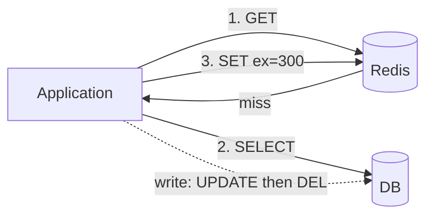
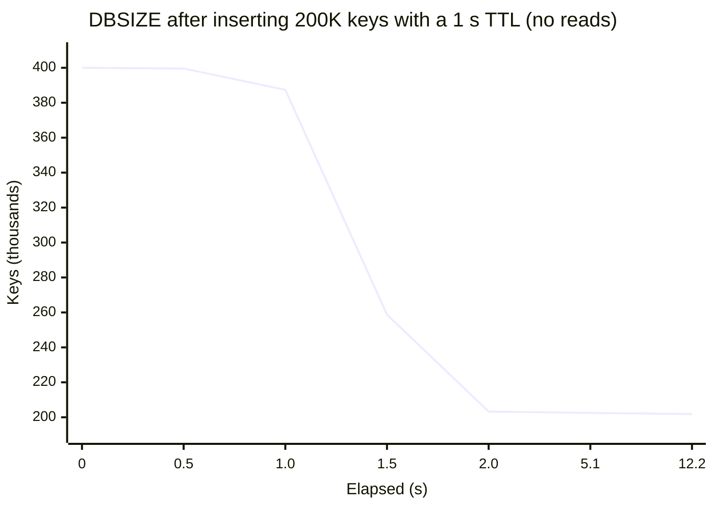
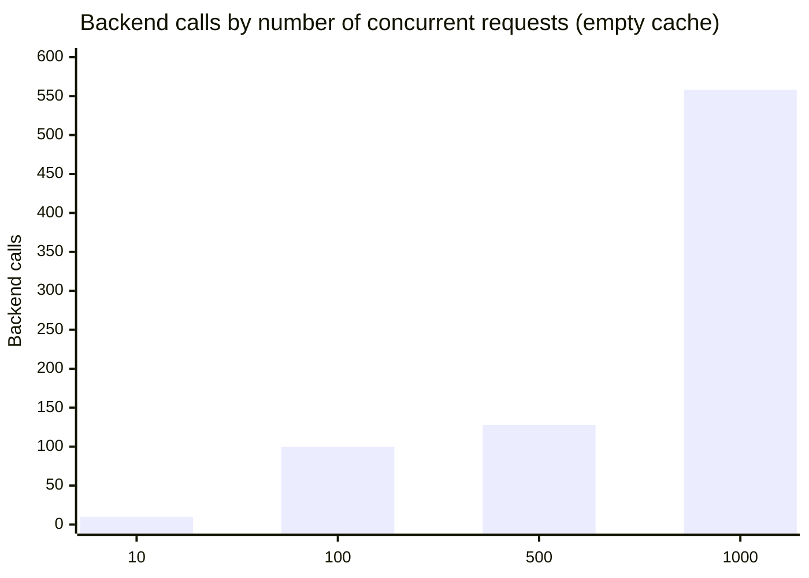

# A Field Guide to Redis Caching: Expiry, Eviction, and the Herd at the Door

> A cache is easy to add and hard to run. I read how expiry and eviction actually work in the Redis 6.2 source, then measured a cache stampede and approximate LRU. Interview glossary, quiz, and flash cards at the end.
> 2021-11-23 · https://alfex4936.github.io/blog/redis-cache-field-guide/

The first time you put a cache in front of something, the latency graph drops to the floor. You then spend the next few months fixing problems the cache caused. Expiries line up and knock the database over, requests for keys that do not exist sail straight through, and memory fills until writes stop.

This post walks through those problems one at a time and checks in the source how Redis handles each. The source is Redis 6.2.6; measurements were taken against the official Docker image of the same version with a Python client (redis-py), on an Apple Silicon laptop. The numbers come from that setup, so look at their shape more than their absolute values.

The first half covers cache patterns and how Redis does expiry and eviction. The second half goes through failure modes. At the end there is a glossary of interview terms and a quiz. I wrote it with backend engineers and people who run Redis in mind, but a frontend developer should be able to follow along.

## Where the cache goes

The patterns are named after the order in which you read and write.

**Cache-aside** (lazy loading) is the most common. The application checks the cache first; on a miss it reads the database and fills the cache. On a write it updates the database and deletes the cache key. If the cache dies, things get slower but keep working.

```python title="cache-aside"
def get_user(uid):
    v = r.get(f"user:{uid}")
    if v is not None:
        return json.loads(v)
    row = db.fetch_user(uid)               # cache miss
    r.set(f"user:{uid}", json.dumps(row), ex=300)
    return row

def update_user(uid, fields):
    db.update_user(uid, fields)
    r.delete(f"user:{uid}")                # delete, don't overwrite
```

Deleting instead of overwriting on write is deliberate. If two writes land almost together, the database can end with B as the last value while the cache ends with A. Deleting means the next read refetches from the database, so that ordering mix-up does not survive until the TTL.

A gap remains. A read fetches the old value from the database, a write then deletes the cache key, and the read puts the old value into the cache. That is why you always set a TTL, even a short one. The TTL is the longest a consistency bug can live.

**Read-through** does the same thing as cache-aside, but the cache layer (a library or proxy) does it for you. The application only talks to the cache.

**Write-through** updates the cache and the database synchronously on every write. Reads are always warm, but values that will never be read end up in the cache too.

**Write-behind** (write-back) writes to the cache first and flushes to the database later in batches. Writes are fast and database load drops, but if the cache dies you lose the writes that were not flushed. It suits values where losing a little is fine, like view counts or likes.



## Expiry: when does "delete" happen

`SET key value EX 60` makes Redis record the key and its expiry time (Unix milliseconds) in a separate hash table called `expires`. Nothing wakes up at the 60-second mark to remove the key. There are two ways it gets deleted.

### Lazy expiry

Every read or write of a key calls `expireIfNeeded` first.

<Walk>

```c title="src/db.c (Redis 6.2.6, comments removed)"
int expireIfNeeded(redisDb *db, robj *key) {
    if (!keyIsExpired(db,key)) return 0;

    if (server.masterhost != NULL) return 1;

    if (checkClientPauseTimeoutAndReturnIfPaused()) return 1;

    /* Delete the key */
    deleteExpiredKeyAndPropagate(db,key);
    return 1;
}
```

<Step lines="2">

If the expiry time has not passed, nothing happens. Most accesses stop on this line.

</Step>

<Step lines="4">

A replica only answers "expired" and does not delete. Keys on a replica are removed only by a `DEL` sent from the master, which keeps the two datasets from drifting apart. Reads see the key as missing, but its memory stays until the master deletes it.

</Step>

<Step lines="6">

While clients are paused (`CLIENT PAUSE`, during a failover) it does not delete either, because the dataset must stay unchanged.

</Step>

<Step lines="8-10">

On a master, it deletes the key and propagates a `DEL` (or `UNLINK`) to the AOF and the replicas.

</Step>

</Walk>

With only this, an expired key that nobody reads stays in memory forever.

### Active expiry

So the server samples the `expires` table periodically. That is `activeExpireCycle`. The constants sit at the top of `expire.c`.

| Constant | Value | Meaning |
|---|---|---|
| `KEYS_PER_LOOP` | 20 | Keys sampled per pass |
| `FAST_DURATION` | 1000µs | Time limit of the fast cycle that runs between event loop iterations |
| `SLOW_TIME_PERC` | 25 | Share of CPU the slow cycle in `serverCron` may use |
| `ACCEPTABLE_STALE` | 10 | If the expired share of a sample is below this, stop on this DB |

Raising `active-expire-effort` (default 1, max 10) increases the sample size and time limits and lowers the acceptable share. The core loop: sample 20, delete the expired ones, and if more than 10% were expired, sample again. Once it drops below 10%, move to the next DB. A DB whose `expires` table is less than 1% full is skipped entirely.

I checked that it really behaves like this. I inserted 200,000 keys with a 1-second TTL and 200,000 with a 1-hour TTL, read nothing, and watched `DBSIZE`. `hz` was the default 10.



Once the first second passed, 197,000 keys were gone within the next second. But after 2 seconds the curve goes flat. The remaining two thousand or so drained slowly, about 100 per second.

The reason is in the table above. With 2,000 expired keys among 200,000 live ones, the expired share of a 20-key sample is around 1%. That is below 10%, so the loop takes one look and leaves. Active expiry does not promise to delete every expired key. It promises to keep the expired share somewhere below about 10%. The `expired_stale_perc` field in `INFO stats` is that estimate; during the run it peaked at 28% and settled near 13%.

In production this shows up on the memory graph. If the key count dropped but `used_memory` did not come down as much as you expected, the difference may be expired keys nobody has touched yet.

## Eviction: when memory is full

When `maxmemory` is reached, Redis calls `performEvictions` to make room before running a command. What gets removed is decided by `maxmemory-policy`.

| Policy | Candidates | Rule |
|---|---|---|
| `noeviction` | none | Write commands get an OOM error |
| `allkeys-lru` / `volatile-lru` | all / keys with TTL | Least recently used |
| `allkeys-lfu` / `volatile-lfu` | all / keys with TTL | Least frequently used |
| `allkeys-random` / `volatile-random` | all / keys with TTL | Random |
| `volatile-ttl` | keys with TTL | Nearest expiry |

**The default is `noeviction`.** If you run Redis as a cache and leave this alone, every `SET` fails with `OOM command not allowed` the moment memory fills. Reads still work, so the outage is only half an outage and gets noticed late. The `volatile-*` policies also behave like `noeviction` when no key has a TTL.

### LRU is an approximation

True LRU needs a linked list ordering every key by access. That is two pointers, 16 bytes, per key, plus a list update on every read.

Instead, Redis writes the last access time, in seconds, into 24 bits of the key's object header. To evict, it picks `maxmemory-samples` keys at random (default 5), puts them into a candidate pool of size 16, and evicts the one in the pool that has been idle longest.

```c title="src/evict.c, evictionPoolPopulate (excerpt)"
if (server.maxmemory_policy & MAXMEMORY_FLAG_LRU) {
    idle = estimateObjectIdleTime(o);
} else if (server.maxmemory_policy & MAXMEMORY_FLAG_LFU) {
    idle = 255-LFUDecrAndReturn(o);
} else if (server.maxmemory_policy == MAXMEMORY_VOLATILE_TTL) {
    idle = ULLONG_MAX - (long)dictGetVal(de);
}
```

All three policies reduce to one rule: evict the highest idle score first. LFU inverts the frequency and TTL inverts the expiry time so they fit in the same pool.

I measured how much the sample count matters. I inserted 10 batches of 2,000 keys, 1.05 seconds apart, with memory capped at about half the total. Under ideal LRU every surviving key would be in the newer half.

<LruSampleViz lang="en" caption="Each bar is one batch of keys; older keys are to the left. Solid bars are keys that survived eviction." />

| `maxmemory-samples` | Survivors in the newer half |
|---|---|
| 1 | 53.6% |
| 3 | 84.5% |
| 5 (default) | 92.0% |
| 10 | 96.6% |
| ideal LRU | 100% |

One sample is just random eviction. Five already gets 92%, and ten comes close. The price is CPU for sampling more keys on each eviction. Unless the server is write-heavy and always at its memory limit, you will hardly notice, so if hit rate matters, 10 is worth a try.

### LFU counts in 8 bits

In LFU mode the same 24 bits are split in two. The high 16 bits hold the last decrement time in minutes, the low 8 bits the access count. Eight bits only reach 255, so instead of adding one per access, the counter goes up with a probability.

```c title="src/evict.c"
uint8_t LFULogIncr(uint8_t counter) {
    if (counter == 255) return 255;
    double r = (double)rand()/RAND_MAX;
    double baseval = counter - LFU_INIT_VAL;
    if (baseval < 0) baseval = 0;
    double p = 1.0/(baseval*server.lfu_log_factor+1);
    if (r < p) counter++;
    return counter;
}
```

A new key starts at 5 (`LFU_INIT_VAL`). Starting at 0 would make a freshly inserted key the first in line for eviction. The higher the value, the lower the chance of the next increment, so the counter grows roughly logarithmically. I ran `GET` on one key N times and read `OBJECT FREQ`.

| `lfu-log-factor` | 0 | 1 | 10 | 100 | 1K | 10K | 100K | 1M |
|---|---|---|---|---|---|---|---|---|
| 1 | 5 | 6 | 9 | 19 | 45 | 145 | 255 | 255 |
| 10 (default) | 5 | 6 | 6 | 10 | 21 | 45 | 148 | 255 |
| 100 | 5 | 6 | 6 | 7 | 9 | 18 | 50 | 162 |

At the default of 10, it takes a million accesses to reach 255, so a key read 10,000 times and one read 100,000 times can still be told apart. Drop the factor to 1 and it saturates by 100,000, and the truly popular keys all look the same.

It also has to go down. Yesterday's hot key should not sit at 255 today, so on access the counter is reduced by the minutes since the last decrement divided by `lfu-decay-time` (default 1 minute). A key nobody read for 10 minutes loses 10.

Which to pick depends on the access pattern. When a batch job scans the whole dataset once, LRU swaps the cache over to the scanned keys. Under LFU a key read once stays at 5 or 6, so the keys that were popular before hold on.

## Four ways a cache falls over

These are the names that come up in interviews over and over.

### 1. Cache stampede (thundering herd)

The moment a popular key expires, every request waiting on it sees a miss and goes to the database at once. If the query takes 200 ms, every request in those 200 ms runs the same query. Also called dog-piling.

I measured it. The backend was a function that sleeps for 200 ms, and I ran the cache-aside code above on many threads, held at a barrier so they all started at the same instant.



Up to 100 requests, every request hit the database. At 500 and 1000 there were fewer calls than requests, but not because anything fixed it. The first request filled the cache before all the Python threads got going. A real server takes requests from many processes on many machines, so it is worse.

**Fix 1: a lock.** Only one of the requests that missed goes to the database; the rest wait briefly and check the cache again.

```python title="lock + re-check"
RELEASE = r.register_script("""
if redis.call('get', KEYS[1]) == ARGV[1] then
  return redis.call('del', KEYS[1])
end
return 0
""")

def get_with_lock(key, load, ttl=60):
    while True:
        v = r.get(key)
        if v is not None:
            return v
        token = uuid4().hex
        if r.set(f"lock:{key}", token, nx=True, px=2000):
            try:
                v = r.get(key)             # check again
                if v is None:
                    v = load()
                    r.set(key, v, ex=ttl)
                return v
            finally:
                RELEASE(keys=[f"lock:{key}"], args=[token])
        time.sleep(0.02)
```

Two details matter here.

- If you release with a plain `DEL`, then after your lock outlives its 2-second `PX` and someone else takes it, you can delete their lock. So the lock holds a token, and a Lua script deletes it only if the token is still yours, in one step.
- Right after taking the lock, check the cache once more. A request that takes the lock just after the previous holder filled the cache and released it will hit the database again without this check. Without that line, 500 and 1000 requests produced 1 to 2 backend calls; with it, exactly 1 in both cases.

**Fix 2: refresh early.** If you refresh before expiry, there is no moment of expiry. XFetch (probabilistic early expiration) stores how long the value took to compute and has one request refresh early, with a probability that rises as expiry approaches[^1]. Without any lock, a single request ends up doing most refreshes. Another option is a background job that overwrites the value on a schedule while the TTL stays generous.

### 2. Cache penetration

If you keep asking for keys that are not in the database either, the cache never fills and every request goes to the database. It happens when a crawler walks nonexistent product IDs or an attacker sends random IDs.

- **Cache the absence too (negative caching).** If the database has nothing, store an empty marker with a short TTL. If the key is created later, the writer deletes the marker.
- **Put a Bloom filter in front.** Keep the set of existing IDs in a Bloom filter and drop the "definitely not there" requests before the cache lookup. A Bloom filter can give false positives but never false negatives, so when it says no, the answer really is no.
- Rejecting nonsense IDs (negative, out of range) with input validation is cheapest of all.

### 3. Cache avalanche

Many keys expire at the same moment. If you filled the cache all at once right after a deploy, or set a 24-hour TTL on everything in a nightly job, it all expires together at the next midnight. A stampede is one key; an avalanche is thousands at once. The same name is used when the Redis server itself dies and the whole cache goes empty.

- **Add jitter to TTLs.** Something like `ex=3600 + random.randint(0, 600)` spreads expiry over ten minutes. It is the cheapest fix and the most effective.
- For server death, set up failover with replicas and Sentinel (or Cluster), and put a circuit breaker or a concurrency limit in front of the database. That lets in only as much as the database can take while the cache is empty.

### 4. Hot keys and big keys

Redis runs commands one after another on a single thread. The I/O threads added in 6.0 (`io-threads`) only share socket reads and writes; commands still execute on the one main thread. So when requests pile onto one key (a hot key), only the shard holding it heats up, even in a cluster. Adding nodes does not help.

- Cache it again in application memory with a very short TTL (a local or near cache). With client-side caching in 6.0 (`CLIENT TRACKING`), the server sends an invalidation message when that key changes.
- If it is read-only, copy it into several keys like `hot:item:42:{0..7}` and read one at random.
- To find hot keys, use `redis-cli --hotkeys`. It reads LFU counters, so it only works under an LFU policy.

A big key is a hash with millions of fields or a string of hundreds of megabytes. The trouble comes when you delete it. Freeing millions of elements blocks the main thread, and every other command waits.

- Use `UNLINK` instead of `DEL`. It detaches the key from the keyspace right away and a background thread frees it. In the source, it only hands off to the background when the free cost (roughly the element count) exceeds 64 (`LAZYFREE_THRESHOLD`), because for small values the hand-off costs more.
- Expiry and eviction have the same problem. Turning on `lazyfree-lazy-expire` and `lazyfree-lazy-eviction` sends those to the background too. In 6.2 both default to `no`.
- To find big keys, use `redis-cli --bigkeys` or `MEMORY USAGE key`. Splitting them from the start is best.

## Persistence, even for a cache

"It's a cache, losing it is fine." But a restart starts from an empty cache, and that is an avalanche. So persistence settings matter even on a cache server.

- **RDB** forks a child process with `fork()` to write a snapshot. Parent and child share memory pages, and only pages the parent changes are copied (copy-on-write). On a write-heavy server, memory can approach double in the worst case during a snapshot, and the larger the dataset, the longer `fork()` itself takes.
- **AOF** logs write commands. `appendfsync everysec` is the default, so you can lose up to a second.
- **Replication** is asynchronous. The master acknowledges a write and then sends it to replicas, so if the master dies in between, that write is lost.

## Interview glossary

| Term | In one line |
|---|---|
| Cache-aside | App checks cache first, fills from DB on a miss. On write, update DB then delete the key |
| Write-through | Update cache and DB together, synchronously |
| Write-behind | Write to cache first, flush to DB asynchronously in batches |
| TTL | A key's remaining lifetime, and the longest a consistency bug can live |
| Lazy expiry | Check and delete an expired key when it is accessed |
| Active expiry | Sample 20 keys at a time to keep the expired share below about 10% |
| Approximate LRU | Evict the longest-idle key among 5 random samples |
| LFU counter | 8-bit logarithmic counter, starts at 5, decays per minute |
| `noeviction` | The default policy. Writes fail when memory is full |
| Stampede | Requests rush the DB the moment a popular key expires |
| Penetration | Lookups for nonexistent keys pass through the cache to the DB |
| Avalanche | Many keys expire at once, or the cache server goes empty |
| Hot key | One key gets so many requests that one shard overheats |
| Big key | A key large enough to block the main thread when deleted or sent |
| `UNLINK` | Detach the key now, free it in the background |
| Copy-on-write | During an RDB fork, only pages the parent changes are copied |

## Quiz

<Quiz lang="en" items={[
  {
    q: "You run Redis 6.2 with no config as a cache and it reaches `maxmemory`. What happens?",
    choices: ["It evicts the least recently used keys", "Write commands fail with an OOM error", "It evicts only keys with a TTL", "It spills to disk"],
    answer: 1,
    why: "The default `maxmemory-policy` is `noeviction`. Reads work, writes fail."
  },
  {
    q: "There are 200K keys with a 1 s TTL and nobody reads them. What is closest to the state 2 seconds later?",
    choices: ["All deleted, exactly", "None deleted", "Most deleted, but a few thousand linger for a while", "Redis stalls"],
    answer: 2,
    why: "Active expiry stops once the expired share of a sample is under 10%. The rest drain slowly."
  },
  {
    q: "With `maxmemory-samples` set to 1, approximate LRU becomes closest to what?",
    choices: ["Random eviction", "Exact LRU", "LFU", "FIFO"],
    answer: 0,
    why: "With one sample there is nothing to choose between. The measured newer-half share was 53.6%, about the same as random."
  },
  {
    q: "Why does the LFU counter start at 5 instead of 0?",
    choices: ["8-bit alignment", "So a newly inserted key is not evicted right away", "To avoid dividing by zero in the log", "To match replicas"],
    answer: 1,
    why: "Starting at 0, a new key would always have the lowest frequency and be an eviction candidate the moment it arrives."
  },
  {
    q: "In a stampede lock, why check the cache again after taking the lock?",
    choices: ["To confirm the lock was taken", "The previous holder may already have filled it", "To refresh the TTL", "To use a Lua script"],
    answer: 1,
    why: "If you take the lock right after the previous holder filled the cache and released it, you hit the DB again unless you check."
  },
  {
    q: "A nightly job sets a 24-hour TTL on every product key at midnight. What worries you most?",
    choices: ["Cache penetration", "Hot keys", "Cache avalanche", "Big keys"],
    answer: 2,
    why: "They all expire together at the next midnight. Add jitter to the TTL to spread them out."
  },
  {
    q: "You need to delete a hash with 5 million fields. Which command blocks the main thread least?",
    choices: ["`DEL`", "`EXPIRE key 0`", "`UNLINK`", "`FLUSHDB`"],
    answer: 2,
    why: "`UNLINK` detaches the key and hands the freeing to a background thread."
  },
  {
    q: "What happens when you `GET` an expired key on a replica?",
    choices: ["It returns the value", "It returns nil and deletes the key", "It returns nil but the key stays until the master's DEL arrives", "It returns an error"],
    answer: 2,
    why: "A replica decides expiry only to answer; deletion happens only via the `DEL` the master propagates."
  }
]} />

## Flash cards

Tap a card to flip it. Made for a quick pass the night before an interview.

<FlashCards lang="en" cards={[
  { front: "Write order in cache-aside", back: "Update the DB first, then delete the cache key. Don't overwrite." },
  { front: "Default `maxmemory-policy`", back: "`noeviction`. Writes fail when memory is full." },
  { front: "Default `maxmemory-samples`", back: "5. Raising it to 10 gets closer to ideal LRU." },
  { front: "Eviction candidate pool size", back: "16 (`EVPOOL_SIZE`)" },
  { front: "LFU counter size and start value", back: "8 bits, starts at 5. Grows by probability, decays per minute." },
  { front: "Keys sampled per active-expiry pass", back: "20. Repeats while more than 10% are expired." },
  { front: "Expired keys on a replica", back: "Answers nil but does not delete. Waits for the master's DEL." },
  { front: "Two stampede fixes", back: "A lock with a re-check, and refreshing before expiry (XFetch)" },
  { front: "Penetration fixes", back: "Cache the absence briefly, Bloom filter, input validation" },
  { front: "Avalanche fixes", back: "TTL jitter, high availability, concurrency limit in front of the DB" },
  { front: "When `UNLINK` frees in the background", back: "When the free cost exceeds 64 (`LAZYFREE_THRESHOLD`)" },
  { front: "What 6.0 I/O threads do", back: "Socket reads and writes only. Commands still run on the one main thread." }
]} />

## Summary

- With a cache, update the database, delete the cache key, and always set a TTL, even a short one.
- Expiry has two paths: delete on access, and periodic sampling. Sampling only keeps the expired share below about 10%, so some expired keys linger.
- The default eviction policy is `noeviction`. If Redis is a cache, change it.
- LRU is an approximation over 5 samples; in my run it kept 92% of survivors in the newer half, against 100% for ideal LRU. LFU uses an 8-bit logarithmic counter that takes a million accesses to saturate.
- Stampede: lock and re-check. Penetration: cache the absence and use a Bloom filter. Avalanche: TTL jitter. Big keys: `UNLINK`.

[^1]: Andrea Vattani, Flavio Chierichetti, Keegan Lowenstein, "Optimal Probabilistic Cache Stampede Prevention", VLDB 2015.
