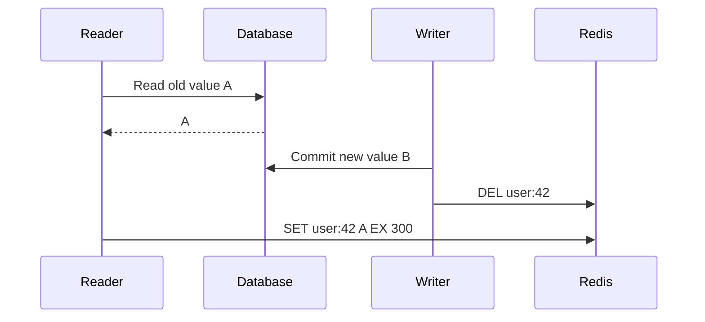
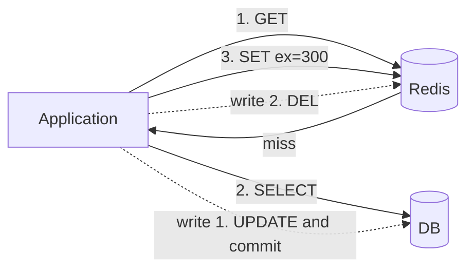
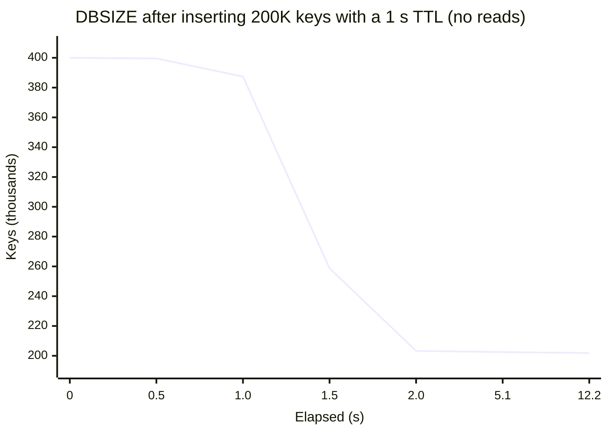
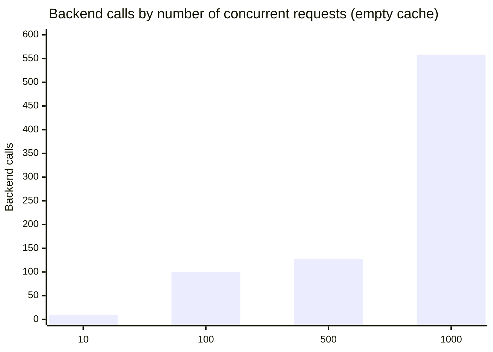
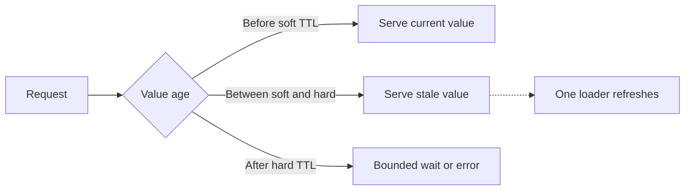

# A Field Guide to Redis Caching: Expiry, Eviction, and the Herd at the Door

> A cache is easy to add and hard to run. I read how expiry and eviction actually work in the Redis 6.2 source, then measured a cache stampede and approximate LRU. Interview glossary, quiz, and flash cards at the end.
> 2021-11-23 · https://alfex4936.github.io/blog/redis-cache-field-guide/

The first time you put a cache in front of something, the latency graph drops to the floor. You then spend the next few months fixing problems the cache caused. Expiries line up and knock the database over, requests for keys that do not exist sail straight through, and memory fills until writes stop.

This post walks through those problems one at a time and checks in the source how Redis handles each. The source is Redis 6.2.6; measurements were taken against the official Docker image of the same version with a Python client (redis-py), on an Apple Silicon laptop. The numbers come from that setup, so look at their shape more than their absolute values.

The first half covers cache patterns and how Redis does expiry and eviction. The second half goes through failure modes. At the end there is a glossary of interview terms and a quiz. I wrote it with backend engineers and people who run Redis in mind, but a frontend developer should be able to follow along.

## Where the cache goes

The patterns are named after the order in which you read and write.

With **cache-aside** (lazy loading), the application checks the cache first; on a miss it reads the database and fills the cache. On a write it commits the database transaction, then deletes the cache key. A path without the cache is possible, but the example below propagates Redis errors to its caller. Falling back to the database during an outage requires timeouts and a database concurrency limit.

```python title="cache-aside"
def get_user(uid):
    v = r.get(f"user:{uid}")
    if v is not None:
        return json.loads(v)
    row = db.fetch_user(uid)               # cache miss
    r.set(f"user:{uid}", json.dumps(row), ex=300)
    return row

def update_user(uid, fields):
    db.update_user(uid, fields)
    r.delete(f"user:{uid}")                # delete, don't overwrite
```

Deleting instead of overwriting on write is deliberate. If two writes land almost together, the database can end with B as the last value while the cache ends with A. Deleting means the next read refetches from the database, so that ordering mix-up does not survive until the TTL.

A gap remains. A read fetches the old value from the database, a write then deletes the cache key, and the read puts the old value into the cache.

<Walk>



<Step show="R,D,#1,#2">

The reader gets A. Reading the database and filling the cache are separate operations, so another request can run between them.

</Step>

<Step show="W,D,C,#3,#4">

The writer commits B and deletes the cache entry. It followed the intended commit-then-delete order.

</Step>

<Step show="R,C,#5">

The delayed reader inserts A again. The database holds B while the cache holds A.

</Step>

</Walk>

TTL bounds the lifetime of that last `SET`, not staleness measured from the database commit. A delayed read or a lagging database replica can insert the old value much later. Extending TTL on every read can keep it alive even longer.

For prices or permissions where stale reads are unacceptable, read the database or design a protocol that checks versions against the authoritative data. Record failed invalidations so they can be retried. An outbox records the invalidation event in the same database transaction as the update; CDC is another option. Both still need to handle delivery delay and out-of-order events.

<Quiz lang="en" title="Checkpoint: what TTL bounds" items={[
  {
    q: "After B is committed and the cache invalidated, a delayed reader inserts A with a 60-second TTL. Which statement is correct?",
    choices: ["Freshness is guaranteed within 60 seconds of the commit", "Lifetime is bounded from the delayed SET", "Commit-then-delete makes inserting A impossible"],
    answer: 1,
    why: "TTL starts at cache insertion. It does not automatically fix delayed database reads or stale replica data."
  }
]} />

**Read-through** does the same thing as cache-aside, but the cache layer (a library or proxy) does it for you. The application only talks to the cache.

**Write-through** updates the cache and database synchronously on every write. Written values enter the cache, but expiration and eviction can still cause misses. Two stores do not become one transaction; partial success needs a recovery policy.

**Write-behind** (write-back) writes to the cache first and flushes to the database later in batches. Writes are fast and database load drops, but if the cache dies you lose the writes that were not flushed. It suits values where losing a little is fine, like view counts or likes.



## Expiry: when does "delete" happen

`SET key value EX 60` makes Redis record the key and its expiry time (Unix milliseconds) in a separate hash table called `expires`. Nothing wakes up at the 60-second mark to remove the key. There are two ways it gets deleted.

### Lazy expiry

Ordinary key lookup paths check expiry with `expireIfNeeded`. A command such as `DBSIZE`, which reports the size of the keyspace, does not expire every key by visiting it.

<Walk>

```c title="src/db.c (Redis 6.2.6, comments removed)"
int expireIfNeeded(redisDb *db, robj *key) {
    if (!keyIsExpired(db,key)) return 0;

    if (server.masterhost != NULL) return 1;

    if (checkClientPauseTimeoutAndReturnIfPaused()) return 1;

    /* Delete the key */
    deleteExpiredKeyAndPropagate(db,key);
    return 1;
}
```

<Step lines="2">

If the expiry time has not passed, nothing happens. Most accesses stop on this line.

</Step>

<Step lines="4">

A replica only answers "expired" and does not delete. Keys on a replica are removed only by a `DEL` sent from the master, which keeps the two datasets from drifting apart. Reads see the key as missing, but its memory stays until the master deletes it.

</Step>

<Step lines="6">

While clients are paused (`CLIENT PAUSE`, during a failover) it does not delete either, because the dataset must stay unchanged.

</Step>

<Step lines="8-10">

On a master, it deletes the key and propagates a `DEL` (or `UNLINK`) to the AOF and the replicas.

</Step>

</Walk>

With only this, an expired key that nobody reads stays in memory forever.

### Active expiry

So the server samples the `expires` table periodically. That is `activeExpireCycle`. The constants sit at the top of `expire.c`.

| Constant | Value | Meaning |
|---|---|---|
| `KEYS_PER_LOOP` | 20 | Keys sampled per pass |
| `FAST_DURATION` | 1000µs | Time limit of the fast cycle that runs between event loop iterations |
| `SLOW_TIME_PERC` | 25 | Share of CPU the slow cycle in `serverCron` may use |
| `ACCEPTABLE_STALE` | 10 | If the expired share of a sample is below this, stop on this DB |

Raising `active-expire-effort` (default 1, max 10) increases work and time limits and lowers the acceptable share. Redis 6.2.6's [`activeExpireCycle`](https://github.com/redis/redis/blob/6.2.6/src/expire.c) scans hash buckets with a cursor. Its default target is 20 keys, but it finishes a bucket's collision chain, so that is not an exact count. It repeats when the expired share exceeds 10%, unless the time budget runs out. If the `expires` table has less than 1% bucket occupancy, it skips this pass until the table can shrink.

I checked that it really behaves like this. I inserted 200,000 keys with a 1-second TTL and 200,000 with a 1-hour TTL, read nothing, and watched `DBSIZE`. `hz` was the default 10.



Once the first second passed, 197,000 keys were gone within the next second. But after 2 seconds the curve goes flat. The remaining two thousand or so drained slowly, about 100 per second.

With 2,000 expired keys among 200,000 live ones, the overall expired share is around 1%. A pass finding a low share does not repeat, which can explain the slower tail. Sampling and time budgets do not guarantee that the actual expired share stays below 10%. The `expired_stale_perc` field in `INFO stats` is a smoothed estimate; during the run it peaked at 28% and settled near 13%.

Expired keys not yet deleted are included in `DBSIZE`. If the key count falls but process RSS stays high, the allocator may retain freed memory or leave fragmentation. Compare `used_memory`, `used_memory_rss`, and `lazyfree_pending_objects` to distinguish delayed expiry from delayed freeing.

## Eviction: when memory is full

When `maxmemory` is reached, Redis calls `performEvictions` to make room before running a command. What gets removed is decided by `maxmemory-policy`.

| Policy | Candidates | Rule |
|---|---|---|
| `noeviction` | none | Commands that may grow memory, such as `SET`, get an OOM error |
| `allkeys-lru` / `volatile-lru` | all / keys with TTL | Least recently used |
| `allkeys-lfu` / `volatile-lfu` | all / keys with TTL | Least frequently used |
| `allkeys-random` / `volatile-random` | all / keys with TTL | Random |
| `volatile-ttl` | keys with TTL | Nearest expiry |

The default policy is `noeviction`; the default `maxmemory` on a 64-bit server is 0, meaning unlimited. Set a limit for the policy to matter. If Redis cannot relieve an over-limit condition, the [OOM check in `server.c`](https://github.com/redis/redis/blob/6.2.6/src/server.c) rejects commands marked `denyoom`, such as `SET`. It does not reject every write: commands such as `DEL` can return space. A `volatile-*` policy cannot make space if there are no keys with TTLs.

### LRU is an approximation

True LRU needs a linked list ordering every key by access. That is two pointers, 16 bytes, per key, plus a list update on every read.

Instead, Redis writes the last access time, in seconds, into 24 bits of the key's object header. To evict, it picks `maxmemory-samples` keys at random (default 5), puts them into a candidate pool of size 16, and evicts the one in the pool that has been idle longest.

```c title="src/evict.c, evictionPoolPopulate (excerpt)"
if (server.maxmemory_policy & MAXMEMORY_FLAG_LRU) {
    idle = estimateObjectIdleTime(o);
} else if (server.maxmemory_policy & MAXMEMORY_FLAG_LFU) {
    idle = 255-LFUDecrAndReturn(o);
} else if (server.maxmemory_policy == MAXMEMORY_VOLATILE_TTL) {
    idle = ULLONG_MAX - (long)dictGetVal(de);
}
```

All three policies reduce to one rule: evict the highest idle score first. LFU inverts the frequency and TTL inverts the expiry time so they fit in the same pool.

I measured how much the sample count matters. I inserted 10 batches of 2,000 keys, 1.05 seconds apart, with memory capped at about half the total. Under ideal LRU every surviving key would be in the newer half.

<LruSampleViz lang="en" caption="Each bar is one batch of keys; older keys are to the left. Solid bars are keys that survived eviction." />

| `maxmemory-samples` | Survivors in the newer half |
|---|---|
| 1 | 53.6% |
| 3 | 84.5% |
| 5 (default) | 92.0% |
| 10 | 96.6% |
| ideal LRU | 100% |

In this run, one sample produced a result close to random eviction. It is still not the same algorithm as `allkeys-random`: [`evictionPoolPopulate`](https://github.com/redis/redis/blob/6.2.6/src/evict.c) retains earlier candidates for later choices. More samples compare more candidates at a CPU cost, so measure hit rate and latency together. These bars show measured results, not an animation of the eviction algorithm.

### LFU counts in 8 bits

In LFU mode the same 24 bits are split in two. The high 16 bits hold the last decrement time in minutes, the low 8 bits the access count. Eight bits only reach 255, so instead of adding one per access, the counter goes up with a probability.

```c title="src/evict.c"
uint8_t LFULogIncr(uint8_t counter) {
    if (counter == 255) return 255;
    double r = (double)rand()/RAND_MAX;
    double baseval = counter - LFU_INIT_VAL;
    if (baseval < 0) baseval = 0;
    double p = 1.0/(baseval*server.lfu_log_factor+1);
    if (r < p) counter++;
    return counter;
}
```

A new key starts at 5 (`LFU_INIT_VAL`). Starting at 0 would make a freshly inserted key the first in line for eviction. The higher the value, the lower the chance of the next increment, so the counter grows roughly logarithmically. I ran `GET` on one key N times and read `OBJECT FREQ`.

<div class="table-wrap">

| `lfu-log-factor` | 0 | 1 | 10 | 100 | 1K | 10K | 100K | 1M |
|---|---|---|---|---|---|---|---|---|
| 1 | 5 | 6 | 9 | 19 | 45 | 145 | 255 | 255 |
| 10 (default) | 5 | 6 | 6 | 10 | 21 | 45 | 148 | 255 |
| 100 | 5 | 6 | 6 | 7 | 9 | 18 | 50 | 162 |

</div>

In this run, with the default factor of 10, I observed 255 after a million reads. Increments are probabilistic; a million is not a fixed saturation threshold. Lowering the factor makes the counter grow faster, but saturated popular keys become harder to distinguish.

[`LFUDecrAndReturn`](https://github.com/redis/redis/blob/6.2.6/src/evict.c) lowers the score by elapsed minutes since the last access divided by `lfu-decay-time` (default 1 minute). There is no timer updating every key each minute. Access updates the stored value; eviction sampling also compares decayed scores. With the defaults, a key idle for 10 minutes loses up to 10 when evaluated, never falling below zero.

Which to pick depends on the access pattern. When a batch job scans the whole dataset once, LRU swaps the cache over to the scanned keys. Under LFU a key read once stays at 5 or 6, so the keys that were popular before hold on.

## Four ways a cache falls over

These are the names that come up in interviews over and over.

### 1. Cache stampede (thundering herd)

The moment a popular key expires, every request waiting on it sees a miss and goes to the database at once. If the query takes 200 ms, every request in those 200 ms runs the same query. Also called dog-piling.

I measured it. The backend was a function that sleeps for 200 ms, and I ran the cache-aside code above on many threads, held at a barrier so they all started at the same instant.



Up to 100 requests, every request hit the database. At 500 and 1000 there were fewer calls than requests, but not because anything fixed it. The first request filled the cache before all the Python threads got going. Production concurrency differs from this thread experiment, so it cannot predict exact call counts.

**Fix 1: a lock.** Only one of the requests that missed goes to the database; the rest wait briefly and check the cache again.

```python title="lock + re-check"
import math
import time
from uuid import uuid4

RELEASE = r.register_script("""
if redis.call('get', KEYS[1]) == ARGV[1] then
  return redis.call('del', KEYS[1])
end
return 0
""")

PUBLISH = r.register_script("""
if redis.call('get', KEYS[1]) ~= ARGV[1] then return 0 end
redis.call('set', KEYS[2], ARGV[2], 'EX', ARGV[3])
return 1
""")

def get_with_lock(key, load, ttl=60, wait=1.0):
    if type(ttl) is not int or ttl <= 0 or not math.isfinite(wait) or wait <= 0:
        raise ValueError("ttl must be a positive integer; wait must be positive")
    deadline = time.monotonic() + wait
    lock_key = f"{key}:lock"
    while time.monotonic() < deadline:
        v = r.get(key)
        if v is not None:
            return v
        token = uuid4().hex
        if r.set(lock_key, token, nx=True, px=2000):
            try:
                v = r.get(key)             # check again
                if v is None:
                    remaining = deadline - time.monotonic()
                    if remaining <= 0:
                        raise TimeoutError("cache fill deadline")
                    v = load(timeout=remaining)
                    if time.monotonic() >= deadline:
                        raise TimeoutError("cache fill deadline")
                    if not PUBLISH(keys=[lock_key, key],
                                   args=[token, v, ttl]):
                        raise TimeoutError("cache fill lease lost")
                return v
            finally:
                RELEASE(keys=[lock_key], args=[token])
        time.sleep(min(0.02, max(0, deadline - time.monotonic())))
    raise TimeoutError("cache fill wait expired")
```

Two details matter here.

- If you release with a plain `DEL`, then after your lock outlives its 2-second `PX` and someone else takes it, you can delete their lock. So the lock holds a token, and a Lua script deletes it only if the token is still yours, in one step.
- Right after taking the lock, check the cache once more. A request that takes the lock just after the previous holder filled the cache and released it will hit the database again without this check. Without that line, 500 and 1000 requests produced 1 to 2 backend calls; with it, exactly 1 in both cases.

The chart compares basic cache-aside with locking and a re-check. The code above adds a wait deadline and ownership-checked publication. It avoids unbounded waiting and prevents a loader that lost its lease from overwriting the cache later.

`r` is a redis-py client with finite connection and socket timeouts. `load(timeout=...)` must enforce that timeout in its database query or HTTP request. Python clock checks cannot cancel a function that never stops. Values are bytes or strings Redis can store directly. Redis and database errors propagate to the caller.

I checked the revised example with `npm run test:cache -- --docker` against Redis 6.2.6. The test executes the post's Python fence directly and evaluates its Lua in Redis. It checks concurrent misses, empty-value hits, wait deadlines, ownership loss, database errors, rejection of late results, and OOM behaviour, and compares the Korean and English examples' ASTs. These checks were run when revising the post, separately from the original measurements above.

In Cluster, both Lua keys must share a slot. A value key of `{user:42}:value` produces a lock key of `{user:42}:value:lock`, using the same hash tag. Lease expiry, lock-key eviction, or failover can allow overlapping loaders. This lock reduces duplicate cache fills. It does not provide exactly-once payments or inventory updates; use database transactions and idempotency keys for those.

<Quiz lang="en" title="Checkpoint: a loader loses its lease" items={[
  {
    q: "The loader pauses until its lock expires. Does its token still give it exclusive access?",
    choices: ["Yes; tokens guarantee indefinite exclusivity", "No; another loader can take the lock", "Yes; database transactions are joined automatically"],
    answer: 1,
    why: "A token prevents deleting another owner's lock. The code checks ownership at publication too, but cannot guarantee no overlapping database reads."
  }
]} />

**Fix 2: refresh early.** XFetch (probabilistic early expiration) stores how long the value took to compute and increases the chance of an early refresh as expiry approaches[^1]. It reduces clumping without guaranteeing exactly one refresher. Scheduled background warming can fail or run late too, so keep a path for requests after expiry.

### Serve something slightly old instead of waiting

For data such as a news list, separate soft TTL from hard TTL. Before the soft deadline, serve the value. Between soft and hard, serve the old value while one loader refreshes it. After hard expiry, stop using the old value and choose bounded waiting or an error. This is stale-while-revalidate.



Use Redis `EX` for the hard TTL and put the soft deadline in the value's metadata. Do not automatically extend hard TTL after a failed refresh. This policy is inappropriate for reads such as permission revocation where staleness is dangerous. Apply the same freshness budget to local caches so multiple layers do not keep extending stale data.

### 2. Cache penetration

If you keep asking for keys that are not in the database either, the cache never fills and every request goes to the database. It happens when a crawler walks nonexistent product IDs or an attacker sends random IDs.

- **Cache the absence too (negative caching).** If the database has nothing, store an empty marker with a short TTL. If the key is created later, the writer deletes the marker.
- **Put a Bloom filter in front.** Inserted elements have no false negatives. But if a newly created database ID has not reached the filter, it can reject a valid request. Trust "definitely absent" only after initial population and updates have caught up. If the filter is not ready, use a concurrency-limited database path. The structure is covered in [Bloom versus cuckoo filters](/blog/cuckoo-vs-bloom/).
- Rejecting nonsense IDs (negative, out of range) with input validation is cheapest of all.

### 3. Cache avalanche

Many keys expire at the same moment. If you filled the cache all at once right after a deploy, or set a 24-hour TTL on everything in a nightly job, it all expires together at the next midnight. A stampede is one key; an avalanche is thousands at once. The same name is used when the Redis server itself dies and the whole cache goes empty.

- Add jitter to TTLs. The illustrative `ex=3600 + random.randint(0, 600)` spreads expiry over ten minutes. Use it only for data that tolerates a maximum TTL of 4,200 seconds.
- For server death, set up failover with replicas and Sentinel (or Cluster), and put a circuit breaker or a concurrency limit in front of the database. That lets in only as much as the database can take while the cache is empty.

### 4. Hot keys and big keys

Redis runs commands one after another on a single thread. The I/O threads added in 6.0 (`io-threads`) only share socket reads and writes; commands still execute on the one main thread. So when requests pile onto one key (a hot key), only the shard holding it heats up, even in a cluster. Adding nodes does not help.

- Cache it again in application memory with a very short TTL (a local or near cache). With client-side caching in 6.0 (`CLIENT TRACKING`), the server sends an invalidation message when that key changes. If a disconnect loses invalidations, recovery must discard or stop trusting the local cache. Keyspace notifications are not a replayable event log either; connection loss belongs in the consistency design.
- For read-only data, copy it into keys in different slots, such as `hot:item:42:copy:0` and `hot:item:42:copy:1`, and read one at random. Giving every copy the same `{item:42}` hash tag leaves them in the same slot and does not spread load across shards. Copies also increase update and invalidation work.
- To find hot keys, use `redis-cli --hotkeys`. It reads LFU counters, so it only works under an LFU policy.

A big key is a hash with millions of fields or a string of hundreds of megabytes. The trouble comes when you delete it. Freeing millions of elements blocks the main thread, and every other command waits.

- Use `UNLINK` instead of `DEL`. It detaches the key immediately, then [`lazyfree.c`](https://github.com/redis/redis/blob/6.2.6/src/lazyfree.c) evaluates the freeing cost. It hands off only when effort exceeds 64 (`LAZYFREE_THRESHOLD`) and the reference count is 1. It helps structures with many allocations, such as a large hash. Strings and single-allocation encodings have effort 1, so a large byte size alone does not cause asynchronous freeing.
- Expiry and eviction have the same problem. Turning on `lazyfree-lazy-expire` and `lazyfree-lazy-eviction` sends those to the background too. In 6.2 both default to `no`.
- To find big keys, use `redis-cli --bigkeys` or `MEMORY USAGE key`. Splitting them from the start is best.

`--bigkeys` scans the keyspace with `SCAN`, so limit its rate while watching production load. Avoid diagnosing with `KEYS *` or reading an entire large hash with `HGETALL`. `UNLINK` addresses freeing work; it does not remove the cost of serializing and sending a huge response.

## Persistence, even for a cache

"It's a cache, losing it is fine." But a restart starts from an empty cache, and that is an avalanche. So persistence settings matter even on a cache server.

- **RDB** forks a child process with `fork()` to write a snapshot. Parent and child share memory pages, and only pages the parent changes are copied (copy-on-write). On a write-heavy server, memory can approach double in the worst case during a snapshot, and the larger the dataset, the longer `fork()` itself takes.
- **AOF** logs write commands. The [Redis 6.2.6 configuration](https://github.com/redis/redis/blob/6.2.6/redis.conf) defaults to `appendonly no`. Once AOF is enabled, the default fsync policy is `everysec`; normally plan for roughly a second of data loss. Disk or fsync stalls mean that is not a strict upper bound.
- **Replication** is asynchronous. A successful write reply does not mean replicas have received it or a disk fsync completed. Failover can lose acknowledged writes. Waiting for replica acknowledgements with `WAIT` still does not turn Redis into a consensus store or guarantee disk durability.

## Set budgets before setting TTLs

A product description may tolerate delay; a payment amount may not. Decide the allowed staleness, request deadline, and load the database can accept without the cache for each kind of data. TTL follows those decisions.

TTL jitter must stay within the freshness limit. If an example allows at most 300 seconds, `300 + random.randint(0, 60)` can reach 360 and break that limit. Use a bounded range such as `random.randint(240, 300)`. These are illustrative budget assumptions, not measurements.

Include every input that changes the result in the cache key. The same user ID can yield different responses by tenant, language, or authorization scope. Change the namespace when serialization changes, for example `user:v2:...`. Returning another user's response is not fixed by a short TTL.

Negative entries must distinguish absence from an empty string, an empty list, and a Redis miss. Converting a failed database query into "not found" caches an outage as a normal response. Check the path that removes a negative entry when data is created.

Distinguish single-flight, which combines loaders, from pipelining, which batches commands. A pipeline sends multiple Redis commands without waiting for a round trip after each one. It is not a transaction and does not resolve another client's update between `GET` and `SET`. Bound the batch size so response memory and waiting do not grow without limit.

<Quiz lang="en" title="Checkpoint: fewer round trips, but atomic?" items={[
  {
    q: "You pipeline GET and SET. Does that eliminate races with another request?",
    choices: ["Yes; a pipeline is a transaction", "No; it reduces round-trip waits without guaranteeing atomicity", "Yes; the cache TTL is locked automatically"],
    answer: 1,
    why: "Atomic comparison and mutation require Lua or an appropriate transaction protocol. Pipelining addresses transport waits."
  }
]} />

A simple load model is

$$
Q_{\mathrm{DB}} \approx Q_{\mathrm{read}}(1-h)
$$

Assume 10,000 reads per second. A 99% hit rate yields about 100 database queries; 90% yields about 1,000. These are substitutions into the model, assuming one database query per miss. Retries, refreshes, local caching, and writes are excluded. A modest-looking hit-rate drop can multiply database load.

An average hit rate alone is insufficient. Many cheap hits and a few expensive misses can still overload the database. Compare misses and backend cost by endpoint before changing memory or TTL. Look for cache pollution from results that are stored but never read again.

## What to inspect during an outage

```bash title="Inspection commands for Redis 6.2.6"
redis-cli INFO stats
redis-cli INFO memory
redis-cli INFO replication
redis-cli INFO persistence
redis-cli CONFIG GET maxmemory
redis-cli CONFIG GET maxmemory-policy
redis-cli SLOWLOG GET 20
redis-cli LATENCY LATEST
```

`LATENCY LATEST` shows events collected with `latency-monitor-threshold` enabled. An empty result is not proof of no latency. `SLOWLOG` measures command execution, not the full network round trip or client wait. Production ACLs may disallow `CONFIG GET`.

| Observation | Check alongside it | Decision |
|---|---|---|
| Rising `keyspace_misses` | Request volume, `expired_keys`, `evicted_keys`, endpoint misses | Separate expiry, eviction, and nonexistent lookups |
| Rising `evicted_keys` | `maxmemory`, memory usage, hit rate | Eviction can be normal for a cache; investigate when hits collapse |
| `SET` returns OOM | Limit, policy, TTL candidates, actual error | Inspect available space and policy instead of blindly retrying |
| RSS stays high | `used_memory`, `mem_fragmentation_ratio`, `lazyfree_pending_objects` | Separate live data, allocator retention, and pending frees |
| Redis is fast but the app is slow | Pool waits, round trips, payload size, DB misses | Command time is only part of the request |
| Miss surge after failover | Replication lag, cold cache, DB concurrency | Restore the cache while protecting the database |

`INFO stats` hits and misses are cumulative. Compute `Δhits / (Δhits + Δmisses)` over the same interval; if the denominator is zero, do not calculate a hit rate. This is a Redis lookup statistic, not local-cache hits or the application's overall request hit rate.

`maxmemory` is not an absolute limit on process RSS or container memory. Redis 6.2.6's [`freeMemoryGetNotCountedMemory`](https://github.com/redis/redis/blob/6.2.6/src/evict.c) excludes AOF and replica output buffers from eviction accounting. Allocator slack and RDB copy-on-write need room too. Filling data up to the container limit can let the OS kill Redis before eviction has a chance to help.

Sending every timed-out request to the database can turn a cache outage into a database outage. Set connection and read timeouts, bounded retries, and a backend concurrency limit together. A circuit breaker stops repeatedly sending work down a failing path; an allowed stale response is another option. Avoid unlimited fallback for every endpoint.

After recovery, warm popular data first at a limited rate. TTL jitter spreads expiry times, single-flight combines loaders for the same key, and concurrency limits protect the database even from misses for different keys. Each limits a different source of work.

## Interview glossary

| Term | In one line |
|---|---|
| Cache-aside | App checks cache first, fills from DB on a miss. On write, update DB then delete the key |
| Write-through | Update cache and DB together, synchronously |
| Write-behind | Write to cache first, flush to DB asynchronously in batches |
| TTL | Lifetime from cache insertion, not a staleness bound from the database commit |
| Lazy expiry | Check and delete an expired key when it is accessed |
| Active expiry | Default target of 20 keys; repeat based on expired share and time budget |
| Approximate LRU | Refill a candidate pool with a default sample count of 5; evict an idle candidate |
| LFU counter | 8-bit logarithmic counter, starts at 5, decays per minute |
| `noeviction` | Default policy; reject `denyoom` commands such as `SET` if space is insufficient |
| Stampede | Requests rush the DB the moment a popular key expires |
| Penetration | Lookups for nonexistent keys pass through the cache to the DB |
| Avalanche | Many keys expire at once, or the cache server goes empty |
| Hot key | One key gets so many requests that one shard overheats |
| Big key | A key large enough to block the main thread when deleted or sent |
| `UNLINK` | Detach now, choose asynchronous freeing by effort and reference count |
| Copy-on-write | During an RDB fork, only pages the parent changes are copied |

## Quiz

<Quiz lang="en" items={[
  {
    q: "You set `maxmemory` on Redis 6.2 and keep the default policy. It cannot relieve the over-limit condition. What happens?",
    choices: ["It evicts the least recently used keys", "`denyoom` commands such as `SET` fail with OOM", "Every command fails", "It spills to disk"],
    answer: 1,
    why: "The default policy is `noeviction`. It does not reject space-reducing commands such as `DEL`. The default `maxmemory` of 0 means unlimited."
  },
  {
    q: "Active expiry removes keys that nobody reads. What does the source establish?",
    choices: ["Every key is deleted at its deadline", "The expired share is always at most 10%", "Work is controlled by observed expired share and time budgets", "Exactly 20 keys are always deleted per pass"],
    answer: 2,
    why: "It scans buckets with a cursor and checks a time limit. Targets and thresholds do not guarantee an exact deletion time or remaining expired share."
  },
  {
    q: "Is `maxmemory-samples=1` the same algorithm as `allkeys-random`?",
    choices: ["No; earlier candidates remain in a pool", "Yes; the source is identical", "Yes; no access time is recorded", "No; it becomes exact LRU"],
    answer: 0,
    why: "Similar measured outcomes do not make algorithms identical. LRU uses access times and retained candidates."
  },
  {
    q: "Why does the LFU counter start at 5 instead of 0?",
    choices: ["8-bit alignment", "So a newly inserted key is not evicted right away", "To avoid dividing by zero in the log", "To match replicas"],
    answer: 1,
    why: "Starting at 0, a new key would always have the lowest frequency and be an eviction candidate the moment it arrives."
  },
  {
    q: "In a stampede lock, why check the cache again after taking the lock?",
    choices: ["To confirm the lock was taken", "The previous holder may already have filled it", "To refresh the TTL", "To use a Lua script"],
    answer: 1,
    why: "If you take the lock right after the previous holder filled the cache and released it, you hit the DB again unless you check."
  },
  {
    q: "A nightly job sets a 24-hour TTL on every product key at midnight. What worries you most?",
    choices: ["Cache penetration", "Hot keys", "Cache avalanche", "Big keys"],
    answer: 2,
    why: "They all expire together at the next midnight. Add jitter to the TTL to spread them out."
  },
  {
    q: "You need to delete a hash with 5 million fields. Which command blocks the main thread least?",
    choices: ["`DEL`", "`EXPIRE key 0`", "`UNLINK`", "`FLUSHDB`"],
    answer: 2,
    why: "`UNLINK` detaches the key and hands the freeing to a background thread."
  },
  {
    q: "What happens when you `GET` an expired key on a replica?",
    choices: ["It returns the value", "It returns nil and deletes the key", "It returns nil but the key stays until the master's DEL arrives", "It returns an error"],
    answer: 2,
    why: "A replica decides expiry only to answer; deletion happens only via the `DEL` the master propagates."
  },
  {
    q: "Should permission checks immediately after revocation use stale-while-revalidate?",
    choices: ["Every cache tolerates stale data", "If stale authorization is forbidden, check current permissions", "A hard TTL guarantees instant revocation", "Just extend the soft TTL"],
    answer: 1,
    why: "Freshness requirements depend on the data. Old news and revoked permissions cannot share the same stale-response policy."
  },
  {
    q: "In an example with a maximum allowed TTL of 300 seconds, which expression spreads expiry safely?",
    choices: ["`300 + random.randint(0, 60)`", "`random.randint(240, 300)`", "`300 + random.randint(0, 300)`", "Extend TTL indefinitely on every hit"],
    answer: 1,
    why: "It stays within the 300-second limit. Adding positive jitter can exceed the allowed freshness budget."
  },
  {
    q: "A product exists in the database but its Bloom filter update is delayed. Can trusting 'absent' cause trouble?",
    choices: ["No; it is always safe", "Yes; a valid request can be rejected", "Redis updates the filter automatically", "Only false positives can increase"],
    answer: 1,
    why: "No false negatives applies to inserted elements. Database-to-filter update lag is a separate problem."
  },
  {
    q: "You copy a hot key to `hot:{item:42}:0` and `hot:{item:42}:1`. Does that spread Cluster load?",
    choices: ["They always go to different shards", "The same hash tag keeps them in one slot", "Names do not affect slots", "Replicas automatically distribute every read"],
    answer: 1,
    why: "An identical hash tag means an identical slot. Place copies across slots and design their update path."
  },
  {
    q: "Every request that times out on Redis falls back to the database. What protection is needed first?",
    choices: ["Unlimited retries", "Database concurrency limits and request deadlines", "Remove every TTL", "Check only average hit rate"],
    answer: 1,
    why: "The database inherits the cache's load. Bound fallback and serve allowed stale data or explicit errors for excess work."
  }
]} />

## Flash cards

Tap a card to flip it. Made for a quick pass the night before an interview.

<FlashCards lang="en" cards={[
  { front: "Write order in cache-aside", back: "Update the DB first, then delete the cache key. Don't overwrite." },
  { front: "Default `maxmemory-policy`", back: "`noeviction`. Rejects denyoom commands over the limit; the default limit 0 means unlimited." },
  { front: "Default `maxmemory-samples`", back: "5. Raising it to 10 gets closer to ideal LRU." },
  { front: "Eviction candidate pool size", back: "16 (`EVPOOL_SIZE`)" },
  { front: "LFU counter size and start value", back: "8 bits, starts at 5. Grows by probability, decays per minute." },
  { front: "Default active-expiry target", back: "20 keys, possibly more to finish a bucket chain. Repetition depends on expired share and time." },
  { front: "Expired keys on a replica", back: "Answers nil but does not delete. Waits for the master's DEL." },
  { front: "Two stampede fixes", back: "A lock with a re-check, and refreshing before expiry (XFetch)" },
  { front: "Penetration fixes", back: "Cache the absence briefly, Bloom filter, input validation" },
  { front: "Avalanche fixes", back: "TTL jitter, high availability, concurrency limit in front of the DB" },
  { front: "When `UNLINK` frees asynchronously", back: "Effort above 64 and reference count 1. Even large strings have effort 1." },
  { front: "What 6.0 I/O threads do", back: "Socket reads and writes only. Commands still run on the one main thread." },
  { front: "Soft TTL versus hard TTL", back: "After soft: serve stale and refresh. After hard: stop serving the old value." },
  { front: "What TTL does not guarantee", back: "Freshness from the database commit. A delayed reader can reinsert an old value." },
  { front: "Protect the DB when Redis fails", back: "Finite timeouts and retries, backend concurrency limits, and allowed stale responses." }
]} />

## Summary

- With a cache, update the database, delete the cache key, and always set a TTL, even a short one.
- Expiry is handled in lookup paths and active scans. Time budgets can leave expired keys around for a while.
- Set the memory limit and eviction policy together. Under default `noeviction`, insufficient space makes `SET` fail.
- LRU uses a candidate pool; LFU uses a probabilistic counter. Measured survivor shares and saturation counts are not guarantees.
- Same-key misses, absent-key requests, mass expiry, and large-object freeing need different protections. TTL and one lock do not solve all of them.
- Set freshness and wait budgets, and protect the database. After the exercises, draw the failure path of an actual service.

[^1]: Andrea Vattani, Flavio Chierichetti, Keegan Lowenstein, "Optimal Probabilistic Cache Stampede Prevention", VLDB 2015.
