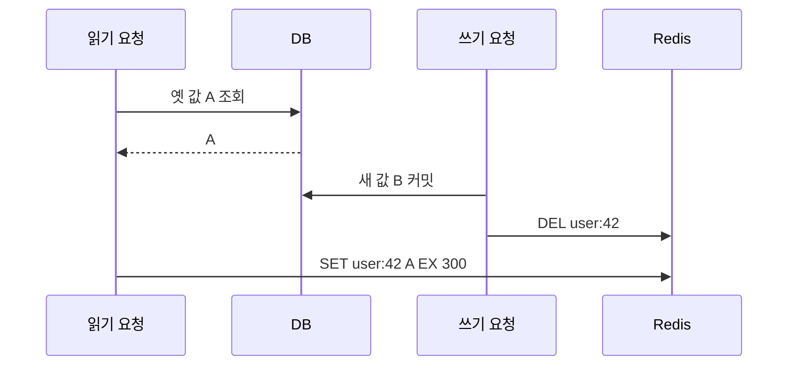
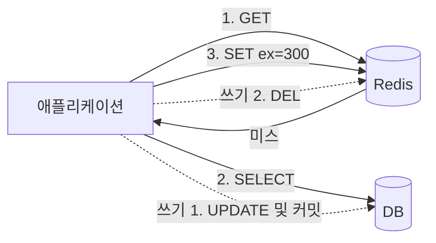
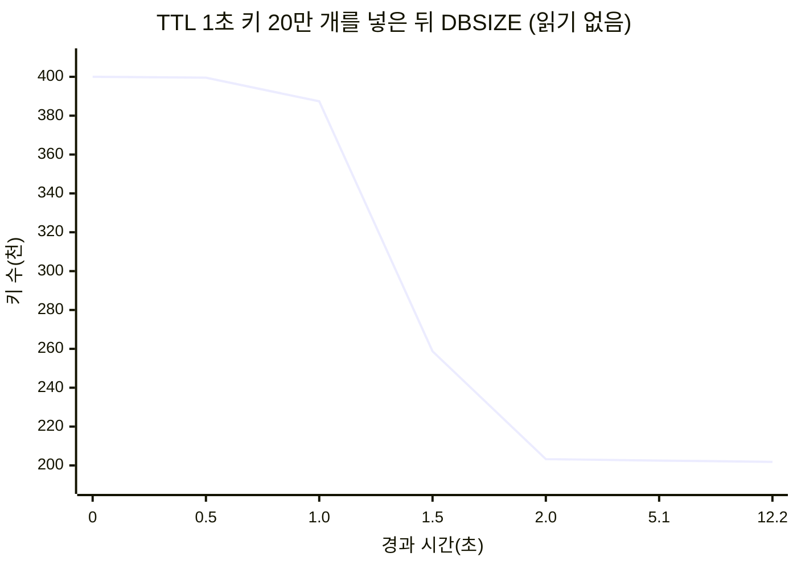
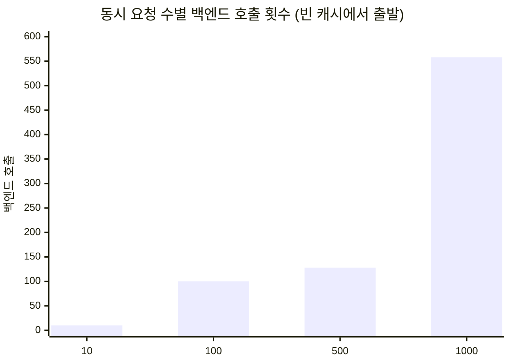
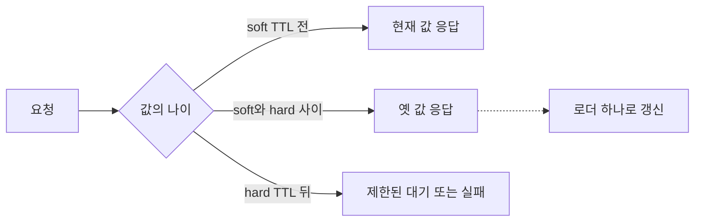

# Redis 캐시 현장 안내서: 만료, 축출, 그리고 한꺼번에 몰려오는 요청

> 캐시는 붙이기 쉽고 운영하기 어렵습니다. Redis 6.2 소스에서 만료와 축출이 실제로 어떻게 돌아가는지 읽고, 캐시 스탬피드와 근사 LRU를 직접 재 봤습니다. 끝에 면접 용어 정리와 퀴즈, 플래시카드가 있습니다.
> 2021-11-23 · https://alfex4936.github.io/blog/redis-cache-field-guide/

캐시를 처음 붙이면 응답 시간 그래프가 바닥으로 내려갑니다. 그다음 몇 달은 그 캐시 때문에 생긴 문제를 고치면서 보냅니다. 만료가 몰려 DB가 넘어가고, 없는 키를 계속 묻는 요청이 캐시를 그냥 통과하고, 메모리가 차서 쓰기가 막힙니다.

이 글은 그런 문제를 하나씩 보고, Redis가 각각을 어떻게 다루는지 소스에서 확인합니다. 소스는 Redis 6.2.6이고, 측정은 같은 버전의 공식 Docker 이미지에서 Python 클라이언트(redis-py)로 했습니다. 환경은 Apple Silicon 노트북입니다. 숫자는 이 환경에서 나온 것이니 절댓값보다 모양을 보시면 됩니다.

앞부분은 캐시 패턴과 Redis의 만료, 축출 구조를 다루고, 뒷부분은 장애 유형별로 정리합니다. 마지막에 면접에서 자주 나오는 용어와 퀴즈가 있습니다. 백엔드 개발자와 Redis를 운영하는 분을 생각하고 썼지만, 프런트엔드 개발자가 읽어도 따라올 수 있게 썼습니다.

## 캐시를 어디에 끼우는가

캐시를 읽고 쓰는 순서에 따라 이름이 붙습니다.

**Cache-aside**(lazy loading)에서는 애플리케이션이 캐시를 먼저 보고, 없으면 DB에서 읽어 캐시에 넣습니다. 쓸 때는 DB 트랜잭션을 커밋한 뒤 캐시 키를 지웁니다. 캐시 없이도 읽을 경로를 만들 수 있지만, 아래 예제는 Redis 오류를 그대로 호출자에게 전달합니다. 장애 시 DB로 우회하려면 타임아웃과 DB 동시성 제한을 함께 설계해야 합니다.

```python title="cache-aside"
def get_user(uid):
    v = r.get(f"user:{uid}")
    if v is not None:
        return json.loads(v)
    row = db.fetch_user(uid)               # 캐시 미스
    r.set(f"user:{uid}", json.dumps(row), ex=300)
    return row

def update_user(uid, fields):
    db.update_user(uid, fields)
    r.delete(f"user:{uid}")                # 덮어쓰지 않고 지운다
```

쓸 때 캐시를 새 값으로 덮어쓰지 않고 지우는 데는 이유가 있습니다. 두 요청이 거의 동시에 쓰면 DB에는 B가 마지막으로 남았는데 캐시에는 A가 마지막으로 남을 수 있습니다. 지우면 다음 읽기가 DB에서 다시 가져오니 이런 순서 꼬임이 TTL까지 남지 않습니다.

그래도 틈은 남습니다. 읽기가 DB에서 옛 값을 가져온 직후 쓰기가 캐시를 지우고, 그다음 읽기가 옛 값을 캐시에 넣는 순서입니다.

<Walk>



<Step show="R,D,#1,#2">

읽기 요청이 A를 얻었습니다. DB 조회와 캐시 채우기는 별도 작업이므로, 그 사이 다른 요청이 들어올 수 있습니다.

</Step>

<Step show="W,D,C,#3,#4">

쓰기 요청은 B를 커밋하고 캐시를 지웁니다. DB 갱신 후 삭제 순서를 지켰습니다.

</Step>

<Step show="R,C,#5">

늦게 끝난 읽기가 A를 다시 넣습니다. DB에는 B, 캐시에는 A가 남습니다.

</Step>

</Walk>

TTL은 이 마지막 `SET`부터 옛 값이 남는 시간을 제한합니다. DB 커밋부터의 정합성 상한은 아닙니다. DB 읽기가 지연되거나 레플리카가 뒤처지면 옛 값이 늦게 들어갈 수 있고, 읽을 때마다 TTL을 늘리면 계속 살아남을 수도 있습니다.

가격이나 권한처럼 옛 값을 허용하기 어려운 읽기는 DB를 확인하거나, 캐시와 DB의 버전을 비교하는 별도 프로토콜이 필요합니다. 무효화 실패는 재시도할 수 있도록 남깁니다. DB 커밋과 무효화 이벤트 기록을 같은 트랜잭션에 넣는 outbox나 CDC도 방법이지만, 이벤트를 처리하기 전까지의 지연과 순서 역전은 여전히 다뤄야 합니다.

<Quiz title="잠깐 확인: TTL이 보장하는 범위" items={[
  {
    q: "B를 커밋하고 캐시를 지운 뒤, 늦은 읽기가 A를 TTL 60초로 넣었습니다. 어느 설명이 맞나요?",
    choices: ["DB 커밋부터 60초 안에 항상 최신입니다", "늦은 SET부터 수명을 제한합니다", "쓰기 순서만 지키면 A는 들어갈 수 없습니다"],
    answer: 1,
    why: "TTL은 캐시 저장부터 셉니다. 지연된 DB 읽기나 레플리카의 옛 값까지 자동으로 해결하지 않습니다."
  }
]} />

**Read-through**는 cache-aside와 같은 일을 캐시 계층(라이브러리나 프록시)이 대신 합니다. 애플리케이션은 캐시만 봅니다.

**Write-through**는 쓸 때 캐시와 DB를 둘 다 동기로 고칩니다. 쓴 값은 캐시에 들어가지만, 만료나 축출 뒤에는 다시 미스가 납니다. 두 저장소가 하나의 트랜잭션이 되는 것도 아닙니다. 한쪽만 성공했을 때의 복구 순서가 필요합니다.

**Write-behind**(write-back)는 캐시에 먼저 쓰고 DB 반영은 나중에 모아서 합니다. 쓰기가 빠르고 DB 부하가 줄지만, 캐시가 죽으면 반영 안 된 쓰기를 잃습니다. 조회수나 좋아요 수처럼 조금 잃어도 되는 값에 씁니다.



## 만료: 지운다는 것이 언제인가

`SET key value EX 60`을 하면 Redis는 키 공간과 별도로 `expires`라는 해시 테이블에 키와 만료 시각(밀리초 유닉스 시간)을 적습니다. 60초가 지나는 순간 무언가가 키를 지워 주지는 않습니다. 지우는 길은 두 가지입니다.

### 게으른 만료

일반 키 조회 경로는 `expireIfNeeded`로 만료 여부를 확인합니다. `DBSIZE`처럼 키 공간의 크기를 보는 명령이 모든 키를 하나씩 만료시키는 것은 아닙니다.

<Walk>

```c title="src/db.c (Redis 6.2.6, 주석 생략)"
int expireIfNeeded(redisDb *db, robj *key) {
    if (!keyIsExpired(db,key)) return 0;

    if (server.masterhost != NULL) return 1;

    if (checkClientPauseTimeoutAndReturnIfPaused()) return 1;

    /* Delete the key */
    deleteExpiredKeyAndPropagate(db,key);
    return 1;
}
```

<Step lines="2">

만료 시각이 지나지 않았으면 아무 일도 없습니다. 대부분의 접근이 이 줄에서 끝납니다.

</Step>

<Step lines="4">

레플리카라면 "만료됐다"고 답만 하고 지우지는 않습니다. 레플리카의 키는 마스터가 보내는 `DEL`로만 지워집니다. 그래야 마스터와 레플리카의 데이터가 갈라지지 않습니다. 읽기에는 없는 키로 보이지만 메모리는 마스터가 지울 때까지 남습니다.

</Step>

<Step lines="6">

클라이언트가 일시 정지된 동안(`CLIENT PAUSE`, 장애 조치 중)에도 지우지 않습니다. 데이터셋을 그대로 두어야 하기 때문입니다.

</Step>

<Step lines="8-10">

마스터라면 키를 지우고, AOF와 레플리카에 `DEL`(또는 `UNLINK`)을 전파합니다.

</Step>

</Walk>

이것만 있으면 아무도 읽지 않는 만료 키는 영원히 메모리에 남습니다.

### 능동 만료

그래서 서버가 주기적으로 `expires` 테이블을 표본 조사합니다. `activeExpireCycle`이 하는 일입니다. 상수는 `expire.c` 맨 위에 있습니다.

| 상수 | 값 | 뜻 |
|---|---|---|
| `KEYS_PER_LOOP` | 20 | 한 번에 표본으로 보는 키 수 |
| `FAST_DURATION` | 1000µs | 이벤트 루프 사이에 도는 빠른 주기의 시간 한도 |
| `SLOW_TIME_PERC` | 25 | `serverCron`에서 도는 느린 주기가 쓸 수 있는 CPU 비율 |
| `ACCEPTABLE_STALE` | 10 | 표본 중 만료 비율이 이보다 낮으면 그 DB는 그만 본다 |

`active-expire-effort`(기본 1, 최대 10)를 올리면 조사량과 시간 한도가 늘고 허용 비율은 내려갑니다. Redis 6.2.6의 [`activeExpireCycle`](https://github.com/redis/redis/blob/6.2.6/src/expire.c)은 커서로 해시 버킷을 훑습니다. 기본 조사 목표가 20개이며, 버킷 안의 충돌 체인을 끝까지 확인하므로 정확히 20개로 고정되지는 않습니다. 만료 비율이 10%를 넘으면 반복하되 시간 한도에 걸려도 멈춥니다. `expires`의 버킷 점유율이 1% 미만이면 테이블이 축소될 때까지 이번 조사를 건너뜁니다.

정말 그렇게 움직이는지 봤습니다. TTL 1초인 키 20만 개와 TTL 1시간인 키 20만 개를 넣고, 아무것도 읽지 않으면서 `DBSIZE`를 지켜봤습니다. `hz`는 기본값 10입니다.



1초가 지나고 다음 1초 안에 19만 7천 개가 지워졌습니다. 그런데 2초 이후 곡선이 평평합니다. 남은 2천 개 남짓은 초당 100개 정도씩 천천히 빠졌습니다.

만료된 키가 2천 개, 살아 있는 키가 20만 개면 전체 만료 비율은 1% 근처입니다. 조사에서 낮은 비율을 만나면 추가 반복을 하지 않으므로 뒤쪽이 천천히 줄어드는 모양을 설명할 수 있습니다. 다만 표본과 시간 한도로 판단하므로 실제 만료 키 비율을 10% 아래로 보장하지는 않습니다. `INFO stats`의 `expired_stale_perc`도 누적 평활 추정치이며, 측정 중 최고 28%까지 갔다가 13% 근처로 내려왔습니다.

아직 지워지지 않은 만료 키는 `DBSIZE`에도 포함됩니다. 키 수가 줄었는데 프로세스 RSS가 잘 안 내려가면 allocator가 해제된 메모리를 OS에 돌려주지 않았거나 단편화가 남았을 수 있습니다. `used_memory`, `used_memory_rss`, `lazyfree_pending_objects`를 나눠 봐야 만료 지연과 해제 지연을 구분할 수 있습니다.

## 축출: 메모리가 찼을 때

`maxmemory`에 닿으면 Redis는 명령을 실행하기 전에 `performEvictions`로 공간을 만듭니다. 무엇을 지울지는 `maxmemory-policy`가 정합니다.

| 정책 | 대상 | 기준 |
|---|---|---|
| `noeviction` | 없음 | `SET` 등 메모리를 늘릴 수 있는 명령에 OOM 에러 |
| `allkeys-lru` / `volatile-lru` | 전체 / TTL 있는 키 | 가장 오래 안 쓴 키 |
| `allkeys-lfu` / `volatile-lfu` | 전체 / TTL 있는 키 | 가장 덜 쓰는 키 |
| `allkeys-random` / `volatile-random` | 전체 / TTL 있는 키 | 무작위 |
| `volatile-ttl` | TTL 있는 키 | 만료가 가장 가까운 키 |

기본 정책은 `noeviction`이며, 64비트 서버의 기본 `maxmemory`는 0(제한 없음)입니다. 한도를 설정해야 축출 정책이 의미가 있습니다. 한도 초과를 해소하지 못하면 [`server.c`의 OOM 검사](https://github.com/redis/redis/blob/6.2.6/src/server.c)는 `denyoom` 플래그가 있는 `SET` 같은 명령을 거절합니다. 모든 쓰기가 막히는 것은 아닙니다. `DEL`처럼 공간을 돌려주는 명령은 실행할 수 있습니다. `volatile-*`도 TTL 있는 후보가 없으면 공간을 만들 수 없습니다.

### LRU는 근사치입니다

진짜 LRU를 하려면 모든 키를 접근 순서로 잇는 연결 리스트가 필요합니다. 키마다 포인터 두 개, 16바이트가 더 들고, 읽을 때마다 리스트를 고쳐야 합니다.

Redis는 대신 키 객체 헤더의 24비트에 마지막 접근 시각을 초 단위로 적습니다. 지울 때는 키를 무작위로 `maxmemory-samples`개(기본 5) 뽑아 크기 16짜리 후보 풀에 넣고, 풀에서 가장 오래 쉰 것부터 지웁니다.

```c title="src/evict.c, evictionPoolPopulate (요약)"
if (server.maxmemory_policy & MAXMEMORY_FLAG_LRU) {
    idle = estimateObjectIdleTime(o);
} else if (server.maxmemory_policy & MAXMEMORY_FLAG_LFU) {
    idle = 255-LFUDecrAndReturn(o);
} else if (server.maxmemory_policy == MAXMEMORY_VOLATILE_TTL) {
    idle = ULLONG_MAX - (long)dictGetVal(de);
}
```

세 정책이 모두 "idle 점수가 큰 것부터 지운다" 하나로 통일되어 있습니다. LFU는 빈도를 뒤집고, TTL은 만료 시각을 뒤집어서 같은 풀에 넣습니다.

표본 수가 결과를 얼마나 바꾸는지 직접 쟀습니다. 2,000개씩 10묶음을 1.05초 간격으로 넣고, 메모리를 전체의 절반쯤으로 묶었습니다. 이상적인 LRU라면 살아남은 키가 전부 뒤쪽 절반(새 키)이어야 합니다.

<LruSampleViz caption="막대 하나가 키 묶음 하나이고, 왼쪽일수록 오래된 키입니다. 진하게 남은 막대가 축출되지 않고 살아남은 키입니다." />

| `maxmemory-samples` | 살아남은 키 중 새 절반 비율 |
|---|---|
| 1 | 53.6% |
| 3 | 84.5% |
| 5 (기본) | 92.0% |
| 10 | 96.6% |
| 이상적 LRU | 100% |

이 측정에서는 표본 1개의 결과가 무작위 축출에 가까웠습니다. 그래도 `allkeys-random`과 같은 알고리즘은 아닙니다. [`evictionPoolPopulate`](https://github.com/redis/redis/blob/6.2.6/src/evict.c)는 앞서 뽑은 후보를 풀에 남겨 다음 선택에도 사용합니다. 표본 수를 올리면 후보를 더 비교하지만 CPU 비용도 늘므로 적중률과 지연을 같이 재야 합니다. 막대는 측정 결과이며 알고리즘 실행 애니메이션은 아닙니다.

### LFU는 8비트로 셉니다

LFU 모드에서는 같은 24비트를 둘로 나눕니다. 위 16비트는 마지막으로 값을 줄인 시각(분 단위), 아래 8비트는 접근 횟수입니다. 8비트면 255까지밖에 못 세니, 횟수를 그대로 더하지 않고 확률로 올립니다.

```c title="src/evict.c"
uint8_t LFULogIncr(uint8_t counter) {
    if (counter == 255) return 255;
    double r = (double)rand()/RAND_MAX;
    double baseval = counter - LFU_INIT_VAL;
    if (baseval < 0) baseval = 0;
    double p = 1.0/(baseval*server.lfu_log_factor+1);
    if (r < p) counter++;
    return counter;
}
```

새 키는 5에서 시작합니다(`LFU_INIT_VAL`). 0에서 시작하면 방금 들어온 키가 바로 축출 1순위가 되기 때문입니다. 값이 커질수록 다음 증가 확률이 떨어지니 카운터는 로그처럼 자랍니다. 실제로 키 하나를 N번 `GET`하고 `OBJECT FREQ`를 봤습니다.

<div class="table-wrap">

| `lfu-log-factor` | 0회 | 1회 | 10회 | 100회 | 1천 | 1만 | 10만 | 100만 |
|---|---|---|---|---|---|---|---|---|
| 1 | 5 | 6 | 9 | 19 | 45 | 145 | 255 | 255 |
| 10 (기본) | 5 | 6 | 6 | 10 | 21 | 45 | 148 | 255 |
| 100 | 5 | 6 | 6 | 7 | 9 | 18 | 50 | 162 |

</div>

이 실행에서는 기본 factor 10에서 100만 번 읽었을 때 255를 관찰했습니다. 확률로 증가하므로 100만 번이 포화까지 필요한 고정 횟수는 아닙니다. factor를 낮추면 더 빨리 증가하지만, 자주 읽히는 키끼리 포화된 뒤에는 구분하기 어렵습니다.

반대 방향도 있습니다. [`LFUDecrAndReturn`](https://github.com/redis/redis/blob/6.2.6/src/evict.c)은 마지막 접근 이후 흐른 분을 `lfu-decay-time`(기본 1분)으로 나눈 만큼 점수를 낮춥니다. 모든 키를 매분 고치는 타이머는 없습니다. 접근 시 값을 갱신하고, 축출 후보를 조사할 때도 감소한 점수로 비교합니다. 기본 설정에서 10분 쉰 키는 점수를 계산할 때 최대 10을 빼며, 0 아래로 내려가지는 않습니다.

LRU와 LFU 중 무엇을 고를지는 접근 패턴에 달렸습니다. 전체를 한 번 훑는 배치 작업이 돌면 LRU는 그 순간 캐시를 훑은 키로 갈아 끼웁니다. LFU에서는 한 번 읽힌 키가 5나 6에 머무니 원래 인기 키가 버팁니다.

## 캐시가 무너지는 네 가지 방식

면접에서 단골로 나오는 이름들입니다. 이름은 한국어 자료에서 흔히 쓰는 것을 따랐습니다.

### 1. 캐시 스탬피드 (Cache Stampede, Thundering Herd)

인기 키 하나가 만료되는 순간, 그 키를 기다리던 요청이 전부 미스를 보고 동시에 DB로 갑니다. DB 쿼리가 200ms라면 그 200ms 동안 들어온 요청은 모두 같은 쿼리를 날립니다. dog-piling이라고도 부릅니다.

직접 재 봤습니다. 백엔드는 200ms 동안 잠드는 함수이고, 위의 cache-aside 코드를 스레드 여러 개로 돌렸습니다. 스레드를 배리어로 묶어 같은 순간에 출발시켰습니다.



100개까지는 요청 수만큼 DB를 쳤습니다. 500개와 1000개에서 호출이 요청 수보다 적은 것은 해결돼서가 아닙니다. Python 스레드가 다 출발하기 전에 첫 요청이 캐시를 채웠을 뿐입니다. 실제 서비스의 동시성은 이 스레드 실험과 다르므로 호출 수를 그대로 예측할 수 없습니다.

**해결 1: 락.** 미스가 난 요청 중 하나만 DB에 가고, 나머지는 잠깐 기다렸다 캐시를 다시 봅니다.

```python title="락 + 재확인"
import math
import time
from uuid import uuid4

RELEASE = r.register_script("""
if redis.call('get', KEYS[1]) == ARGV[1] then
  return redis.call('del', KEYS[1])
end
return 0
""")

PUBLISH = r.register_script("""
if redis.call('get', KEYS[1]) ~= ARGV[1] then return 0 end
redis.call('set', KEYS[2], ARGV[2], 'EX', ARGV[3])
return 1
""")

def get_with_lock(key, load, ttl=60, wait=1.0):
    if type(ttl) is not int or ttl <= 0 or not math.isfinite(wait) or wait <= 0:
        raise ValueError("ttl must be a positive integer; wait must be positive")
    deadline = time.monotonic() + wait
    lock_key = f"{key}:lock"
    while time.monotonic() < deadline:
        v = r.get(key)
        if v is not None:
            return v
        token = uuid4().hex
        if r.set(lock_key, token, nx=True, px=2000):
            try:
                v = r.get(key)             # 다시 확인
                if v is None:
                    remaining = deadline - time.monotonic()
                    if remaining <= 0:
                        raise TimeoutError("cache fill deadline")
                    v = load(timeout=remaining)
                    if time.monotonic() >= deadline:
                        raise TimeoutError("cache fill deadline")
                    if not PUBLISH(keys=[lock_key, key],
                                   args=[token, v, ttl]):
                        raise TimeoutError("cache fill lease lost")
                return v
            finally:
                RELEASE(keys=[lock_key], args=[token])
        time.sleep(min(0.02, max(0, deadline - time.monotonic())))
    raise TimeoutError("cache fill wait expired")
```

여기서 두 군데가 중요합니다.

- 락 해제를 그냥 `DEL`로 하면, 내 락이 `PX` 2초를 넘겨 풀린 뒤 다른 요청이 잡은 락을 내가 지울 수 있습니다. 그래서 토큰을 넣고, 토큰이 내 것일 때만 지우는 것을 Lua로 한 번에 합니다.
- 락을 잡은 직후 캐시를 한 번 더 봅니다. 앞 요청이 캐시를 채우고 락을 푼 직후에 락을 잡은 요청은 이 확인이 없으면 DB를 한 번 더 칩니다. 이 줄 없이 돌렸을 때 500개와 1000개에서 백엔드 호출이 1~2번 나왔고, 넣은 뒤에는 둘 다 정확히 1번이었습니다.

앞의 차트는 기본 cache-aside와 락 및 재확인을 비교한 측정입니다. 위 코드는 여기에 대기 마감과 소유권을 확인하는 캐시 저장을 추가했습니다. 무한 대기를 피하고, 락을 잃은 로더가 늦게 결과를 덮어쓰는 경로를 막습니다.

`r`은 유한한 소켓 연결 및 읽기 타임아웃을 설정한 redis-py 클라이언트입니다. `load(timeout=...)`도 DB 쿼리나 HTTP 요청에 실제 타임아웃을 전달해야 합니다. Python의 시간 검사만으로 멈추지 않는 함수를 취소할 수는 없습니다. 값은 Redis에 바로 저장할 수 있는 바이트열이나 문자열이며, Redis와 DB 오류는 호출자에게 전달합니다.

고친 예제는 `npm run test:cache -- --docker`로 Redis 6.2.6에 연결해 확인했습니다. 테스트는 글의 Python 코드 블록을 그대로 실행하고 Lua도 Redis에서 평가합니다. 동시 미스, 빈 값 적중, 대기 마감, 락 소유권 상실, DB 오류, 늦은 결과 저장 방지, OOM 동작을 검사하며 한국어와 영어 예제의 AST도 비교합니다. 이 검증은 글을 수정한 시점의 테스트이며 위의 원래 측정과는 구분합니다.

Cluster에서 Lua가 사용하는 키는 같은 슬롯이어야 합니다. 예를 들어 값 키를 `{user:42}:value`로 잡으면 락 키 `{user:42}:value:lock`도 같은 해시 태그를 사용합니다. 락의 TTL이 지나거나 락 키가 축출되거나 장애 조치가 일어나면 중복 로더가 생길 수 있습니다. 이 예제의 락은 캐시 채우기 중복을 줄이는 용도입니다. 결제나 재고 갱신을 정확히 한 번 실행하는 보장은 DB 트랜잭션과 멱등성 키에 맡겨야 합니다.

<Quiz title="잠깐 확인: 락을 잃은 로더" items={[
  {
    q: "로더가 멈춘 동안 락 TTL이 지났습니다. 토큰을 넣었다면 여전히 독점하나요?",
    choices: ["네. 토큰은 무기한 독점을 보장합니다", "아니요. 다른 로더가 들어올 수 있습니다", "네. DB 트랜잭션도 자동으로 묶입니다"],
    answer: 1,
    why: "토큰은 다른 소유자의 락 삭제를 막는 데 씁니다. 위 코드는 저장 때도 소유권을 확인하지만 중복 DB 읽기 자체를 보장 없이 없애지는 못합니다."
  }
]} />

**해결 2: 미리 갱신.** 값과 함께 계산에 걸린 시간을 저장해 두고, 만료가 가까울수록 높은 확률로 먼저 갱신하게 하는 방법이 XFetch(확률적 조기 만료)입니다[^1]. 갱신이 몰릴 가능성을 줄이지만 갱신 요청을 정확히 하나로 보장하지는 않습니다. 백그라운드 작업으로 미리 채우는 방법도 실패하거나 늦어질 수 있으므로, 만료 이후 경로가 필요합니다.

### 기다리는 대신 조금 오래된 값을 주기

뉴스 목록처럼 약간 늦어도 되는 값은 soft TTL과 hard TTL을 나눌 수 있습니다. soft TTL 전에는 그대로 응답합니다. soft TTL 뒤에는 옛 값을 응답하면서 로더 하나가 갱신합니다. hard TTL 뒤에는 옛 값을 더 이상 사용하지 않고, 제한된 대기나 실패 응답을 선택합니다. 이 방식이 stale-while-revalidate입니다.



Redis의 `EX`는 hard TTL로 두고 soft 만료 시각은 값의 메타데이터에 넣습니다. 갱신 작업이 실패해도 hard TTL을 무조건 연장하지 않습니다. 권한 취소처럼 오래된 값이 위험한 읽기에는 이 정책을 적용하지 않습니다. 로컬 캐시에도 같은 신선도 예산을 적용해야 단계마다 오래된 값이 누적되지 않습니다.

### 2. 캐시 관통 (Cache Penetration)

DB에도 없는 키를 계속 물으면 캐시는 영원히 채워지지 않고 매번 DB로 갑니다. 존재하지 않는 상품 ID로 크롤러가 긁거나, 공격자가 무작위 ID를 보낼 때 생깁니다.

- **없음도 캐시합니다(negative caching).** DB에 없으면 빈 값 표시를 짧은 TTL로 넣습니다. 나중에 그 키가 생기면 쓰는 쪽에서 지워 주면 됩니다.
- **블룸 필터를 앞에 둡니다.** 삽입한 원소에는 거짓 음성이 없습니다. 하지만 DB에 새로 만든 ID를 필터에 반영하지 않았으면 정상 요청을 거절할 수 있습니다. 초기 구축과 갱신이 따라잡았을 때만 "확실히 없음"을 신뢰합니다. 필터가 준비되지 않았으면 DB 경로로 보내되 동시성은 제한합니다. 구조는 [블룸 필터와 cuckoo filter 비교](/blog/cuckoo-vs-bloom/)에서 다뤘습니다.
- 입력 검증으로 말이 안 되는 ID(음수, 범위 밖)를 먼저 버리는 것이 가장 쌉니다.

### 3. 캐시 눈사태 (Cache Avalanche)

많은 키가 같은 순간에 만료되는 경우입니다. 배포 직후 캐시를 한꺼번에 채웠거나, 매일 자정에 일괄로 TTL 24시간을 걸었으면 다음 자정에 전부 같이 만료됩니다. 스탬피드가 키 하나라면 눈사태는 수천 개가 동시에 오는 것입니다. Redis 서버 자체가 죽어 캐시가 통째로 비는 것도 같은 이름으로 부릅니다.

- TTL에 무작위 흔들기(jitter)를 섞습니다. `ex=3600 + random.randint(0, 600)`이라는 예시는 만료를 10분에 걸쳐 퍼뜨립니다. 최대 TTL 4,200초를 허용할 수 있는 데이터에만 적용합니다.
- 서버가 죽는 경우에 대비해 레플리카와 Sentinel(또는 Cluster)로 장애 조치를 두고, DB 앞에 서킷 브레이커나 동시 요청 제한을 둡니다. 캐시가 비었을 때 DB가 받을 수 있는 만큼만 들여보내는 장치입니다.

### 4. 핫 키와 빅 키 (Hot Key, Big Key)

Redis는 명령을 한 스레드에서 차례로 실행합니다. 6.0의 I/O 스레드(`io-threads`)는 소켓 읽기와 쓰기만 나눠 맡고, 명령 실행은 여전히 메인 스레드 하나입니다. 그래서 키 하나에 요청이 몰리면(핫 키) 클러스터에서도 그 키가 있는 샤드 하나만 뜨거워집니다. 노드를 늘려도 나아지지 않습니다.

- 애플리케이션 메모리에 아주 짧은 TTL로 한 번 더 캐시합니다(로컬 캐시, near cache). 6.0의 client-side caching(`CLIENT TRACKING`)을 쓰면 그 키가 바뀌었을 때 서버가 무효화 메시지를 보내 줍니다. 연결이 끊겨 무효화를 놓쳤다면 로컬 캐시를 비우거나 더 이상 신뢰하지 않는 복구 절차가 필요합니다. keyspace notification도 재생 가능한 이벤트 로그는 아니므로 연결 중단을 정합성 설계에 포함합니다.
- 읽기 전용이면 `hot:item:42:copy:0`, `hot:item:42:copy:1`처럼 서로 다른 슬롯에 가는 키로 복제해 무작위로 읽습니다. 같은 `{item:42}` 해시 태그를 붙이면 전부 같은 슬롯에 남아 샤드 분산이 되지 않습니다. 복제본의 갱신과 삭제 비용도 늘어납니다.
- 찾을 때는 `redis-cli --hotkeys`를 씁니다. LFU 카운터를 읽어 보는 것이라 LFU 정책일 때만 동작합니다.

빅 키는 원소가 수백만 개인 hash나 수백 MB짜리 문자열입니다. 문제는 지울 때 옵니다. 원소 수백만 개를 해제하는 동안 메인 스레드가 멈추고, 그동안 다른 모든 명령이 기다립니다.

- `DEL` 대신 `UNLINK`를 씁니다. 키 공간에서 바로 떼어 낸 뒤 [`lazyfree.c`](https://github.com/redis/redis/blob/6.2.6/src/lazyfree.c)가 해제 비용을 판단합니다. 비용이 64(`LAZYFREE_THRESHOLD`)를 넘고 참조 수가 1인 객체만 백그라운드로 넘깁니다. 큰 hash처럼 할당이 많은 구조에 도움이 됩니다. 문자열이나 한 덩어리로 인코딩된 구조는 비용을 1로 계산하므로, 바이트 수가 크다는 이유만으로 비동기 해제가 되지는 않습니다.
- 만료와 축출로 지워질 때도 같은 문제가 있습니다. `lazyfree-lazy-expire`, `lazyfree-lazy-eviction`을 켜면 이것도 백그라운드로 갑니다. 6.2에서 기본값은 둘 다 `no`입니다.
- 찾을 때는 `redis-cli --bigkeys`나 `MEMORY USAGE key`를 씁니다. 처음부터 쪼개 두는 것이 제일 낫습니다.

`--bigkeys`는 전체를 `SCAN`으로 훑으므로 운영 부하를 보면서 속도를 제한합니다. 운영 서버에서 `KEYS *`로 전체 키를 찾거나 큰 hash를 `HGETALL`로 통째로 읽는 진단은 피합니다. `UNLINK`는 해제 비용을 다루는 명령이지 큰 응답 직렬화와 전송 비용까지 없애 주지는 않습니다.

## 캐시라도 알아야 하는 영속성

"캐시니까 날아가도 된다"고 해도, 재시작하면 빈 캐시에서 출발하고 그게 곧 눈사태입니다. 그래서 캐시 서버에도 영속성 설정이 의미가 있습니다.

- **RDB**는 `fork()`로 자식 프로세스를 만들어 스냅숏을 씁니다. 부모와 자식이 메모리 페이지를 공유하다가 부모가 고친 페이지만 복사됩니다(copy-on-write). 쓰기가 많은 서버면 스냅숏 동안 메모리가 최악의 경우 두 배 가까이 필요하고, 데이터가 클수록 `fork()` 자체도 오래 걸립니다.
- **AOF**는 쓰기 명령을 로그로 남깁니다. [Redis 6.2.6 설정 파일](https://github.com/redis/redis/blob/6.2.6/redis.conf)의 기본은 `appendonly no`입니다. AOF를 켰을 때 기본 fsync 정책이 `everysec`이며, 보통 약 1초의 유실 구간을 고려합니다. 디스크나 fsync 지연이 있으면 정확한 상한으로 쓰면 안 됩니다.
- **복제**는 비동기입니다. 클라이언트의 쓰기 성공 응답은 레플리카 수신이나 디스크 fsync 완료를 기다렸다는 뜻이 아닙니다. 장애 조치 때 승인된 쓰기를 잃을 수 있습니다. `WAIT`로 레플리카 확인을 기다려도 합의 기반 저장소나 디스크 영속성 보장으로 바뀌지는 않습니다.

## 캐시를 설계할 때 먼저 정하는 예산

상품 설명은 잠깐 늦어도 되지만 결제 금액은 그렇지 않습니다. 데이터마다 허용하는 오래됨, 응답 마감, 캐시가 없을 때 DB가 받을 수 있는 부하를 먼저 정합니다. TTL은 그 결정의 결과입니다.

TTL jitter를 넣을 때도 신선도 상한을 지킵니다. 허용 상한이 300초인 예시라면 `300 + random.randint(0, 60)`은 최대 360초가 되어 상한을 어깁니다. `random.randint(240, 300)`처럼 상한 안에서 흔드는 방법을 택합니다. 이 숫자는 측정값이 아니라 예산을 설명하기 위한 가정입니다.

캐시 키에는 결과를 바꾸는 입력을 넣습니다. 사용자 ID가 같아도 테넌트, 언어, 접근 권한이 다르면 같은 응답이 아닐 수 있습니다. 직렬화 형식이 바뀌면 `user:v2:...`처럼 네임스페이스도 바꿉니다. 다른 사용자의 응답을 돌려주는 버그는 짧은 TTL로 해결되지 않습니다.

Negative caching은 "없음"을 빈 문자열, 빈 목록, Redis 미스와 구별해 저장합니다. DB 조회 실패를 "없음"으로 바꾸면 장애가 정상 응답으로 남습니다. 새 데이터가 생겼을 때 negative entry를 지우는 경로도 확인합니다.

미스를 합치는 single-flight와 명령을 묶는 pipeline도 구별합니다. Pipeline은 여러 Redis 명령을 왕복마다 하나씩 기다리지 않고 보내는 방식입니다. 트랜잭션이 아니므로 `GET` 뒤 `SET` 사이에 다른 클라이언트가 끼어드는 정합성 문제를 해결하지 않습니다. 묶음 크기도 제한해야 응답 메모리와 대기가 커지지 않습니다.

<Quiz title="잠깐 확인: 왕복을 줄이면 원자적인가요?" items={[
  {
    q: "GET과 SET을 pipeline으로 묶었습니다. 다른 요청과의 순서 꼬임도 없어지나요?",
    choices: ["네. pipeline은 트랜잭션입니다", "아니요. 왕복 대기를 줄일 뿐 원자성을 보장하지 않습니다", "네. 캐시 TTL이 자동으로 잠깁니다"],
    answer: 1,
    why: "원자적 비교와 갱신이 필요하면 Lua나 적절한 트랜잭션 프로토콜을 설계합니다. Pipeline은 전송 대기를 줄이는 도구입니다."
  }
]} />

단순한 부하 모형에서는

$$
Q_{\mathrm{DB}} \approx Q_{\mathrm{read}}(1-h)
$$

입니다. 읽기 요청이 초당 10,000개라고 가정하면 적중률 99%에서는 DB 조회가 약 100개, 90%에서는 약 1,000개입니다. 식에 가정값을 대입한 결과이며, 미스마다 DB 조회를 한 번 한다고 가정했습니다. 재시도, refresh, 로컬 캐시, 쓰기는 제외한 모형입니다. 적중률이 조금 내려간 것으로 보여도 DB 부하는 훨씬 커질 수 있습니다.

평균 적중률 하나로 결정하지 않습니다. 싼 조회가 많이 적중하고 비싼 조회만 빠지면 적중률이 높아도 DB는 과부하입니다. 경로별 미스 수와 백엔드 소요 시간을 보고, 용량을 늘릴지 TTL을 바꿀지 판단합니다. 다시 읽히지 않는 결과까지 저장하는 캐시 오염도 확인합니다.

## 장애가 났을 때 보는 순서

```bash title="Redis 6.2.6에서 확인할 명령"
redis-cli INFO stats
redis-cli INFO memory
redis-cli INFO replication
redis-cli INFO persistence
redis-cli CONFIG GET maxmemory
redis-cli CONFIG GET maxmemory-policy
redis-cli SLOWLOG GET 20
redis-cli LATENCY LATEST
```

`LATENCY LATEST`는 `latency-monitor-threshold`로 수집을 켜 둔 이벤트만 보여 줍니다. 빈 결과가 지연이 없다는 증거는 아닙니다. `SLOWLOG`는 명령 실행 시간을 보여 주며 네트워크 왕복이나 클라이언트 대기 시간 전체를 재지 않습니다. 운영 ACL에서는 `CONFIG GET` 권한이 없을 수도 있습니다.

| 관측 | 함께 볼 것 | 판단 |
|---|---|---|
| `keyspace_misses`가 증가 | 요청 수, `expired_keys`, `evicted_keys`, 경로별 미스 | 만료, 축출, 원래 없는 조회를 구분합니다 |
| `evicted_keys`가 증가 | `maxmemory`, 메모리 사용량, 적중률 | 축출은 캐시에서 정상 동작일 수도 있습니다. 적중률이 무너질 때 조사합니다 |
| `SET`에서 OOM | 한도, 정책, TTL 후보, 실제 에러 | 무작정 재시도하지 않고 공간과 정책을 확인합니다 |
| RSS가 높게 유지 | `used_memory`, `mem_fragmentation_ratio`, `lazyfree_pending_objects` | 살아 있는 데이터, allocator, 해제 대기를 구분합니다 |
| Redis는 빠른데 앱이 느림 | 연결 풀 대기, 왕복, payload 크기, DB 미스 | Redis 명령 시간만 보지 않습니다 |
| 장애 조치 직후 미스 폭증 | 복제 지연, cold cache, DB 동시 요청 수 | 캐시 복구와 DB 보호를 함께 합니다 |

`INFO stats`의 hits와 misses는 누적값입니다. 같은 구간의 차이로 `Δhits / (Δhits + Δmisses)`를 계산하며, 분모가 0이면 적중률을 계산하지 않습니다. 이 값은 Redis 조회 통계여서 로컬 캐시 적중이나 애플리케이션 전체 요청 비율과 같지 않습니다.

`maxmemory`는 프로세스 RSS나 컨테이너 메모리의 절대 상한도 아닙니다. Redis 6.2.6의 [`freeMemoryGetNotCountedMemory`](https://github.com/redis/redis/blob/6.2.6/src/evict.c)는 AOF와 레플리카 출력 버퍼를 축출 계산에서 제외합니다. allocator의 여유 공간과 RDB의 copy-on-write도 따로 고려해야 합니다. 컨테이너 한도까지 데이터로 채우면 Redis가 축출할 기회보다 먼저 OS가 프로세스를 종료할 수 있습니다.

Redis 타임아웃 때 모든 요청을 DB로 보내면 캐시 장애가 DB 장애로 번질 수 있습니다. 연결 타임아웃과 읽기 타임아웃, 제한된 재시도, 백엔드 동시성 제한을 함께 둡니다. 이미 실패한 경로로 계속 보내지 않는 서킷 브레이커와, 허용된 오래된 값으로 응답하는 정책도 선택지입니다. 모든 기능을 무제한 우회시키는 정책은 피합니다.

복구 직후에도 전체 키를 한 번에 채우지 않습니다. 인기 데이터부터 속도를 제한해 예열합니다. TTL jitter는 만료 시각을 분산하고, single-flight는 같은 키의 로더를 합치며, 동시성 제한은 서로 다른 키의 미스까지 포함해 DB를 보호합니다. 각 장치가 막는 부하가 다릅니다.

## 면접 용어 정리

| 용어 | 한 줄 설명 |
|---|---|
| Cache-aside | 앱이 캐시를 먼저 보고, 미스면 DB에서 읽어 채운다. 쓰기는 DB 갱신 후 캐시 삭제 |
| Write-through | 쓰기 때 캐시와 DB를 동기로 같이 갱신 |
| Write-behind | 캐시에 먼저 쓰고 DB 반영은 비동기로 모아서 |
| TTL | 캐시 저장부터의 수명. DB 커밋부터의 정합성 상한은 아닙니다 |
| 게으른 만료 | 키에 접근할 때 만료 여부를 보고 지운다 |
| 능동 만료 | 기본 목표 20개를 조사하며 만료 비율과 시간 한도로 반복을 판단합니다 |
| 근사 LRU | 기본 표본 수 5개로 후보 풀을 보충하고 오래 쉰 후보를 지웁니다 |
| LFU 카운터 | 8비트 로그 카운터, 초기값 5, 분 단위로 감소 |
| `noeviction` | 기본 정책. 공간 부족 시 `SET` 등 `denyoom` 명령을 거절합니다 |
| 스탬피드 | 인기 키 만료 순간 요청이 한꺼번에 DB로 |
| 관통 | 존재하지 않는 키 조회가 캐시를 통과해 DB로 |
| 눈사태 | 많은 키가 동시에 만료되거나 캐시 서버가 통째로 빔 |
| 핫 키 | 키 하나에 요청이 몰려 샤드 하나가 과열 |
| 빅 키 | 원소나 크기가 커서 삭제, 전송 때 메인 스레드를 막는 키 |
| `UNLINK` | 키를 떼어 내고 해제 비용과 참조 수에 따라 비동기 해제를 선택합니다 |
| Copy-on-write | RDB fork 중 부모가 고친 페이지만 복사 |

## 퀴즈

<Quiz items={[
  {
    q: "Redis 6.2에서 `maxmemory`를 설정하고 기본 정책을 유지했습니다. 한도 초과를 해소할 수 없으면?",
    choices: ["가장 오래 안 쓴 키부터 지웁니다", "`SET` 등 `denyoom` 명령이 OOM으로 실패합니다", "모든 명령이 실패합니다", "디스크로 내려 씁니다"],
    answer: 1,
    why: "기본 정책은 `noeviction`입니다. `DEL`처럼 공간을 줄이는 명령까지 막지는 않습니다. 기본 `maxmemory` 0은 한도가 없다는 뜻입니다."
  },
  {
    q: "읽지 않는 만료 키를 능동 만료가 지웁니다. 소스가 보장하는 것은?",
    choices: ["만료 시각에 전부 지웁니다", "만료 키 비율이 항상 10% 이하입니다", "조사 비율과 시간 한도로 작업량을 조절합니다", "정확히 20개씩만 지웁니다"],
    answer: 2,
    why: "커서로 버킷을 훑으며 시간 한도도 확인합니다. 조사 목표와 비율 임계치는 정확한 삭제 시각이나 잔존 비율을 보장하지 않습니다."
  },
  {
    q: "`maxmemory-samples=1`을 `allkeys-random`과 같은 알고리즘이라고 해도 되나요?",
    choices: ["아니요. 앞서 뽑은 후보를 풀에 유지합니다", "네. 소스 코드가 같습니다", "네. 접근 시각을 저장하지 않습니다", "아니요. 정확한 LRU가 됩니다"],
    answer: 0,
    why: "측정 결과가 비슷해도 알고리즘은 다릅니다. LRU는 접근 시각과 남아 있는 후보 풀을 사용합니다."
  },
  {
    q: "LFU 카운터가 0이 아니라 5에서 시작하는 이유는?",
    choices: ["8비트 정렬 때문", "방금 들어온 키가 곧바로 축출되지 않게", "로그 계산에서 0으로 나누지 않으려고", "레플리카와 맞추려고"],
    answer: 1,
    why: "0에서 시작하면 새 키가 항상 빈도 최하위라 들어오자마자 축출 후보가 됩니다."
  },
  {
    q: "스탬피드 방지 락에서 락을 잡은 뒤 캐시를 한 번 더 보는 이유는?",
    choices: ["락이 잘 잡혔는지 확인하려고", "앞 요청이 이미 채웠을 수 있어서", "TTL을 갱신하려고", "Lua 스크립트를 쓰려고"],
    answer: 1,
    why: "앞 요청이 캐시를 채우고 락을 푼 직후 락을 잡으면, 다시 확인하지 않는 한 DB를 한 번 더 칩니다."
  },
  {
    q: "모든 상품 캐시에 매일 자정 TTL 24시간을 걸었습니다. 가장 걱정되는 것은?",
    choices: ["캐시 관통", "핫 키", "캐시 눈사태", "빅 키"],
    answer: 2,
    why: "다음 자정에 전부 같이 만료됩니다. TTL에 무작위 흔들기를 섞어 퍼뜨립니다."
  },
  {
    q: "원소 500만 개짜리 hash를 지워야 합니다. 메인 스레드를 덜 막는 명령은?",
    choices: ["`DEL`", "`EXPIRE key 0`", "`UNLINK`", "`FLUSHDB`"],
    answer: 2,
    why: "`UNLINK`는 키를 떼어 내고 해제를 백그라운드 스레드로 넘깁니다."
  },
  {
    q: "레플리카에서 만료된 키를 `GET`하면?",
    choices: ["값을 그대로 준다", "nil을 주고 키도 지운다", "nil을 주지만 키는 마스터의 DEL이 올 때까지 남는다", "에러를 낸다"],
    answer: 2,
    why: "레플리카는 만료를 판단해 답만 하고, 삭제는 마스터가 전파하는 `DEL`로만 합니다."
  },
  {
    q: "권한 취소 직후 읽기에도 stale-while-revalidate를 적용하려고 합니다. 어떤 판단이 맞나요?",
    choices: ["모든 캐시는 오래된 값을 허용합니다", "권한 정책이 오래된 허용 응답을 금지하면 최신 권한을 확인해야 합니다", "hard TTL이 있으면 즉시 취소를 보장합니다", "soft TTL만 늘리면 됩니다"],
    answer: 1,
    why: "신선도 요구는 데이터마다 다릅니다. 오래된 뉴스와 취소된 권한을 같은 정책으로 처리하면 안 됩니다."
  },
  {
    q: "허용 TTL 상한이 300초인 예시에서 만료를 분산할 식은?",
    choices: ["`300 + random.randint(0, 60)`", "`random.randint(240, 300)`", "`300 + random.randint(0, 300)`", "적중할 때마다 무한히 TTL을 연장합니다"],
    answer: 1,
    why: "최대 300초를 지키면서 흔듭니다. 양수 jitter를 더하면 허용한 신선도 상한을 넘을 수 있습니다."
  },
  {
    q: "DB에는 새 상품이 있는데 블룸 필터 갱신이 늦었습니다. 필터의 '없음'을 그대로 믿으면?",
    choices: ["항상 안전합니다", "정상 요청을 거절할 수 있습니다", "Redis가 필터를 자동 갱신합니다", "거짓 양성만 늘어납니다"],
    answer: 1,
    why: "거짓 음성 없음은 필터에 삽입한 원소에 대한 성질입니다. DB와 필터 사이의 갱신 지연은 별도 문제입니다."
  },
  {
    q: "핫 키를 `hot:{item:42}:0`과 `hot:{item:42}:1`로 복제했습니다. Cluster의 부하가 분산되나요?",
    choices: ["항상 다른 샤드로 갑니다", "같은 해시 태그라 같은 슬롯에 남습니다", "키 이름은 슬롯에 영향이 없습니다", "레플리카 수만큼 자동 분산됩니다"],
    answer: 1,
    why: "중괄호 안 해시 태그가 같으면 같은 슬롯입니다. 복제본을 다른 슬롯에 배치하고 갱신 경로도 설계해야 합니다."
  },
  {
    q: "Redis 장애 때 타임아웃 난 요청을 전부 DB로 우회시켰습니다. 먼저 필요한 보호 장치는?",
    choices: ["무제한 재시도", "DB 동시성 제한과 요청 마감", "TTL을 전부 없애기", "적중률 평균만 확인하기"],
    answer: 1,
    why: "캐시가 받던 부하가 DB로 몰립니다. DB가 감당할 범위에서만 우회하고 나머지는 허용된 stale 응답이나 명시적 실패로 처리합니다."
  }
]} />

## 플래시카드

카드를 누르면 뒤집힙니다. 면접 전날 한 번 넘겨 보기 좋게 만들었습니다.

<FlashCards cards={[
  { front: "Cache-aside에서 쓰기 순서", back: "DB를 먼저 고치고 캐시 키를 지운다. 덮어쓰지 않는다." },
  { front: "기본 `maxmemory-policy`", back: "`noeviction`. 한도 초과 시 `denyoom` 명령을 거절합니다. 기본 한도 0은 제한 없음입니다." },
  { front: "`maxmemory-samples` 기본값", back: "5. 10으로 올리면 이상적 LRU에 더 가까워진다." },
  { front: "축출 후보 풀 크기", back: "16 (`EVPOOL_SIZE`)" },
  { front: "LFU 카운터 크기와 초기값", back: "8비트, 초기값 5. 확률로 증가하고 분 단위로 감소한다." },
  { front: "능동 만료의 기본 조사 목표", back: "20개. 버킷 체인 때문에 초과할 수 있고 비율과 시간 한도로 반복을 판단합니다." },
  { front: "레플리카의 만료 키", back: "nil로 답하지만 지우지 않는다. 마스터의 DEL을 기다린다." },
  { front: "스탬피드 대책 두 가지", back: "락과 재확인, 그리고 만료 전에 미리 갱신(XFetch)" },
  { front: "관통 대책", back: "없음도 짧게 캐시, 블룸 필터, 입력 검증" },
  { front: "눈사태 대책", back: "TTL 흔들기, 고가용성 구성, DB 앞 동시성 제한" },
  { front: "`UNLINK`의 비동기 해제 조건", back: "해제 비용이 64 초과이고 참조 수가 1입니다. 큰 문자열도 비용은 1로 계산합니다." },
  { front: "6.0 I/O 스레드가 하는 일", back: "소켓 읽기와 쓰기만. 명령 실행은 여전히 메인 스레드 하나." },
  { front: "Soft TTL과 hard TTL", back: "soft 뒤에는 stale 응답과 갱신, hard 뒤에는 오래된 값을 쓰지 않습니다." },
  { front: "TTL이 못 보장하는 것", back: "DB 커밋부터의 최신성 상한입니다. 늦은 읽기가 옛 값을 다시 넣을 수 있습니다." },
  { front: "Redis가 죽었을 때 DB 보호", back: "유한한 타임아웃과 재시도, DB 동시성 제한, 허용된 stale 응답을 조합합니다." }
]} />

## 정리

- 캐시를 쓸 때는 DB를 고치고 캐시를 지우고, TTL은 짧더라도 꼭 겁니다.
- 만료는 접근 경로와 능동 조사에서 처리합니다. 시간 한도 때문에 일부 만료 키는 한동안 남습니다.
- 메모리 한도와 축출 정책을 함께 정합니다. 기본 `noeviction`에서는 공간 부족 시 `SET`이 실패합니다.
- LRU는 후보 풀을 사용하는 근사치이고 LFU는 확률 카운터입니다. 측정에서 나온 비율과 포화 횟수를 보장값으로 쓰지 않습니다.
- 같은 키의 동시 미스, 없는 키 조회, 여러 키의 만료, 큰 객체 해제는 서로 다른 대책이 필요합니다. TTL과 락 하나로 모두 해결되지는 않습니다.
- 신선도와 대기 시간을 정하고 DB를 보호합니다. 복습 뒤에는 실제 서비스의 장애 시 경로를 그려 보시면 됩니다.

[^1]: Andrea Vattani, Flavio Chierichetti, Keegan Lowenstein, "Optimal Probabilistic Cache Stampede Prevention", VLDB 2015.
