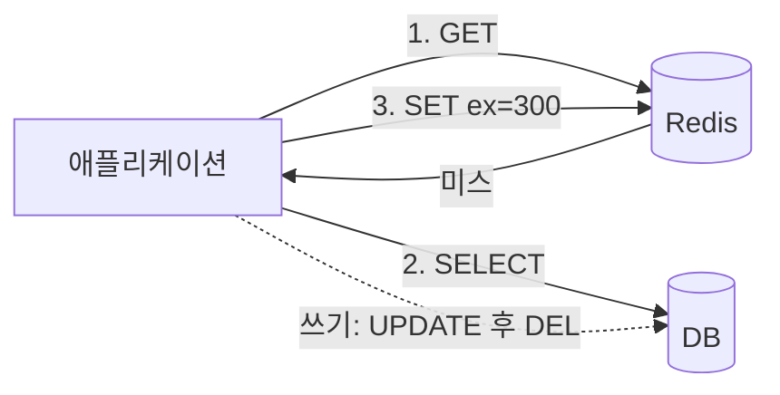
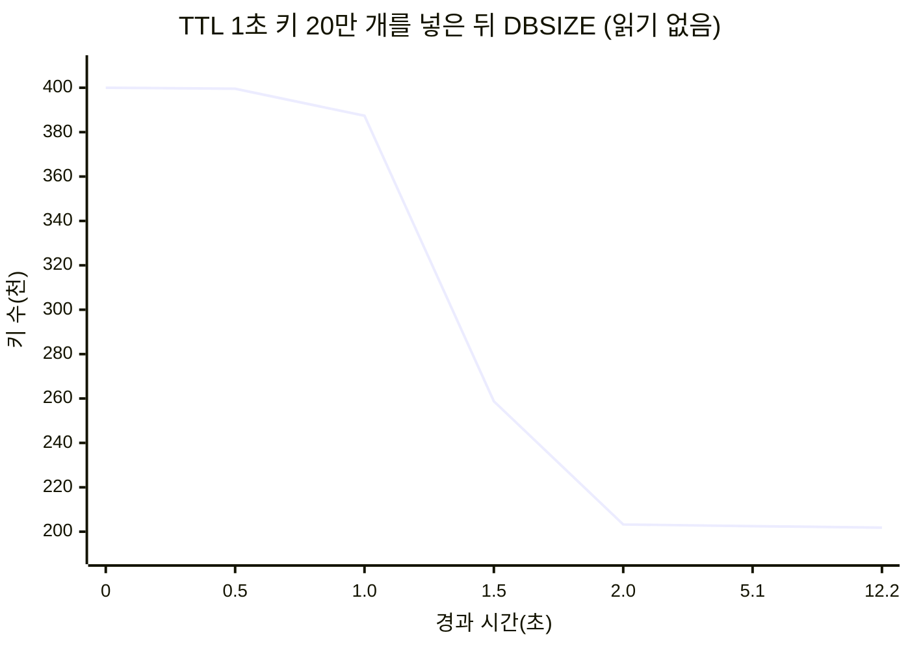
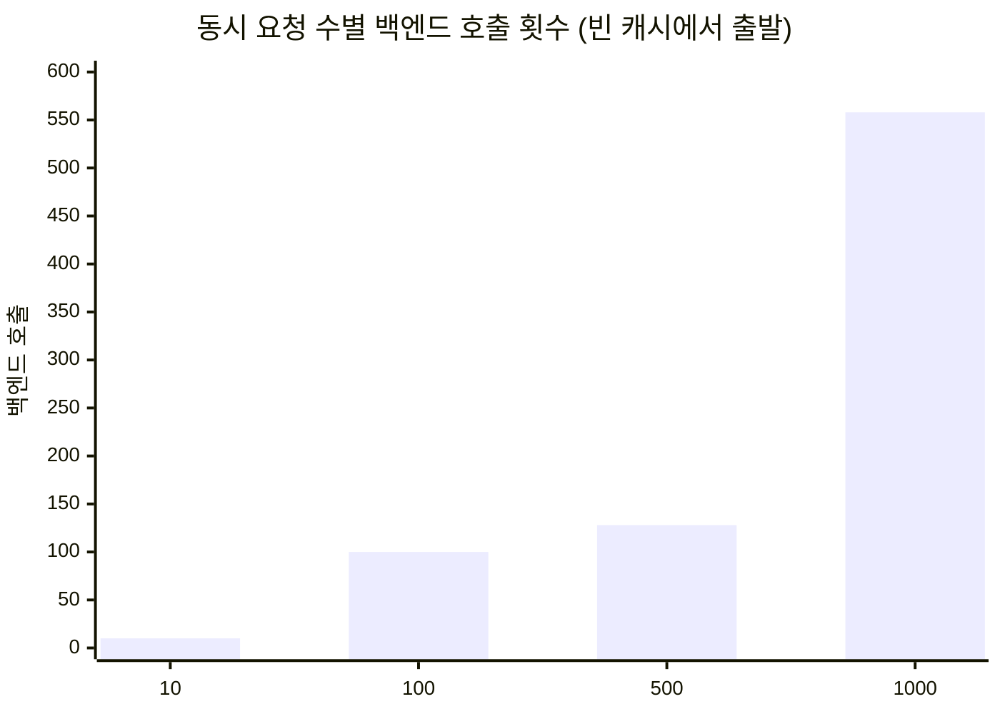

# Redis 캐시 현장 안내서: 만료, 축출, 그리고 한꺼번에 몰려오는 요청

> 캐시는 붙이기 쉽고 운영하기 어렵습니다. Redis 6.2 소스에서 만료와 축출이 실제로 어떻게 돌아가는지 읽고, 캐시 스탬피드와 근사 LRU를 직접 재 봤습니다. 끝에 면접 용어 정리와 퀴즈, 플래시카드가 있습니다.
> 2021-11-23 · https://alfex4936.github.io/blog/redis-cache-field-guide/

캐시를 처음 붙이면 응답 시간 그래프가 바닥으로 내려갑니다. 그다음 몇 달은 그 캐시 때문에 생긴 문제를 고치면서 보냅니다. 만료가 몰려 DB가 넘어가고, 없는 키를 계속 묻는 요청이 캐시를 그냥 통과하고, 메모리가 차서 쓰기가 막힙니다.

이 글은 그런 문제를 하나씩 보고, Redis가 각각을 어떻게 다루는지 소스에서 확인합니다. 소스는 Redis 6.2.6이고, 측정은 같은 버전의 공식 Docker 이미지에서 Python 클라이언트(redis-py)로 했습니다. 환경은 Apple Silicon 노트북입니다. 숫자는 이 환경에서 나온 것이니 절댓값보다 모양을 보시면 됩니다.

앞부분은 캐시 패턴과 Redis의 만료, 축출 구조를 다루고, 뒷부분은 장애 유형별로 정리합니다. 마지막에 면접에서 자주 나오는 용어와 퀴즈가 있습니다. 백엔드 개발자와 Redis를 운영하는 분을 생각하고 썼지만, 프런트엔드 개발자가 읽어도 따라올 수 있게 썼습니다.

## 캐시를 어디에 끼우는가

캐시를 읽고 쓰는 순서에 따라 이름이 붙습니다.

**Cache-aside**(lazy loading)가 가장 흔합니다. 애플리케이션이 캐시를 먼저 보고, 없으면 DB에서 읽어 캐시에 넣습니다. 쓸 때는 DB를 고치고 캐시 키를 지웁니다. 캐시가 죽어도 느려질 뿐 서비스는 돕니다.

```python title="cache-aside"
def get_user(uid):
    v = r.get(f"user:{uid}")
    if v is not None:
        return json.loads(v)
    row = db.fetch_user(uid)               # 캐시 미스
    r.set(f"user:{uid}", json.dumps(row), ex=300)
    return row

def update_user(uid, fields):
    db.update_user(uid, fields)
    r.delete(f"user:{uid}")                # 덮어쓰지 않고 지운다
```

쓸 때 캐시를 새 값으로 덮어쓰지 않고 지우는 데는 이유가 있습니다. 두 요청이 거의 동시에 쓰면 DB에는 B가 마지막으로 남았는데 캐시에는 A가 마지막으로 남을 수 있습니다. 지우면 다음 읽기가 DB에서 다시 가져오니 이런 순서 꼬임이 TTL까지 남지 않습니다.

그래도 틈은 남습니다. 읽기가 DB에서 옛 값을 가져온 직후 쓰기가 캐시를 지우고, 그다음 읽기가 옛 값을 캐시에 넣는 순서입니다. 그래서 TTL은 짧더라도 꼭 겁니다. TTL은 정합성 버그가 살아 있을 수 있는 최대 시간입니다.

**Read-through**는 cache-aside와 같은 일을 캐시 계층(라이브러리나 프록시)이 대신 합니다. 애플리케이션은 캐시만 봅니다.

**Write-through**는 쓸 때 캐시와 DB를 둘 다 동기로 고칩니다. 읽기는 항상 따뜻하지만, 한 번도 읽히지 않을 값까지 캐시에 들어갑니다.

**Write-behind**(write-back)는 캐시에 먼저 쓰고 DB 반영은 나중에 모아서 합니다. 쓰기가 빠르고 DB 부하가 줄지만, 캐시가 죽으면 반영 안 된 쓰기를 잃습니다. 조회수나 좋아요 수처럼 조금 잃어도 되는 값에 씁니다.



## 만료: 지운다는 것이 언제인가

`SET key value EX 60`을 하면 Redis는 키 공간과 별도로 `expires`라는 해시 테이블에 키와 만료 시각(밀리초 유닉스 시간)을 적습니다. 60초가 지나는 순간 무언가가 키를 지워 주지는 않습니다. 지우는 길은 두 가지입니다.

### 게으른 만료

키를 읽거나 쓸 때마다 `expireIfNeeded`가 먼저 불립니다.

<Walk>

```c title="src/db.c (Redis 6.2.6, 주석 생략)"
int expireIfNeeded(redisDb *db, robj *key) {
    if (!keyIsExpired(db,key)) return 0;

    if (server.masterhost != NULL) return 1;

    if (checkClientPauseTimeoutAndReturnIfPaused()) return 1;

    /* Delete the key */
    deleteExpiredKeyAndPropagate(db,key);
    return 1;
}
```

<Step lines="2">

만료 시각이 지나지 않았으면 아무 일도 없습니다. 대부분의 접근이 이 줄에서 끝납니다.

</Step>

<Step lines="4">

레플리카라면 "만료됐다"고 답만 하고 지우지는 않습니다. 레플리카의 키는 마스터가 보내는 `DEL`로만 지워집니다. 그래야 마스터와 레플리카의 데이터가 갈라지지 않습니다. 읽기에는 없는 키로 보이지만 메모리는 마스터가 지울 때까지 남습니다.

</Step>

<Step lines="6">

클라이언트가 일시 정지된 동안(`CLIENT PAUSE`, 장애 조치 중)에도 지우지 않습니다. 데이터셋을 그대로 두어야 하기 때문입니다.

</Step>

<Step lines="8-10">

마스터라면 키를 지우고, AOF와 레플리카에 `DEL`(또는 `UNLINK`)을 전파합니다.

</Step>

</Walk>

이것만 있으면 아무도 읽지 않는 만료 키는 영원히 메모리에 남습니다.

### 능동 만료

그래서 서버가 주기적으로 `expires` 테이블을 표본 조사합니다. `activeExpireCycle`이 하는 일입니다. 상수는 `expire.c` 맨 위에 있습니다.

| 상수 | 값 | 뜻 |
|---|---|---|
| `KEYS_PER_LOOP` | 20 | 한 번에 표본으로 보는 키 수 |
| `FAST_DURATION` | 1000µs | 이벤트 루프 사이에 도는 빠른 주기의 시간 한도 |
| `SLOW_TIME_PERC` | 25 | `serverCron`에서 도는 느린 주기가 쓸 수 있는 CPU 비율 |
| `ACCEPTABLE_STALE` | 10 | 표본 중 만료 비율이 이보다 낮으면 그 DB는 그만 본다 |

`active-expire-effort`(기본 1, 최대 10)를 올리면 표본 수와 시간 한도가 늘고 허용 비율은 내려갑니다. 루프의 핵심은 이렇습니다. 20개를 뽑아 만료된 것을 지우고, 지운 비율이 10%를 넘으면 한 번 더 뽑습니다. 10% 아래로 내려가면 다음 DB로 넘어갑니다. `expires`가 1% 미만으로 차 있으면 그 DB는 아예 건너뜁니다.

정말 그렇게 움직이는지 봤습니다. TTL 1초인 키 20만 개와 TTL 1시간인 키 20만 개를 넣고, 아무것도 읽지 않으면서 `DBSIZE`를 지켜봤습니다. `hz`는 기본값 10입니다.



1초가 지나고 다음 1초 안에 19만 7천 개가 지워졌습니다. 그런데 2초 이후 곡선이 평평합니다. 남은 2천 개 남짓은 초당 100개 정도씩 천천히 빠졌습니다.

이유는 위 표에 있습니다. 만료된 키가 2천 개, 살아 있는 키가 20만 개면 표본 20개 중 만료 비율은 1% 근처입니다. 10%에 못 미치니 루프는 한 번 보고 떠납니다. 능동 만료는 "만료 키를 다 지운다"가 아니라 "만료 키 비율을 10% 근처 아래로 유지한다"는 약속입니다. `INFO stats`의 `expired_stale_perc`가 이 추정치이고, 측정 중 최고 28%까지 갔다가 13% 근처로 내려왔습니다.

운영에서 이 차이가 드러나는 곳은 메모리 그래프입니다. 키 수는 줄었는데 `used_memory`가 생각만큼 안 내려가면, 아직 아무도 건드리지 않은 만료 키일 수 있습니다.

## 축출: 메모리가 찼을 때

`maxmemory`에 닿으면 Redis는 명령을 실행하기 전에 `performEvictions`로 공간을 만듭니다. 무엇을 지울지는 `maxmemory-policy`가 정합니다.

| 정책 | 대상 | 기준 |
|---|---|---|
| `noeviction` | 없음 | 쓰기 명령에 OOM 에러 |
| `allkeys-lru` / `volatile-lru` | 전체 / TTL 있는 키 | 가장 오래 안 쓴 키 |
| `allkeys-lfu` / `volatile-lfu` | 전체 / TTL 있는 키 | 가장 덜 쓰는 키 |
| `allkeys-random` / `volatile-random` | 전체 / TTL 있는 키 | 무작위 |
| `volatile-ttl` | TTL 있는 키 | 만료가 가장 가까운 키 |

**기본값은 `noeviction`입니다.** 캐시 용도로 띄우면서 이걸 안 바꾸면, 메모리가 찬 순간 `SET`이 전부 `OOM command not allowed`로 실패합니다. 읽기는 되니 장애가 반쯤만 나서 더 늦게 발견됩니다. `volatile-*` 정책도 TTL 있는 키가 하나도 없으면 `noeviction`처럼 행동합니다.

### LRU는 근사치입니다

진짜 LRU를 하려면 모든 키를 접근 순서로 잇는 연결 리스트가 필요합니다. 키마다 포인터 두 개, 16바이트가 더 들고, 읽을 때마다 리스트를 고쳐야 합니다.

Redis는 대신 키 객체 헤더의 24비트에 마지막 접근 시각을 초 단위로 적습니다. 지울 때는 키를 무작위로 `maxmemory-samples`개(기본 5) 뽑아 크기 16짜리 후보 풀에 넣고, 풀에서 가장 오래 쉰 것부터 지웁니다.

```c title="src/evict.c, evictionPoolPopulate (요약)"
if (server.maxmemory_policy & MAXMEMORY_FLAG_LRU) {
    idle = estimateObjectIdleTime(o);
} else if (server.maxmemory_policy & MAXMEMORY_FLAG_LFU) {
    idle = 255-LFUDecrAndReturn(o);
} else if (server.maxmemory_policy == MAXMEMORY_VOLATILE_TTL) {
    idle = ULLONG_MAX - (long)dictGetVal(de);
}
```

세 정책이 모두 "idle 점수가 큰 것부터 지운다" 하나로 통일되어 있습니다. LFU는 빈도를 뒤집고, TTL은 만료 시각을 뒤집어서 같은 풀에 넣습니다.

표본 수가 결과를 얼마나 바꾸는지 직접 쟀습니다. 2,000개씩 10묶음을 1.05초 간격으로 넣고, 메모리를 전체의 절반쯤으로 묶었습니다. 이상적인 LRU라면 살아남은 키가 전부 뒤쪽 절반(새 키)이어야 합니다.

<LruSampleViz caption="막대 하나가 키 묶음 하나이고, 왼쪽일수록 오래된 키입니다. 진하게 남은 막대가 축출되지 않고 살아남은 키입니다." />

| `maxmemory-samples` | 살아남은 키 중 새 절반 비율 |
|---|---|
| 1 | 53.6% |
| 3 | 84.5% |
| 5 (기본) | 92.0% |
| 10 | 96.6% |
| 이상적 LRU | 100% |

표본 1개는 그냥 무작위 축출입니다. 5개만 돼도 92%이고, 10개로 올리면 거의 따라붙습니다. 대가는 축출할 때마다 키를 더 뽑는 CPU입니다. 쓰기가 많고 메모리가 늘 꽉 찬 서버가 아니면 체감하기 어려우니, 적중률이 중요하면 10으로 올려 볼 만합니다.

### LFU는 8비트로 셉니다

LFU 모드에서는 같은 24비트를 둘로 나눕니다. 위 16비트는 마지막으로 값을 줄인 시각(분 단위), 아래 8비트는 접근 횟수입니다. 8비트면 255까지밖에 못 세니, 횟수를 그대로 더하지 않고 확률로 올립니다.

```c title="src/evict.c"
uint8_t LFULogIncr(uint8_t counter) {
    if (counter == 255) return 255;
    double r = (double)rand()/RAND_MAX;
    double baseval = counter - LFU_INIT_VAL;
    if (baseval < 0) baseval = 0;
    double p = 1.0/(baseval*server.lfu_log_factor+1);
    if (r < p) counter++;
    return counter;
}
```

새 키는 5에서 시작합니다(`LFU_INIT_VAL`). 0에서 시작하면 방금 들어온 키가 바로 축출 1순위가 되기 때문입니다. 값이 커질수록 다음 증가 확률이 떨어지니 카운터는 로그처럼 자랍니다. 실제로 키 하나를 N번 `GET`하고 `OBJECT FREQ`를 봤습니다.

| `lfu-log-factor` | 0회 | 1회 | 10회 | 100회 | 1천 | 1만 | 10만 | 100만 |
|---|---|---|---|---|---|---|---|---|
| 1 | 5 | 6 | 9 | 19 | 45 | 145 | 255 | 255 |
| 10 (기본) | 5 | 6 | 6 | 10 | 21 | 45 | 148 | 255 |
| 100 | 5 | 6 | 6 | 7 | 9 | 18 | 50 | 162 |

기본값 10에서는 100만 번 접근해야 255에 닿습니다. 1만 번 읽힌 키와 10만 번 읽힌 키를 구분할 수 있다는 뜻입니다. factor를 1로 낮추면 10만 번에서 이미 포화되어 진짜 인기 키끼리 구분이 안 됩니다.

반대 방향도 있습니다. 어제 인기였던 키가 오늘도 255로 남으면 안 되니, 접근할 때 지난 감소 이후 흐른 분을 `lfu-decay-time`(기본 1분)으로 나눈 만큼 카운터를 뺍니다. 10분 동안 아무도 안 읽은 키는 10이 줄어듭니다.

LRU와 LFU 중 무엇을 고를지는 접근 패턴에 달렸습니다. 전체를 한 번 훑는 배치 작업이 돌면 LRU는 그 순간 캐시를 훑은 키로 갈아 끼웁니다. LFU에서는 한 번 읽힌 키가 5나 6에 머무니 원래 인기 키가 버팁니다.

## 캐시가 무너지는 네 가지 방식

면접에서 단골로 나오는 이름들입니다. 이름은 한국어 자료에서 흔히 쓰는 것을 따랐습니다.

### 1. 캐시 스탬피드 (Cache Stampede, Thundering Herd)

인기 키 하나가 만료되는 순간, 그 키를 기다리던 요청이 전부 미스를 보고 동시에 DB로 갑니다. DB 쿼리가 200ms라면 그 200ms 동안 들어온 요청은 모두 같은 쿼리를 날립니다. dog-piling이라고도 부릅니다.

직접 재 봤습니다. 백엔드는 200ms 동안 잠드는 함수이고, 위의 cache-aside 코드를 스레드 여러 개로 돌렸습니다. 스레드를 배리어로 묶어 같은 순간에 출발시켰습니다.



100개까지는 요청 수만큼 DB를 쳤습니다. 500개와 1000개에서 호출이 요청 수보다 적은 것은 해결돼서가 아닙니다. Python 스레드가 다 출발하기 전에 첫 요청이 캐시를 채웠을 뿐입니다. 실제 서버는 여러 프로세스와 여러 머신에서 요청이 오니 더 나쁩니다.

**해결 1: 락.** 미스가 난 요청 중 하나만 DB에 가고, 나머지는 잠깐 기다렸다 캐시를 다시 봅니다.

```python title="락 + 재확인"
RELEASE = r.register_script("""
if redis.call('get', KEYS[1]) == ARGV[1] then
  return redis.call('del', KEYS[1])
end
return 0
""")

def get_with_lock(key, load, ttl=60):
    while True:
        v = r.get(key)
        if v is not None:
            return v
        token = uuid4().hex
        if r.set(f"lock:{key}", token, nx=True, px=2000):
            try:
                v = r.get(key)             # 다시 확인
                if v is None:
                    v = load()
                    r.set(key, v, ex=ttl)
                return v
            finally:
                RELEASE(keys=[f"lock:{key}"], args=[token])
        time.sleep(0.02)
```

여기서 두 군데가 중요합니다.

- 락 해제를 그냥 `DEL`로 하면, 내 락이 `PX` 2초를 넘겨 풀린 뒤 다른 요청이 잡은 락을 내가 지울 수 있습니다. 그래서 토큰을 넣고, 토큰이 내 것일 때만 지우는 것을 Lua로 한 번에 합니다.
- 락을 잡은 직후 캐시를 한 번 더 봅니다. 앞 요청이 캐시를 채우고 락을 푼 직후에 락을 잡은 요청은 이 확인이 없으면 DB를 한 번 더 칩니다. 이 줄 없이 돌렸을 때 500개와 1000개에서 백엔드 호출이 1~2번 나왔고, 넣은 뒤에는 둘 다 정확히 1번이었습니다.

**해결 2: 미리 갱신.** 만료되기 전에 갱신하면 만료 순간 자체가 없습니다. 값과 함께 계산에 걸린 시간을 저장해 두고, 만료가 가까울수록 높은 확률로 한 요청이 먼저 갱신하게 하는 방법이 XFetch(확률적 조기 만료)입니다[^1]. 락 없이도 대부분의 갱신을 요청 하나가 맡게 됩니다. 아예 백그라운드 작업이 주기적으로 덮어쓰고 TTL은 넉넉히 두는 방법도 있습니다.

### 2. 캐시 관통 (Cache Penetration)

DB에도 없는 키를 계속 물으면 캐시는 영원히 채워지지 않고 매번 DB로 갑니다. 존재하지 않는 상품 ID로 크롤러가 긁거나, 공격자가 무작위 ID를 보낼 때 생깁니다.

- **없음도 캐시합니다(negative caching).** DB에 없으면 빈 값 표시를 짧은 TTL로 넣습니다. 나중에 그 키가 생기면 쓰는 쪽에서 지워 주면 됩니다.
- **블룸 필터를 앞에 둡니다.** 존재하는 ID 집합을 블룸 필터로 들고 있으면 "확실히 없음"을 캐시 조회 전에 걸러냅니다. 블룸 필터는 거짓 양성은 있어도 거짓 음성은 없어서, "없다"고 하면 정말 없습니다.
- 입력 검증으로 말이 안 되는 ID(음수, 범위 밖)를 먼저 버리는 것이 가장 쌉니다.

### 3. 캐시 눈사태 (Cache Avalanche)

많은 키가 같은 순간에 만료되는 경우입니다. 배포 직후 캐시를 한꺼번에 채웠거나, 매일 자정에 일괄로 TTL 24시간을 걸었으면 다음 자정에 전부 같이 만료됩니다. 스탬피드가 키 하나라면 눈사태는 수천 개가 동시에 오는 것입니다. Redis 서버 자체가 죽어 캐시가 통째로 비는 것도 같은 이름으로 부릅니다.

- **TTL에 무작위 흔들기(jitter)를 섞습니다.** `ex=3600 + random.randint(0, 600)`처럼 하면 만료가 10분에 걸쳐 퍼집니다. 가장 싸고 효과가 큽니다.
- 서버가 죽는 경우에 대비해 레플리카와 Sentinel(또는 Cluster)로 장애 조치를 두고, DB 앞에 서킷 브레이커나 동시 요청 제한을 둡니다. 캐시가 비었을 때 DB가 받을 수 있는 만큼만 들여보내는 장치입니다.

### 4. 핫 키와 빅 키 (Hot Key, Big Key)

Redis는 명령을 한 스레드에서 차례로 실행합니다. 6.0의 I/O 스레드(`io-threads`)는 소켓 읽기와 쓰기만 나눠 맡고, 명령 실행은 여전히 메인 스레드 하나입니다. 그래서 키 하나에 요청이 몰리면(핫 키) 클러스터에서도 그 키가 있는 샤드 하나만 뜨거워집니다. 노드를 늘려도 나아지지 않습니다.

- 애플리케이션 메모리에 아주 짧은 TTL로 한 번 더 캐시합니다(로컬 캐시, near cache). 6.0의 client-side caching(`CLIENT TRACKING`)을 쓰면 그 키가 바뀌었을 때 서버가 무효화 메시지를 보내 줍니다.
- 읽기 전용이면 키를 `hot:item:42:{0..7}`처럼 여러 벌 복제해 무작위로 읽습니다.
- 찾을 때는 `redis-cli --hotkeys`를 씁니다. LFU 카운터를 읽어 보는 것이라 LFU 정책일 때만 동작합니다.

빅 키는 원소가 수백만 개인 hash나 수백 MB짜리 문자열입니다. 문제는 지울 때 옵니다. 원소 수백만 개를 해제하는 동안 메인 스레드가 멈추고, 그동안 다른 모든 명령이 기다립니다.

- `DEL` 대신 `UNLINK`를 씁니다. 키 공간에서는 바로 떼어 내고 해제는 백그라운드 스레드가 합니다. 소스를 보면 해제 비용(원소 수 근사)이 64(`LAZYFREE_THRESHOLD`)를 넘을 때만 백그라운드로 넘깁니다. 작은 값은 넘기는 비용이 더 크기 때문입니다.
- 만료와 축출로 지워질 때도 같은 문제가 있습니다. `lazyfree-lazy-expire`, `lazyfree-lazy-eviction`을 켜면 이것도 백그라운드로 갑니다. 6.2에서 기본값은 둘 다 `no`입니다.
- 찾을 때는 `redis-cli --bigkeys`나 `MEMORY USAGE key`를 씁니다. 처음부터 쪼개 두는 것이 제일 낫습니다.

## 캐시라도 알아야 하는 영속성

"캐시니까 날아가도 된다"고 해도, 재시작하면 빈 캐시에서 출발하고 그게 곧 눈사태입니다. 그래서 캐시 서버에도 영속성 설정이 의미가 있습니다.

- **RDB**는 `fork()`로 자식 프로세스를 만들어 스냅숏을 씁니다. 부모와 자식이 메모리 페이지를 공유하다가 부모가 고친 페이지만 복사됩니다(copy-on-write). 쓰기가 많은 서버면 스냅숏 동안 메모리가 최악의 경우 두 배 가까이 필요하고, 데이터가 클수록 `fork()` 자체도 오래 걸립니다.
- **AOF**는 쓰기 명령을 로그로 남깁니다. `appendfsync everysec`이 기본이고, 최대 1초치를 잃을 수 있습니다.
- **복제**는 비동기입니다. 마스터가 쓰기에 OK를 준 뒤 레플리카로 보내니, 그 사이에 마스터가 죽으면 그 쓰기는 잃습니다.

## 면접 용어 정리

| 용어 | 한 줄 설명 |
|---|---|
| Cache-aside | 앱이 캐시를 먼저 보고, 미스면 DB에서 읽어 채운다. 쓰기는 DB 갱신 후 캐시 삭제 |
| Write-through | 쓰기 때 캐시와 DB를 동기로 같이 갱신 |
| Write-behind | 캐시에 먼저 쓰고 DB 반영은 비동기로 모아서 |
| TTL | 키의 남은 수명. 정합성 버그가 살아 있을 수 있는 최대 시간이기도 하다 |
| 게으른 만료 | 키에 접근할 때 만료 여부를 보고 지운다 |
| 능동 만료 | 주기적으로 20개씩 표본 조사해 만료 키 비율을 10% 근처 아래로 유지 |
| 근사 LRU | 무작위 표본 5개 중 가장 오래 쉰 키를 지운다 |
| LFU 카운터 | 8비트 로그 카운터, 초기값 5, 분 단위로 감소 |
| `noeviction` | 기본 정책. 메모리가 차면 쓰기가 실패한다 |
| 스탬피드 | 인기 키 만료 순간 요청이 한꺼번에 DB로 |
| 관통 | 존재하지 않는 키 조회가 캐시를 통과해 DB로 |
| 눈사태 | 많은 키가 동시에 만료되거나 캐시 서버가 통째로 빔 |
| 핫 키 | 키 하나에 요청이 몰려 샤드 하나가 과열 |
| 빅 키 | 원소나 크기가 커서 삭제, 전송 때 메인 스레드를 막는 키 |
| `UNLINK` | 키를 떼어 내고 해제는 백그라운드로 |
| Copy-on-write | RDB fork 중 부모가 고친 페이지만 복사 |

## 퀴즈

<Quiz items={[
  {
    q: "Redis 6.2를 설정 없이 띄워 캐시로 쓰다가 `maxmemory`에 닿았습니다. 무슨 일이 생기나요?",
    choices: ["가장 오래 안 쓴 키부터 지운다", "쓰기 명령이 OOM 에러로 실패한다", "TTL 있는 키만 지운다", "디스크로 내려 쓴다"],
    answer: 1,
    why: "기본 `maxmemory-policy`는 `noeviction`입니다. 읽기는 되고 쓰기만 실패합니다."
  },
  {
    q: "TTL 1초 키가 20만 개 있고 아무도 읽지 않습니다. 2초 뒤 상태로 가장 가까운 것은?",
    choices: ["전부 정확히 지워졌다", "하나도 안 지워졌다", "대부분 지워졌지만 수천 개가 한동안 남는다", "Redis가 멈춘다"],
    answer: 2,
    why: "능동 만료는 표본의 만료 비율이 10% 아래로 내려가면 멈춥니다. 남은 키는 천천히 빠집니다."
  },
  {
    q: "`maxmemory-samples`를 1로 두면 근사 LRU는 무엇에 가까워지나요?",
    choices: ["무작위 축출", "정확한 LRU", "LFU", "FIFO"],
    answer: 0,
    why: "표본이 하나면 고를 것이 없습니다. 측정에서 새 키 비율이 53.6%로 무작위와 거의 같았습니다."
  },
  {
    q: "LFU 카운터가 0이 아니라 5에서 시작하는 이유는?",
    choices: ["8비트 정렬 때문", "방금 들어온 키가 곧바로 축출되지 않게", "로그 계산에서 0으로 나누지 않으려고", "레플리카와 맞추려고"],
    answer: 1,
    why: "0에서 시작하면 새 키가 항상 빈도 최하위라 들어오자마자 축출 후보가 됩니다."
  },
  {
    q: "스탬피드 방지 락에서 락을 잡은 뒤 캐시를 한 번 더 보는 이유는?",
    choices: ["락이 잘 잡혔는지 확인하려고", "앞 요청이 이미 채웠을 수 있어서", "TTL을 갱신하려고", "Lua 스크립트를 쓰려고"],
    answer: 1,
    why: "앞 요청이 캐시를 채우고 락을 푼 직후 락을 잡으면, 다시 확인하지 않는 한 DB를 한 번 더 칩니다."
  },
  {
    q: "모든 상품 캐시에 매일 자정 TTL 24시간을 걸었습니다. 가장 걱정되는 것은?",
    choices: ["캐시 관통", "핫 키", "캐시 눈사태", "빅 키"],
    answer: 2,
    why: "다음 자정에 전부 같이 만료됩니다. TTL에 무작위 흔들기를 섞어 퍼뜨립니다."
  },
  {
    q: "원소 500만 개짜리 hash를 지워야 합니다. 메인 스레드를 덜 막는 명령은?",
    choices: ["`DEL`", "`EXPIRE key 0`", "`UNLINK`", "`FLUSHDB`"],
    answer: 2,
    why: "`UNLINK`는 키를 떼어 내고 해제를 백그라운드 스레드로 넘깁니다."
  },
  {
    q: "레플리카에서 만료된 키를 `GET`하면?",
    choices: ["값을 그대로 준다", "nil을 주고 키도 지운다", "nil을 주지만 키는 마스터의 DEL이 올 때까지 남는다", "에러를 낸다"],
    answer: 2,
    why: "레플리카는 만료를 판단해 답만 하고, 삭제는 마스터가 전파하는 `DEL`로만 합니다."
  }
]} />

## 플래시카드

카드를 누르면 뒤집힙니다. 면접 전날 한 번 넘겨 보기 좋게 만들었습니다.

<FlashCards cards={[
  { front: "Cache-aside에서 쓰기 순서", back: "DB를 먼저 고치고 캐시 키를 지운다. 덮어쓰지 않는다." },
  { front: "기본 `maxmemory-policy`", back: "`noeviction`. 메모리가 차면 쓰기가 실패한다." },
  { front: "`maxmemory-samples` 기본값", back: "5. 10으로 올리면 이상적 LRU에 더 가까워진다." },
  { front: "축출 후보 풀 크기", back: "16 (`EVPOOL_SIZE`)" },
  { front: "LFU 카운터 크기와 초기값", back: "8비트, 초기값 5. 확률로 증가하고 분 단위로 감소한다." },
  { front: "능동 만료 한 번에 보는 키 수", back: "20개. 만료 비율이 10%를 넘으면 반복한다." },
  { front: "레플리카의 만료 키", back: "nil로 답하지만 지우지 않는다. 마스터의 DEL을 기다린다." },
  { front: "스탬피드 대책 두 가지", back: "락과 재확인, 그리고 만료 전에 미리 갱신(XFetch)" },
  { front: "관통 대책", back: "없음도 짧게 캐시, 블룸 필터, 입력 검증" },
  { front: "눈사태 대책", back: "TTL 흔들기, 고가용성 구성, DB 앞 동시성 제한" },
  { front: "`UNLINK`가 백그라운드로 넘기는 기준", back: "해제 비용이 64(`LAZYFREE_THRESHOLD`)를 넘을 때" },
  { front: "6.0 I/O 스레드가 하는 일", back: "소켓 읽기와 쓰기만. 명령 실행은 여전히 메인 스레드 하나." }
]} />

## 정리

- 캐시를 쓸 때는 DB를 고치고 캐시를 지우고, TTL은 짧더라도 꼭 겁니다.
- 만료는 접근할 때 지우는 길과 주기적 표본 조사 두 갈래입니다. 표본 조사는 만료 비율을 10% 근처 아래로 유지할 뿐이라 일부 만료 키는 한동안 남습니다.
- 기본 축출 정책은 `noeviction`입니다. 캐시로 쓸 거면 반드시 바꿉니다.
- LRU는 표본 5개로 고르는 근사치이고 측정에서 살아남은 키의 92%가 새 절반이었습니다(이상적 LRU는 100%). LFU는 8비트 로그 카운터라 100만 번 접근해야 포화됩니다.
- 스탬피드는 락과 재확인, 관통은 없음 캐시와 블룸 필터, 눈사태는 TTL 흔들기, 빅 키는 `UNLINK`로 막습니다.

[^1]: Andrea Vattani, Flavio Chierichetti, Keegan Lowenstein, "Optimal Probabilistic Cache Stampede Prevention", VLDB 2015.
