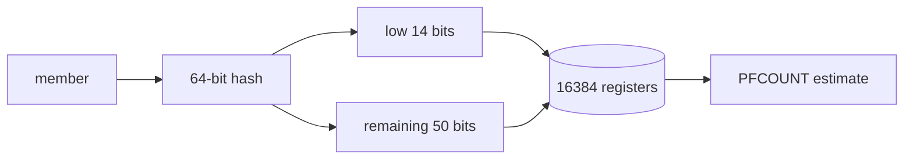
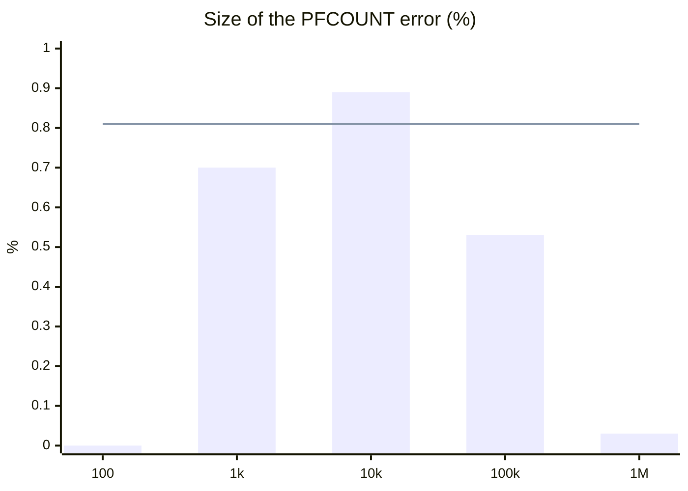

# Redis HyperLogLog: counting a million users in 14 KB

> Counting unique visitors with a SET takes 48 MB for a million; HyperLogLog takes 14 KB. How it counts, and how far off it is, measured.
> 2024-05-28 · https://alfex4936.github.io/blog/redis-hyperloglog/

Some questions only need how many, not who: unique visitors in a day, for one. Every number in this post was measured on Redis 7.2.4 in Docker (official image, jemalloc) loaded with `user:0` through `user:999999`.

## Counting exactly

A SET gives the exact count. In exchange it has to hold every member.

```bash
$ redis-cli SCARD visitors:set
(integer) 1000000
$ redis-cli MEMORY USAGE visitors:set SAMPLES 0
(integer) 48388640
```

A million members take 48,388,640 bytes, about 48 MB. That is one day; keep a set per day and it adds up.

## How HyperLogLog counts

HyperLogLog stores no members, only the shape of their hashes. Following `hyperloglog.c` in the Redis source:

<Walk>



<Step show="M,H">
Each member is hashed to 64 bits with MurmurHash64A. The same member always gets the same hash.
</Step>

<Step show="H,I,R">
The low 14 bits pick one register: 2 to the 14th, 16,384 of them.
</Step>

<Step show="H,Z,R">
The remaining bits are read from the bottom up, counting the zeros before the first 1, plus one. A register keeps only the largest value it has seen. Long runs of zeros are rare, so seeing a large value means many members have gone past.
</Step>

<Step show="R,C">
PFCOUNT estimates the count from how the register values are spread. Redis uses Otmar Ertl's estimator.[^1]
</Step>

</Walk>

A register is 6 bits, so 16,384 × 6 bits is 12,288 bytes, and a 16-byte header makes 12,304. The measurement agrees.

<Quiz lang="en" title="Checkpoint: updating a register" items={[
  {
    q: "A user visits several times in one day. Does each PFADD of the same ID increase the estimate?",
    choices: ["Yes, once per visit.", "No. The same hash updates the same register with the same value.", "Only the sparse representation deduplicates visits."],
    answer: 1,
    why: "The same ID produces the same hash and register value. A register keeps only its maximum, so a repeated visit adds no new information.",
  },
]} />

```bash
$ redis-cli STRLEN visitors:hll
(integer) 12304
$ redis-cli MEMORY USAGE visitors:hll SAMPLES 0
(integer) 14392
```

The same million members, counted in about 1/3,400 of the space the SET takes.

## How far off it is

The standard error is set by the number of registers $m$:

$$
\sigma \approx \frac{1.04}{\sqrt{m}} = \frac{1.04}{\sqrt{16384}} = \frac{1.04}{128} \approx 0.81\%
$$

Measured at several sizes:

| Members | PFCOUNT | Error | String | MEMORY USAGE |
| ---: | ---: | ---: | ---: | ---: |
| 100 | 100 | 0.00% | 283 B | 440 B |
| 1,000 | 1,007 | +0.70% | 1,910 B | 2,616 B |
| 10,000 | 10,089 | +0.89% | 12,304 B | 14,392 B |
| 100,000 | 99,471 | −0.53% | 12,304 B | 14,392 B |
| 1,000,000 | 999,674 | −0.03% | 12,304 B | 14,392 B |



At 10,000 members the error was 0.89%, above the 0.81% standard error (the line). A standard error is the typical size of the error, not a ceiling, so a single measurement can go past it. At a million it was 0.03%.

## Smaller when small

With few members, Redis uses a sparse representation that does not lay out all 16,384 registers. It was 283 bytes at 100 members and 1,910 bytes at 1,000; by 10,000 it had switched to the 12,304-byte dense representation. The switch is set by `hll-sparse-max-bytes`.[^2]

## Using it from code

Add each visit to that day's key; to count, pass several day keys at once. The example is Go with go-redis v9.

<Walk>

```go title="visitors.go"
func Visit(ctx context.Context, rdb *redis.Client, day, user string) error {
	return rdb.PFAdd(ctx, "visitors:"+day, user).Err()
}

func Unique(ctx context.Context, rdb *redis.Client, days ...string) (int64, error) {
	keys := make([]string, len(days))
	for i, d := range days {
		keys[i] = "visitors:" + d
	}
	return rdb.PFCount(ctx, keys...).Result()
}
```

<Step lines="1-3">
Every visit is a PFADD to that day's key. The same user visiting twice does not raise the count.
</Step>

<Step lines="5-11">
Given several keys, PFCOUNT estimates the size of their union. A week's unique visitors are seven day keys. If the union will be read again and again, PFMERGE can store it under a new key.
</Step>

</Walk>

Where the exact number matters, billing for example, count with a SET or a database. All the measurements above had errors under 1%, but neither those observations nor the 0.81% standard error bound future errors. HyperLogLog saves memory for dashboards that accept estimates. It does not guarantee a requirement that error must always stay within 1%.

<Quiz lang="en" title="Designing a visitor counter" items={[
  {
    q: "You keep one HLL per day. How do you estimate weekly unique visitors without counting repeat visitors once per day?",
    choices: ["Add the daily PFCOUNT results.", "Use the largest daily PFCOUNT result.", "Pass all day keys to one PFCOUNT call."],
    answer: 2,
    why: "PFCOUNT with several keys estimates their union. Adding daily estimates counts repeat visitors more than once; taking the maximum misses users who only visited on other days.",
  },
  {
    q: "The measurement table reports 0.89% error. Does exceeding the 0.81% standard error alone prove an implementation bug?",
    choices: ["No. Standard error is not a ceiling on individual measurements.", "Yes. Every measurement must fall within 0.81%.", "Yes. The dense representation stores an exact count."],
    answer: 0,
    why: "The post's 0.81% is a standard error determined by the register count. A single measurement can exceed it. Switching from sparse to dense does not turn an estimate into an exact count.",
  },
  {
    q: "Billing requires both an exact unique-user count and the user list. Can you store only an HLL?",
    choices: ["Yes. PFMERGE reconstructs the original IDs.", "No. Keep the members in a SET or database.", "Yes. Switching to dense reconstructs the original IDs."],
    answer: 1,
    why: "An HLL stores register information derived from hashes, not members. It cannot reconstruct an exact count or user list, and PFMERGE does not restore the original members.",
  },
]} />

[^1]: Otmar Ertl, "New cardinality estimation algorithms for HyperLogLog sketches", arXiv:1702.01284. The comment on `hllSigma` in the Redis source points to it.
[^2]: On the machine these numbers come from, `CONFIG GET hll-sparse-max-bytes` returned 3000.
