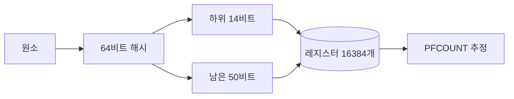

# Redis HyperLogLog: 100만 명을 14KB로 세기

> 고유 방문자를 SET으로 세면 100만 명에 37MB, HyperLogLog로 세면 14KB입니다. 어떻게 세는지 따라가 보고, 오차가 얼마인지 직접 재 봤습니다.
> 2026-09-21 · https://alfex4936.github.io/blog/redis-hyperloglog/

하루 고유 방문자 수처럼, 누가 왔는지는 필요 없고 몇 명인지만 알면 되는 질문이 있습니다. 이 글의 숫자는 모두 로컬 Redis 8.10.2(Homebrew 빌드, libc malloc)에 `user:0`부터 `user:999999`까지 넣어 잰 값입니다.

## 정확히 세면

SET에 넣으면 정확한 개수가 나옵니다. 대신 원소를 전부 들고 있어야 합니다.

```bash
$ redis-cli SCARD visitors:set
(integer) 1000000
$ redis-cli MEMORY USAGE visitors:set SAMPLES 0
(integer) 37277585
```

100만 명에 37,277,585바이트, 약 37MB입니다. 하루치가 이 크기이고, 날마다 따로 보관하면 그만큼 쌓입니다.

## HyperLogLog가 세는 방법

HyperLogLog는 원소를 저장하지 않고 해시값의 모양만 기억합니다. Redis 소스의 `hyperloglog.c`를 따라가면 이렇습니다.

<Walk>



<Step show="M,H">
원소를 MurmurHash64A로 64비트 해시값으로 바꿉니다. 같은 원소는 언제나 같은 해시가 됩니다.
</Step>

<Step show="H,I,R">
하위 14비트로 레지스터 하나를 고릅니다. 2의 14제곱, 16,384개입니다.
</Step>

<Step show="H,Z,R">
남은 비트를 아래쪽부터 보면서 처음 1이 나올 때까지의 0의 개수에 1을 더합니다. 레지스터는 지금까지 본 가장 큰 값만 남깁니다. 0이 길게 이어지는 해시는 드물기 때문에, 큰 값이 보였다는 것은 그만큼 많은 원소를 봤다는 뜻입니다.
</Step>

<Step show="R,C">
PFCOUNT는 레지스터 값들의 분포로 개수를 추정합니다. Redis는 Otmar Ertl의 추정식을 씁니다.[^1]
</Step>

</Walk>

레지스터 하나는 6비트이므로 16,384 × 6비트 = 12,288바이트이고, 16바이트 헤더가 붙어 12,304바이트입니다. 잰 값도 같습니다.

```bash
$ redis-cli STRLEN visitors:hll
(integer) 12304
$ redis-cli MEMORY USAGE visitors:hll SAMPLES 0
(integer) 14367
```

같은 100만 명을 SET보다 약 2,600분의 1 크기로 셉니다.

## 오차는 얼마나

표준 오차는 레지스터 수 $m$으로 정해집니다.

$$
\sigma \approx \frac{1.04}{\sqrt{m}} = \frac{1.04}{\sqrt{16384}} = \frac{1.04}{128} \approx 0.81\%
$$

원소 수를 바꿔 가며 잰 결과입니다.

| 원소 수 | PFCOUNT | 오차 | 문자열 | MEMORY USAGE |
| ---: | ---: | ---: | ---: | ---: |
| 100 | 100 | 0.00% | 283 B | 538 B |
| 1,000 | 1,007 | +0.70% | 1,910 B | 2,587 B |
| 10,000 | 10,089 | +0.89% | 12,304 B | 14,364 B |
| 100,000 | 99,471 | −0.53% | 12,304 B | 14,365 B |
| 1,000,000 | 999,674 | −0.03% | 12,304 B | 14,367 B |

```mermaid
xychart-beta
  title "PFCOUNT 오차의 크기 (%)"
  x-axis [100, 1천, 1만, 10만, 100만]
  y-axis "%" 0 --> 1
  bar "측정한 오차" [0, 0.70, 0.89, 0.53, 0.03]
  line "표준 오차 0.81%" [0.81, 0.81, 0.81, 0.81, 0.81]
```

1만 개에서는 0.89%로 표준 오차 0.81%(선)보다 컸습니다. 표준 오차는 상한이 아니라 오차가 흔히 그 정도라는 뜻이어서, 한 번 잰 값은 넘어설 수 있습니다. 100만 개에서는 0.03%였습니다.

## 작을 때는 더 작게

원소가 적을 때 Redis는 레지스터 16,384개를 다 펼치지 않는 희소(sparse) 표현을 씁니다. 100개일 때 283바이트, 1,000개일 때 1,910바이트였고, 1만 개에서는 12,304바이트의 밀집(dense) 표현으로 바뀌어 있었습니다. 바뀌는 기준은 `hll-sparse-max-bytes`입니다.[^2]

## 코드에서 쓰기

방문할 때마다 그날의 키에 넣고, 셀 때는 날짜 키를 여러 개 함께 넘깁니다. 예시는 Go와 go-redis v9입니다.

<Walk>

```go title="visitors.go"
func Visit(ctx context.Context, rdb *redis.Client, day, user string) error {
	return rdb.PFAdd(ctx, "visitors:"+day, user).Err()
}

func Unique(ctx context.Context, rdb *redis.Client, days ...string) (int64, error) {
	keys := make([]string, len(days))
	for i, d := range days {
		keys[i] = "visitors:" + d
	}
	return rdb.PFCount(ctx, keys...).Result()
}
```

<Step lines="1-3">
방문마다 그날 키에 PFADD합니다. 같은 사용자가 여러 번 와도 개수는 늘지 않습니다.
</Step>

<Step lines="5-11">
PFCOUNT에 키를 여러 개 넘기면 합집합의 크기를 추정합니다. 일주일의 고유 방문자는 날짜 키 일곱 개로 셉니다. 합친 결과를 계속 쓸 거라면 PFMERGE로 새 키에 저장해 둘 수 있습니다.
</Step>

</Walk>

정확한 수가 꼭 필요한 곳, 예를 들어 과금이라면 SET이나 데이터베이스로 세야 합니다. 대시보드의 고유 방문자처럼 1% 안쪽의 오차가 괜찮은 곳에서는 HyperLogLog가 메모리를 크게 아낍니다.

[^1]: Otmar Ertl, "New cardinality estimation algorithms for HyperLogLog sketches", arXiv:1702.01284. Redis 소스의 `hllSigma` 함수 주석이 이 논문을 가리킵니다.
[^2]: 이 글을 잰 환경에서 `CONFIG GET hll-sparse-max-bytes`는 3000을 돌려줬습니다.
