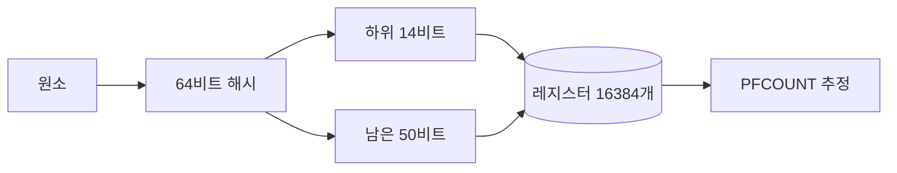

# Redis HyperLogLog: 100만 명을 14KB로 세기

> 고유 방문자를 SET으로 세면 100만 명에 48MB, HyperLogLog로 세면 14KB입니다. 어떻게 세는지 따라가 보고, 오차가 얼마인지 직접 재 봤습니다.
> 2024-05-28 · https://alfex4936.github.io/blog/redis-hyperloglog/

하루 고유 방문자 수처럼, 누가 왔는지는 필요 없고 몇 명인지만 알면 되는 질문이 있습니다. 이 글의 숫자는 모두 Docker의 Redis 7.2.4(공식 이미지, jemalloc)에 `user:0`부터 `user:999999`까지 넣어 잰 값입니다.

## 정확히 세면

SET에 넣으면 정확한 개수가 나옵니다. 대신 원소를 전부 들고 있어야 합니다.

```bash
$ redis-cli SCARD visitors:set
(integer) 1000000
$ redis-cli MEMORY USAGE visitors:set SAMPLES 0
(integer) 48388640
```

100만 명에 48,388,640바이트, 약 48MB입니다. 하루치가 이 크기이고, 날마다 따로 보관하면 그만큼 쌓입니다.

## HyperLogLog가 세는 방법

HyperLogLog는 원소를 저장하지 않고 해시값의 모양만 기억합니다. Redis 소스의 `hyperloglog.c`를 따라가면 이렇습니다.



1. 원소를 MurmurHash64A로 64비트 해시값으로 바꿉니다. 같은 원소는 언제나 같은 해시가 됩니다.

2. 하위 14비트로 레지스터 하나를 고릅니다. 2의 14제곱, 16,384개입니다.

3. 남은 비트를 아래쪽부터 보면서 처음 1이 나올 때까지의 0의 개수에 1을 더합니다. 레지스터는 지금까지 본 가장 큰 값만 남깁니다. 0이 길게 이어지는 해시는 드물기 때문에, 큰 값이 보였다는 것은 그만큼 많은 원소를 봤다는 뜻입니다.

4. PFCOUNT는 레지스터 값들의 분포로 개수를 추정합니다. Redis는 Otmar Ertl의 추정식을 씁니다.[^1]

해시의 하위 비트와 나머지 비트를 직접 바꿔 보면 두 역할이 구분됩니다. "같은 후보 값, 다른 번호"를 누르면 후보 값은 그대로인데 레지스터 번호만 바뀝니다. 기존 값보다 작은 후보는 저장하지 않습니다.

> 인터랙티브 시각화 (원문 페이지에서 직접 조작할 수 있습니다: https://alfex4936.github.io/blog/redis-hyperloglog/)

남은 비트가 모두 0인 경우도 있습니다. [`hllPatLen`(Redis 7.2.4)](https://github.com/redis/redis/blob/7.2.4/src/hyperloglog.c)의 규칙은 검사할 비트 뒤에 종료용 1을 붙여 후보 값이 51에서 멈추도록 합니다. 위 "모든 비트가 0" 예시에서는 남은 50비트를 전부 검사하고 이 종료용 비트에서 멈춥니다. 이 후보 값 자체가 방문자 수는 아닙니다.

레지스터 하나는 6비트이므로 16,384 × 6비트 = 12,288바이트이고, 16바이트 헤더가 붙어 12,304바이트입니다. 잰 값도 같습니다.

**퀴즈: 레지스터 갱신을 확인합니다**

1. 한 사용자가 같은 날 여러 번 방문합니다. 같은 ID를 PFADD할 때마다 추정치가 늘어납니까?
   - 방문 횟수만큼 늘어납니다.
   - 같은 해시로 같은 레지스터를 갱신하므로 늘어나지 않습니다.
   - 희소 표현일 때만 늘어나지 않습니다.

   정답: 같은 해시로 같은 레지스터를 갱신하므로 늘어나지 않습니다. 같은 ID는 같은 해시와 같은 레지스터 값을 만듭니다. 레지스터는 최댓값만 보관하므로 중복 방문은 새로운 정보를 더하지 않습니다.

```bash
$ redis-cli STRLEN visitors:hll
(integer) 12304
$ redis-cli MEMORY USAGE visitors:hll SAMPLES 0
(integer) 14392
```

같은 100만 명을 SET보다 약 3,400분의 1 크기로 셉니다.

## 오차는 얼마나

표준 오차는 레지스터 수 $m$으로 정해집니다.

$$
\sigma \approx \frac{1.04}{\sqrt{m}} = \frac{1.04}{\sqrt{16384}} = \frac{1.04}{128} \approx 0.81\%
$$

원소 수를 바꿔 가며 잰 결과입니다.

| 원소 수 | PFCOUNT | 오차 | 문자열 | MEMORY USAGE |
| ---: | ---: | ---: | ---: | ---: |
| 100 | 100 | 0.00% | 283 B | 440 B |
| 1,000 | 1,007 | +0.70% | 1,910 B | 2,616 B |
| 10,000 | 10,089 | +0.89% | 12,304 B | 14,392 B |
| 100,000 | 99,471 | −0.53% | 12,304 B | 14,392 B |
| 1,000,000 | 999,674 | −0.03% | 12,304 B | 14,392 B |

```mermaid
xychart-beta
  title "PFCOUNT 오차의 크기 (%)"
  x-axis [100, 1천, 1만, 10만, 100만]
  y-axis "%" 0 --> 1
  bar "측정한 오차" [0, 0.70, 0.89, 0.53, 0.03]
  line "표준 오차 0.81%" [0.81, 0.81, 0.81, 0.81, 0.81]
```

1만 개에서는 0.89%로 표준 오차 0.81%(선)보다 컸습니다. 표준 오차는 상한이 아니라 오차가 흔히 그 정도라는 뜻이어서, 한 번 잰 값은 넘어설 수 있습니다. 100만 개에서는 0.03%였습니다.

## 작을 때는 더 작게

원소가 적을 때 Redis는 레지스터 16,384개를 다 펼치지 않는 희소(sparse) 표현을 씁니다. 100개일 때 283바이트, 1,000개일 때 1,910바이트였고, 1만 개에서는 12,304바이트의 밀집(dense) 표현으로 바뀌어 있었습니다. 바뀌는 기준은 `hll-sparse-max-bytes`입니다.[^2]

## 코드에서 쓰기

방문할 때마다 그날의 키에 넣고, 셀 때는 날짜 키를 여러 개 함께 넘깁니다. 예시는 Go와 go-redis v9입니다.

```go title="visitors.go"
func Visit(ctx context.Context, rdb *redis.Client, day, user string) error {
	return rdb.PFAdd(ctx, "visitors:"+day, user).Err()
}

func Unique(ctx context.Context, rdb *redis.Client, days ...string) (int64, error) {
	keys := make([]string, len(days))
	for i, d := range days {
		keys[i] = "visitors:" + d
	}
	return rdb.PFCount(ctx, keys...).Result()
}
```

1. 방문마다 그날 키에 PFADD합니다. 같은 사용자가 여러 번 와도 개수는 늘지 않습니다.

2. PFCOUNT에 키를 여러 개 넘기면 합집합의 크기를 추정합니다. 일주일의 고유 방문자는 날짜 키 일곱 개로 셉니다. 합친 결과를 계속 쓸 거라면 PFMERGE로 새 키에 저장해 둘 수 있습니다.

정확한 수가 꼭 필요한 곳, 예를 들어 과금이라면 SET이나 데이터베이스로 세야 합니다. 위 측정에서는 오차가 모두 1% 안쪽이었지만, 표준 오차 0.81%도 실제 오차의 상한은 아닙니다. 대시보드처럼 근사 집계를 받아들이는 곳에서는 HyperLogLog로 메모리를 아낄 수 있습니다. 오차가 반드시 1% 이하여야 하는 요구사항을 HLL만으로 보장하면 안 됩니다.

**퀴즈: 방문자 집계를 설계한다면**

1. 날짜별 HLL로 일주일의 고유 방문자를 셉니다. 여러 날 방문한 사용자를 중복해서 세지 않으려면 어떻게 합니다?
   - 날짜별 PFCOUNT 결과를 더합니다.
   - 날짜별 PFCOUNT 결과 중 최댓값을 씁니다.
   - 날짜 키를 함께 PFCOUNT에 넘깁니다.

   정답: 날짜 키를 함께 PFCOUNT에 넘깁니다. 여러 키를 받은 PFCOUNT는 합집합의 크기를 추정합니다. 날짜별 추정치를 더하면 여러 날 방문한 사용자가 중복 집계되고, 최댓값만 쓰면 다른 날에만 온 사용자를 놓칩니다.
2. 측정 표에서 오차가 0.89%로 나왔습니다. 표준 오차 0.81%보다 크다는 이유만으로 구현 버그라고 판단할 수 있습니까?
   - 판단할 수 없습니다. 표준 오차는 개별 측정의 상한이 아닙니다.
   - 판단할 수 있습니다. 모든 측정이 0.81% 안에 들어야 합니다.
   - 판단할 수 있습니다. 밀집 표현은 정확한 개수를 저장합니다.

   정답: 판단할 수 없습니다. 표준 오차는 개별 측정의 상한이 아닙니다. 본문의 0.81%는 레지스터 수로 정해지는 표준 오차입니다. 한 번의 측정은 이를 넘을 수 있고, 희소 표현에서 밀집 표현으로 바뀌어도 근사 집계라는 성질은 같습니다.
3. 과금용으로 정확한 고유 사용자 수와 사용자 목록이 필요합니다. HLL만 저장해도 됩니까?
   - 됩니다. PFMERGE하면 원래 ID를 복원합니다.
   - 안 됩니다. SET이나 데이터베이스에 원소를 보관해야 합니다.
   - 됩니다. 밀집 표현으로 바꾸면 원래 ID를 복원합니다.

   정답: 안 됩니다. SET이나 데이터베이스에 원소를 보관해야 합니다. HLL은 원소 대신 해시에서 얻은 레지스터 정보만 보관합니다. 정확한 수나 사용자 목록을 복원할 수 없으며, PFMERGE도 원소를 되살리는 명령이 아닙니다.

[^1]: Otmar Ertl, "New cardinality estimation algorithms for HyperLogLog sketches", arXiv:1702.01284. Redis 소스의 `hllSigma` 함수 주석이 이 논문을 가리킵니다.
[^2]: 이 글을 잰 환경에서 `CONFIG GET hll-sparse-max-bytes`는 3000을 돌려줬습니다.
