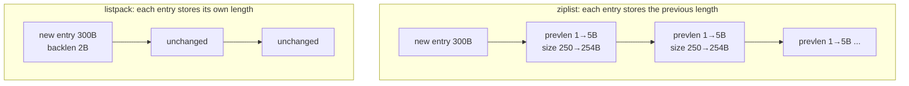
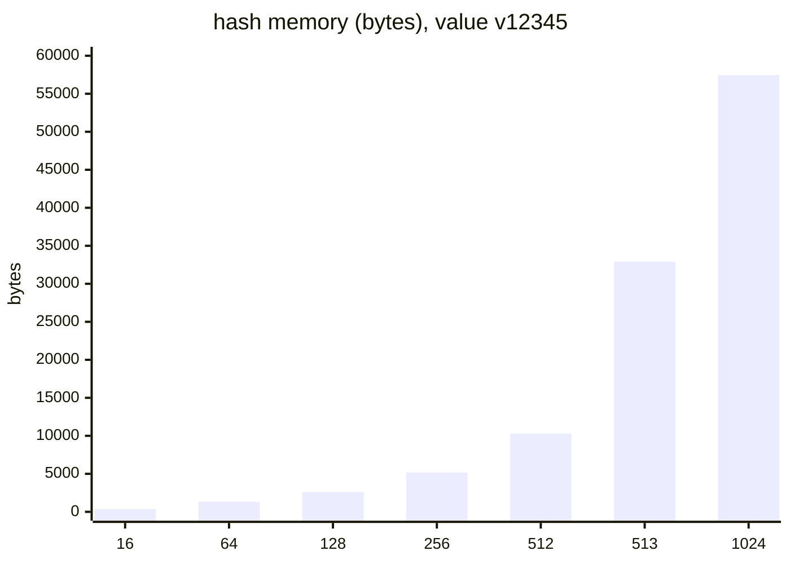

# Redis listpack: between field 512 and field 513

> In Redis 7, small hashes, sets and zsets live in a single listpack. One step past the threshold triples memory, a converted encoding never comes back, and raising the threshold turns lookups into a linear scan. Measured on Redis 7.2.
> 2023-10-17 · https://alfex4936.github.io/blog/redis-listpack/

A small Redis hash is not a hash table. Fields and values are written one after another into a single contiguous byte array, and a lookup scans it from the start. In Redis 7.0 the format of that array changed from ziplist to listpack. The setting `hash-max-ziplist-entries` became `hash-max-listpack-entries`, with the old name kept as an alias.

This post covers why the format changed and how memory and latency actually move around the thresholds. Measurements use the official Redis 7.2.16 Docker image: memory from `MEMORY USAGE`, server-side execution time from `usec_per_call` in `INFO commandstats`. The machine is an Apple Silicon laptop.

## Why ziplist was replaced

Every ziplist entry starts with the length of the previous entry (prevlen), so the list can be walked backwards. prevlen takes 1 byte if the previous entry is under 254 bytes and 5 bytes otherwise.



Take a row of 250-byte entries and insert a large one in front. The next entry's prevlen grows from 1 to 5 bytes, making it 254 bytes, so the entry after it needs a bigger prevlen too. That chain running to the end is the cascading update. It is rare, but in the worst case one insert rewrites the whole list.

listpack stores an entry's own length (backlen) at its end, not the previous entry's. Walking backwards reads that length from the end of the preceding entry. Changing one entry's size leaves its neighbours untouched, so there is nothing to cascade. Redis 7.0 replaced ziplist with listpack for hashes, zsets, and lists (each quicklist node).

## Default thresholds

listpack is only used while small. The Redis 7.2.16 defaults:

| Setting | Default |
| --- | ---: |
| `hash-max-listpack-entries` | 512 |
| `hash-max-listpack-value` | 64 |
| `zset-max-listpack-entries` | 128 |
| `zset-max-listpack-value` | 64 |
| `set-max-listpack-entries` | 128 |
| `set-max-intset-entries` | 512 |

Exceeding either the entry count or the value length converts to a hash table (a skiplist for zsets). Sets gained a listpack encoding in 7.2, and if every member is an integer, intset is used before that.

## Field 513

I added fields with value `v12345` one at a time and measured `MEMORY USAGE`.

| Fields | Encoding | Bytes | Per field |
| ---: | --- | ---: | ---: |
| 1 | listpack | 72 | |
| 16 | listpack | 368 | 23 |
| 64 | listpack | 1,328 | 21 |
| 128 | listpack | 2,608 | 20 |
| 256 | listpack | 5,168 | 20 |
| 512 | listpack | 10,288 | 20 |
| 513 | hashtable | **32,920** | 64 |
| 1,024 | hashtable | 57,448 | 56 |



One more field made memory 3.2 times larger. In a listpack, `field:123` and `v12345` sit side by side with only a length header and a few backlen bytes, a little over 20 bytes per field. In a hash table, field and value each become separately allocated strings, plus an entry struct and the bucket array, around 60 bytes per field.

The value-length boundary has the same shape. A 100-field hash with only the value length changed:

| Value length | Encoding | Bytes |
| ---: | --- | ---: |
| 8 | listpack | 1,840 |
| 32 | listpack | 4,144 |
| 63 | listpack | 7,216 |
| 64 | listpack | 8,240 |
| 65 | hashtable | 12,840 |
| 128 | hashtable | 20,840 |

Up to 64 bytes it stays listpack; from 65 it is a hash table. The boundary is "64 or less".

Sets behave the same way.

| Members | Count | Encoding | Bytes |
| --- | ---: | --- | ---: |
| strings | 128 | listpack | 816 |
| strings | 129 | hashtable | 6,280 |
| integers | 512 | intset | 1,328 |
| integers | 513 | hashtable | **24,712** |

An integer set grows 18.6 times going from intset to hash table. An intset is a sorted integer array using only 2–8 bytes per member.

## A conversion that does not come back

Conversion only goes one way. I took a 100-field hash of 1,072 bytes, set one 65-byte value, then deleted that field.

| Step | Encoding | Bytes |
| --- | --- | ---: |
| Start | listpack | 1,072 |
| `HSET` a 65-byte value | hashtable | 5,240 |
| `HDEL` that field | hashtable | 5,128 |

The cause is gone and the key stays a hash table. Redis never converts in the shrinking direction. On an instance with millions of keys, a pattern where long values come and go makes memory climb in steps only. Reverting means rewriting the key. When I ran `DUMP` on a key in this state, deleted it and `RESTORE`d it, it came back as listpack, because loading a key from RDB picks the encoding from its current size.

## Raising the threshold

Saving memory by raising `hash-max-listpack-entries` is tempting. A listpack lookup is a linear scan from the start, so there is a cost. I sent 50,000 `HGET`s each for the first and the last field and read the server-side `usec_per_call`.

```bash title="rlp3.sh (excerpt)"
for f in 1 $n; do
  redis-cli config resetstat >/dev/null
  redis-benchmark -n 50000 -c 4 -P 16 -q hget h field:$f >/dev/null 2>&1
  redis-cli info commandstats | grep cmdstat_hget
done
```

| Fields | Encoding | First field (µs) | Last field (µs) |
| ---: | --- | ---: | ---: |
| 128 | listpack | 0.08 | 0.53 |
| 512 | listpack | 0.08 | 2.12 |
| 4,096 | hashtable | 0.07 | 0.07 |
| 16,384 | hashtable | 0.07 | 0.07 |
| 4,096 | listpack (threshold 100000) | 0.08 | 15.97 |
| 16,384 | listpack (threshold 100000) | 0.08 | **50.74** |

Even at the default of 512, the last field is 26 times slower than the first, but only 2µs in absolute terms. With the threshold raised and 16,384 fields in a listpack, looking up the last field takes 50µs. Redis executes commands on one thread, so every other client waits through those 50µs. At 20,000 such lookups per second, that alone fills a CPU core.

Requests per second measured on the client barely showed this. Even over local loopback, the network round trip hides the gap between 0.07µs and 2µs. You have to look at the server-side numbers.

> The threshold is a dial that trades memory against worst-case lookup time. For a hash whose tail fields are read often, raising it slows lookups by exactly as much.

## Summary

- ziplist's cascading update came from each entry storing the previous entry's length; listpack stores its own length and removes the problem structurally.
- One step past the threshold, a hash grows 3.2× and an integer set 18.6×.
- A key converted to a hash table does not return even after shrinking.
- Raising the threshold saves memory, but tail-field lookups slow down in proportion to the field count: 50µs at 16,384 fields.

If a key hovers around 512 fields, splitting it to stay below 512 is safer than raising the threshold.
