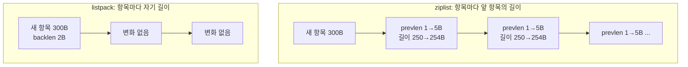
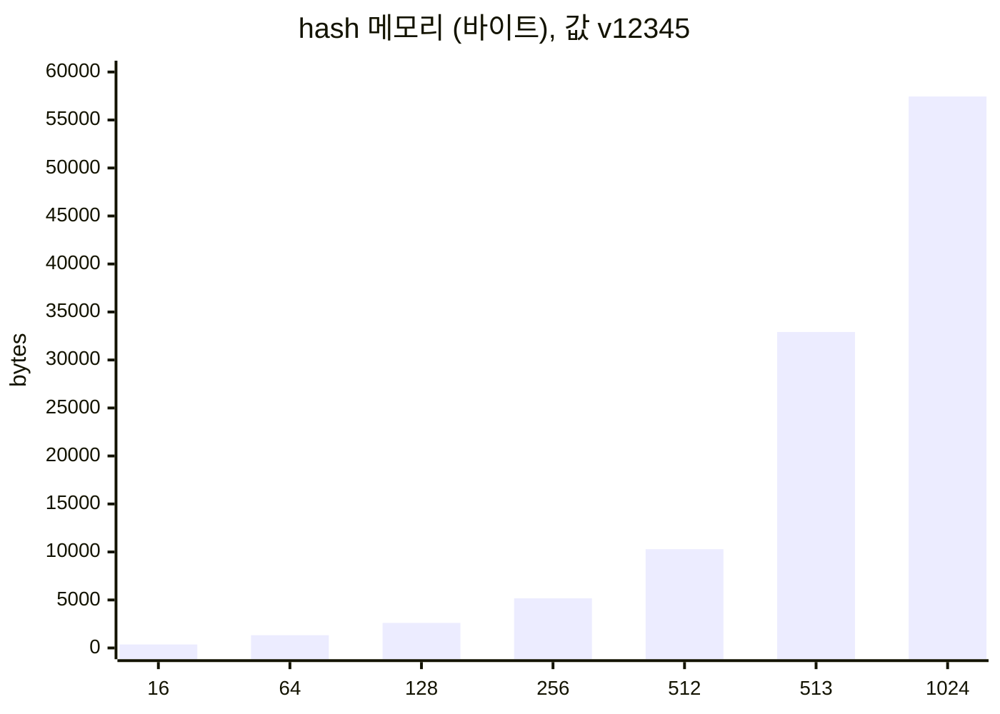

# Redis listpack: 512번째 필드와 513번째 필드 사이

> Redis 7에서 작은 hash, set, zset은 listpack 하나에 통째로 들어갑니다. 임계값 한 칸 차이로 메모리가 세 배 뛰고, 한번 바뀐 인코딩은 돌아오지 않으며, 임계값을 올리면 조회가 선형 탐색이 됩니다. Redis 7.2에서 직접 쟀습니다.
> 2023-10-17 · https://alfex4936.github.io/blog/redis-listpack/

Redis의 hash는 작을 때 해시 테이블이 아닙니다. 필드와 값을 연속된 바이트 배열 하나에 차례로 적어 두고, 조회할 때 처음부터 훑습니다. Redis 7.0부터 이 배열의 형식이 ziplist에서 listpack으로 바뀌었습니다. 설정 이름도 `hash-max-ziplist-entries`에서 `hash-max-listpack-entries`로 바뀌었고, 옛 이름은 별칭으로 남았습니다.

이 글에서는 왜 형식을 바꿨는지, 그리고 임계값 근처에서 메모리와 지연이 실제로 어떻게 움직이는지 봅니다. 측정은 Redis 7.2.16 공식 Docker 이미지에서 했고, 메모리는 `MEMORY USAGE`, 서버 쪽 실행 시간은 `INFO commandstats`의 `usec_per_call`입니다. 환경은 Apple Silicon 노트북입니다.

## ziplist가 바뀐 이유

ziplist의 각 항목은 앞 항목의 길이(prevlen)를 맨 앞에 적습니다. 뒤에서 앞으로 걸어갈 수 있게 하기 위해서입니다. prevlen은 앞 항목이 254바이트 미만이면 1바이트, 이상이면 5바이트입니다.



250바이트짜리 항목이 줄지어 있을 때 앞에 큰 항목 하나가 들어가면 문제가 생깁니다. 바로 뒤 항목의 prevlen이 1바이트에서 5바이트로 늘고, 그 항목이 254바이트가 되면서 다음 항목의 prevlen도 늘어나야 합니다. 이것이 끝까지 이어지는 연쇄 갱신(cascading update)입니다. 드물지만 최악의 경우 삽입 한 번이 리스트 전체를 다시 씁니다.

listpack은 앞 항목이 아니라 자기 길이(backlen)를 항목 끝에 적습니다. 뒤에서 걸어갈 때는 바로 앞 항목의 끝에서 그 길이를 읽으면 됩니다. 한 항목의 크기가 바뀌어도 이웃 항목은 그대로이니 연쇄가 생길 구조가 없습니다. Redis 7.0은 hash, zset, 그리고 list(quicklist의 각 노드)에서 ziplist를 모두 listpack으로 바꿨습니다.

<Quiz title="길이 저장 방식을 확인합니다" items={[
  {
    q: "listpack 앞부분에 큰 항목을 넣었습니다. ziplist의 prevlen 연쇄 갱신이 같은 방식으로 생깁니까?",
    choices: ["생깁니다. listpack도 다음 항목에 앞 항목 길이를 저장합니다.", "생기지 않습니다. backlen은 각 항목의 자기 길이를 저장합니다.", "생기지 않습니다. listpack 삽입은 바이트를 전혀 옮기지 않습니다."],
    answer: 1,
    why: "자기 길이를 저장하므로 이웃 항목의 길이 헤더가 연달아 커지는 구조가 없습니다. 이는 연쇄 갱신을 없앤다는 뜻이며, 연속 배열에 삽입할 때 바이트 이동까지 없앤다는 뜻은 아닙니다.",
  },
]} />

## 기본 임계값

listpack은 작을 때만 씁니다. Redis 7.2.16의 기본값은 다음과 같습니다.

| 설정 | 기본값 |
| --- | ---: |
| `hash-max-listpack-entries` | 512 |
| `hash-max-listpack-value` | 64 |
| `zset-max-listpack-entries` | 128 |
| `zset-max-listpack-value` | 64 |
| `set-max-listpack-entries` | 128 |
| `set-max-intset-entries` | 512 |

필드 수나 값 길이 중 하나만 넘어도 해시 테이블(zset은 skiplist)로 바뀝니다. set은 7.2에서 listpack 인코딩이 새로 생겼고, 원소가 모두 정수면 그보다 앞서 intset을 씁니다.

## 513번째 필드

값 `v12345`인 필드를 하나씩 늘리며 `MEMORY USAGE`를 쟀습니다.

| 필드 수 | 인코딩 | 바이트 | 필드당 |
| ---: | --- | ---: | ---: |
| 1 | listpack | 72 | |
| 16 | listpack | 368 | 23 |
| 64 | listpack | 1,328 | 21 |
| 128 | listpack | 2,608 | 20 |
| 256 | listpack | 5,168 | 20 |
| 512 | listpack | 10,288 | 20 |
| 513 | hashtable | **32,920** | 64 |
| 1,024 | hashtable | 57,448 | 56 |



필드 하나를 더 넣었더니 메모리가 3.2배가 됐습니다. listpack에서는 `field:123`과 `v12345`가 길이 헤더와 backlen 몇 바이트만 붙어 나란히 놓이므로 필드당 20바이트 남짓입니다. 해시 테이블에서는 필드와 값이 각각 별도로 할당된 문자열이 되고, 엔트리 구조체와 버킷 배열이 붙어 필드당 60바이트 안팎이 됩니다.

값 길이 쪽 경계도 같은 모양입니다. 필드 100개 hash에서 값 길이만 바꿨습니다.

| 값 길이 | 인코딩 | 바이트 |
| ---: | --- | ---: |
| 8 | listpack | 1,840 |
| 32 | listpack | 4,144 |
| 63 | listpack | 7,216 |
| 64 | listpack | 8,240 |
| 65 | hashtable | 12,840 |
| 128 | hashtable | 20,840 |

64바이트까지는 listpack이고 65바이트부터 해시 테이블입니다. 경계는 "64 이하"입니다.

set도 같습니다.

| 원소 | 개수 | 인코딩 | 바이트 |
| --- | ---: | --- | ---: |
| 문자열 | 128 | listpack | 816 |
| 문자열 | 129 | hashtable | 6,280 |
| 정수 | 512 | intset | 1,328 |
| 정수 | 513 | hashtable | **24,712** |

정수 set은 intset에서 해시 테이블로 바뀔 때 18.6배가 됩니다. intset은 정렬된 정수 배열이라 원소당 2~8바이트밖에 쓰지 않기 때문입니다.

## 돌아오지 않는 변환

변환은 한 방향입니다. 필드 100개, 1,072바이트인 hash에 65바이트 값을 하나 넣은 뒤 그 필드를 지웠습니다.

| 단계 | 인코딩 | 바이트 |
| --- | --- | ---: |
| 처음 | listpack | 1,072 |
| 65바이트 값 `HSET` | hashtable | 5,240 |
| 그 필드 `HDEL` | hashtable | 5,128 |

원인이 사라져도 해시 테이블로 남습니다. Redis는 축소 방향의 변환을 하지 않습니다. 키가 수백만 개인 인스턴스에서 잠깐 긴 값이 들어갔다 나가는 패턴이 있으면 메모리가 계단식으로만 오릅니다. 되돌리려면 키를 다시 써야 합니다. 같은 상태의 키를 `DUMP` 후 지우고 `RESTORE`하니 listpack으로 돌아왔습니다. RDB에서 키를 읽어 들일 때 현재 크기를 기준으로 인코딩을 다시 고르기 때문입니다.

## 임계값을 올리면

메모리가 아까우니 `hash-max-listpack-entries`를 크게 올리자는 생각이 들 수 있습니다. listpack 조회는 처음부터 훑는 선형 탐색이라 대가가 있습니다. `HGET`을 첫 필드와 마지막 필드에 대해 각각 5만 번 보내고 서버 쪽 `usec_per_call`을 봤습니다.

```bash title="rlp3.sh (발췌)"
for f in 1 $n; do
  redis-cli config resetstat >/dev/null
  redis-benchmark -n 50000 -c 4 -P 16 -q hget h field:$f >/dev/null 2>&1
  redis-cli info commandstats | grep cmdstat_hget
done
```

| 필드 수 | 인코딩 | 첫 필드 (µs) | 마지막 필드 (µs) |
| ---: | --- | ---: | ---: |
| 128 | listpack | 0.08 | 0.53 |
| 512 | listpack | 0.08 | 2.12 |
| 4,096 | hashtable | 0.07 | 0.07 |
| 16,384 | hashtable | 0.07 | 0.07 |
| 4,096 | listpack (임계값 100000) | 0.08 | 15.97 |
| 16,384 | listpack (임계값 100000) | 0.08 | **50.74** |

기본값 512에서도 마지막 필드는 첫 필드보다 26배 느리지만 절대값은 2µs입니다. 임계값을 올려 16,384개를 listpack에 넣으면 마지막 필드 조회가 50µs가 됩니다. Redis는 명령을 한 스레드에서 처리하므로 이 50µs 동안 다른 클라이언트도 모두 기다립니다. 초당 2만 번 이런 조회가 들어오면 그것만으로 CPU 한 개가 찹니다.

클라이언트에서 잰 초당 요청 수로는 이 차이가 거의 보이지 않았습니다. 로컬 루프백에서도 네트워크 왕복이 0.07µs와 2µs의 차이를 덮기 때문입니다. 서버 쪽 숫자를 봐야 합니다.

> 임계값은 메모리와 최악 조회 시간을 맞바꾸는 손잡이입니다. 필드를 끝에서 자주 읽는 hash라면 올린 만큼 그대로 느려집니다.

## 정리

- ziplist의 연쇄 갱신은 각 항목이 앞 항목의 길이를 적어서 생겼고, listpack은 자기 길이를 적어 구조적으로 없앴습니다.
- 임계값 한 칸 차이로 hash는 3.2배, 정수 set은 18.6배 커집니다.
- 해시 테이블로 바뀐 키는 작아져도 돌아오지 않습니다.
- 임계값을 올리면 메모리를 아끼는 대신 끝쪽 필드 조회가 필드 수에 비례해 느려집니다. 16,384 필드에서 50µs였습니다.

키 하나에 필드가 512개 근처에서 왔다 갔다 한다면 키를 쪼개 512개 아래로 유지하는 쪽이 임계값을 올리는 것보다 안전합니다.

<Quiz title="작은 hash의 메모리가 뛰었다면" items={[
  {
    q: "기본 설정에서 listpack hash에 짧은 필드와 값을 넣습니다. 필드 수가 512에서 513이 될 때 메모리가 급증하는 이유는 무엇입니까?",
    choices: ["추가한 필드 하나만 별도 해시 테이블에 저장합니다.", "키 전체가 해시 테이블로 바뀌면서 문자열과 엔트리의 비용이 붙습니다.", "listpack이 모든 필드의 값을 두 번 복사해 보관합니다."],
    answer: 1,
    why: "필드 수 임계값을 넘으면 키의 인코딩 자체가 바뀝니다. 연속 배열의 작은 헤더 대신 개별 문자열 할당, 엔트리 구조체, 버킷 배열의 비용이 생깁니다.",
  },
  {
    q: "본문 실험처럼 긴 값을 넣어 hash가 해시 테이블이 된 뒤 그 필드를 지웠습니다. 남은 키가 작아지면 자동으로 listpack으로 돌아갑니까?",
    choices: ["돌아갑니다. HDEL이 현재 크기로 인코딩을 다시 고릅니다.", "돌아갑니다. 다음 HGET이 인코딩을 다시 고릅니다.", "돌아가지 않습니다. 키를 다시 쓰는 작업이 필요합니다."],
    answer: 2,
    why: "일반 명령으로 크기를 줄여도 해시 테이블에서 listpack으로 축소 변환하지 않습니다. 본문에서 DUMP 후 재생성으로 돌아온 것은 로딩 시 현재 크기로 인코딩을 다시 골랐기 때문입니다.",
  },
  {
    q: "메모리를 줄이려고 listpack 필드 수 임계값을 올렸습니다. 끝쪽 필드를 자주 읽는 서비스에서는 무엇을 함께 확인해야 합니까?",
    choices: ["INFO commandstats의 서버 실행 시간을 확인합니다. 선형 탐색 비용이 늘어납니다.", "MEMORY USAGE만 확인합니다. listpack의 HGET은 상수 시간입니다.", "클라이언트 처리량만 확인합니다. 네트워크는 실행 시간 차이를 숨기지 않습니다."],
    answer: 0,
    why: "listpack은 앞에서부터 필드를 찾습니다. 끝쪽 조회가 길어지면 다른 명령도 기다리고, 본문 실험처럼 네트워크 왕복이 차이를 가릴 수 있어 서버 쪽 usec_per_call을 함께 봐야 합니다.",
  },
]} />
