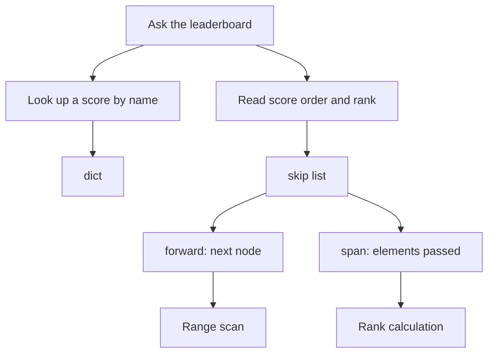
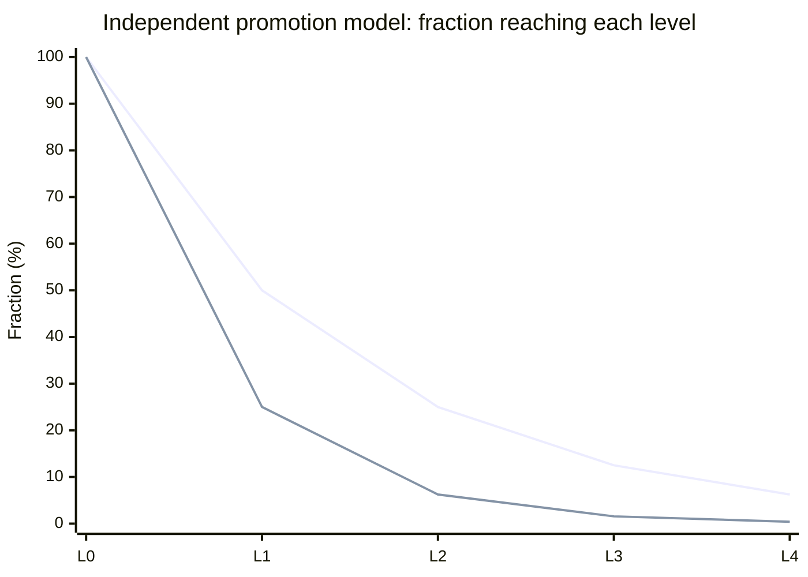
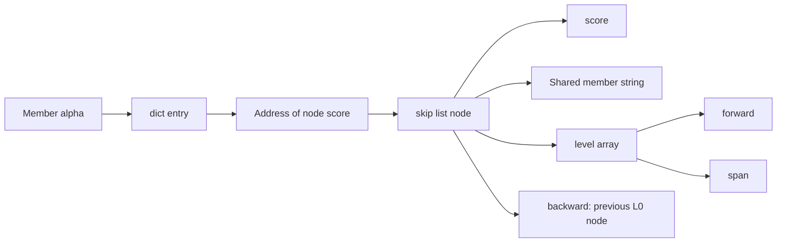
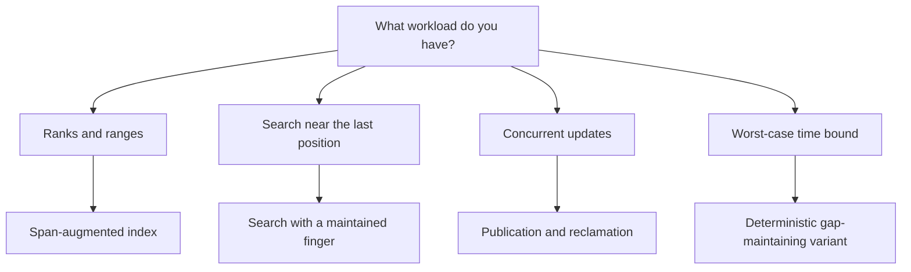

# Skip lists: from coin flips to Redis rankings

> A few tall nodes shorten a search. Redis adds rank accounting; LevelDB turns the structure into a memory index that can be read during writes. Change the paths and spans, then follow where the papers and production implementations diverge.
> 2022-06-16 · https://alfex4936.github.io/blog/skip-list/

Updating a score on a game leaderboard and asking "how many players are ahead of me?" are different operations. Looking up a score by name is straightforward. Counting every player ahead of you gets more expensive as the board grows.

A large Redis sorted set assigns these jobs to different structures. A hash table handles member lookup; a skip list maintains score order. Forward pointers alone cannot tell you how many players a jump passed. Redis stores that count beside the pointer.

This article starts with that count, then follows why randomized heights shorten searches and what changes inside a storage engine or a concurrent container. The sources are the original papers and Redis 6.2.6, LevelDB 1.23, and OpenJDK 11. The reproductions and visualization checks below were **run on 2026-10-10**. They are not records of tests run on the displayed 2022 date.



## Give a linked list some express stops

Imagine searching for 42 in a sorted linked list. Read the next node; if its value is smaller, read the next one. Unlike an array, you cannot calculate the address of the middle element, so adding binary search is not straightforward.

A skip list gives some nodes pointers that travel farther. The base level, L0, contains every node. Each higher level connects a subset. Start at the top. Move right while the next value is below the target. When the next value reaches or exceeds the target, descend at the current node. You never need to climb back up.[^pugh]

Press `Next` below. Refusing a jump and descending is a step of its own. Change the target to 35 to try an unsuccessful search. Absence is established at the base level too.

> Interactive visual (try it on the original page: https://alfex4936.github.io/blog/skip-list/)

Every upper level is a subset of the base list. Search may skip smaller values, but it never follows a link past the target. If it stops before the target, the lower level provides a finer path.

Height does not determine *correctness*. Even if every node has height 1, the answers remain correct. You just walk farther. Choose `All height 1` and search for 73 to see the difference.

With independent promotion, search, insertion and deletion take expected $O(\log n)$ time. One particular list can still take $O(n)$ in the worst case. The coin controls the distribution of costs; it does not guarantee that every search is short.[^pugh]

**Quiz: An unlucky height distribution**

1. Random promotion gives every node height 1. What goes wrong?
   - Search misses some keys.
   - The sorted base list still gives correct answers, but search becomes a long linear walk.
   - Keys become ordered by insertion time.

   Answer: The sorted base list still gives correct answers, but search becomes a long linear walk. Sorted L0 and the rule against overshooting protect correctness. The distribution of upper levels changes search cost. Expected time and correct answers are separate properties.

## Why flip a coin, and how much does the coin cost?

Pugh's original paper uses $p$ as the probability of promotion to another level. Every node gets its first level; each successful promotion adds one more. With independent promotions and no height cap, height $H$ has this distribution:[^pugh]

$$
\begin{aligned}
P(H \ge k)&=p^{k-1}\\
E[H]&=1+p+p^2+\cdots\\
&=\frac{1}{1-p}
\end{aligned}
$$

At $p=1/2$, the expected number of forward pointers per node is 2. At $p=1/4$, it is $4/3$. This counts **forward slots only**. It excludes the header, values, spans, backward pointers, and allocator overhead. It is not a per-node byte measurement.



The chart evaluates the formula; it is not a measurement. Reducing $p$ produces fewer upper-level nodes and can mean longer walks within a level. The leading search-cost term in Pugh's analysis has the form $(1/p)\log_{1/p}n$. The choices $p=1/2$ and $p=1/4$ give the same leading term, but this does not make two programs equally fast.[^pugh]

Redis 6.2.6 uses `ZSKIPLIST_P = 0.25` and `ZSKIPLIST_MAXLEVEL = 32`. LevelDB 1.23 also samples heights with branching factor 4, but caps them at 12. Neither simply adopts the fair coin in the familiar textbook picture.[^redis-structure][^leveldb]

The explorer caps height at 4 to keep the diagram readable. Choosing `p = 1/4` or `p = 1/2` generates heights with a seeded PRNG; `Next seed` samples another arrangement. One small example does not replace the expected-time analysis or reproduce Redis's random generator.

## Redis stores names and order separately

Redis 6.2.6's `zset` contains a `dict` and a `zsl`. Member lookup reads the dict; score ranges and ranks use the skip list. The structures share member strings, and a dict value points to the skip-list node's `score` field.[^redis-structure][^redis-code]



There is a size condition. Small sorted sets in Redis 6.2.6 can use ziplist encoding. The defaults are `zset-max-ziplist-entries = 128` and `zset-max-ziplist-value = 64` bytes. Exceeding a limit converts the representation to dict plus skip list. Not every `ZADD` allocates a skip-list node from the beginning.[^redis-config]

Redis order is not fully described by "score." Tied scores compare member strings using `sdscmp`: byte order, not a locale-aware dictionary order. In the ASCII example here, tied members come out as `alpha`, `bravo`, `charlie`.[^redis-code]

Members are unique; scores may repeat. Before asking whether a skip list allows duplicates, define its comparison key. Redis orders by `(score, member)`, while the dict turns another registration of the same member into an update.

## Rank comes from spans beside the pointers

`forward` identifies the destination. `span` counts the base elements passed on the way there. Redis's `zslGetRank` follows links that do not pass the target and adds their spans.[^redis-code]

Find 42 in `Rank` mode below. With the authored heights, the path from H to 26 adds span 4, and the path from 26 to 42 adds span 2. Two horizontal moves account for six base nodes. `npm run test:skiplist` checks these values using the same engine as the drawing.

> Interactive visual (try it on the original page: https://alfex4936.github.io/blog/skip-list/)

Header H has internal rank 0; the first element has rank 1, and 42 has rank 6 here. Redis's internal rank and public `ZRANK` use different origins. `ZRANK` starts at zero, so the corresponding public rank is 5.[^redis-code]

A span is not a score difference. The gap from score 26 to score 42 does not matter; the number of nodes does. A span on a null link can count remaining base elements. Rank search never follows a null link, so it never adds that span.

A range query first finds its starting point, then follows L0 through the results. Returning $M$ elements still requires reading those $M$ elements. Omitting $M$ from `ZRANGE`'s $O(\log N+M)$ hides the cost of large range reads.[^zrange]

## Insertion changes more than two pointers

An ordinary linked-list insertion adjusts the predecessor and the new node's links. A skip list records the predecessor at each level in `update[]`. Redis also records the rank reached at those positions in `rank[]`.[^redis-code]

Let the old link have span $S$, and let $d$ be the number of base elements between this level's predecessor and the insertion position. The split produces:

$$
S_{\text{before→new}}=d+1,\qquad
S_{\text{new→after}}=S-d
$$

Even higher levels that do not contain the new node must increment a crossing span by 1. Linking the node on its own levels and maintaining counts on every active level are different jobs.

The next explorer inserts 35 with height 2. Its last step highlights changed links and spans in terracotta. The L2 link `26 → 58` changes its span from 3 to 4 even though 35 has no L2 pointer. A count changes without a new link. Deletion reverses the adjustment.

> Interactive visual (try it on the original page: https://alfex4936.github.io/blog/skip-list/)

The engine actually builds `update[]` and `rank[]` and updates links and spans. It is not a table of plausible-looking authored snapshots. Tests compare 2,000 insertions and deletions against a sorted set and verify that each span equals destination rank minus source rank. This verifies the teaching model, not the entire Redis C implementation.

**Quiz: Inserting a height-2 node**

1. A new node exists only on L0 and L1. What happens to an L2 link crossing its position?
   - Its destination stays the same, and its span increases by 1.
   - Its destination changes to the new node.
   - Its span stays unchanged because the node has no L2 slot.

   Answer: Its destination stays the same, and its span increases by 1. The L2 pointer passes one more base element. A rank-supporting implementation must update spans on levels that do not contain the new node too.

## A score update can stay in place

Changing a score in a large Redis sorted set does not always allocate a new node. `zslUpdateScore` checks whether the new score is strictly greater than the previous node's score and strictly smaller than the next node's score. At either end, the missing neighbor's condition is omitted. If the test passes, it changes only `score`.[^redis-code]

Order is preserved, so links and spans remain unchanged. The dict's pointer to that score field fits this path. If the condition fails, Redis deletes the old node and inserts one with the new score. The dict's score pointer is adjusted on the new-node path.

The strict `<` and `>` checks are worth noticing. A change that ties a neighbor's score requires member-byte ordering, so this shortcut does not decide it. A `ZADD` that repeats the existing score can instead skip the score-update path above this function.

### Check the actual Redis behavior

The following Lua reproduction runs against standalone Redis 6.2.6 started with the default zset limits. It checks the ziplist boundary, tied ordering, score updates, deletion, and rejection of NaN input. A temporary 65-byte member converts the leaderboard key to skiplist encoding before that member is removed. It uses multiple keys, so it is neither a Cluster example nor a script to attach to a production server.

```lua title="zset-contract.lua"
local boundary = "skiplist-check:boundary"
local board = "skiplist-check:board"
redis.call("DEL", boundary, board)
for i = 1, 128 do
  redis.call("ZADD", boundary, i, string.format("m:%03d", i))
end
assert(redis.call("OBJECT", "ENCODING", boundary) == "ziplist")
redis.call("ZADD", boundary, 129, "m:129")
assert(redis.call("OBJECT", "ENCODING", boundary) == "skiplist")
redis.call("ZREM", boundary, "m:129")
assert(redis.call("OBJECT", "ENCODING", boundary) == "skiplist")

local trigger = string.rep("x", 65)
redis.call("ZADD", board, 10, "charlie", 10, "alpha", 10, "bravo")
redis.call("ZADD", board, 0, trigger)
redis.call("ZREM", board, trigger)
assert(redis.call("OBJECT", "ENCODING", board) == "skiplist")
local ties = table.concat(redis.call("ZRANGE", board, 0, -1), ",")
assert(ties == "alpha,bravo,charlie")
assert(redis.call("ZRANK", board, "alpha") == 0)
assert(redis.call("ZRANK", board, "bravo") == 1)
assert(redis.call("ZRANK", board, "charlie") == 2)
redis.call("ZADD", board, 20, "alpha")
redis.call("ZADD", board, 21, "alpha")
redis.call("ZADD", board, 21, "alpha")
assert(redis.call("ZCARD", board) == 3)
assert(redis.call("ZSCORE", board, "alpha") == "21")
assert(redis.pcall("ZADD", board, "nan", "alpha").err)
assert(redis.call("ZSCORE", board, "alpha") == "21")
local moves = table.concat(redis.call("ZRANGE", board, 0, -1), ",")
assert(moves == "bravo,charlie,alpha")
redis.call("ZREM", board, "charlie")
local deleted = table.concat(redis.call("ZRANGE", board, 0, -1), ",")
assert(deleted == "bravo,alpha")
return {
  "boundary: ziplist/skiplist",
  "ties: " .. ties,
  "ranks: 0,1,2",
  "moves: " .. moves,
  "delete: " .. deleted
}
```

In the blog source, `python3 scripts/test-skiplist-redis.py --docker` extracts this exact code block. It executes it in an isolated `redis:6.2.6` container and removes the container afterward. The check for this article returned:

```text
boundary: ziplist/skiplist
ties: alpha,bravo,charlie
ranks: 0,1,2
moves: bravo,charlie,alpha
delete: bravo,alpha
```

This output checks order and encoding. It cannot identify which C branch performed an in-place update or a reinsertion. That distinction comes from reading `zslUpdateScore`. Source inspection and reproduced external behavior are separate evidence.

## LevelDB keeps nodes alive while readers use them

LevelDB 1.23's memtable also contains a skip list. Its order is not Redis score order. Memtable entries contain internal keys; when user keys match, internal information such as sequence number participates in comparison. Sorting newer versions first supports lookup at a read's sequence.[^leveldb-mem]

Flushing a memtable to disk does not mean disk reads traverse a skip list. LevelDB's SSTables have their own block-and-index format. A claim that an LSM storage engine uses skip lists needs to name the layer.[^leveldb-table]

The concurrency contract at the top of `db/skiplist.h` is specific. Writes require external synchronization; readers may run concurrently from other threads. The skip list must remain alive while a read runs. Nodes come from an Arena and are not individually deleted. They are reclaimed when the list is destroyed.[^leveldb]

**When a reader can reach the new node**

*Initialize, then publish*

| Step | Note | Predecessor next | New node next | Reachable reader path |
| --- | --- | --- | --- | --- |
| Before insertion | The old link points to 42. A reader cannot reach the new node yet. | 42 | Unpublished | 26 → 42 |
| Initialize new node | The writer first fills in 35's successor pointer. | 42 | 42 | 26 → 42 |
| Publish with release | The predecessor link is published. The reader loads that link with acquire. | 35 | 42 | 26 → 35 → 42 |

*A single-link model of initialization and release/acquire publication in LevelDB 1.23. It measures no CPU time and is not a concurrency proof for the entire insertion.*

LevelDB's `Next()` uses an acquire load; `SetNext()` uses a release store. Initializing links in a node that is not yet published can use relaxed stores. Saying "pointers are read atomically" does not explain when the pointed-to node's initialization becomes visible.

The absence of deletion matters too. A reader's node is not freed halfway through its read in this structure. Adding Redis-style spans and individual deletion does not inherit safety from this concurrency contract. The new fields and lifetime rules need their own design.

## Concurrent skip lists have different contracts

OpenJDK 11's `ConcurrentSkipListMap` separates base nodes from upper-level `Index` nodes. It has CAS update paths, deletion markers, and code that helps pending deletions. It is not the LevelDB arrangement of externally synchronized writes and no individual deletion.[^jdk]

The source comments identify the base-list deletion algorithm as Harris and Michael's HM algorithm. Fraser is cited as related work. A name in the bibliography does not mean the implementation directly adopts that paper's algorithm.[^jdk]

The implementation comments describe locating values in the base list and using upper indexes as search aids. During competing updates, a node can temporarily be absent from the index without making its base-list value unfindable. The earlier property returns here: height does not decide whether an answer exists.

Fraser's *Practical lock-freedom* addresses memory reclamation as well as CAS-based structures. Unlinking a node and establishing when no other thread can reference it are different operations. A Java implementation relying on GC and a C/C++ implementation managing lifetimes cannot be treated as equivalent because their pointer diagrams look similar.[^fraser]

| Implementation | What is ordered? | Updates and lifetime to inspect |
| --- | --- | --- |
| Redis 6.2.6 zset | Score, then member bytes | Dict and spans are maintained together; individual deletion is supported. The skip list itself is not a general concurrent container. |
| LevelDB 1.23 memtable | Internal keys | Writes are externally synchronized. Readers require a live structure; there is no individual deletion. |
| OpenJDK 11 ConcurrentSkipListMap | Key comparator | Base/index separation, CAS, deletion assistance, and GC belong in the explanation. |

Sharing the name skip list does not make these implementations share concurrent-write support or safe deletion during reads.

`Lock-free` also does not mean every call finishes within a bounded number of steps. System-wide progress and per-call completion guarantees are different. One call can retry for a long time under contention; that is part of the distinction from `wait-free`.[^fraser]

## The papers go beyond rank to fingers and merging

Pugh's *A Skip List Cookbook* covers rank operations, search fingers, merge, split, and concatenation in addition to search and insertion. Where requests begin and how they follow one another can change the algorithms worth using.[^cookbook]

A finger remembers a position near the previous search. The report analyzes expected $O(\log k)$ search for a target $k$ positions away. The premise differs from restarting every search at the header. Redis's `ZRANK` does not automatically inherit this bound.

Merge work also depends on how interleaved the inputs are. If every value in one list comes after the other, concatenation fits. The Cookbook's merge analysis distinguishes input arrangements like this. Walking both base lists to their ends is not the only possible merge algorithm.

Research can remove randomness too. Munro, Papadakis, and Sedgewick's *Deterministic Skip Lists* maintains conditions on gaps between levels and adjusts heights to obtain worst-case logarithmic bounds. Those guarantees do not appear in an implementation merely because it samples random heights.[^deterministic]



Choosing a skip list does not supply all these features. Choose an *implementation* that supports the required operation. Combining a Cookbook algorithm, a storage engine's lifetime contract, and a concurrent map's progress guarantee into one description attributes behavior that the code may not have.

## Check the implementation against the job

For a leaderboard, start with member lookup, tie ordering, and whether rank is required. A sorted map without spans may scan ranges without answering rank at the same cost.

For a memtable, ask whether individual nodes must be deleted. Reclaiming a structure as a whole and deleting nodes at arbitrary times need different reader protection. Comparing against arrays or B-trees also takes more than an $O(\log n)$ label. Check pointer-chasing memory access, contiguous layout, and result-scan length for the actual workload.

**Quiz: Apply it to another workload**

1. You want to add a rank operation to a skip-list map without spans. What should you inspect first?
   - Upper pointers automatically provide ranks.
   - Whether it stores passed-element counts, and whether insertion and deletion maintain them consistently.
   - An integer score is already a rank.

   Answer: Whether it stores passed-element counts, and whether insertion and deletion maintain them consistently. A destination pointer alone does not count the skipped elements. Tied scores and score gaps also prevent score from substituting for rank.
2. You copy LevelDB's reader path but add immediate free of individual nodes. Are acquire/release pointers enough?
   - Yes. An atomic pointer guarantees the target's lifetime.
   - No. You need a reclamation rule for nodes readers may still hold.
   - Freeing only base nodes is always safe.

   Answer: No. You need a reclamation rule for nodes readers may still hold. Publication order and memory lifetime are separate. LevelDB's implementation assumes no individual deletion. Removing that assumption invalidates reuse of the original contract.
3. Redis quickly finds the start of a range. Does returning 10,000 results also take logarithmic time?
   - Yes. One skip-list pointer returns an entire range.
   - No. Reading and returning the result elements still costs work.
   - Linear work occurs only when scores tie.

   Answer: No. Reading and returning the result elements still costs work. After locating the start, the operation scans M results. ZRANGE documents O(log N + M). The 10,000 is this question's chosen result size, not a measurement.

**Keep these in mind when reading source**

- Forward and span: Forward identifies the destination; span counts the base elements passed. Rank adds the spans of the links actually followed.
- What randomness provides: A height distribution and expected search costs. Sorted L0 and the search rules protect correctness. Bad heights can produce a linear walk.
- Tied scores in Redis: Member strings are ordered by bytes. Members are unique; scores may repeat.
- LevelDB's concurrent-reader conditions: Writes are externally synchronized; the structure stays alive during reads. Individual nodes are not deleted before destruction of the list.
- Finger search: An algorithm maintaining a position near the previous search. Its guarantee does not automatically apply to ordinary header-based searches.
- Lock-free and wait-free: System-wide progress and per-call completion are distinct. A call in a lock-free algorithm can still retry under contention.

[^pugh]: William Pugh, [Skip Lists: A Probabilistic Alternative to Balanced Trees](https://epaperpress.com/sortsearch/download/skiplist.pdf), *Communications of the ACM*, 1990. This links a PDF mirror; the publication record is [DOI 10.1145/78973.78977](https://doi.org/10.1145/78973.78977). Table 1 confirms pointer counts and normalized search cost. The author's original PDF URL returned 404 during verification.
[^cookbook]: William Pugh, [A Skip List Cookbook](https://drum.lib.umd.edu/items/56c44671-3973-46b6-9e52-f71dc95af178), CS-TR-2286.1 / UMIACS-TR-89-72.1. Finger search and linear-list operations were checked in the [university repository PDF](https://api.drum.lib.umd.edu/server/api/core/bitstreams/17176ef8-8330-4a6c-8b75-4cd18c570bec/content). Rank, finger, and merge guarantees need the assumptions of their respective algorithms.
[^redis-structure]: Redis [6.2.6 `server.h`](https://github.com/redis/redis/blob/6.2.6/src/server.h): `ZSKIPLIST_MAXLEVEL`, `ZSKIPLIST_P`, `zskiplistNode`, `zset`.
[^redis-code]: Redis [6.2.6 `t_zset.c`](https://github.com/redis/redis/blob/6.2.6/src/t_zset.c): `zslRandomLevel`, `zslInsert`, `zslDeleteNode`, `zslUpdateScore`, `zslGetRank`, `zsetAdd`, `zrankGenericCommand`.
[^redis-config]: Redis [6.2.6 `redis.conf`](https://github.com/redis/redis/blob/6.2.6/redis.conf): `zset-max-ziplist-entries`, `zset-max-ziplist-value`. The test runner explicitly sets these default boundaries at server startup.
[^zrange]: Redis [`ZRANGE` documentation](https://redis.io/docs/latest/commands/zrange/): $O(\log N+M)$. This cites the current command documentation for complexity; the execution target is 6.2.6.
[^leveldb]: LevelDB [1.23 `db/skiplist.h`](https://github.com/google/leveldb/blob/1.23/db/skiplist.h): introductory contract, `Node::Next`, `Node::SetNext`, `RandomHeight`, `Insert`. Maximum height 12 and branching factor 4 are from this tag.
[^leveldb-mem]: LevelDB [1.23 `db/memtable.cc`](https://github.com/google/leveldb/blob/1.23/db/memtable.cc) and [`db/dbformat.h`](https://github.com/google/leveldb/blob/1.23/db/dbformat.h): `KeyComparator`, `InternalKeyComparator`.
[^leveldb-table]: LevelDB [1.23 `doc/table_format.md`](https://github.com/google/leveldb/blob/1.23/doc/table_format.md): data blocks and index blocks.
[^jdk]: OpenJDK [`jdk-11+28` `ConcurrentSkipListMap.java`](https://github.com/openjdk/jdk/blob/jdk-11%2B28/src/java.base/share/classes/java/util/concurrent/ConcurrentSkipListMap.java): implementation comments, `Node`, `Index`, and search/insertion/deletion paths.
[^fraser]: Keir Fraser, [Practical lock-freedom](https://www.cl.cam.ac.uk/techreports/UCAM-CL-TR-579.html), University of Cambridge technical report 579, 2004. Covers skip lists, progress guarantees, and memory reclamation.
[^deterministic]: J. Ian Munro, Thomas Papadakis, Robert Sedgewick, [Deterministic Skip Lists](https://sedgewick.io/wp-content/themes/sedgewick/papers/1992Skip.pdf), SODA 1992. The author-hosted PDF describes variants guaranteeing logarithmic search, insertion and deletion. Not every variant in the paper has the same update cost.
