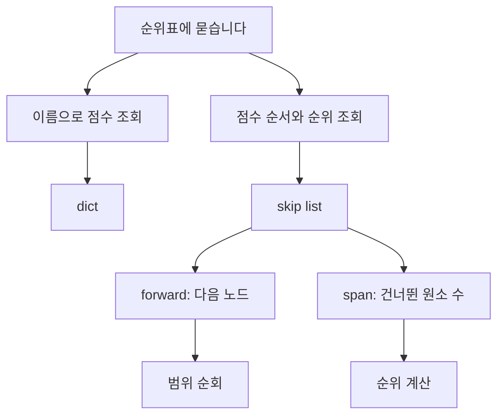
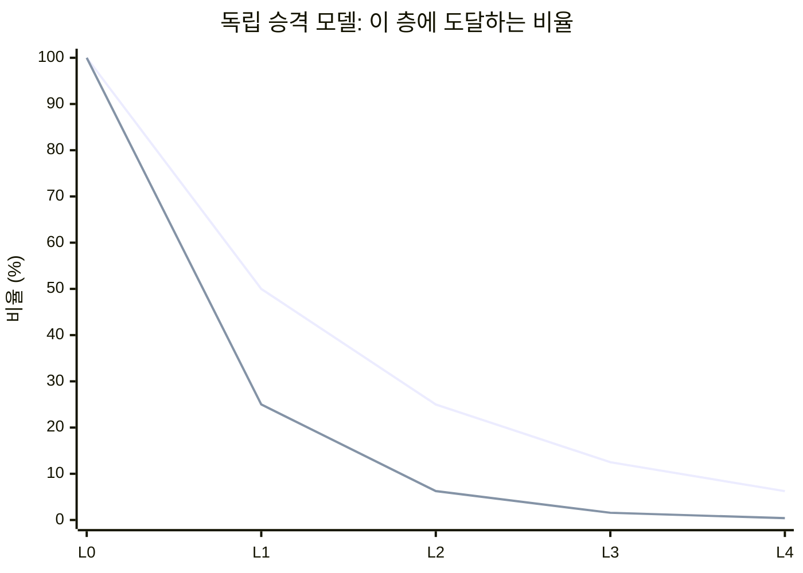
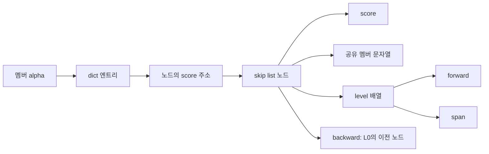
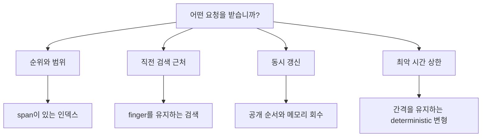

# Skip list: 동전 던지기에서 Redis의 순위표까지

> 높은 노드 몇 개로 검색을 줄이는 구조가 Redis에서는 순위를 세고, LevelDB에서는 쓰는 동안 읽히는 메모리 인덱스가 됩니다. 검색 경로와 span을 직접 바꾸고, 논문과 실제 구현이 어디서 갈라지는지 따라갑니다.
> 2022-06-16 · https://alfex4936.github.io/blog/skip-list/

게임 순위표에서 점수를 바꾸는 일과 "내 위에 몇 명이 있나"를 묻는 일은 다른 연산입니다. 이름으로 점수를 찾기는 쉬워도, 앞에 있는 사람을 매번 세면 순위표가 길어질수록 오래 걸립니다.

Redis의 큰 sorted set은 이 둘을 서로 다른 구조에 맡깁니다. 이름은 해시 테이블에서 찾고, 점수 순서는 skip list에 둡니다. 그런데 skip list의 포인터만 따라가서는 건너뛴 사람이 몇 명인지 알 수 없습니다. Redis는 포인터 옆에 그 수까지 저장합니다.

이 글은 그 숫자에서 시작해서, 동전 던지기로 만든 높이가 왜 검색을 줄이는지, 저장 엔진과 동시성 자료구조에서는 무엇이 달라지는지 이어집니다. 원 논문과 Redis 6.2.6, LevelDB 1.23, OpenJDK 11의 구현을 읽었습니다. 아래 재현과 시각화 검증은 **2026-10-10에 실행한 확인**입니다. 화면의 2022년 날짜와 당시 실행 기록을 뜻하지는 않습니다.



## 연결 리스트에 급행 정류장을 만듭니다

정렬된 연결 리스트에서 42를 찾는다고 생각해 봅니다. 시작점에서 다음 노드를 읽고, 작으면 또 다음으로 갑니다. 배열처럼 가운데 주소를 바로 계산할 수 없으니 이진 탐색을 붙이기도 어렵습니다.

skip list는 일부 노드에 더 멀리 가는 포인터를 붙입니다. 바닥 층 L0에는 모든 노드가 있고, 위층은 그중 일부만 연결합니다. 높은 층에서 시작해 다음 값이 목표보다 작으면 오른쪽으로 갑니다. 다음 값이 목표 이상이면 같은 노드에서 한 층 내려갑니다. 위로 다시 올라가지는 않습니다.[^pugh]

아래 그림에서 `다음`을 눌러 보시면 "지나갈 수 없어서 내려간다"는 동작도 한 단계로 나옵니다. 목표를 35로 바꾸면 값이 없는 검색을 볼 수 있습니다. 없다는 판정 역시 바닥 층에서 합니다.

<SkipListViz />

각 위층은 바닥 리스트의 부분집합입니다. 검색 도중 작은 값을 건너뛸 수 있지만, 목표를 넘어서는 연결은 타지 않습니다. 목표 앞에 도착하면 아래층에 더 촘촘한 길이 있습니다.

여기서 높이는 검색의 *정확성*을 정하지 않습니다. 모든 노드가 높이 1이어도 답은 맞습니다. 오른쪽으로 걸어가는 횟수가 늘어날 뿐입니다. 높이 메뉴를 `모두 높이 1`로 바꾸고 73을 찾아 보면 차이를 볼 수 있습니다.

독립적인 승격 모델에서 검색·삽입·삭제 비용은 기댓값 $O(\log n)$입니다. 특정 리스트 하나의 최악 시간은 $O(n)$일 수 있습니다. 동전이 약속하는 것은 "이번에도 반드시 빠르다"가 아니라 분포 전체에서의 비용입니다.[^pugh]

<Quiz title="높이가 나쁘게 나왔을 때" items={[
  { q: "난수 결과가 좋지 않아 모든 노드의 높이가 1이 됐습니다. 어떤 문제가 생깁니까?", choices: ["검색이 일부 값을 놓칩니다.", "바닥 리스트는 정렬되어 있으므로 답은 맞지만, 긴 선형 탐색이 됩니다.", "삽입 순서대로 정렬됩니다."], answer: 1, why: "정렬된 L0와 목표를 넘지 않는 검색 규칙이 정확성을 지킵니다. 위층의 분포는 검색 비용을 바꿉니다. 기대 시간과 정답 보장은 별개입니다." },
]} />

## 동전을 던지는 이유, 그리고 동전값

Pugh의 원 논문은 노드를 한 층 높일 확률을 $p$로 둡니다. 처음 한 층은 누구에게나 있고, 승격에 성공할 때마다 한 층을 더 받습니다. 높이를 제한하지 않는 독립적인 승격 모델에서 높이 $H$의 분포는 다음과 같습니다.[^pugh]

$$
\begin{aligned}
P(H \ge k)&=p^{k-1}\\
E[H]&=1+p+p^2+\cdots\\
&=\frac{1}{1-p}
\end{aligned}
$$

따라서 $p=1/2$이면 노드당 forward 포인터 수의 기댓값은 2개, $p=1/4$이면 $4/3$개입니다. 헤더, 값, span, backward 포인터, 할당기의 여유 공간을 뺀 **forward 슬롯만의 계산**입니다. 이것을 그대로 노드당 메모리 바이트라고 부를 수는 없습니다.



이 그래프는 측정값이 아니라 위 식의 값입니다. $p$를 줄이면 위층 노드는 줄고, 같은 층에서 더 멀리 걸을 수 있습니다. Pugh가 분석한 탐색 비용의 주항은 $(1/p)\log_{1/p}n$ 형태입니다. $p=1/2$와 $p=1/4$는 이 주항이 같아지는 조합이지만, 실제 프로그램의 실행 시간이 같다는 뜻은 아닙니다.[^pugh]

Redis 6.2.6은 승격 확률 `ZSKIPLIST_P = 0.25`, 최대 높이 `ZSKIPLIST_MAXLEVEL = 32`를 씁니다. LevelDB 1.23도 분기 계수 4로 높이를 뽑지만 최대 높이는 12입니다. 둘 다 교과서 그림의 "공정한 동전"을 그대로 쓰지 않습니다.[^redis-structure][^leveldb]

앞의 그림은 읽을 수 있는 크기로 최대 높이를 4로 제한했습니다. `p = 1/4`나 `p = 1/2`를 고르면 시드가 있는 난수로 높이를 만들고, `다른 시드`로 다시 뽑습니다. 작은 예제 하나가 논문의 기대 시간 증명이나 Redis의 난수 구현을 대신하지는 않습니다.

## Redis는 이름과 순서를 따로 보관합니다

Redis 6.2.6의 `zset`에는 `dict`와 `zsl`이 있습니다. 멤버 이름으로 현재 점수를 찾을 때는 dict를 읽습니다. 점수 범위와 순위에서는 skip list를 탐색합니다. 두 구조는 멤버 문자열을 공유하고, dict의 값은 skip list 노드의 `score` 필드를 가리킵니다.[^redis-structure][^redis-code]



이 설명에는 크기 조건이 붙습니다. Redis 6.2.6의 작은 sorted set은 ziplist를 쓸 수 있습니다. 기본 `zset-max-ziplist-entries`는 128, `zset-max-ziplist-value`는 64바이트입니다. 이 조건을 넘으면 dict와 skip list를 쓰는 표현으로 바뀝니다. 모든 `ZADD`가 처음부터 skip list 노드를 만드는 것은 아닙니다.[^redis-config]

Redis의 정렬 기준도 "점수" 한 단어로 끝나지 않습니다. 점수가 같으면 `sdscmp`로 멤버 문자열을 비교합니다. 언어별 사전순이나 지역화된 문자열 정렬이 아니라 바이트 비교입니다. 이 글의 ASCII 예제에서는 같은 점수의 `alpha`, `bravo`, `charlie`가 그 순서로 나옵니다.[^redis-code]

멤버 이름은 유일하지만 점수는 중복될 수 있습니다. "skip list가 중복을 허용하나요?"라는 질문은 비교 키가 무엇인지 먼저 정해야 답할 수 있습니다. Redis에서는 `(score, member)`가 순서를 정하고, dict가 같은 멤버의 재등록을 갱신으로 처리합니다.

## 순위는 포인터 옆의 span으로 셉니다

`forward`가 목적지만 알려 준다면 `span`은 거기까지 바닥 원소를 몇 개 지나는지 알려 줍니다. Redis의 `zslGetRank`는 목표를 넘지 않는 연결을 타면서 span을 더합니다.[^redis-code]

이 그림의 값 42를 `순위` 모드로 찾아 보겠습니다. 설명용 높이에서는 H에서 26까지 span 4를 더하고, 26에서 42까지 span 2를 더합니다. 바닥 노드 여섯 개를 두 번의 수평 이동으로 셉니다. 이 값은 `npm run test:skiplist`가 그림과 같은 엔진에서 확인합니다.

<SkipListViz mode="rank" />

헤더 H는 내부 순위 0입니다. 첫 원소는 1이고, 그림의 42는 6입니다. Redis의 내부 순위와 공개 명령 `ZRANK`는 시작점이 다릅니다. `ZRANK`는 0부터 세므로 이 예제에 해당하는 공개 순위는 5입니다.[^redis-code]

span은 점수 차이가 아닙니다. 점수가 26에서 42로 벌어져도 그 사이에 몇 노드가 있는지만 셉니다. 끝의 null을 향하는 span에는 남아 있는 바닥 원소 수가 들어갈 수 있습니다. rank 탐색은 null 링크로 이동하지 않으므로 그 값을 더하지 않습니다.

범위 조회에서는 시작점을 찾은 뒤 L0를 따라 결과를 읽습니다. 결과 $M$개를 반환해야 한다면 그 $M$개를 읽는 비용은 사라지지 않습니다. `ZRANGE`의 $O(\log N+M)$에서 $M$을 빼고 설명하면 큰 범위 조회의 비용을 놓칩니다.[^zrange]

## 삽입은 두 포인터만 바꾸고 끝나지 않습니다

연결 리스트 삽입을 처음 배우면 앞 노드와 새 노드의 연결을 고칩니다. skip list에서도 각 층에서 새 노드 바로 앞에 멈춘 위치를 `update[]`에 모읍니다. Redis는 그 위치까지 센 순위를 `rank[]`에도 남깁니다.[^redis-code]

기존 연결의 span을 $S$, 해당 층의 앞 노드에서 삽입 직전 위치까지 바닥에서 이동한 수를 $d$라 두면, 새 연결의 span은 다음처럼 나뉩니다.

$$
S_{\text{앞→새}}=d+1,\qquad
S_{\text{새→뒤}}=S-d
$$

새 노드가 참여하지 않는 더 높은 층도 원소 하나가 연결 밑에 추가됐으므로 span을 1 늘려야 합니다. 새 노드의 높이만큼 포인터를 연결하는 일과 전체 활성 층의 카운트를 고치는 일은 다릅니다.

아래는 높이 2인 값 35의 삽입입니다. 마지막 단계에서 바뀐 연결과 span이 주황색으로 표시됩니다. 35가 없는 L2에서도 `26 → 58`의 span이 3에서 4로 바뀝니다. 새 포인터가 없어도 카운트는 바뀝니다. 삭제 모드에서는 반대로 내려갑니다.

<SkipListViz mode="insert" target={35} />

그림의 엔진은 실제로 `update[]`와 `rank[]`를 만들고 연결과 span을 갱신합니다. 각 단계를 그럴듯하게 적어 둔 재생 표는 아닙니다. 테스트는 삽입과 삭제 2,000회를 정렬된 집합과 대조하고, 각 연결의 span이 목적지 순위에서 출발 순위를 뺀 값인지 검사합니다. 이는 이 학습 모델의 검증이며 Redis C 구현 전체의 검증을 대신하지 않습니다.

<Quiz title="높이 2인 노드를 넣었습니다" items={[
  { q: "새 노드가 L0와 L1에만 존재합니다. 이 노드를 가로질러 가는 L2 링크는 어떻게 바뀝니까?", choices: ["목적지는 그대로이며 span은 1 늘어납니다.", "목적지가 새 노드로 바뀝니다.", "새 노드가 없으니 span도 그대로입니다."], answer: 0, why: "L2 포인터가 건너뛰는 바닥 원소가 하나 늘었습니다. rank를 지원하는 구현은 새 노드가 없는 층의 span도 갱신해야 합니다." },
]} />

## 점수 변경에도 제자리 갱신이 있습니다

큰 Redis sorted set에서 점수를 바꿀 때마다 반드시 노드를 새로 만드는 것은 아닙니다. `zslUpdateScore`는 새 점수가 앞 노드의 점수보다 크고 뒤 노드의 점수보다 작은지 봅니다. 리스트 양 끝에서는 없는 이웃 쪽 조건을 생략합니다. 이 조건을 만족하면 `score`만 바꿉니다.[^redis-code]

순서가 유지되므로 연결과 span은 그대로입니다. dict가 노드의 score 주소를 가리키는 것도 여기에 맞습니다. 제자리 조건을 만족하지 못하면 기존 노드를 삭제하고 새 점수로 삽입합니다. 새 노드를 만든 경로에서는 dict가 가리키는 score 주소도 바뀝니다.

조건이 엄격한 `<`, `>`라는 점도 볼 만합니다. 이웃과 점수가 같아지는 변경은 멤버의 바이트 순서까지 따져야 하므로 이 빠른 경로로 판정하지 않습니다. 반면 아예 같은 점수를 다시 쓰는 `ZADD`는 상위 경로에서 점수 변경을 생략할 수 있습니다.

### 실제 Redis에서 확인합니다

다음 Lua는 기본 zset 임계값으로 시작한 단독 Redis 6.2.6에서 실행하는 재현입니다. ziplist 경계, 같은 점수의 순서, 점수 변경, 삭제, NaN 입력 거절을 확인합니다. 순위표 키는 65바이트 멤버를 잠깐 넣어 skiplist로 바꾼 뒤 그 멤버를 지웁니다. 여러 키를 쓰므로 Cluster 예제가 아니며, 운영 서버에 붙여서 실행하는 스크립트도 아닙니다.

```lua title="zset-contract.lua"
local boundary = "skiplist-check:boundary"
local board = "skiplist-check:board"
redis.call("DEL", boundary, board)
for i = 1, 128 do
  redis.call("ZADD", boundary, i, string.format("m:%03d", i))
end
assert(redis.call("OBJECT", "ENCODING", boundary) == "ziplist")
redis.call("ZADD", boundary, 129, "m:129")
assert(redis.call("OBJECT", "ENCODING", boundary) == "skiplist")
redis.call("ZREM", boundary, "m:129")
assert(redis.call("OBJECT", "ENCODING", boundary) == "skiplist")

local trigger = string.rep("x", 65)
redis.call("ZADD", board, 10, "charlie", 10, "alpha", 10, "bravo")
redis.call("ZADD", board, 0, trigger)
redis.call("ZREM", board, trigger)
assert(redis.call("OBJECT", "ENCODING", board) == "skiplist")
local ties = table.concat(redis.call("ZRANGE", board, 0, -1), ",")
assert(ties == "alpha,bravo,charlie")
assert(redis.call("ZRANK", board, "alpha") == 0)
assert(redis.call("ZRANK", board, "bravo") == 1)
assert(redis.call("ZRANK", board, "charlie") == 2)
redis.call("ZADD", board, 20, "alpha")
redis.call("ZADD", board, 21, "alpha")
redis.call("ZADD", board, 21, "alpha")
assert(redis.call("ZCARD", board) == 3)
assert(redis.call("ZSCORE", board, "alpha") == "21")
assert(redis.pcall("ZADD", board, "nan", "alpha").err)
assert(redis.call("ZSCORE", board, "alpha") == "21")
local moves = table.concat(redis.call("ZRANGE", board, 0, -1), ",")
assert(moves == "bravo,charlie,alpha")
redis.call("ZREM", board, "charlie")
local deleted = table.concat(redis.call("ZRANGE", board, 0, -1), ",")
assert(deleted == "bravo,alpha")
return {
  "boundary: ziplist/skiplist",
  "ties: " .. ties,
  "ranks: 0,1,2",
  "moves: " .. moves,
  "delete: " .. deleted
}
```

블로그 소스의 `python3 scripts/test-skiplist-redis.py --docker`는 이 코드 블록을 그대로 추출합니다. 격리한 `redis:6.2.6` 컨테이너에서 실행하고 컨테이너를 지웁니다. 이 글의 확인에서는 다음 결과가 나왔습니다.

```text
boundary: ziplist/skiplist
ties: alpha,bravo,charlie
ranks: 0,1,2
moves: bravo,charlie,alpha
delete: bravo,alpha
```

이 명령 결과는 순서와 인코딩을 확인합니다. 제자리 갱신과 재삽입 중 어느 C 분기를 탔는지는 이 출력만으로 판별할 수 없습니다. 그 구분은 `zslUpdateScore`의 조건을 읽은 결과입니다. 내부 구현을 관찰한 것과 외부 동작을 재현한 것을 섞지 않습니다.

## LevelDB는 읽는 동안 노드가 사라지지 않습니다

LevelDB 1.23의 memtable에도 skip list가 들어갑니다. 여기서 순서는 Redis의 점수 순서가 아닙니다. memtable 엔트리는 internal key를 포함하며, 사용자 키가 같으면 sequence number 등의 내부 정보가 비교에 들어갑니다. 새로운 버전이 앞에 오는 정렬 덕분에 읽기 시점에 맞는 버전을 찾습니다.[^leveldb-mem]

memtable에 쓴 내용이 파일로 내려간 뒤에도 디스크에서 skip list를 읽는 것은 아닙니다. LevelDB의 SSTable은 블록과 인덱스를 쓰는 별도 형식입니다. "LSM 저장 엔진이 skip list를 쓴다"는 설명은 어느 층을 말하는지 붙여야 합니다.[^leveldb-table]

`db/skiplist.h` 맨 위의 동시성 계약은 구체적입니다. 쓰기는 외부에서 동기화하고, 읽기는 다른 쓰레드에서 동시에 해도 됩니다. 읽는 동안 skip list가 파괴되지 않아야 합니다. 노드는 Arena에서 할당하고, 개별 노드를 삭제하지 않습니다. 리스트를 파괴할 때 함께 정리합니다.[^leveldb]

<TracePlayer
  title="새 노드가 독자에게 보이는 시점"
  columns={["기존 노드의 next", "새 노드의 next", "독자가 볼 수 있는 경로"]}
  caption="LevelDB 1.23의 초기화와 release/acquire 공개 순서를 단일 링크로 줄인 모델입니다. CPU 시간을 측정하지 않으며, 전체 삽입의 동시성 증명은 아닙니다."
  tracks={[
    { label: "초기화 후 공개", steps: [
      { action: "삽입 전", note: "기존 링크가 42를 가리킵니다. 새 노드는 아직 독자가 도달할 수 없습니다.", values: ["42", "미공개", "26 → 42"] },
      { action: "새 노드 초기화", note: "쓰기 쓰레드가 35의 다음 포인터를 먼저 채웁니다.", values: ["42", "42", "26 → 42"] },
      { action: "release로 연결", note: "앞 노드의 next를 공개합니다. 독자는 acquire로 이 링크를 읽습니다.", values: ["35", "42", "26 → 35 → 42"] },
    ] },
  ]}
/>

LevelDB의 `Next()`는 acquire load, `SetNext()`는 release store를 씁니다. 아직 공개되지 않은 새 노드의 링크를 초기화할 때는 relaxed store를 쓸 수 있습니다. "포인터는 원자적으로 읽히니까 괜찮다"로 끝내면, 포인터가 가리키는 노드의 초기화가 언제 보이는지 설명하지 못합니다.

삭제가 없다는 조건도 중요합니다. 독자가 읽던 노드가 도중에 해제되는 문제를 이 자료구조에서는 피합니다. Redis용 span과 개별 삭제를 이 코드에 붙이면 기존 동시성 계약으로 안전하다고 말할 수 없습니다. 추가 필드와 수명 규칙을 다시 설계해야 합니다.

## 동시 skip list는 구현마다 계약이 다릅니다

OpenJDK 11의 `ConcurrentSkipListMap`은 바닥 노드와 위층의 `Index` 노드를 나눕니다. CAS를 쓰는 갱신 경로와 삭제용 marker, 진행 중인 삭제를 돕는 코드가 있습니다. LevelDB처럼 "쓰기 하나와 삭제 없음"을 전제로 읽기만 허용하는 코드가 아닙니다.[^jdk]

바닥 리스트의 삭제 알고리즘은 소스 주석이 Harris와 Michael의 HM 알고리즘으로 명시합니다. Fraser는 관련 연구로 인용합니다. 논문 목록에 이름이 있다고 해서 그 논문의 구현을 그대로 가져왔다고 읽으면 안 됩니다.[^jdk]

이 구현의 주석은 바닥 리스트에서 값을 찾고 위의 인덱스를 탐색 보조로 사용한다고 설명합니다. 삽입과 삭제가 경쟁할 때 인덱스에 잠시 없는 노드가 생겨도 바닥 리스트가 값을 찾을 수 있어야 합니다. 처음 봤던 "높이가 정답을 결정하지 않는다"는 성질이 여기서 다시 쓰입니다.

Fraser의 *Practical lock-freedom*은 CAS 기반 자료구조뿐 아니라 메모리 회수까지 다룹니다. 노드를 리스트에서 분리하는 일과 다른 쓰레드가 더 이상 참조하지 않아 해제할 수 있는 시점을 정하는 일은 다릅니다. Java의 GC에 기대는 구현과 C/C++에서 수명을 직접 관리하는 구현을 포인터 그림 하나로 같다고 볼 수 없습니다.[^fraser]

| 구현 | 무엇의 순서인가 | 갱신과 노드 수명에서 볼 부분 |
| --- | --- | --- |
| Redis 6.2.6 zset | 점수, 그다음 멤버 바이트 | dict와 span을 함께 고치며 개별 삭제를 합니다. 이 skip list 자체가 범용 동시성 컨테이너는 아닙니다. |
| LevelDB 1.23 memtable | internal key | 외부에서 쓰기를 동기화합니다. 동시 독자는 읽는 동안 구조가 살아 있어야 하고, 개별 삭제는 없습니다. |
| OpenJDK 11 ConcurrentSkipListMap | 키 comparator | 바닥/인덱스 분리, CAS, 삭제 도움, GC를 함께 봅니다. |

표의 자료구조에 모두 skip list라는 이름이 붙어도 "동시에 쓸 수 있다"나 "삭제해도 독자가 안전하다"는 속성이 공유되지는 않습니다.

`lock-free`라는 용어도 "모든 호출이 정해진 횟수 안에 끝난다"는 뜻으로 쓰지 않습니다. 시스템 전체의 진행 보장과 한 호출의 완료 보장은 다릅니다. 재시도하는 호출이 오래 기다릴 수 있고, 이것은 `wait-free`와 구별해야 하는 부분입니다.[^fraser]

## 논문에서는 rank 다음에 finger와 merge가 나옵니다

Pugh의 *A Skip List Cookbook*에는 검색과 삽입 외에 순위 연산, finger 검색, merge, split, concatenate가 나옵니다. 같은 자료구조라도 요청이 어디에서 시작하는지, 어떻게 이어지는지에 따라 더 할 일이 있습니다.[^cookbook]

finger는 이전 검색 근처의 위치를 기억하는 손가락입니다. 직전 위치에서 순위상 $k$만큼 떨어진 대상을 찾는 검색을 기댓값 $O(\log k)$로 분석합니다. 모든 검색을 헤더에서 다시 시작하는 코드와 전제가 다릅니다. 이 결과가 Redis의 `ZRANK`에 자동으로 적용되는 것은 아닙니다.

merge도 두 입력이 얼마나 뒤섞였는지에 따라 작업량이 달라집니다. 한 리스트의 값이 다른 리스트 뒤에 통째로 붙는 경우에는 concatenate가 맞습니다. Cookbook이 분석하는 merge는 이런 입력의 배치를 구별합니다. 항상 양쪽 바닥 리스트를 끝까지 순회하는 병합만이 선택지는 아닙니다.

확률 자체를 빼는 연구도 있습니다. Munro, Papadakis, Sedgewick의 *Deterministic Skip Lists*는 층 사이의 간격에 조건을 두고 높이를 조정해 최악 시간의 로그 경계를 얻습니다. 노드 높이를 난수로 뽑는 구현에 그 보장이 생기는 것은 아닙니다.[^deterministic]



skip list를 선택한다고 해서 이 기능을 모두 받는 것은 아닙니다. 필요한 기능이 붙은 *구현*을 선택해야 합니다. 특히 Cookbook의 알고리즘, 저장 엔진의 수명 계약, concurrent map의 진행 보장을 한 문장으로 묶으면 실제 코드가 하지 않는 일을 설명하게 됩니다.

## 어떤 구현을 고를지 확인합니다

순위표라면 이름 조회, 같은 점수의 순서, rank가 필요한지부터 묻습니다. span이 없는 정렬 map은 범위 순회는 해도 rank를 같은 비용으로 답하지 못할 수 있습니다.

memtable이라면 삽입 후 노드를 개별 삭제해야 하는지 묻습니다. 수명을 통째로 묶을 수 있는 구조와, 아무 때나 노드를 지우는 구조는 독자를 보호하는 방법부터 다릅니다. 배열이나 B-tree와 비교할 때도 $O(\log n)$만으로 승자를 정하지 않습니다. 포인터를 따라가며 메모리를 읽는 비용, 연속 배치, 결과를 순회하는 길이까지 해당 작업에서 확인해야 합니다.

<Quiz title="다른 작업에 옮겨 봅니다" items={[
  { q: "span이 없는 skip list 기반 map에 `내 순위` 기능을 붙이려 합니다. 먼저 무엇을 확인해야 합니까?", choices: ["상위 포인터만 타면 순위가 자동으로 나옵니다.", "건너뛴 원소 수를 저장하는지, 삽입과 삭제가 그 수를 일관되게 고치는지 확인합니다.", "점수가 정수이면 점수 자체가 순위입니다."], answer: 1, why: "목적지 포인터만으로는 몇 원소를 건너뛰었는지 모릅니다. 중복 점수와 점수 간격도 있으므로 score로 rank를 대신할 수 없습니다." },
  { q: "LevelDB 방식의 읽기 경로를 가져오면서 개별 노드를 즉시 free하도록 바꿨습니다. acquire/release 포인터면 충분합니까?", choices: ["충분합니다. 원자적인 포인터는 대상 수명까지 보장합니다.", "충분하지 않습니다. 독자가 잡고 있는 노드를 언제 해제할지 별도 회수 규칙이 필요합니다.", "바닥 포인터만 free하면 항상 안전합니다."], answer: 1, why: "공개 순서와 메모리 수명은 다른 문제입니다. LevelDB의 이 구현은 개별 삭제가 없다는 조건을 갖고 있습니다. 그 조건을 없애면 기존 계약을 다시 사용할 수 없습니다." },
  { q: "Redis가 반환할 범위의 시작점을 빨리 찾았습니다. 결과 10,000개를 돌려주는 비용도 로그 시간입니까?", choices: ["그렇습니다. skip list는 모든 범위를 한 포인터로 반환합니다.", "아닙니다. 결과 원소를 읽고 반환하는 비용이 별도로 남습니다.", "점수가 같을 때만 선형 비용이 생깁니다."], answer: 1, why: "시작점 탐색 뒤에는 결과 M개를 순회합니다. ZRANGE의 문서화된 비용은 O(log N + M)입니다. 10,000은 질문에서 정한 결과 크기이지 측정값이 아닙니다." },
]} />

<FlashCards title="다음에 소스를 읽을 때" cards={[
  { front: "forward와 span", back: "forward는 목적지, span은 그 연결이 지나가는 바닥 원소 수입니다. rank는 실제로 탄 연결의 span을 더합니다." },
  { front: "확률이 지키는 것", back: "노드 높이의 분포와 기대 검색 비용입니다. 정답은 정렬된 바닥 리스트와 검색 규칙이 지킵니다. 나쁜 높이는 선형 탐색을 만들 수 있습니다." },
  { front: "Redis에서 같은 점수", back: "멤버 문자열의 바이트 순서로 정렬합니다. 멤버는 유일하고 점수는 중복될 수 있습니다." },
  { front: "LevelDB의 동시 읽기 조건", back: "쓰기는 외부에서 동기화하고, 읽는 동안 구조가 살아 있어야 합니다. 개별 노드는 리스트가 파괴되기 전에 삭제하지 않습니다." },
  { front: "finger 검색", back: "직전 검색 근처에서 시작하도록 위치를 유지하는 알고리즘입니다. 헤더에서 시작하는 보통 검색에 자동으로 붙는 보장은 아닙니다." },
  { front: "lock-free와 wait-free", back: "전체의 진행 보장과 호출별 완료 보장은 다릅니다. lock-free에서도 한 호출은 경쟁 때문에 재시도할 수 있습니다." },
]} />

[^pugh]: William Pugh, [Skip Lists: A Probabilistic Alternative to Balanced Trees](https://epaperpress.com/sortsearch/download/skiplist.pdf), *Communications of the ACM*, 1990. 링크는 PDF 미러이며, 출판 기록은 [DOI 10.1145/78973.78977](https://doi.org/10.1145/78973.78977)입니다. 표 1의 포인터 수와 정규화한 탐색 비용을 확인했습니다. 원 저자의 PDF 주소는 확인 당시 404였습니다.
[^cookbook]: William Pugh, [A Skip List Cookbook](https://drum.lib.umd.edu/items/56c44671-3973-46b6-9e52-f71dc95af178), CS-TR-2286.1 / UMIACS-TR-89-72.1. [대학 저장소 PDF](https://api.drum.lib.umd.edu/server/api/core/bitstreams/17176ef8-8330-4a6c-8b75-4cd18c570bec/content)의 finger 검색과 선형 리스트 연산을 확인했습니다. rank, finger, merge의 보장은 각 알고리즘의 전제 아래 읽어야 합니다.
[^redis-structure]: Redis [6.2.6 `server.h`](https://github.com/redis/redis/blob/6.2.6/src/server.h): `ZSKIPLIST_MAXLEVEL`, `ZSKIPLIST_P`, `zskiplistNode`, `zset`.
[^redis-code]: Redis [6.2.6 `t_zset.c`](https://github.com/redis/redis/blob/6.2.6/src/t_zset.c): `zslRandomLevel`, `zslInsert`, `zslDeleteNode`, `zslUpdateScore`, `zslGetRank`, `zsetAdd`, `zrankGenericCommand`.
[^redis-config]: Redis [6.2.6 `redis.conf`](https://github.com/redis/redis/blob/6.2.6/redis.conf): `zset-max-ziplist-entries`, `zset-max-ziplist-value`. 테스트 실행기는 서버를 시작할 때 이 기본 경계를 명시합니다.
[^zrange]: Redis [`ZRANGE` 명령 문서](https://redis.io/docs/latest/commands/zrange/): $O(\log N+M)$. 현재 명령 문서의 복잡도 설명을 인용하며, 이 글의 실행 대상은 6.2.6입니다.
[^leveldb]: LevelDB [1.23 `db/skiplist.h`](https://github.com/google/leveldb/blob/1.23/db/skiplist.h): 파일 상단의 계약, `Node::Next`, `Node::SetNext`, `RandomHeight`, `Insert`. 최대 높이 12, 분기 계수 4를 이 태그에서 확인합니다.
[^leveldb-mem]: LevelDB [1.23 `db/memtable.cc`](https://github.com/google/leveldb/blob/1.23/db/memtable.cc)와 [`db/dbformat.h`](https://github.com/google/leveldb/blob/1.23/db/dbformat.h): `KeyComparator`, `InternalKeyComparator`.
[^leveldb-table]: LevelDB [1.23 `doc/table_format.md`](https://github.com/google/leveldb/blob/1.23/doc/table_format.md): data block과 index block.
[^jdk]: OpenJDK [`jdk-11+28`의 `ConcurrentSkipListMap.java`](https://github.com/openjdk/jdk/blob/jdk-11%2B28/src/java.base/share/classes/java/util/concurrent/ConcurrentSkipListMap.java): 구현 주석, `Node`, `Index`, 검색·삽입·삭제 경로.
[^fraser]: Keir Fraser, [Practical lock-freedom](https://www.cl.cam.ac.uk/techreports/UCAM-CL-TR-579.html), University of Cambridge, 기술 보고서 579, 2004. skip list 구현과 진행 보장, 메모리 회수를 다룹니다.
[^deterministic]: J. Ian Munro, Thomas Papadakis, Robert Sedgewick, [Deterministic Skip Lists](https://sedgewick.io/wp-content/themes/sedgewick/papers/1992Skip.pdf), SODA 1992. 저자 사이트의 PDF에서 로그 시간의 검색·삽입·삭제를 보장하는 변형을 확인했습니다. 논문 안의 모든 변형이 같은 갱신 비용을 갖는 것은 아닙니다.
