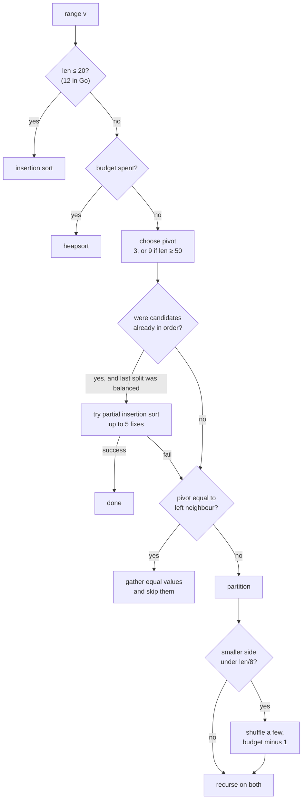
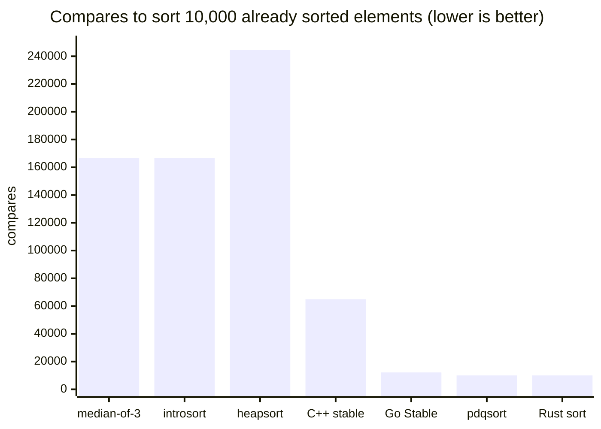

# What actually runs when you call sort(): quicksort in C++, Rust and Go

> Textbook quicksort goes quadratic on an already sorted array, so none of the C++, Rust or Go standard libraries ship it. This post follows libstdc++'s introsort, the pdqsort in Rust and Go 1.19, and the three stable sorts, with animations showing which input each one defends against and how.
> 2022-09-14 · https://alfex4936.github.io/blog/sorting-in-the-wild/

Go 1.19 came out last month, and `sort.Sort` switched to pdqsort along the way.[^1] The release notes give it one line ("faster in some common scenarios"), so finding out what got faster and why meant reading the code. While I was at it I read the Rust and C++ versions too. All three are called sort and all three start from quicksort, but they guard against quicksort's weak spots in rather different ways.

Every figure in this post is live. Each bar is one element and its height is the value. Yellow marks the two elements being compared, red the ones just swapped, and an outlined bar is the pivot. Anything outside the range currently being worked on is dimmed. When several panels sit side by side they are racing on the same input: every panel performs the same number of compares or swaps per frame, so **whichever does less work finishes first.**

The compare counts in the figures and tables come from JavaScript ports of the three libraries' sorts. The ports follow the original branches and constants, and every input is generated from the same seed (7). These are not timings of the real libraries, so read them as ratios rather than absolute numbers.

## Start with insertion sort

Insertion sort is usually the first sort anyone learns. You pick up one card at a time from the left and slide it into place among the cards already in order. Each insertion compares against the cards before it one by one, so on random input it costs about $n^2/4$ compares.

Quicksort picks a pivot and sends everything smaller to the left and everything larger to the right. The pivot is now in its final place, and the two sides can be sorted independently. If the pivot lands near the middle every time, the problem halves at each level and you get roughly $n \log_2 n$ compares.

> Interactive visual: The same 60 random values. When quicksort on the right is done, insertion sort on the left is about a third of the way through. (try it on the original page: https://alfex4936.github.io/blog/sorting-in-the-wild/)

At 60 elements the counts are 922 against 430, a bit over 2×, but the gap opens quickly. On 200 random elements insertion sort made 10,054 compares and quicksort 1,764.

Yet all three libraries below **still use insertion sort.** Once quicksort has cut a range down to a dozen or so elements, they hand it over. With so few elements, the fixed cost of recursion and pivot selection outweighs the difference between $n^2$ and $n \log n$, and insertion sort walks memory front to back, which caches love. The cutoff is 16 in C++, 20 in Rust and 12 in Go.

## Same quicksort, different partition

How you partition changes quicksort's character a lot. The two schemes in most textbooks are Lomuto's and Hoare's.

Lomuto takes the last element as the pivot and walks forward, moving every element smaller than the pivot to a growing left region. It is short, which is why textbooks like it. Hoare walks two pointers inward from both ends. The left one stops at an element greater than or equal to the pivot, the right one at an element less than or equal to it, and the two are swapped. Switching inputs in the figure below makes the difference obvious.

> Interactive visual: Pick 'sorted' from the input menu. Lomuto shrinks the range by one element at a time. (try it on the original page: https://alfex4936.github.io/blog/sorting-in-the-wild/)

On random input both are fine. At n=200, Lomuto made 1,878 compares and Hoare 2,300, while Lomuto swapped 740 times to Hoare's 354. Hoare compares a little more and swaps less than half as often.

On sorted input Lomuto collapses. The last element is always the maximum, so each partition peels off just the pivot and passes the other $n-1$ elements down. That is $n(n-1)/2$ compares, exactly 19,900 at n=200, with a recursion depth of 199. Re-sorting an already sorted array happens more than you'd think in practice: logs accumulated in time order, or a sorted list with a few items appended and sorted again.

**Quiz: Checkpoint: a lopsided partition**

1. You pass an already sorted array to Lomuto quicksort with the last element as pivot. Why does its comparison count become quadratic?
   - Every pivot is the maximum, so the remaining range shrinks by only one element.
   - Sorted input makes every comparator call happen twice.
   - The pivot is the median, so every split halves the range.

   Answer: Every pivot is the maximum, so the remaining range shrinks by only one element. Repeated lopsided partitions reduce the remaining length one element at a time. Being already sorted does not save comparisons when the partitioning is unbalanced.

The '4 values' input is worth a look too. With many duplicates, Lomuto pushes everything equal to the pivot to one side and leans again (5,446 compares, depth 53). Hoare stops and swaps on equal values as well, so duplicates end up split evenly between the two sides (1,943 compares). Swaps that look pointless are what keep it balanced.

Hoare has its own weak spot. This version uses the middle element as the pivot, and on an organ-pipe input, where values rise toward the middle and fall again, the middle is always the maximum. It takes 10,900 compares and reaches depth 104. If you always draw the pivot from one position, some input will target that position.

## Choose the pivot from three

The usual remedy is to draw candidates from several positions and use their median. Take one each from the start, middle and end and use the middle value, and you have **median-of-3**. Do that three times and take the median of the medians, and you have the **ninther**. On sorted input the middle value really is the median, so the pivot is perfect. On organ-pipe input the ends are small and the middle large, so the median of the three is a reasonable value.

At n=200, median-of-3 quicksort handled sorted input in 1,529 compares and organ-pipe in 2,521, at depths 5 and 11. That blocks most ordinary inputs. The trouble is inputs built on purpose.

## The input that kills quicksort

In 1999 Doug McIlroy published a short paper called "A Killer Adversary for Quicksort".[^2] The idea is lovely: you rig the comparison function you pass to the sort so that it **makes up the input while the sort is running.**

At the start no element has a value yet. The paper calls this state gas. When the comparator is asked to compare two gas elements, it freezes one of them at a value larger than anything frozen so far. It picks the one that looks like a pivot candidate, the one that has shown up in comparisons most often. As a result, the pivot quicksort picks is always close to the smallest remaining element. When the sort finishes every element is frozen, and those values, laid out as an array, form a worst-case input for that particular quicksort.

The only requirement is that the quicksort is deterministic. However clever the pivot rule, if it compares the same input in the same order every time, this method takes it down.

> Interactive visual: A 64-element killer input built against median-of-3 quicksort. The left panel shrinks by only two elements per partition; introsort in the middle switches to heapsort when it hits its depth limit. (try it on the original page: https://alfex4936.github.io/blog/sorting-in-the-wild/)

In the left panel the range shrinks by just two elements after each partition. At 64 elements that's 1,142 compares and depth 25, which isn't dramatic, but scale it up and things change.

| n | random input | killer input | ratio | max depth |
|---|---:|---:|---:|---:|
| 1,000 | 12,521 | 253,394 | 20× | 493 |
| 10,000 | 160,402 | 25,034,894 | 156× | 4,993 |

Ten thousand elements, 25 million compares, recursion nearly 5,000 deep. At that point the stack is a bigger worry than the speed. If a web server sorts a list a user sent it, a crafted list can pin the CPU.

There are two ways out. Pick pivots at random so an attacker can't predict the order, or detect the collapse and switch to a different algorithm. All three languages chose the second. A random pivot is only fast in expectation, the worst case is still $O(n^2)$, and a library whose running time varies from run to run on the same input is not something maintainers want either.

## C++: introsort

libstdc++'s `std::sort` is **introsort**, proposed by David Musser in 1997.[^3] It starts as quicksort but caps the recursion depth. A healthy quicksort should bottom out near $\log_2 n$, so going far deeper than that means pivot selection is failing. When that happens, the range is sorted with heapsort instead.

Heapsort is $O(n \log n)$ on any input but usually slower than quicksort. On 200 random elements heapsort made 2,461 compares against median-of-3 quicksort's 1,764. Memory access hurts more than the compare count: in a heap the children of index $i$ live at $2i+1$ and $2i+2$, so each step down the heap touches memory further away.

> Interactive visual: Heapsort (right) builds a heap first, then moves the maximum to the back one element at a time. Watch the bars jump across the whole array. (try it on the original page: https://alfex4936.github.io/blog/sorting-in-the-wild/)

Introsort takes the best of both: quicksort normally, heapsort only in the worst case. Its main loop is short.

```cpp title="bits/stl_algo.h (libstdc++, abridged)"
template<typename _Iter, typename _Size, typename _Compare>
void __introsort_loop(_Iter __first, _Iter __last,
                      _Size __depth_limit, _Compare __comp)
{
  while (__last - __first > int(_S_threshold))   // 16
    {
      if (__depth_limit == 0)
        {
          std::__partial_sort(__first, __last, __last, __comp);
          return;
        }
      --__depth_limit;
      _Iter __cut =
        std::__unguarded_partition_pivot(__first, __last, __comp);
      std::__introsort_loop(__cut, __last, __depth_limit, __comp);
      __last = __cut;
    }
}
```

1. Once a range is down to 16 elements or fewer, the loop just returns. Those small ranges stay unsorted, but every value in them already belongs to that range.

2. When the depth budget runs out, the rest of the range goes to `__partial_sort`. The middle argument is `__last`, meaning "sort all of it", and underneath this function is heapsort. `std::sort` passes a budget of $2\lfloor\log_2 n\rfloor$.

3. The pivot comes from `__move_median_to_first`, which moves the median of the second, middle and second-to-last elements to the front. Partitioning is Hoare-style, and because both ends are known to hold values not less than and not greater than the pivot, the pointers skip their bounds checks (unguarded).

4. The right side recurses; the left side is handled by the `while` loop. It's tail recursion turned into a loop by hand.

After `__introsort_loop` returns, `std::sort` finishes with `__final_insertion_sort`, a single insertion sort over the whole array. Each element only moves within its own range, so the compare count is about the same as sorting each 16-element range separately, and it costs one call.

The payoff shows up on the killer input. Same median-of-3 pivot, and one depth limit turns 25 million compares into half a million.

| n = 10,000 | random | sorted | killer | max depth (killer) |
|---|---:|---:|---:|---:|
| median-of-3 quicksort | 160,402 | 166,677 | 25,034,894 | 4,993 |
| introsort (`std::sort`) | 160,402 | 166,677 | 500,919 | 27 |
| heapsort | 235,624 | 244,460 | 233,001 | |

Even on the killer input introsort compares more than twice as much as plain heapsort, because it keeps making bad partitions down to depth 26 before giving up. What matters is that it stays within $O(n \log n)$.

The second column is the disappointing one. Sorting 10,000 elements that are already in order costs more compares than sorting random ones. Introsort never checks whether its input is already sorted. That is what pdqsort fixes.

## Rust and Go: pdqsort

**pdqsort** (pattern-defeating quicksort) was published by Orson Peters in 2015 and written up as a paper in 2021.[^4] The skeleton is introsort's: quicksort to split, insertion sort for small ranges, heapsort past the depth limit. On top of that sit a few mechanisms that recognise patterns in the input and exploit them. Rust has used it for `slice::sort_unstable` since 2017, and Go switched `sort.Sort` and `sort.Slice` to it in 1.19.



One at a time.

**It checks whether the pivot candidates were already in order.** While comparing the three (or nine) candidates to choose a pivot, it counts whether any of them had to be swapped. If none did, the whole range is quite likely sorted already. If the previous partition was also balanced and moved nothing, it tries insertion sort before running quicksort, but it fixes at most five misplaced elements and gives up beyond that, so a wrong guess costs no more than $O(n)$. Conversely, if the candidates needed the maximum number of swaps (12), the range is taken to be in reverse order and is flipped in one go.

That is why sorted and reversed input both finish in about $n$ compares: 10,011 each at 10,000 elements, against introsort's 166,677 and 122,044. More than a tenfold difference.

**It clears out runs of equal values in one pass.** When recursing into a right-hand range, if the new pivot equals the value just left of the range (the previous pivot), nothing in this range is smaller than it. In that case every element equal to the previous pivot is gathered on the left and never looked at again. With $k$ distinct values, this happens about $k$ times and the sort is done.

**It breaks patterns when a split is lopsided.** If the smaller side is under 1/8 of the range, a few elements near the middle are swapped with pseudo-randomly chosen positions and the budget drops by one. This scrambles whatever arrangement an attacker was aiming for. The budget is the bit length of $n$, 14 for 10,000. Once that many bad splits pile up, it falls back to heapsort just like introsort.

> Interactive visual: Try different inputs. Sorted and reversed finish after one pass. With 4 values, the equal-value step fires a few times and that's it. (try it on the original page: https://alfex4936.github.io/blog/sorting-in-the-wild/)

Rust and Go share the design but partition differently. Rust uses the **BlockQuicksort** partition by Edelkamp and Weiß.[^5] It first records the results of comparing against the pivot in a small buffer (a block) and does the swaps afterwards in bulk. Because it never branches on a comparison result, the CPU's branch predictor has fewer chances to be wrong. On random data each partition branch is a coin flip that the predictor can barely guess, and this removes that cost. Rust's blocks hold 128 elements; the figure uses 8 so you can see them move. Go's `sort.Interface` only provides `Less` and `Swap`, so there's no way to put elements in a buffer, and it uses a plain Hoare partition. Go also hands off to insertion sort earlier, at 12 rather than Rust's 20.

> Interactive visual: introsort, Go's pdqsort and Rust's pdqsort. The starting input has only 4 distinct values. (try it on the original page: https://alfex4936.github.io/blog/sorting-in-the-wild/)

Compare counts for the three at n=10,000:

| input | introsort (C++) | pdqsort (Go) | pdqsort (Rust) |
|---|---:|---:|---:|
| random | 160,402 | 144,680 | 154,658 |
| sorted | 166,677 | 10,011 | 10,011 |
| reversed | 122,044 | 10,011 | 10,011 |
| 4 values | 113,289 | 32,583 | 32,591 |
| organ pipe | 358,390 | 130,613 | 138,454 |
| killer (for median-of-3) | 500,919 | 92,837 | 96,438 |

On random input the three are within 10% of each other. Rust makes slightly more compares than Go, but block partitioning exists to cut branch mispredictions, not compares, so this table can't show its advantage. The differences come from inputs with structure.

The killer input in the last row was built against median-of-3 quicksort, so it barely bothers pdqsort. I built one against pdqsort itself as well. At 1,000 elements it took 7,157 compares at depth 3, fewer than random input (11,486). My adversary apparently couldn't keep up with the pivot selection and pattern breaking together. That doesn't mean pdqsort can't be beaten: it is deterministic too, and a more careful attack could probably make it burn through its budget. Even then heapsort catches it, so $O(n \log n)$ holds.

Go's `sort.Sort` up to 1.18 was also a quicksort. It used a ninther above 40 elements, fell back to heapsort past a depth of $2\lceil\log_2(n+1)\rceil$, and finished ranges under 12 with insertion sort. Introsort in all but name. What 1.19 added was sorted-input detection, equal-value handling and pattern breaking, and the release notes' "some common scenarios" are exactly the rows in that table with the largest gaps.

## Stable sorts are a separate story

Everything so far is unstable: elements with equal keys may end up in a different order than they started. If you sort an employee list that's already in name order by department and want names to stay in order within each department, you need a stable sort. In all three languages the stable sort is a merge sort rather than a quicksort, and here the three really do go their own ways.

C++'s `std::stable_sort` borrows a temporary buffer half the size of the array and does a **bottom-up merge sort**. It insertion-sorts chunks of 7, then merges neighbours into 14, 28, 56 and so on, copying elements back and forth between the array and the buffer at each pass. It doesn't look for already sorted stretches. If it can't get a buffer it falls back to an in-place merge using rotations, which is $O(n \log^2 n)$.

Rust's `slice::sort` is a simplified **TimSort**. It scans from the back for runs that are already sorted, reverses descending runs, and extends runs shorter than 10 with insertion sort. Runs go on a stack and are merged by TimSort's length rules. Unlike the TimSort in Python or Java there's no galloping (switching to binary search when one side keeps winning). The buffer is half the array.

Go's `sort.Stable` **uses no buffer.** More precisely, it can't. `sort.Interface` gives no way to take an element out and store it elsewhere; all you can do is compare two positions and swap them. So it insertion-sorts blocks of 20 and then merges in place with **SymMerge** by Kim and Kutzner.[^6] It binary-searches both halves symmetrically for the cut points, rotates the middle part to swap them, and recursively merges each side. Rotations are built from swaps, so the swap count goes up.

The figure gives equal keys distinct input positions. The original order of key 1 is 2, 4, 6. Lomuto quicksort reverses it; the stable sort preserves it.

> Interactive visual: The large number is the sort key; the small number is the item's input position. (try it on the original page: https://alfex4936.github.io/blog/sorting-in-the-wild/)

> Interactive visual: C++ stable_sort, Rust sort and Go sort.Stable. Bars moving one at a time are being written back from the buffer; the long swap sequences on the Go side are rotations. (try it on the original page: https://alfex4936.github.io/blog/sorting-in-the-wild/)

Counts at n=1,000. 'Writes' are element moves between the buffer and the array.

| input | C++ compares | C++ writes | Rust compares | Rust writes | Go compares | Go swaps |
|---|---:|---:|---:|---:|---:|---:|
| random | 9,578 | 7,682 | 9,773 | 6,880 | 12,415 | 19,730 |
| sorted | 5,106 | 7,682 | 999 | 0 | 1,229 | 0 |
| reversed | 6,430 | 7,682 | 999 | 0 | 9,842 | 13,832 |
| organ pipe | 5,856 | 7,682 | 1,998 | 1,000 | 7,220 | 9,594 |

Notice that C++ always makes exactly 7,682 writes regardless of input. The chunk sizes are fixed in advance, so the number of merges is too. Rust looks for runs, so sorted and reversed input take 999 compares, a single pass (reversed costs another 500 swaps to flip). Organ pipe is one rising run and one falling run, so it's one reversal and one merge. Go uses no extra memory at all but pays for it with close to 20,000 swaps on random input.

It's hard to call one of these better. Go's buffer-free stable sort is a consequence of its interface design: any container can be sorted as long as it implements `Len`, `Less` and `Swap`. The price is the performance you'd expect from a language that can move elements directly.

## At a glance

| | C++ (libstdc++) | Rust | Go 1.19 |
|---|---|---|---|
| unstable sort | `std::sort`: introsort | `sort_unstable`: pdqsort, block partition | `sort.Sort`: pdqsort |
| insertion sort cutoff | 16 | 20 | 12 |
| depth limit | $2\lfloor\log_2 n\rfloor$ | bit length of $n$ | bit length of $n$ |
| sorted-input detection | no | yes | yes |
| stable sort | `std::stable_sort`: merges from chunks of 7, $n/2$ buffer | `sort`: TimSort-style run merging, $n/2$ buffer | `sort.Stable`: blocks of 20 + SymMerge, no buffer |



## Wrapping up

- In all three languages the standard sort is a combination of quicksort, insertion sort and heapsort. If quicksort keeps picking bad pivots it hits the depth limit and switches to heapsort, so even the worst case is $O(n \log n)$.
- Any deterministic quicksort can be handed a worst-case input using McIlroy's method. Median-of-3 quicksort made 156× the compares of random input at 10,000 elements; introsort, which is the same pivot rule plus a depth limit, made only 3×.
- C++'s `std::sort` never checks whether its input is already sorted. The pdqsort in Rust and Go 1.19 recognises sorted, reversed and duplicate-heavy input and finishes in close to linear time.
- The stable sorts are all merge sorts, but they use memory differently. C++ and Rust use a half-size buffer; Go, constrained by `sort.Interface`, merges in place with rotations.

There's a surprising amount of code behind a one-line `sort()` call, all of it looking at the shape of the input. Most of the time you don't need to know. But if you're re-sorting data that's already sorted, sorting data that came from outside, or sorting arrays full of duplicates, which language's which function you call can make a difference of several times.

**Quiz: Choosing a sort for the job**

1. A pdqsort range has already ordered pivot candidates. Can it declare the entire range sorted from this signal alone?
   - Yes. Ordered candidates prove the entire range is sorted.
   - No. Under the right conditions it tries bounded partial insertion sort, then partitions if that fails.
   - No. Ordered candidates always trigger heapsort.

   Answer: No. Under the right conditions it tries bounded partial insertion sort, then partitions if that fails. Candidate order is a hint. The previous partition's state also matters before partial insertion sort is tried, and exceeding the correction budget abandons the attempt. The bound limits the cost of a wrong guess.
2. An employee list is in name order. You sort it by department and want name order preserved within each department. What should you choose?
   - An unstable sort, because equal department comparisons preserve input order.
   - Any sort, because a good pivot guarantees stability.
   - A stable sort, preserving input order among equal department keys.

   Answer: A stable sort, preserving input order among equal department keys. Stability preserves the relative order of elements with equal keys. An unstable sort can correctly sort departments while scrambling the original name order within a department.
3. The comparison table shows Rust's block partition making slightly more comparisons than Go. Does this alone establish a longer Rust runtime?
   - No. Block partition cuts branch mispredictions, and the table is not a timing of the actual libraries.
   - Yes. Runtime always scales exactly with comparison count.
   - Yes. The block buffer exists to eliminate comparisons.

   Answer: No. Block partition cuts branch mispredictions, and the table is not a timing of the actual libraries. The counts come from JavaScript ports. Block partitioning reduces branches on comparison outcomes, so comparison counts alone cannot establish CPU cost or actual runtimes across languages.

[^1]: The `sort` section of the Go 1.19 release notes. The implementation is in `src/sort/zsortinterface.go` and `zsortfunc.go`, both generated by `gen_sort_variants.go`.
[^2]: M. Douglas McIlroy, "A Killer Adversary for Quicksort", Software: Practice and Experience 29(4), 1999.
[^3]: David R. Musser, "Introspective Sorting and Selection Algorithms", Software: Practice and Experience 27(8), 1997.
[^4]: Orson R. L. Peters, "Pattern-defeating Quicksort", arXiv:2106.05123, 2021. Rust's implementation is in `library/core/src/slice/sort.rs`.
[^5]: Stefan Edelkamp, Armin Weiß, "BlockQuicksort: Avoiding Branch Mispredictions in Quicksort", ESA 2016.
[^6]: Pok-Son Kim, Arne Kutzner, "Stable Minimum Storage Merging by Symmetric Comparisons", ESA 2004.
