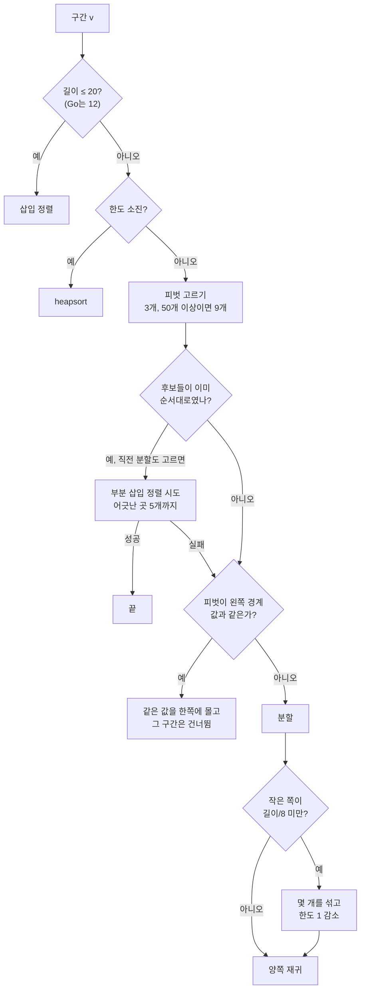
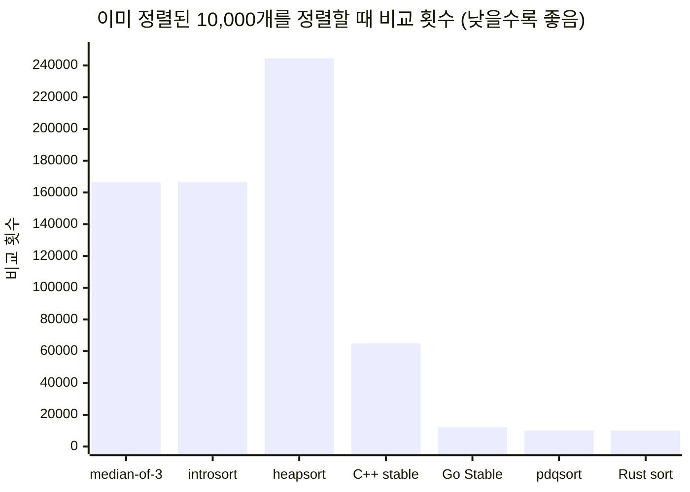

# sort()를 부르면 실제로 도는 것: C++, Rust, Go의 퀵소트

> 교과서의 퀵소트는 이미 정렬된 배열에서 O(n²)이 됩니다. 그래서 C++, Rust, Go의 표준 라이브러리는 아무도 교과서 퀵소트를 쓰지 않습니다. libstdc++의 introsort, Rust와 Go 1.19의 pdqsort, 그리고 세 언어의 안정 정렬이 각각 어떤 입력을 어떻게 막는지 움직이는 그림으로 따라가 봤습니다.
> 2022-09-14 · https://alfex4936.github.io/blog/sorting-in-the-wild/

지난달 Go 1.19가 나오면서 `sort.Sort`의 알고리즘이 pdqsort로 바뀌었습니다.[^1] 릴리스 노트에는 "몇몇 흔한 경우에 더 빠르다"는 한 줄뿐이라, 무엇이 왜 빨라졌는지 알려면 코드를 열어 봐야 했습니다. 연 김에 Rust와 C++ 쪽도 같이 봤습니다. 셋 다 이름은 sort이고 셋 다 퀵소트에서 출발했지만, 퀵소트의 약점을 막는 방법은 꽤 다릅니다.

이 글의 그림은 모두 직접 움직여 볼 수 있습니다. 막대 하나가 원소 하나이고 높이가 값입니다. 노란색은 지금 비교하는 두 원소, 빨간색은 방금 자리를 바꾼 원소, 테두리만 있는 막대는 피벗입니다. 지금 다루는 구간 밖은 흐리게 그립니다. 여러 칸이 나란히 있으면 같은 입력을 놓고 경주를 합니다. 한 프레임마다 모든 칸이 비교나 교환을 똑같은 수만큼 하니, **일을 덜 하는 쪽이 먼저 끝납니다.**

그림과 표의 비교 횟수는 세 라이브러리의 정렬을 JavaScript로 옮긴 코드에서 셌습니다. 원본의 분기와 상수를 그대로 따랐고, 입력은 시드 7로 만든 같은 배열입니다. 실제 라이브러리의 시간을 잰 것이 아니니 절댓값보다는 서로의 비율로 읽어 주세요.

## 삽입 정렬부터

정렬을 처음 배우면 대개 삽입 정렬부터 봅니다. 왼쪽부터 한 장씩 집어 이미 정리된 카드 사이에 끼워 넣는 방식입니다. 한 번 끼울 때마다 앞의 카드들과 하나씩 비교하니, 무작위 입력에서는 비교가 대략 $n^2/4$번입니다.

퀵소트는 피벗 하나를 골라 그보다 작은 것은 왼쪽, 큰 것은 오른쪽으로 보냅니다. 그러면 피벗은 제자리를 찾고, 양쪽을 따로 정렬하면 끝납니다. 피벗이 매번 가운데쯤에 떨어지면 반씩 줄어드니 비교는 $n \log_2 n$ 정도가 됩니다.

<SortViz algo="insertion,median3" n={60} caption="같은 무작위 입력 60개. 오른쪽 퀵소트가 끝났을 때 왼쪽 삽입 정렬은 아직 3분의 1쯤 와 있습니다." />

60개에서는 비교 횟수가 922번과 430번으로 두 배 남짓 차이지만, 원소가 늘면 격차가 빠르게 벌어집니다. 200개짜리 무작위 배열에서 삽입 정렬은 10,054번, 퀵소트는 1,764번 비교했습니다.

그런데 아래에서 볼 세 라이브러리는 모두 **삽입 정렬을 버리지 않았습니다.** 퀵소트로 쪼개다가 구간이 십수 개로 작아지면 삽입 정렬로 넘깁니다. 원소가 적으면 $n^2$과 $n \log n$의 차이보다 재귀 호출과 피벗 선택에 드는 고정 비용이 더 크고, 삽입 정렬은 메모리를 앞에서 뒤로 순서대로 훑어서 캐시에도 잘 맞기 때문입니다. 그 경계가 C++은 16, Rust는 20, Go는 12입니다.

## 같은 퀵소트, 다른 분할

퀵소트는 분할(partition)을 어떻게 하느냐에 따라 성격이 꽤 달라집니다. 교과서에 자주 나오는 두 가지가 Lomuto와 Hoare 방식입니다.

Lomuto 분할은 마지막 원소를 피벗으로 잡고, 앞에서부터 훑으며 피벗보다 작은 원소를 왼쪽 경계로 하나씩 옮깁니다. 코드가 짧아서 교재에 많이 실립니다. Hoare 분할은 양 끝에서 포인터 두 개가 안쪽으로 걸어오다가, 왼쪽은 피벗보다 크거나 같은 원소에서, 오른쪽은 작거나 같은 원소에서 멈추고 둘을 바꿉니다. 아래 그림에서 입력을 바꿔 가며 보면 차이가 잘 보입니다.

<SortViz algo="lomuto,hoare" inputs="random,sorted,few,organ" n={60} caption="입력 메뉴에서 '정렬됨'을 골라 보세요. Lomuto는 한 칸씩만 줄어듭니다." />

무작위 입력에서는 둘 다 무난합니다. n=200에서 Lomuto가 1,878번, Hoare가 2,300번 비교했고 교환은 Lomuto가 740번, Hoare가 354번이었습니다. Hoare는 비교를 조금 더 하는 대신 교환을 절반 이하로 합니다.

정렬된 입력에서 Lomuto는 무너집니다. 마지막 원소가 늘 최댓값이니 분할할 때마다 피벗 하나만 떨어져 나가고, 나머지 $n-1$개가 그대로 다음 단계로 넘어갑니다. 비교는 $n(n-1)/2$, n=200에서 정확히 19,900번이고 재귀 깊이는 199입니다. 이미 정렬된 배열을 다시 정렬하는 일은 실무에서 생각보다 흔합니다. 로그를 시간순으로 쌓아 두었다가 정렬하거나, 정렬된 목록 끝에 몇 개를 붙이고 다시 정렬하는 경우가 그렇습니다.

<Quiz title="기울어진 분할을 확인합니다" items={[
  {
    q: "마지막 원소를 피벗으로 쓰는 Lomuto 퀵소트에 이미 정렬된 배열을 넘깁니다. 비교가 제곱으로 늘어나는 이유는 무엇입니까?",
    choices: ["매번 피벗이 최댓값이라 나머지 구간이 한 원소씩만 줄어듭니다.", "정렬된 입력은 비교 함수가 매번 두 번 호출됩니다.", "피벗이 중앙값이라 매번 반으로 나뉩니다."],
    answer: 0,
    why: "한쪽으로 치우친 분할을 반복하면 남은 길이가 하나씩만 줄어듭니다. 이미 정렬되어 있어도 분할이 균형 잡혀 있지 않으면 비교 횟수가 늘어납니다.",
  },
]} />

'값 4종'도 눈여겨볼 만합니다. 같은 값이 많으면 Lomuto는 피벗과 같은 원소를 모두 한쪽으로 몰아서 다시 한쪽으로 기웁니다(5,446번, 깊이 53). Hoare는 같은 값에서도 멈추고 바꾸기 때문에 같은 값이 양쪽으로 고르게 나뉩니다(1,943번). 쓸데없어 보이는 교환이 균형을 지켜 주는 셈입니다.

Hoare도 약점이 있습니다. 이 구현은 가운데 원소를 피벗으로 쓰는데, 값이 가운데로 갈수록 커졌다가 다시 작아지는 산 모양 입력에서는 가운데가 늘 최댓값입니다. 그래서 10,900번 비교하고 깊이는 104까지 갑니다. 피벗을 한 자리에서만 뽑으면 그 자리를 노리는 입력이 반드시 있습니다.

## 피벗을 세 개 중에서 고르기

흔한 처방은 여러 자리에서 후보를 뽑아 그 중앙값을 피벗으로 쓰는 것입니다. 처음, 가운데, 끝에서 하나씩 뽑아 가운데 값을 쓰면 **median-of-3**, 이것을 세 번 해서 다시 중앙값을 고르면 **ninther**(아홉 개 중 하나)입니다. 정렬된 입력에서는 가운데 값이 진짜 중앙값이니 최적의 피벗이 나옵니다. 산 모양에서도 양 끝이 작고 가운데가 크니 셋 중 중앙값은 적당한 값이 됩니다.

n=200에서 median-of-3 퀵소트는 정렬된 입력을 1,529번, 산 모양을 2,521번 비교로 끝냈습니다. 깊이도 각각 5와 11입니다. 흔한 입력은 이것으로 대부분 막힙니다. 문제는 일부러 만든 입력입니다.

## 퀵소트를 죽이는 입력

1999년 Doug McIlroy가 "A Killer Adversary for Quicksort"라는 짧은 논문을 냈습니다.[^2] 아이디어가 재미있습니다. 정렬 함수에 넘기는 비교 함수를 조작해서, **정렬이 진행되는 동안 입력을 만들어 냅니다.**

처음에는 모든 원소의 값이 정해져 있지 않습니다. 논문에서는 이 상태를 기체(gas)라고 부릅니다. 비교 함수가 기체 둘을 비교하라는 요청을 받으면, 그중 하나를 지금까지 정해진 어떤 값보다도 큰 값으로 얼립니다. 어느 쪽을 얼릴지는 피벗 후보로 보이는 쪽, 즉 비교에 많이 불려 나온 쪽을 고릅니다. 그러면 퀵소트가 고른 피벗은 늘 남은 원소 중 가장 작은 쪽에 가깝게 됩니다. 정렬이 끝나면 모든 원소가 얼어 있고, 그 값들을 그대로 배열로 만들면 이 퀵소트 전용의 최악 입력이 됩니다.

조건은 퀵소트가 결정적이어야 한다는 것 하나뿐입니다. 피벗을 고르는 규칙이 얼마나 정교하든, 같은 입력에 같은 순서로 비교한다면 이 방법으로 무너뜨릴 수 있습니다.

<SortViz algo="median3,introsort,pdqsort" input="killer" n={64} view="dots" caption="median-of-3 퀵소트를 겨냥해 만든 64개짜리 킬러 입력. 왼쪽은 한 번에 두 개씩만 줄어들고, 가운데 introsort는 깊이 한도에 걸리면 heapsort로 넘어갑니다." />

왼쪽 칸을 보면 분할이 끝날 때마다 구간이 두 칸씩만 줄어듭니다. 64개에서는 1,142번 비교, 깊이 25로 끝나 그리 극적이지 않지만, 크기를 키우면 이야기가 다릅니다.

| n | 무작위 입력 | 킬러 입력 | 배율 | 최대 깊이 |
|---|---:|---:|---:|---:|
| 1,000 | 12,521 | 253,394 | 20배 | 493 |
| 10,000 | 160,402 | 25,034,894 | 156배 | 4,993 |

10,000개에서 비교가 2,500만 번이고 재귀 깊이가 거의 5,000입니다. 이 정도면 느린 것보다 스택이 먼저 걱정입니다. 웹 서버가 사용자가 보낸 목록을 정렬한다면, 그 목록을 조작해 CPU를 붙잡아 둘 수 있다는 뜻이기도 합니다.

해결책은 두 갈래입니다. 피벗을 무작위로 골라 공격자가 순서를 예측하지 못하게 하거나, 무너지는 것을 감지해 다른 알고리즘으로 갈아타는 것입니다. 세 언어는 모두 두 번째를 골랐습니다. 무작위 피벗은 기대값으로만 빠르고 최악이 여전히 $O(n^2)$이며, 같은 입력의 실행 시간이 매번 달라지는 것도 라이브러리로서는 반갑지 않습니다.

## C++: introsort

libstdc++의 `std::sort`는 1997년 David Musser가 제안한 **introsort**입니다.[^3] 퀵소트로 시작하되 재귀 깊이에 한도를 둡니다. 정상적인 퀵소트라면 깊이가 $\log_2 n$ 근처에서 끝나야 하니, 그보다 한참 깊어지면 피벗 선택이 실패하고 있다는 신호입니다. 그때 그 구간을 heapsort로 정렬합니다.

heapsort는 어떤 입력에서도 $O(n \log n)$이지만 평소에는 퀵소트보다 느립니다. n=200 무작위 입력에서 heapsort는 2,461번, median-of-3 퀵소트는 1,764번 비교했습니다. 비교 횟수보다 더 큰 문제는 메모리 접근입니다. 힙은 인덱스 $i$의 자식이 $2i+1$, $2i+2$에 있어서 아래로 내려갈수록 멀리 떨어진 곳을 건드립니다.

<SortViz algo="median3,heapsort" n={60} caption="heapsort(오른쪽)는 먼저 힙을 만들고, 최댓값을 하나씩 맨 뒤로 보냅니다. 막대가 배열 전체를 크게 오가는 것이 보입니다." />

introsort는 둘의 장점만 씁니다. 평소에는 퀵소트이고, 최악의 경우에만 heapsort가 됩니다. 중심이 되는 루프는 짧습니다.

<Walk>

```cpp title="bits/stl_algo.h (libstdc++, 요약)"
template<typename _Iter, typename _Size, typename _Compare>
void __introsort_loop(_Iter __first, _Iter __last,
                      _Size __depth_limit, _Compare __comp)
{
  while (__last - __first > int(_S_threshold))   // 16
    {
      if (__depth_limit == 0)
        {
          std::__partial_sort(__first, __last, __last, __comp);
          return;
        }
      --__depth_limit;
      _Iter __cut =
        std::__unguarded_partition_pivot(__first, __last, __comp);
      std::__introsort_loop(__cut, __last, __depth_limit, __comp);
      __last = __cut;
    }
}
```

<Step lines="5">

구간이 16개 이하로 줄면 여기서는 아무것도 하지 않고 돌아갑니다. 작은 구간들은 정렬되지 않은 채로 남지만, 각 구간의 값은 이미 제 구간 안에 들어와 있습니다.

</Step>

<Step lines="7-11">

깊이 한도를 다 쓰면 남은 구간 전체를 `__partial_sort`로 정렬합니다. 가운데 인자가 `__last`이니 구간 전부를 정렬하라는 뜻이고, 이 함수의 실체는 heapsort입니다. 한도는 `std::sort`가 $2\lfloor\log_2 n\rfloor$로 넘깁니다.

</Step>

<Step lines="13-14">

피벗은 `__move_median_to_first`가 고릅니다. 두 번째, 가운데, 마지막에서 한 칸 앞 원소 중 중앙값을 맨 앞으로 옮깁니다. 그다음 Hoare 방식으로 분할하는데, 양쪽 끝에 피벗보다 작지 않은 값과 크지 않은 값이 있다는 것을 알기 때문에 포인터가 배열 밖으로 나가는지 검사하지 않습니다(unguarded).

</Step>

<Step lines="15-16">

오른쪽은 재귀로, 왼쪽은 `while` 루프로 처리합니다. 꼬리 재귀를 손으로 루프로 바꾼 것입니다.

</Step>

</Walk>

`__introsort_loop`가 끝나면 `std::sort`는 `__final_insertion_sort`로 배열 전체를 삽입 정렬 한 번에 마무리합니다. 원소마다 제 구간 안에서만 움직이면 되니, 16개짜리 구간을 따로따로 정렬하는 것과 비교 횟수는 비슷하고 함수 호출은 한 번이면 됩니다.

효과는 킬러 입력에서 바로 보입니다. 같은 median-of-3 피벗을 쓰는데, 깊이 한도 하나로 2,500만 번이 50만 번이 됩니다.

| n = 10,000 | 무작위 | 정렬됨 | 킬러 | 최대 깊이(킬러) |
|---|---:|---:|---:|---:|
| median-of-3 퀵소트 | 160,402 | 166,677 | 25,034,894 | 4,993 |
| introsort (`std::sort`) | 160,402 | 166,677 | 500,919 | 27 |
| heapsort | 235,624 | 244,460 | 233,001 | |

킬러 입력에서도 introsort가 heapsort보다 두 배 넘게 비교합니다. 깊이 26까지는 계속 나쁜 분할을 하다가 그제야 heapsort로 넘어가기 때문입니다. 그래도 $O(n \log n)$ 안에 머문다는 것이 중요합니다.

한편 표의 둘째 열은 아쉬운 부분입니다. 이미 정렬된 10,000개를 정렬하는데 무작위 입력보다 비교를 더 합니다. introsort는 입력이 이미 정렬되어 있는지 알아보지 않습니다. 이 부분을 손본 것이 pdqsort입니다.

## Rust와 Go: pdqsort

**pdqsort**(pattern-defeating quicksort)는 Orson Peters가 2015년에 공개하고 2021년에 논문으로 정리한 알고리즘입니다.[^4] 뼈대는 introsort와 같습니다. 퀵소트로 쪼개고, 작은 구간은 삽입 정렬, 깊이 한도를 넘으면 heapsort. 여기에 입력의 패턴을 알아보고 이용하는 장치가 몇 개 붙어 있습니다. Rust는 2017년부터 `slice::sort_unstable`에 이 알고리즘을 썼고, Go는 1.19에서 `sort.Sort`와 `sort.Slice`를 이것으로 바꿨습니다.



하나씩 보겠습니다.

**피벗 후보가 이미 정렬된 순서인지 봅니다.** 피벗을 고르려고 후보 셋(또는 아홉)을 비교하는 김에, 후보끼리 자리를 바꿀 일이 한 번도 없었는지 셉니다. 한 번도 없었다면 이 구간 전체가 이미 정렬되어 있을 가능성이 높습니다. 직전 분할도 고르게 나뉘었고 그때 원소를 하나도 옮기지 않았다면, 퀵소트를 돌리기 전에 삽입 정렬을 시도합니다. 단, 어긋난 원소를 다섯 개까지만 고치고 그 이상이면 포기합니다. 손해가 나도 $O(n)$을 넘지 않도록 한 것입니다. 거꾸로 후보끼리 자리를 바꾼 횟수가 최대치(12번)에 이르면 구간이 거꾸로 정렬되어 있다고 보고 통째로 뒤집습니다.

그래서 정렬된 입력과 역순 입력이 거의 $n$번 비교로 끝납니다. 10,000개에서 둘 다 10,011번이었습니다. introsort의 166,677번, 122,044번과 비교하면 열 배 이상 차이입니다.

**같은 값이 많으면 한 번에 치웁니다.** 분할한 오른쪽 구간을 다시 정렬할 때, 이번 피벗이 구간 바로 왼쪽의 값(이전 피벗)과 같다면 이 구간에는 그 값보다 작은 원소가 없다는 뜻입니다. 이때는 이전 피벗과 같은 값을 모두 왼쪽에 모으고 그 부분을 다시 보지 않습니다. 값의 종류가 $k$개면 이런 분할이 $k$번 정도 일어나고 끝납니다.

**분할이 기울면 패턴을 깹니다.** 작은 쪽이 전체의 1/8도 안 되면 구간 가운데 근처의 원소 몇 개를 의사 난수로 고른 자리와 바꾸고 한도를 하나 줄입니다. 공격자가 노린 배치를 흐트러뜨리는 장치입니다. 한도는 $n$의 비트 수, 10,000이면 14입니다. 이 횟수만큼 나쁜 분할이 쌓이면 introsort처럼 heapsort로 넘어갑니다.

<SortViz algo="pdqsort" inputs="sorted,reversed,nearly,few,organ,random" input="sorted" n={80} caption="입력을 바꿔 가며 보세요. 정렬됨과 역순은 한 번 훑고 끝납니다. 값 4종에서는 '같은 값 묶기'가 몇 번 나오고 끝납니다." />

Rust와 Go의 pdqsort는 같은 설계이지만 분할 방식이 다릅니다. Rust는 Edelkamp와 Weiß의 **BlockQuicksort** 분할을 씁니다.[^5] 피벗과의 비교 결과를 먼저 작은 버퍼(블록)에 몰아서 기록하고, 교환은 나중에 한꺼번에 합니다. 비교 결과에 따라 분기하지 않으니 CPU의 분기 예측이 틀릴 일이 줄어듭니다. 무작위 데이터에서 분할 루프의 분기는 반반 확률이라 예측기가 거의 맞히지 못하는데, 그 비용을 없애는 것입니다. Rust의 블록은 원소 128개인데, 위 그림에서는 움직임이 보이도록 8개로 줄였습니다. Go는 `sort.Interface`가 `Less`와 `Swap`만 제공하기 때문에 원소를 버퍼에 담을 수 없고, 평범한 Hoare 분할을 씁니다. 삽입 정렬로 넘기는 크기도 Go가 12로 Rust의 20보다 작습니다.

<SortViz algo="introsort,pdqsort-go,pdqsort" inputs="few,sorted,organ,nearly,random" input="few" n={80} caption="introsort, Go의 pdqsort, Rust의 pdqsort. 처음 입력은 값 4종입니다." />

n=10,000에서 세 구현의 비교 횟수입니다.

| 입력 | introsort (C++) | pdqsort (Go) | pdqsort (Rust) |
|---|---:|---:|---:|
| 무작위 | 160,402 | 144,680 | 154,658 |
| 정렬됨 | 166,677 | 10,011 | 10,011 |
| 역순 | 122,044 | 10,011 | 10,011 |
| 값 4종 | 113,289 | 32,583 | 32,591 |
| 산 모양 | 358,390 | 130,613 | 138,454 |
| 킬러 (median-of-3용) | 500,919 | 92,837 | 96,438 |

무작위 입력에서는 세 구현의 차이가 10% 안쪽입니다. 비교 횟수만 보면 Rust가 Go보다 약간 많은데, 블록 분할은 비교를 줄이려는 것이 아니라 분기 예측 실패를 줄이려는 것이라 이 표로는 장점이 드러나지 않습니다. 차이는 패턴이 있는 입력에서 납니다.

마지막 줄의 킬러 입력은 median-of-3 퀵소트를 겨냥해 만든 것이라 pdqsort에는 그다지 위협이 되지 않습니다. 그래서 pdqsort 자신을 겨냥해서도 만들어 봤습니다. 1,000개에서 7,157번 비교, 깊이 3으로 무작위 입력(11,486번)보다 오히려 적게 끝났습니다. 이 글의 공격 코드가 피벗 선택과 패턴 깨기를 함께 따라가지 못한 것으로 보입니다. 그렇다고 pdqsort를 무너뜨릴 수 없다는 뜻은 아닙니다. pdqsort도 결정적이니 더 정교하게 만든 공격이라면 한도를 다 쓰게 만들 수 있을 것입니다. 그때도 heapsort가 받쳐 주니 $O(n \log n)$은 지켜집니다.

Go 1.18까지의 `sort.Sort`도 퀵소트였습니다. 40개가 넘으면 ninther로 피벗을 고르고, 깊이가 $2\lceil\log_2(n+1)\rceil$을 넘으면 heapsort로 넘어가고, 12개 미만은 삽입 정렬로 마무리했습니다. 사실상 introsort입니다. 1.19의 변경은 여기에 정렬된 입력 감지, 같은 값 처리, 패턴 깨기를 더한 것이고, 릴리스 노트의 "몇몇 흔한 경우"가 바로 위 표에서 차이가 큰 줄들입니다.

## 안정 정렬은 따로 있습니다

지금까지 본 알고리즘은 모두 불안정 정렬입니다. 같은 값을 가진 원소의 원래 순서가 바뀔 수 있습니다. 이름순으로 정렬된 직원 목록을 부서로 다시 정렬했을 때 같은 부서 안에서 이름순이 유지되기를 바란다면 안정 정렬이 필요합니다. 세 언어 모두 안정 정렬은 퀵소트가 아니라 병합 정렬 계열입니다. 그리고 여기서는 세 언어가 정말로 제각각입니다.

C++의 `std::stable_sort`는 배열 크기의 절반만큼 임시 버퍼를 빌려 **바닥부터 올라가는 병합 정렬**을 합니다. 먼저 7개씩 끊어 삽입 정렬하고, 14개, 28개, 56개 순으로 이웃한 덩어리를 병합합니다. 병합할 때마다 배열과 버퍼 사이를 오가며 원소를 씁니다. 입력에 이미 정렬된 구간이 있는지는 보지 않습니다. 버퍼를 얻지 못하면 회전을 이용한 제자리 병합으로 떨어지는데, 그쪽은 $O(n \log^2 n)$입니다.

Rust의 `slice::sort`는 **TimSort**를 단순하게 만든 것입니다. 뒤에서부터 이미 정렬된 구간(run)을 찾고, 거꾸로 정렬된 구간은 뒤집고, 10개보다 짧은 run은 삽입 정렬로 늘립니다. run을 스택에 쌓으며 TimSort와 같은 길이 규칙으로 병합합니다. Python이나 Java의 TimSort와 달리 galloping(한쪽에서 연속으로 이길 때 이진 탐색으로 건너뛰기)은 없습니다. 버퍼는 배열의 절반입니다.

Go의 `sort.Stable`은 **버퍼를 쓰지 않습니다.** 정확히는 쓸 수 없습니다. `sort.Interface`로는 원소를 꺼내 다른 곳에 저장할 방법이 없고, 할 수 있는 것은 두 자리를 비교하고 바꾸는 것뿐입니다. 그래서 20개씩 삽입 정렬한 다음, Kim과 Kutzner의 **SymMerge**로 제자리 병합합니다.[^6] 두 덩어리를 대칭으로 이진 탐색해 자를 자리를 찾고, 가운데 부분을 회전(rotation)해 맞바꾼 다음 양쪽을 재귀로 병합합니다. 회전은 교환으로만 이루어지니 교환이 많아집니다.

아래에서는 같은 키를 가진 원소에 서로 다른 입력 번호를 붙였습니다. 키 1의 원래 순서는 2, 4, 6입니다. 불안정한 Lomuto 퀵소트는 이 순서를 뒤집지만, 안정 정렬은 보존합니다.

<SortStabilityViz keys={[2, 1, 2, 1, 2, 1]} unstableAlgo="lomuto" stableAlgo="stable-rust" caption="큰 숫자는 정렬 키, 작은 숫자는 입력에서의 위치입니다." />

<SortViz algo="stable-cpp,stable-rust,stable-go" inputs="random,organ,sorted,few" n={80} caption="C++ stable_sort, Rust sort, Go sort.Stable. 막대가 한 칸씩 옮겨지는 것은 버퍼에서 되돌려 쓰는 것이고, Go 쪽의 긴 교환 줄은 회전입니다." />

n=1,000에서 센 값입니다. '쓰기'는 버퍼와 배열 사이에서 원소를 옮긴 횟수입니다.

| 입력 | C++ 비교 | C++ 쓰기 | Rust 비교 | Rust 쓰기 | Go 비교 | Go 교환 |
|---|---:|---:|---:|---:|---:|---:|
| 무작위 | 9,578 | 7,682 | 9,773 | 6,880 | 12,415 | 19,730 |
| 정렬됨 | 5,106 | 7,682 | 999 | 0 | 1,229 | 0 |
| 역순 | 6,430 | 7,682 | 999 | 0 | 9,842 | 13,832 |
| 산 모양 | 5,856 | 7,682 | 1,998 | 1,000 | 7,220 | 9,594 |

C++의 쓰기 횟수가 입력과 상관없이 7,682로 같은 것이 눈에 띕니다. 덩어리 크기가 미리 정해져 있어서 병합 횟수도 정해져 있기 때문입니다. Rust는 run을 찾으니 정렬된 입력과 역순 입력은 999번 비교, 즉 한 번 훑고 끝납니다(역순은 뒤집는 데 교환 500번이 더 듭니다). 산 모양은 올라가는 run 하나와 내려가는 run 하나라서 뒤집고 한 번 병합하면 됩니다. Go는 메모리를 하나도 쓰지 않는 대신 무작위 입력에서 교환이 2만 번에 가깝습니다.

어느 쪽이 낫다고 하기는 어렵습니다. Go가 안정 정렬에 버퍼를 쓰지 않는 것은 인터페이스 설계에서 나온 결과이고, 그 덕에 어떤 컨테이너든 `Len`, `Less`, `Swap`만 구현하면 정렬할 수 있습니다. 대신 원소를 직접 다룰 수 있는 언어에서 기대할 만한 성능은 포기한 셈입니다.

## 한눈에 보기

| | C++ (libstdc++) | Rust | Go 1.19 |
|---|---|---|---|
| 불안정 정렬 | `std::sort`: introsort | `sort_unstable`: pdqsort, 블록 분할 | `sort.Sort`: pdqsort |
| 삽입 정렬로 넘기는 크기 | 16 | 20 | 12 |
| 깊이 한도 | $2\lfloor\log_2 n\rfloor$ | $n$의 비트 수 | $n$의 비트 수 |
| 정렬된 입력 감지 | 없음 | 있음 | 있음 |
| 안정 정렬 | `std::stable_sort`: 7개 단위 병합, 버퍼 $n/2$ | `sort`: TimSort식 run 병합, 버퍼 $n/2$ | `sort.Stable`: 20개 단위 + SymMerge, 버퍼 없음 |



## 정리

- 세 언어 모두 표준 정렬은 퀵소트, 삽입 정렬, heapsort의 조합입니다. 퀵소트가 나쁜 피벗을 계속 고르면 깊이 한도에 걸려 heapsort로 넘어가니, 최악의 경우도 $O(n \log n)$입니다.
- 결정적인 퀵소트는 McIlroy의 방법으로 최악의 입력을 만들 수 있습니다. median-of-3 퀵소트는 10,000개에서 무작위 입력의 156배를 비교했고, 같은 피벗 규칙에 깊이 한도만 더한 introsort는 3배에 그쳤습니다.
- C++의 `std::sort`는 입력이 이미 정렬되어 있는지 보지 않습니다. Rust와 Go 1.19의 pdqsort는 정렬된 입력, 역순 입력, 같은 값이 많은 입력을 알아보고 거의 선형 시간에 끝냅니다.
- 안정 정렬은 세 언어가 모두 병합 정렬 계열이지만 버퍼 사용이 다릅니다. C++과 Rust는 절반 크기 버퍼를 쓰고, Go는 `sort.Interface`의 제약 때문에 버퍼 없이 회전으로 병합합니다.

`sort()` 한 줄 뒤에는 이렇게 입력의 모양을 살피는 코드가 꽤 많이 들어 있습니다. 평소에는 몰라도 되지만, 이미 정렬된 데이터를 반복해서 정렬하고 있거나, 외부에서 들어온 데이터를 정렬하고 있거나, 같은 값이 잔뜩 있는 배열을 정렬하고 있다면 어떤 언어의 어떤 함수를 부르는지에 따라 몇 배씩 차이가 날 수 있습니다.

<Quiz title="정렬 함수를 고른다면" items={[
  {
    q: "pdqsort의 피벗 후보가 이미 순서대로입니다. 이 신호만 보고 구간 전체가 정렬됐다고 처리해도 됩니까?",
    choices: ["됩니다. 후보가 정렬됐으면 전체 구간도 정렬됐습니다.", "안 됩니다. 조건이 맞으면 제한된 부분 삽입 정렬로 확인하고 실패하면 분할합니다.", "안 됩니다. 후보가 정렬됐으면 항상 heapsort로 바꿉니다."],
    answer: 1,
    why: "후보의 순서는 힌트입니다. 직전 분할 상태도 보고 부분 삽입 정렬을 시도하며, 수정 한도를 넘으면 포기합니다. 이 제한이 틀린 추측으로 과도한 일을 하는 것을 막습니다.",
  },
  {
    q: "이름순 직원 목록을 부서로 다시 정렬하면서 같은 부서 안의 이름순을 보존하려고 합니다. 무엇을 선택해야 합니까?",
    choices: ["불안정 정렬을 씁니다. 같은 부서는 비교 결과가 같으니 원래 순서도 유지됩니다.", "아무 정렬이나 씁니다. 피벗을 잘 고르면 안정성이 보장됩니다.", "안정 정렬을 씁니다. 부서 키가 같은 원소의 입력 순서를 보존합니다."],
    answer: 2,
    why: "안정성은 같은 키를 가진 원소의 상대 순서를 보존하는 성질입니다. 불안정 정렬은 결과가 부서순으로 맞아도 같은 부서 안의 이름순을 바꿀 수 있습니다.",
  },
  {
    q: "본문의 비교 횟수 표에서 Rust의 블록 분할이 Go보다 조금 더 비교합니다. 이것만으로 Rust 쪽 실행 시간이 더 길다고 판단할 수 있습니까?",
    choices: ["판단할 수 없습니다. 블록 분할은 분기 예측 실패를 줄이며 표는 실제 라이브러리 시간을 잰 값이 아닙니다.", "판단할 수 있습니다. 비교 횟수가 실행 시간과 항상 같은 비율입니다.", "판단할 수 있습니다. 블록 버퍼는 비교를 없애려는 장치입니다."],
    answer: 0,
    why: "본문 수치는 JavaScript로 옮긴 구현의 작업 횟수입니다. 블록 분할의 목적은 비교 결과에 따른 분기를 줄이는 것이므로, 비교 수만으로 CPU 비용이나 실제 언어별 속도를 정할 수 없습니다.",
  },
]} />

[^1]: Go 1.19 릴리스 노트의 `sort` 항목. 구현은 `src/sort/zsortinterface.go`와 `zsortfunc.go`에 있고, 둘 다 `gen_sort_variants.go`가 생성합니다.
[^2]: M. Douglas McIlroy, "A Killer Adversary for Quicksort", Software: Practice and Experience 29(4), 1999.
[^3]: David R. Musser, "Introspective Sorting and Selection Algorithms", Software: Practice and Experience 27(8), 1997.
[^4]: Orson R. L. Peters, "Pattern-defeating Quicksort", arXiv:2106.05123, 2021. Rust 구현은 `library/core/src/slice/sort.rs`에 있습니다.
[^5]: Stefan Edelkamp, Armin Weiß, "BlockQuicksort: Avoiding Branch Mispredictions in Quicksort", ESA 2016.
[^6]: Pok-Son Kim, Arne Kutzner, "Stable Minimum Storage Merging by Symmetric Comparisons", ESA 2004.
