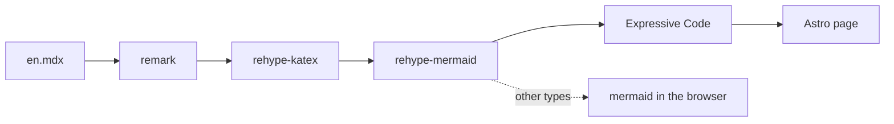
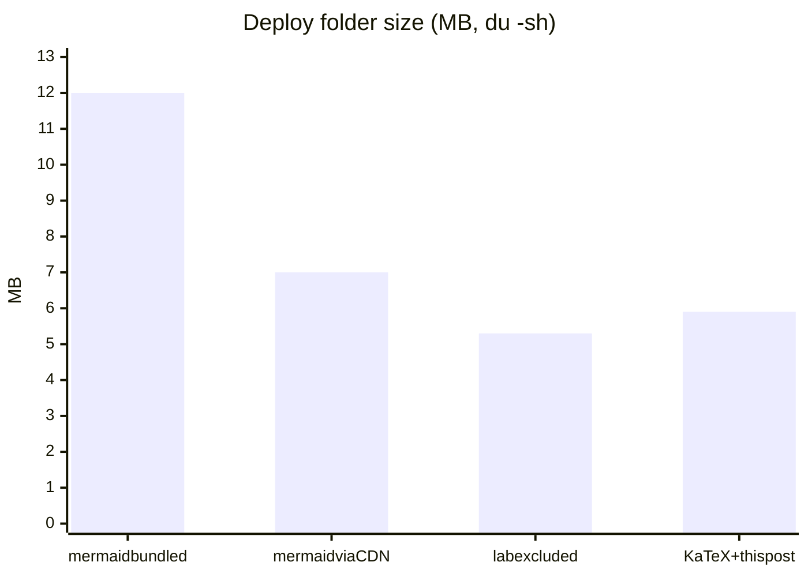
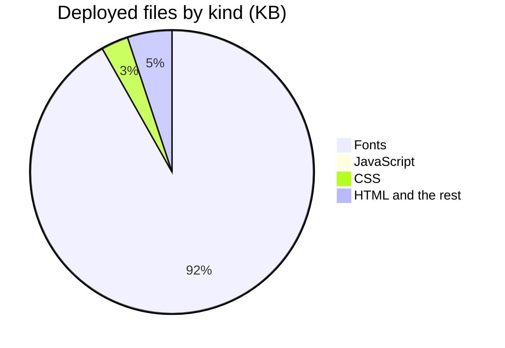
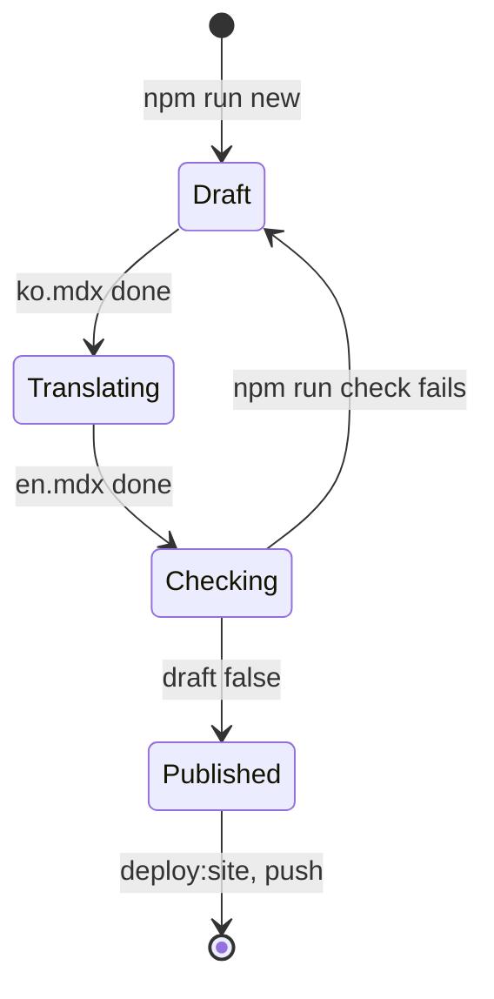
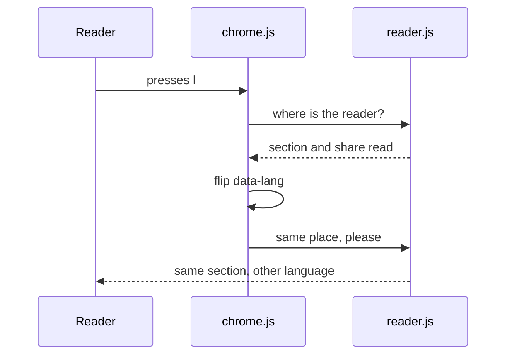

# A tour of this blog: diagrams, math, code

> The first post. Everything this blog can put inside a post, one thing at a time: a figure that follows your place, diagrams drawn at build time, math, code, and two languages.
> 2026-10-05 · https://alfex4936.github.io/blog/tour/

This blog is where I write down what I measured and how I measured it: Redis internals, Go and Kubernetes operators, performance work. Every post is written in both Korean and English. The first one is a tour of the blog itself. Every figure, formula and code block below is real output of this blog's build, and every number was measured while building it.

## A figure that follows your place

When an explanation points at a figure, the figure is usually a few paragraphs up. Here it pins beside the text (above it, on a phone), and only the part the current step talks about lights up. Below is the path a post takes to become a page.

<Walk>



<Step show="M,R">
A post is an MDX file. remark turns the markdown into a syntax tree, and the math wrapped in `$` and the mermaid code blocks each become a node of that tree.
</Step>

<Step show="R,K">
rehype-katex turns the math into KaTeX HTML. The reader downloads fonts, not a math engine.
</Step>

<Step show="K,D">
rehype-mermaid draws each diagram block with beautiful-mermaid and puts the SVG into the tree. Colours stay CSS variables, so switching the theme recolours the figure without drawing it again.
</Step>

<Step show="D,E">
A block that became a picture is no longer a code block, so Expressive Code highlights only the code that is left.
</Step>

<Step show="E,A">
Astro assembles the page. Every figure and formula in this post came this way.
</Step>

<Step show="D,B">
beautiful-mermaid draws six types: flowchart, state, sequence, class, ER and xychart.[^1] The rest, gantt or pie for example, are drawn by mermaid in the browser, fetched only on a page that has one.
</Step>

</Walk>

## Diagrams

While building this blog I measured the deploy folder with `du -sh`. At first the browser build of mermaid was bundled whole, and the folder was 12 MB. Fetching mermaid from a CDN only on pages that need it, and keeping the harness pages out of the deploy, brought it to 5.3 MB. With the KaTeX fonts for math and this post added, it is now 5.9 MB.



Split by kind, the files deployed today look like this. Most of it is fonts, but the Korean fonts are cut into small ranges of characters, so a browser downloads only the pieces holding characters that appear on the page. This pie chart is a type beautiful-mermaid does not draw, so on this page alone the browser fetched mermaid to draw it.



How a post gets published fits in one figure too.



## Math

Math written as `$…$` sits inside a sentence; `$$…$$` takes a line of its own. Redis's HyperLogLog, for example, uses $m = 16384$ registers, which gives this standard error:

$$
\sigma \approx \frac{1.04}{\sqrt{m}} = \frac{1.04}{\sqrt{16384}} = \frac{1.04}{128} \approx 0.81\%
$$

Reading time on this blog is a formula too. Korean is read at 500 characters $c$ a minute, not counting spaces; English at 230 words $w$ a minute; code is skimmed at 40 lines $\ell$ a minute.

$$
\begin{aligned}
t_{\text{ko}} &= \frac{c}{500} + \frac{\ell}{40} \\
t_{\text{en}} &= \frac{w}{230} + \frac{\ell}{40}
\end{aligned}
$$

The time left in the status line at the bottom splits this $t$ across sections. Each section gets a weight $m_i$ worked out the same way (plus 0.3 minutes per figure), less the share $r_i$ of it already read. $r_i$ is how far the reading line, 30% down the screen, has passed through that section. At the top of a post, then, the time left equals the reading time under the title.

$$
t_{\text{left}} = t \cdot \frac{\sum_i m_i\,(1 - r_i)}{\sum_i m_i}, \qquad r_i = \min\!\left(1,\ \max\!\left(0,\ \frac{0.3\,H - \mathrm{top}_i}{\mathrm{bottom}_i - \mathrm{top}_i}\right)\right)
$$

## Code

Code blocks are drawn by Expressive Code: file names, marked lines, diffs, terminal frames, collapsed sections. The diff below is a line actually fixed while building this blog.

```diff lang="js" title="src/lib/diagram.js"
-    .replace(/\bid="([^"]*)"/g, `id="${id}-$1"`)
+    .replace(/(?<=\s)id="([^"]*)"/g, `id="${id}-$1"`)
```

`\bid=` also treats the gap between `-` and `i` in `data-id=` as a word boundary, so it rewrote node names too, and the walkthrough above could not find the nodes it was meant to light. Now only an `id=` with whitespace before it matches. The whole function reads as a walkthrough as well.

<Walk>

```js title="src/lib/diagram.js"
export function drawDiagram(src, id) {
  return renderMermaidSVG(src, { bg: 'var(--bg)', fg: 'var(--fg)', transparent: true })
    .replace(/<style>[\s\S]*?<\/style>/g, '')
    .replace(/^(<svg[^>]*?) style="[^"]*"/, '$1')
    .replace(/(?<=\s)id="([^"]*)"/g, `id="${id}-$1"`)
    .replace(/url\(#([^)]+)\)/g, `url(#${id}-$1)`)
}
```

<Step lines="2">
Drawing is one line. Where a colour goes, it passes `var(--bg)` instead of a colour.
</Step>

<Step lines="3">
Drop the `<style>` each SVG carries. The same rules would repeat once per figure, and they include an `@import` of Inter from Google Fonts. The rules live once, in `diagram.css`.
</Step>

<Step lines="4">
Remove `--bg: var(--bg)` from the SVG element itself. A variable that refers to itself is a cycle, and its value is lost.
</Step>

<Step lines="5-6">
Give each figure's arrowhead markers their own prefix. Without one, every figure shares a single `#arrowhead`, and when the first figure sits in the hidden language, the arrowheads of all the others disappear with it.
</Step>

</Walk>

Writing and publishing a post takes four commands.

```bash
$ npm run new -- tour "블로그 둘러보기" "A tour of this blog"
$ npm run dev
$ npm run check
$ npm run deploy:site
```

Code is set in Monoplex KR, which combines IBM Plex Mono with the Hangul of IBM Plex Sans KR at exactly two columns. The box below breaks if a Hangul syllable is anything other than two columns wide; the Korean version of this post labels it in Korean.

```text
┌──────────────┬──────────┐
│ Stage        │ Output   │
├──────────────┼──────────┤
│ Markdown     │ en.mdx   │
│ Math         │ HTML     │
│ Figure       │ SVG      │
└──────────────┴──────────┘
```

The source font is 2.7 MB per weight. The build keeps only the Hangul used in this repository: when this post was written, 406 syllables, 25.5 KB per weight.

## For the reader

On a wide screen, the contents on the left draw a bar as long as each section and fill it as you read. The status line at the bottom shows the section you are in and the time left, and the file name at its left opens this post's source markdown. Click a figure to see it large.

| Key | What it does |
| :--- | :--- |
| <kbd>t</kbd> | Light or dark theme |
| <kbd>l</kbd> | Korean or English, keeping your place |
| <kbd>[</kbd> <kbd>]</kbd> | Previous or next section |
| <kbd>?</kbd> | The list of keys |

Try <kbd>l</kbd>. Both languages are already on this page, so nothing reloads, and you land at the same point of the same section.

<Walk>



<Step show="U,C,#1">
The l key goes to chrome.js, the script on every page that looks after language and theme.
</Step>

<Step show="C,R,#2,#3">
Before switching, it asks reader.js where the reader is. The answer is a section number and how much of that section has been read.
</Step>

<Step show="C,#4">
Changing `data-lang` on the html element shows the hidden language and hides the visible one. Nothing reloads.
</Step>

<Step show="U,C,R,#5,#6">
reader.js scrolls to the same share of the same section in the new language. That is why the build fails when the two languages have a different number of sections.
</Step>

</Walk>

On a wide screen, footnotes sit in the margin beside the text.[^2] New posts arrive by RSS (Korean, English), and an agent can start from `llms.txt`.

[^1]: xychart uses the `xychart-beta` syntax. Its first series takes the terracotta this site gives measured numbers; the deploy size chart in the next section is one.
[^2]: Like this one. On a narrow screen it moves to the end of the post.
