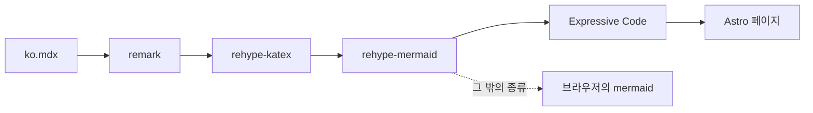
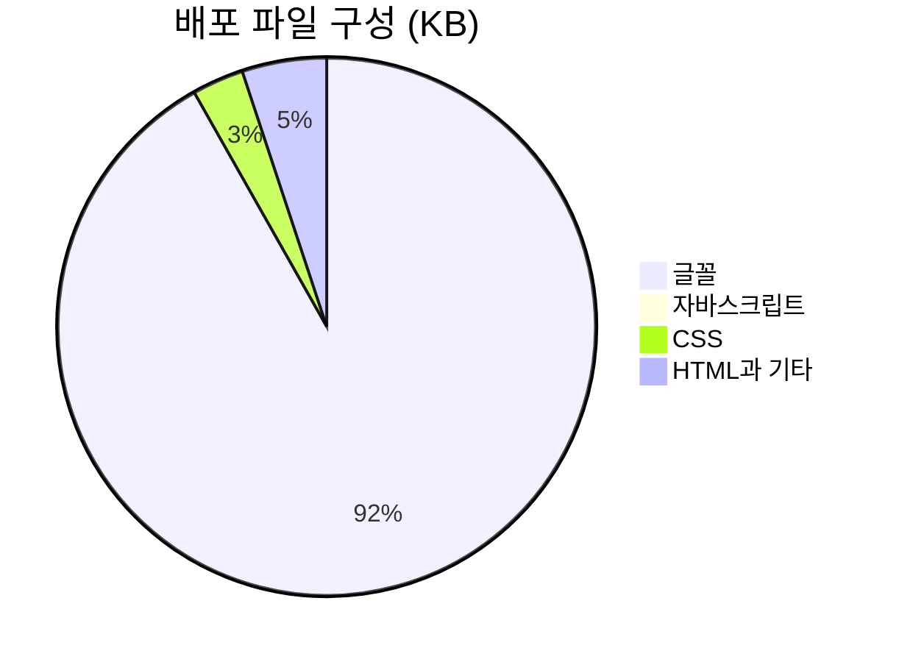
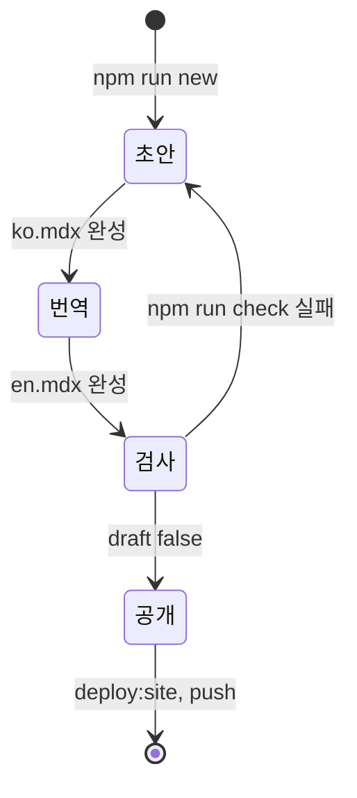
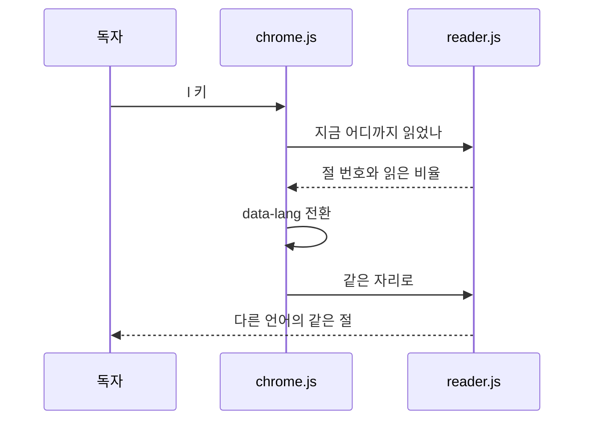

# 블로그 둘러보기: 다이어그램, 수식, 코드

> 첫 글입니다. 이 블로그가 글 안에 담을 수 있는 것을 하나씩 보여 드립니다. 읽는 자리를 따라오는 그림, 빌드할 때 그리는 다이어그램, 수식, 코드, 그리고 두 언어.
> 2026-10-05 · https://alfex4936.github.io/blog/tour/

이 블로그는 제 노트입니다. 대부분 기술 이야기이고, 일하다 생긴 잡다한 것도 올립니다. 모든 글은 한국어와 영어로 함께 씁니다. 첫 글은 이 블로그 자체를 둘러봅니다. 아래의 그림과 수식과 코드는 모두 이 블로그의 빌드가 실제로 만든 결과이고, 숫자는 모두 이 블로그를 만들면서 잰 값입니다.

## 읽는 자리를 따라오는 그림

설명이 그림을 가리킬 때, 그림은 보통 몇 문단 위에 있습니다. 여기서는 그림이 옆에(휴대폰에서는 위에) 고정되고, 지금 읽는 단계가 가리키는 부분만 밝아집니다. 아래는 글 한 편이 페이지가 되는 경로입니다.

<Walk>



<Step show="M,R">
글은 MDX 파일입니다. remark가 마크다운을 구문 트리로 바꾸고, 이때 `$`로 감싼 수식과 mermaid 코드 블록도 각자 트리의 노드가 됩니다.
</Step>

<Step show="R,K">
rehype-katex가 수식을 KaTeX HTML로 바꿉니다. 읽는 사람은 수식 엔진이 아니라 글꼴만 내려받습니다.
</Step>

<Step show="K,D">
rehype-mermaid가 다이어그램 블록을 beautiful-mermaid로 그려 SVG로 끼워 넣습니다. 색은 CSS 변수로 남겨 두어서, 테마를 바꾸면 다시 그리지 않고 색만 바뀝니다.
</Step>

<Step show="D,E">
그림이 된 블록은 더 이상 코드 블록이 아니므로, Expressive Code는 남은 코드만 하이라이트합니다.
</Step>

<Step show="E,A">
Astro가 페이지로 묶습니다. 이 글의 그림과 수식은 모두 이 경로로 왔습니다.
</Step>

<Step show="D,B">
beautiful-mermaid는 flowchart, state, sequence, class, ER, xychart 여섯 가지를 그립니다.[^1] gantt나 pie 같은 나머지는 그 종류가 있는 페이지에서만 브라우저가 mermaid를 받아서 그립니다.
</Step>

</Walk>

## 다이어그램

이 블로그를 만들면서 배포 폴더의 크기를 `du -sh`로 쟀습니다. 처음에는 브라우저용 mermaid가 번들에 통째로 들어가 12MB였습니다. mermaid를 필요한 페이지에서만 CDN으로 받게 바꾸고, 하네스 페이지를 배포에서 빼자 5.3MB가 됐습니다. 수식용 KaTeX 글꼴과 이 글을 더한 지금은 5.9MB입니다.

```mermaid
xychart-beta
  title "배포 폴더 크기 (MB, du -sh)"
  x-axis [mermaid 번들, mermaid CDN, lab 제외, KaTeX와 첫 글]
  y-axis "MB" 0 --> 13
  bar [12, 7.0, 5.3, 5.9]
```

지금 배포되는 파일을 종류별로 나누면 다음과 같습니다. 대부분은 글꼴인데, 한글 글꼴은 글자 범위별로 잘게 나뉘어 있어서 브라우저는 페이지에 실제로 나온 글자가 든 조각만 내려받습니다. 이 원 그래프는 beautiful-mermaid가 그리지 않는 종류라서, 이 페이지에서만 브라우저가 mermaid를 받아 그렸습니다.



글 한 편이 공개되기까지의 과정도 그림 하나로 그립니다.



## 수식

수식은 `$…$`로 쓰면 문장 안에, `$$…$$`로 쓰면 한 줄을 따로 차지합니다. 예를 들어 Redis의 HyperLogLog는 레지스터를 $m = 16384$개 쓰고, 표준 오차는 다음과 같습니다.

$$
\sigma \approx \frac{1.04}{\sqrt{m}} = \frac{1.04}{\sqrt{16384}} = \frac{1.04}{128} \approx 0.81\%
$$

이 블로그의 읽기 시간도 식으로 셉니다. 한국어는 공백을 뺀 글자 $c$를 분당 500자로, 영어는 단어 $w$를 분당 230단어로 읽고, 코드는 $\ell$줄을 분당 40줄로 훑는다고 봅니다.

$$
\begin{aligned}
t_{\text{ko}} &= \frac{c}{500} + \frac{\ell}{40} \\
t_{\text{en}} &= \frac{w}{230} + \frac{\ell}{40}
\end{aligned}
$$

화면 아래 상태 줄의 남은 시간은 이 $t$를 절마다 나눠서 셉니다. 절마다 같은 방식으로 무게 $m_i$를 구하고(그림 하나에 0.3분을 더합니다), 그 절을 읽은 비율 $r_i$만큼 덜어 냅니다. $r_i$는 화면 위에서 30% 지점에 있는 읽는 선이 그 절을 얼마나 지났는지입니다. 그래서 글 맨 위에서는 남은 시간이 제목 아래의 읽기 시간과 같습니다.

$$
t_{\text{left}} = t \cdot \frac{\sum_i m_i\,(1 - r_i)}{\sum_i m_i}, \qquad r_i = \min\!\left(1,\ \max\!\left(0,\ \frac{0.3\,H - \mathrm{top}_i}{\mathrm{bottom}_i - \mathrm{top}_i}\right)\right)
$$

## 코드

코드 블록은 Expressive Code가 그립니다. 파일 이름, 줄 강조, diff, 터미널 창, 접기를 씁니다. 아래 diff는 이 블로그를 만들다가 실제로 고친 한 줄입니다.

```diff lang="js" title="src/lib/diagram.js"
-    .replace(/\bid="([^"]*)"/g, `id="${id}-$1"`)
+    .replace(/(?<=\s)id="([^"]*)"/g, `id="${id}-$1"`)
```

`\bid=`는 `data-id=`의 `-`와 `i` 사이도 단어 경계로 보기 때문에 노드 이름까지 바꿔 버렸고, 그래서 위의 워크스루가 밝힐 노드를 찾지 못했습니다. 지금은 앞에 공백이 있는 `id=`만 고릅니다. 이 함수 전체도 워크스루로 읽을 수 있습니다.

<Walk>

```js title="src/lib/diagram.js"
export function drawDiagram(src, id) {
  return renderMermaidSVG(src, { bg: 'var(--bg)', fg: 'var(--fg)', transparent: true })
    .replace(/<style>[\s\S]*?<\/style>/g, '')
    .replace(/^(<svg[^>]*?) style="[^"]*"/, '$1')
    .replace(/(?<=\s)id="([^"]*)"/g, `id="${id}-$1"`)
    .replace(/url\(#([^)]+)\)/g, `url(#${id}-$1)`)
}
```

<Step lines="2">
그리는 쪽은 한 줄입니다. 색 자리에 실제 색 대신 `var(--bg)`를 넘깁니다.
</Step>

<Step lines="3">
SVG마다 들어 있는 `<style>`을 뺍니다. 같은 규칙이 그림 수만큼 반복되고, Google Fonts에서 Inter를 불러오는 `@import`도 들어 있기 때문입니다. 규칙은 `diagram.css`에 한 번만 둡니다.
</Step>

<Step lines="4">
SVG 자신에 붙은 `--bg: var(--bg)`를 지웁니다. 자기 자신을 참조하는 변수는 순환이 되어 값이 사라집니다.
</Step>

<Step lines="5-6">
화살촉 marker의 id에 그림마다 다른 접두사를 붙입니다. 접두사가 없으면 모든 그림이 `#arrowhead` 하나를 나눠 쓰는데, 그 첫 그림이 숨겨진 언어 쪽에 있으면 나머지 그림의 화살촉이 함께 사라집니다.
</Step>

</Walk>

글을 쓰고 공개하는 일은 터미널 명령 네 개로 끝납니다.

```bash
$ npm run new -- tour "블로그 둘러보기" "A tour of this blog"
$ npm run dev
$ npm run check
$ npm run deploy:site
```

코드 글꼴은 IBM Plex Mono에 IBM Plex Sans KR의 한글을 정확히 두 칸 폭으로 합친 Monoplex KR입니다. 한글이 두 칸이 아니면 아래 상자가 어긋납니다.

```text
┌──────────────┬──────────┐
│ 단계         │ 결과     │
├──────────────┼──────────┤
│ 마크다운     │ ko.mdx   │
│ 수식         │ HTML     │
│ 그림         │ SVG      │
└──────────────┴──────────┘
```

원본 글꼴은 굵기마다 2.7MB입니다. 빌드는 이 저장소에 쓰인 한글만 남깁니다. 이 글을 쓴 시점에는 한글 406자, 굵기마다 25.5KB였습니다.

## 읽는 사람을 위한 것

넓은 화면에서 왼쪽 목차는 절마다 그 길이만큼 막대를 그리고, 읽은 만큼 채웁니다. 화면 아래 상태 줄은 지금 읽는 절과 남은 시간을 보여 주고, 왼쪽의 파일 이름을 누르면 이 글의 원문 마크다운이 열립니다. 그림은 누르면 크게 볼 수 있습니다.

| 키 | 하는 일 |
| :--- | :--- |
| <kbd>t</kbd> | 밝은 테마와 어두운 테마 |
| <kbd>l</kbd> | 한국어와 영어, 읽던 자리 유지 |
| <kbd>[</kbd> <kbd>]</kbd> | 이전 절과 다음 절 |
| <kbd>?</kbd> | 단축키 목록 |

<kbd>l</kbd>을 눌러 보세요. 한 페이지에 두 언어가 다 들어 있어서 다시 불러오지 않고, 지금 읽는 절의 같은 위치로 옮겨 갑니다.

<Walk>



<Step show="U,C,#1">
l 키는 chrome.js가 받습니다. 모든 페이지에 들어 있는, 언어와 테마를 맡은 스크립트입니다.
</Step>

<Step show="C,R,#2,#3">
언어를 바꾸기 전에 reader.js에 지금 위치를 묻습니다. 답은 절 번호와 그 절을 읽은 비율입니다.
</Step>

<Step show="C,#4">
html의 `data-lang`을 바꾸면 숨어 있던 언어가 보이고 보이던 언어가 숨습니다. 아무것도 다시 불러오지 않습니다.
</Step>

<Step show="U,C,R,#5,#6">
reader.js가 새 언어의 같은 절, 같은 비율 지점으로 스크롤합니다. 그래서 두 언어의 절 수가 다르면 빌드가 실패합니다.
</Step>

</Walk>

넓은 화면에서는 각주가 본문 옆 여백에 놓입니다.[^2] 새 글은 RSS(한국어, 영어)로 받아 볼 수 있고, 에이전트에게 읽힐 때는 `llms.txt`에서 시작하면 됩니다.

[^1]: xychart는 `xychart-beta` 문법입니다. 첫 번째 계열은 이 사이트가 측정값에 쓰는 테라코타 색을 받습니다. 다음 절의 배포 크기 그래프가 그 예입니다.
[^2]: 이 각주처럼요. 좁은 화면에서는 글 끝으로 갑니다.
